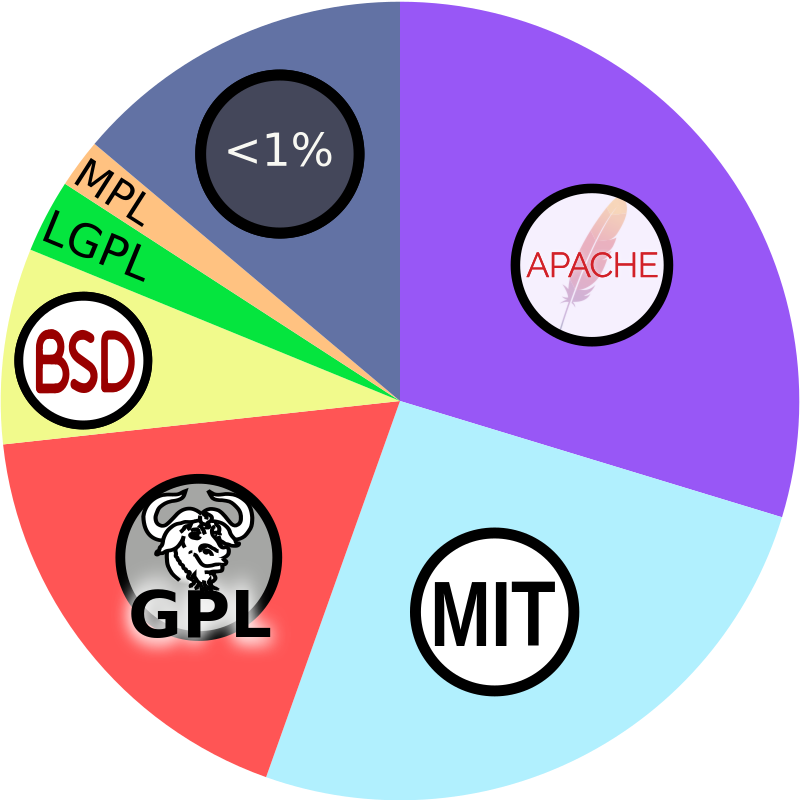
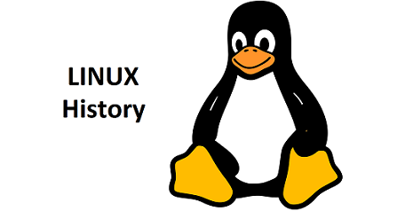
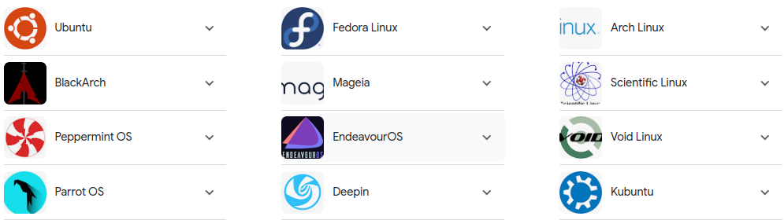
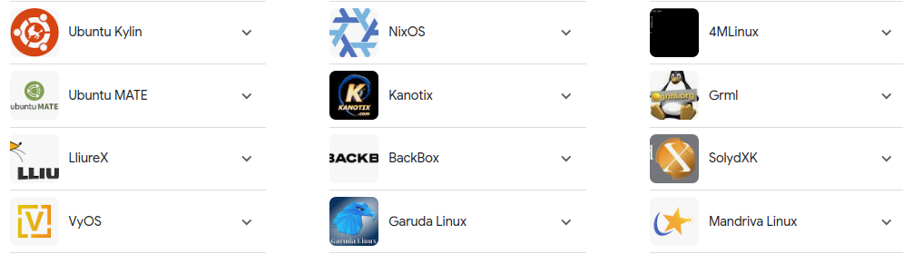
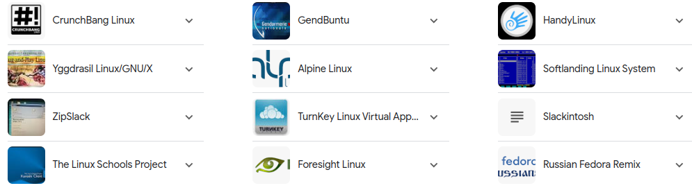
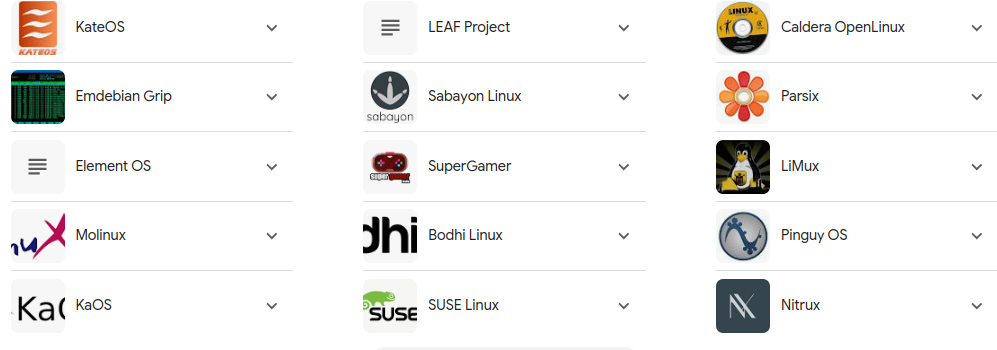
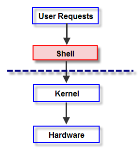
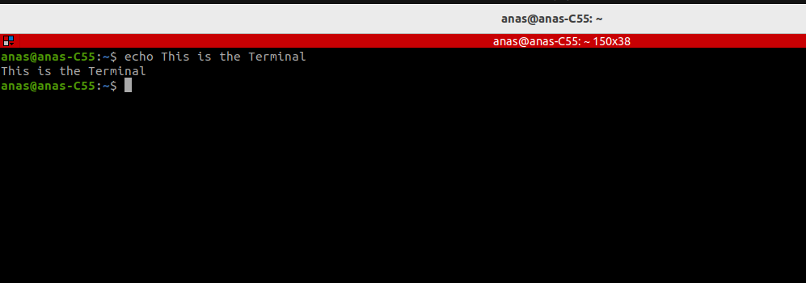
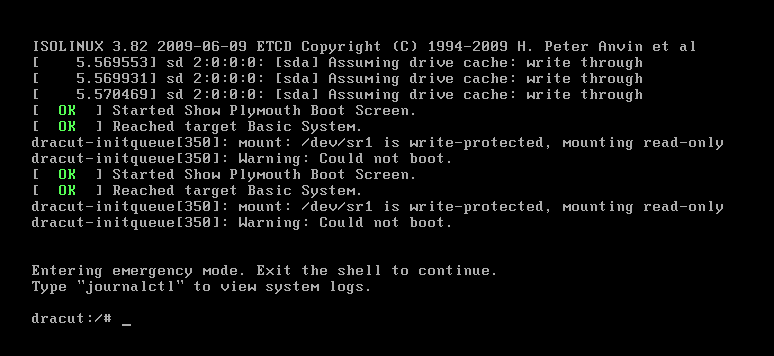

# Linux Admin 

## 1. Open Source License

 #### 1.1. What is the open source license ?

Open source software license is the legal contract between author and user, and  how the users can use, modify, or distribute software code. They grant other users the permission and rights to use or reuse the code for new applications or to include the code in other projects.

#### 1.2. open source license types

#### 1.2.1. CopyLeft license

Copyleft is a general concept in licensing that allows derivative works but requires them to be released under the same licensing terms as the original work. The purpose of copyleft is to ensure that the freedom to use, modify, and distribute a work remains intact for all users.

**1.2.1.1. GNU General Public License (GPL)**

- **GPLv2**: Requires that any distributed modified versions of the software also be licensed under the GPL. It was the first copyleft license to see widespread use.
- **GPLv3**: An updated version that addresses issues such as software patents and license compatibility. It includes additional terms to prevent tivoization (the use of hardware restrictions to prevent users from running modified versions of the software).

**1.2.1.2. GNU Lesser General Public License (LGPL)**

- **LGPLv2.1** and **LGPLv3**: Allows developers to link to the LGPL-licensed libraries and use them in proprietary software, provided that modifications to the LGPL-licensed components themselves are released under the LGPL.

**1.2.1.3. Mozilla Public License (MPL)**

- **MPL 2.0**: A weaker copyleft license that allows code to be combined with proprietary code. However, modifications to MPL-licensed code must be released under the MPL.

**1.2.1.4. Creative Commons Attribution-ShareAlike (CC BY-SA)**

- Often used for creative works like text, art, and music. It requires that derivative works be licensed under the same terms, ensuring that adaptations and modifications remain free.

**1.2.1.5. Affero General Public License (AGPL)**

- Similar to the GPL, but with an additional provision that requires anyone who uses the software over a network to make the source code available to the users of that network service.

#### 1.2.2. Permissive license

A permissive open source license is a type of open source license that allows software to be freely used, modified, and distributed with minimal restrictions. These licenses are more flexible compared to copyleft licenses, which require derivative works to be licensed under the same terms. Here are some examples of permissive open source licenses:

### Examples of Permissive Open Source Licenses

1. **MIT License**
   - One of the most popular permissive licenses. It allows for the software to be used, modified, and distributed, even in proprietary software, with the only requirement being that the original license and copyright notice are included in all copies or substantial portions of the software.
2. **Apache License 2.0**
   - Allows users to use, modify, and distribute the software under more detailed conditions than the MIT License, including patent rights and contributions. It requires that a copy of the license be included with any substantial portions of the software and provides an explicit grant of patent rights from contributors to users.
3. **BSD License**
   - **2-Clause BSD License (Simplified BSD License)**: Similar to the MIT License, it allows for the free use, modification, and distribution of the software, with the requirement that the original license and copyright notice are retained.
   - **3-Clause BSD License (New BSD License)**: Adds a non-endorsement clause, stating that the names of the project and its contributors may not be used to endorse or promote derived products without written permission.
4. **ISC License**
   - A simplified license similar to the MIT and 2-Clause BSD licenses. It permits the free use, modification, and distribution of the software with the condition that the original license and copyright notice are included.
5. **Zlib License**
   - Allows for the software to be used, modified, and distributed freely, with the requirement that the original copyright notice is included. It also stipulates that altered source versions must be plainly marked as such.

#### 1.2.3. The difference 

- **Reciprocity:** Copyleft licenses require derived works to be distributed under the same license, ensuring the software remains free and open. Permissive licenses do not have this requirement, allowing derived works to be licensed under different terms, including proprietary licenses.

- **Flexibility:** Permissive licenses offer more flexibility in how the software can be used, modified, and redistributed. Copyleft licenses impose more restrictions to ensure the software remains free.

- **Community Protection:** Copyleft licenses protect the community by ensuring all modifications are shared back, whereas permissive licenses allow for the possibility of modifications being kept proprietary.

- **Complexity:** Permissive licenses tend to be simpler and easier to comply with, while copyleft licenses can have more complex legal requirements.

-----------------------------------------------------------------------------------------------------------------------------------------------

# 2. Linux History

In 1969, a team of developers of Bell Labs started a project to make a common software for all the computers and named it as 'Unix'. It was simple and elegant, used 'C' language instead of assembly language and its code was recyclable. As it was recyclable, a part of its code now commonly called 'kernel' was used to develop the operating system and other functions and could be used on different systems. Also its source code was open source.

Initially, Unix was only found in large organizations like government, university, or larger financial corporations with mainframes and minicomputers (PC is a microcomputer).

 

### 2.1. The Foundations (1960s)

- **1969**: The story of Linux begins with the creation of Unix at Bell Labs. Ken Thompson, Dennis Ritchie, and others developed Unix as a multitasking, multiuser operating system. It was written in C, making it portable and adaptable to different machines.

### 2.2. Unix Expansion (1970s)

- **1973**: Unix was rewritten in C, which contributed to its portability and widespread adoption. The source code was distributed to academic institutions, leading to various versions and derivatives.
- **1975**: AT&T, the owner of Bell Labs, began to license Unix to commercial vendors. This period saw the development of notable Unix variants such as BSD (Berkeley Software Distribution).

### 2.3. Rise of Free Software (1980s)

- **1983**: Richard Stallman announced the GNU Project, aiming to create a free Unix-like operating system. GNU stands for **"GNU's Not Unix" **Stallman also founded the Free Software Foundation (FSF) in 1985 to support the project.

- **1989**: The first version of the GNU General Public License (GPL) was released, ensuring that software remains free and open.

  

### 2.4. Birth of Linux (1990s)

- **1991**: Linus Torvalds, a Finnish computer science student, began working on a new Unix-like kernel. On August 25, he announced his project on the comp.os.minix newsgroup, seeking feedback and contributions.

- **1992**: The Linux kernel was released under the GPL, allowing the integration of GNU software. This combination of the Linux kernel with GNU tools created a complete operating system often referred to as GNU/Linux.

  

### 2.5. Early Growth (1993 - 1996)

- **1993**: Multiple Linux distributions started to appear. Slackware and Debian were among the first, providing users with pre-packaged systems.
- **1994**: Linux 1.0 was released, marking the kernel's transition from an experimental project to a stable operating system. This period saw growing interest from academic, business, and hobbyist communities.
- **1996**: Linux 2.0 was released, introducing support for multiprocessor systems and further establishing Linux's capabilities for enterprise use.

### 2.6. Commercial Adoption (Late 1990s)

- **1998**: Major companies such as IBM, Oracle, and Intel began to support Linux. This endorsement helped Linux gain credibility in the business world.
- **1999**: Red Hat, a prominent Linux distribution company, went public, demonstrating the commercial viability of open-source software.

### 2.7. Mainstream Acceptance (2000s)

- **2000**: IBM announced a billion-dollar investment in Linux, signaling strong support from a tech giant.
- **2003**: The SCO Group filed lawsuits claiming ownership of parts of Unix and, by extension, Linux. The legal battles drew attention to Linux but ultimately did not hinder its growth.
- **2004**: Ubuntu was launched by Canonical, aiming to make Linux more accessible to everyday users. Ubuntu's ease of use contributed to its popularity and the wider adoption of Linux on desktops.

### 2.8. Dominance in Various Sectors (2010s)

- **2011**: Google released Android, a mobile operating system based on the Linux kernel. Android's success made Linux the dominant OS in the mobile market.
- **2012**: The Linux Foundation reported that Linux powered 94% of the world's top supercomputers, illustrating its importance in high-performance computing.
- **2014**: The systemd init system was adopted by many Linux distributions, modernizing system initialization and management processes.

### 2.9. Continued Growth and Innovation (2020s)

- **2020**: The Linux kernel celebrated its 29th anniversary, with version 5.8 released. Linux continued to thrive in various fields, including cloud computing, embedded systems, and Internet of Things (IoT) devices.

- **2021**: Microsoft integrated the Windows Subsystem for Linux (WSL) into Windows 10, allowing users to run Linux distributions natively on Windows. This marked a significant shift in Microsoft's attitude towards Linux and open source.

  -----------------------------------------------------------------------------------------------------------------

  

## 3. Linux Distributions

A **Linux distribution** (often abbreviated as **distro**) is an operating system made from a software collection, which is based on the Linux kernel and, often, a package management system.

### 3.1. Components of a Linux Distro

1. **Linux Kernel**: The core of the operating system, responsible for managing hardware, running processes, and handling system calls.
2. **System Libraries**: Libraries like the GNU C Library (glibc) which provide essential system functions to applications and other system software.
3. **System Utilities**: Basic tools and utilities that perform essential system tasks. Examples include shell programs, file manipulation utilities, and system monitoring tools.
4. **Package Management System**: Tools to install, update, and remove software packages. Examples include `apt` (Debian-based), `yum`/`dnf` (Red Hat-based), and `pacman` (Arch-based).
5. **Desktop Environment**: The graphical user interface (GUI) for users. Examples include GNOME, KDE, XFCE, and LXDE.

### 3.2. Examples of Popular Linux Distributions

## 4. Linux Components

**4.1. Kernel**: The **Linux kernel** is the core component of the Linux operating system. It is responsible for managing the system's hardware, running processes, and providing an interface between the hardware and the user-space software. The kernel is crucial for system stability, security, and performance.

**4.2. Shell**: The command-line interface that allows users to interact with the operating system. Common shells include Bash (Bourne Again Shell), Zsh (Z Shell), and others.

**4.3. GNU Utilities**: Essential command-line tools and utilities provided by the GNU Project, such as **ls, cp, mv, grep, etc.**

**4.4. Filesystem**: A hierarchical structure for organizing and storing files and directories, typically starting with the root directory (/).

**4.5. Libraries**: Shared libraries that provide common functions and services to applications and other system components.

**4.6. System Utilities**: Tools and daemons that manage system processes, services, and configurations, such as **systemd, init, cron, etc.**

**4.7. Graphical Server**: (Optional) Provides a graphical user interface (GUI) for desktop environments, typically Xorg or Wayland.

**4.8. Desktop Environment**: (Optional) A collection of applications and tools that provide a complete user interface, such as **GNOME, KDE Plasma, XFCE, etc.**

**4.9. User Applications**: Software packages and programs that run on top of the operating system, serving various purposes from productivity tools to multimedia applications.

1. **Terminal:** A terminal, or terminal emulator, is a program that allows you to interact with a computer through a command-line interface. It provides a text-based interface where you can type commands to communicate with the operating system.

   

2. **Shell:** A shell is a command-line interpreter that takes commands from the terminal and gives them to the operating system to perform. It is a program that runs on top of the operating system and translates commands entered by the user into a language that the kernel (core of the operating system) can understand. Popular shells include Bash (Bourne Again SHell), Zsh (Z Shell), and Fish (Friendly Interactive SHell).

3. **Console**

   **3.1. System Console:**

   - The system console is a physical or virtual device that allows users to interact with a Kernel. It typically includes a keyboard for input and a display screen (monitor) for output.
   - On many systems, especially servers and during system boot-up, the console displays Kernel messages, warnings, errors, and provides a text-based interface for administrative tasks.

   **3.2. Software Console:**

   - A software console refers to a program or interface that provides a text-based environment for users to input commands and receive text-based output.
   - This can be a terminal emulator on a graphical desktop environment or a command-line interface accessed via SSH (Secure Shell) or other remote access methods.

## 5. File System

A  **file system**  defines how files are  **named**,  **stored**, and  **retrieved**  from a storage device. When you open a file on your computer or smart device, the operating system uses its internal file system to retrieve it from storage. Actions like copying, editing, or deleting files are also managed by the file system in the background. Without a file system, data on a storage device would just be a jumble of information, impossible for the operating system to distinguish between different files.

The term "file system" derives from older paper-based systems where documents were organized into files and directories.

Think of a messy room filled with scattered papers. A storage device without a file system would resemble this chaos, rendering it unusable. 

The File system organize the File/data structure. However, a file system isn't just about organization. It also handles space management, metadata, data encryption, file access control, and ensures data integrity.

## 6. Linux File System

the Linux file system is a hierarchical structure that organizes and  manages files and directories on a Linux-based operating system. It  defines how files are named, stored, and retrieved from storage devices. The file system is integral to various operations, such as opening,  copying, editing, and deleting files, as well as accessing data over the Internet. It provides a unified and organized approach to managing data and resources on the system. For more info read those articles [FileSystem](https://www.freecodecamp.org/news/file-systems-architecture-explained/) , [LinuxFS](https://www.baeldung.com/linux/rootfs).

| Root directory | Description                                                  |
| -------------- | ------------------------------------------------------------ |
| */etc*         | Contains system local configuration files and scripts. Configuration files for various software applications and system settings are stored  here. |
| */bin*         | Symbolic link to  `/usr/bin` directory. contains user commands binaries. |
| */sbin*        | Contains system binaries (commands) used for system boot, administration and maintenance tasks such as  mount the `/usr` file system. |
| */dev*         | Contains device files that represent hardware/emulated devices and peripheral  components. Devices such as hard drives, terminals, SD cards and printers .... |
| */usr*         | Contains user-related programs, libraries, and ASCII documentation. |
| */home*        | Home directories for user accounts are located here. Each user typically has a subdirectory with their username under `/home`. |
| */temp*        | **contains files that are temporary**. Many of these files  are created by currently running processes on our system that store  their temporary data under this directory. Therefore, a clearing out of  this directory may happen at booting or at system shutdown. |
| */boot*        | Contains the bootloader and kernel executable and configuration files required to boot a Linux OS. |
| */lib*         | Contains shared libraries needed by programs at runtime. `/lib` is used for 32-bit libraries, and `/lib64` (or `/lib/x86_64-linux-gnu`) is used for 64-bit libraries on some systems. |
| */opt*         | **contains optional software packages,  those that are not part of the system such as, third-party software that we install as add-ons. |
| */root*        | The `/root` directory is the **home directory of the root user** of the system. |
| /*srv*         | Contains, service data such as (TFTP, HTTP,SSH....), if we’re using an HTTP server to serve a website, then we may store files related to our website inside this directory. |
| */proc*        | virtual file system created when the system boots and is dissolved at the time of system shutdown. It contains useful information about the processes that are currently running,   also provides a communication medium between kernel space and user space. |
| */mnt*         | is a mount point **where we can [mount](https://man7.org/linux/man-pages/man2/mount.2.html) a temporary filesystem that resides on a storage device** like a hard-disk drive, USB stick, or CD-ROM. Unlike */media*, where the system mounts removable media automatically, under */mnt* we need to [mount manually](https://www.baeldung.com/linux/mount-unmount-filesystems). This directory can be empty or may have subdirectories to mount individual devices. |
| */media*       | Contains subdirectories that are utilized as mount points when we connect any removable media devices to the system. We can find subdirectories or [symbolic links](https://www.baeldung.com/linux/symbolic-and-hard-links#symbolic-links) to directories representing different removable media devices like SD-card and USB . For example, on inserting a SD card into our Linux system, a directory will **automatically** be created inside the */media* directory. We can use this to access the contents of the SD card inside this directory. |

- **Difference between `/mnt` and `/media` ** 

  1. **`/mnt`:**
     - The `/mnt` directory is a general-purpose location for mounting temporary filesystems or directories. It was traditionally used for mounting temporary filesystems or other devices.
     - System administrators often use `/mnt` when they need to temporarily mount a filesystem for tasks such as system maintenance or recovery.
     - It doesn't have a specific standard structure, and the subdirectories under `/mnt` are usually created based on the administrator's needs.
  2. **`/media`:**
     - The `/media` directory is typically used as a mount point for removable media, such as USB drives, optical discs, and external hard drives.
     - Modern Linux distributions often automatically create subdirectories under `/media` when removable media is inserted or connected, providing a more user-friendly experience.
     - The subdirectories under `/media` are usually named after the volume label or some identifier of the connected media.

  So, while both `/mnt` and `/media` can be used for mounting external storage, `/mnt` is more general-purpose and might require manual setup, while `/media` is often used by the system to automatically manage and organize mounted removable media. The specific usage can vary based on system configuration and administrator preferences.
