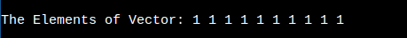
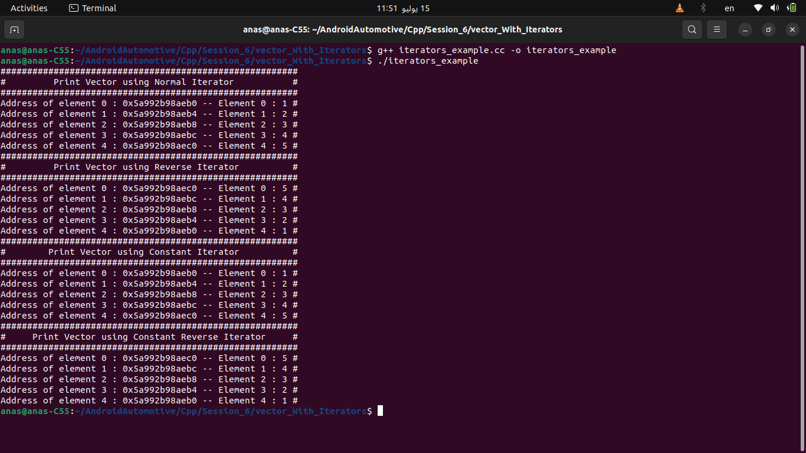

## Table of Contents

- **Strings**
- **Strings view**
- **Array**
- **Vector**

------------------------

## 1. Strings in Modern c++

In C++, strings are typically managed using the `std::string` class from the Standard Library, which provides a more convenient and safer alternative to C-style strings (`char` arrays).

### Examples with `std::string` Member Functions

### 1. `string::append`

```c++
#include <iostream>
#include <string>

int main() {
    std::string str = "Hello";
    str.append(", World!"); // Append ", World!" to the end of str
    std::cout << "After append: " << str << std::endl; // Output the result
    return 0;
}
```

### Explanation

- `str.append(", World!");`: Adds the string ", World!" to the end of `str`.

### 2. `string::assign`

```c++
#include <iostream>
#include <string>

int main() {
    std::string str;
    str.assign("Hello, World!"); // Assign "Hello, World!" to str
    std::cout << "After assign: " << str << std::endl; // Output the result
    return 0;
}
```

### Explanation

- `str.assign("Hello, World!");`: Assigns the string "Hello, World!" to `str`.

### 3. `string::at`

```c++
#include <iostream>
#include <string>

int main() {
    std::string str = "Hello";
    try {
        char ch = str.at(1); // Access the character at index 1 (second character)
        std::cout << "Character at index 1: " << ch << std::endl; // Output the character
    } catch (const std::out_of_range &e) {
        std::cerr << "Index out of range: " << e.what() << std::endl; // Handle out-of-range error
    }
    return 0;
}
```

### Explanation

- `char ch = str.at(1);`: Accesses the character at index 1 (second character) in `str`, which is 'e'.

### 4. `string::back`

```c++
#include <iostream>
#include <string>

int main() {
    std::string str = "Hello";
    char ch = str.back(); // Access the last character
    std::cout << "Last character: " << ch << std::endl; // Output the character
    return 0;
}
```

### Explanation

- `char ch = str.back();`: Accesses the last character in `str`, which is 'o'.

### 5. `string::begin`

```c++
#include <iostream>
#include <string>

int main() {
    std::string str = "Hello";
    auto it = str.begin(); // Get iterator to the first character
    std::cout << "First character: " << *it << std::endl; // Output the character
    return 0;
}
```

### Explanation

- `auto it = str.begin();`: Gets an iterator to the first character in `str`.

### 6. `string::clear`

```c++
#include <iostream>
#include <string>

int main() {
    std::string str = "Hello, World!";
    str.clear(); // Clear the string
    std::cout << "After clear: " << str << std::endl; // Output the result (empty string)
    return 0;
}
```

### Explanation

- `str.clear();`: Clears all characters from `str`, making it an empty string.

### 7. `string::compare`

```c++
#include <iostream>
#include <string>

int main() {
    std::string str1 = "Hello";
    std::string str2 = "World";
    int result = str1.compare(str2); // Compare str1 with str2
    if (result == 0) {
        std::cout << "Strings are equal" << std::endl;
    } else if (result < 0) {
        std::cout << "str1 is less than str2" << std::endl;
    } else {
        std::cout << "str1 is greater than str2" << std::endl;
    }
    return 0;
}
```

### Explanation

- `int result = str1.compare(str2);`: Compares `str1` with `str2` lexicographically.

### 8. `string::c_str`

```c++
#include <iostream>
#include <string>

int main() {
    std::string str = "Hello, World!";
    const char* cstr = str.c_str(); // Get C-style string
    std::cout << "C-style string: " << cstr << std::endl; // Output the C-style string
    return 0;
}
```

### Explanation

- `const char* cstr = str.c_str();`: Converts `str` to a C-style string (null-terminated character array).

### 9. `string::capacity`

```c++
#include <iostream>
#include <string>

int main() {
    std::string str = "Hello";
    std::cout << "Capacity: " << str.capacity() << std::endl; // Output the capacity
    return 0;
}
```

### Explanation

- `std::cout << "Capacity: " << str.capacity() << std::endl;`: Outputs the number of characters that `str` can hold before needing to allocate more memory.

### 10. `string::copy`

```c++
#include <iostream>
#include <string>

int main() {
    std::string str = "Hello, World!";
    char buffer[6];
    str.copy(buffer, 5, 0); // Copy first 5 characters to buffer
    buffer[5] = '\0'; // Null-terminate the buffer
    std::cout << "Buffer: " << buffer << std::endl; // Output the buffer
    return 0;
}
```

### Explanation

- `str.copy(buffer, 5, 0);`: Copies the first 5 characters of `str` into `buffer`.
- `buffer[5] = '\0';`: Null-terminates the buffer to make it a valid C-style string.

### 11. `string::crbegin`

```c++
#include <iostream>
#include <string>

int main() {
    std::string str = "Hello";
    auto it = str.crbegin(); // Get reverse constant iterator to the last character
    std::cout << "Last character using crbegin: " << *it << std::endl; // Output the character
    return 0;
}
```

### Explanation

- `auto it = str.crbegin();`: Gets a reverse constant iterator to the last character in `str`.

### 12. `string::crend`

```c++
#include <iostream>
#include <string>

int main() {
    std::string str = "Hello";
    auto it = str.crend(); // Get reverse constant iterator to one past the first character
    std::cout << "Using crend, no character to output" << std::endl;
    return 0;
}
```

### Explanation

- `auto it = str.crend();`: Gets a reverse constant iterator to one past the first character in `str`.

### 13. `string::data`

```c++
#include <iostream>
#include <string>

int main() {
    std::string str = "Hello, World!";
    const char* data = str.data(); // Get pointer to internal data
    std::cout << "Data: " << data << std::endl; // Output the data
    return 0;
}
```

### Explanation

- `const char* data = str.data();`: Gets a pointer to the internal character array of `str`.

### 14. `string::empty`

```c++
#include <iostream>
#include <string>

int main() {
    std::string str = "Hello";
    bool isEmpty = str.empty(); // Check if the string is empty
    std::cout << "Is empty: " << std::boolalpha << isEmpty << std::endl; // Output the result
    return 0;
}
```

### Explanation

- `bool isEmpty = str.empty();`: Checks if `str` is empty.
- `std::cout << "Is empty: " << std::boolalpha << isEmpty << std::endl;`: Outputs `true` or `false` based on whether `str` is empty.

### 15. `string::erase`

```c++
#include <iostream>
#include <string>

int main() {
    std::string str = "Hello, World!";
    str.erase(5, 1); // Erase the character at index 5 (the comma)
    std::cout << "After erase: " << str << std::endl; // Output the result
    return 0;
}
```

### Explanation

- `str.erase(5, 1);`: Erases 1 character at index 5 (the comma), resulting in "Hello World!".

### 16. `string::find`

```c++
#include <iostream>
#include <string>

int main() {
    std::string str = "Hello, World!";
    size_t pos = str.find("World"); // Find the position of the substring "World"
    if (pos != std::string::npos) { // Check if the substring was found
        std::cout << "Found 'World' at position: " << pos << std::endl; // Output the position
    } else {
        std::cout << "'World' not found" << std::endl; // Output if not found
    }
    return 0;
}
```

### Explanation

- `size_t pos = str.find("World");`: Searches for the substring "World" in `str` and stores the position in `pos`.
- `if (pos != std::string::npos)`: Checks if "World" was found (`npos` indicates not found).
- `std::cout << "Found 'World' at position: " << pos << std::endl;`: Prints the position of "World".
- `std::cout << "'World' not found" << std::endl;`: Prints that "World" was not found if it is not present.

### 17. `string::find_first_not_of`

```c++
#include <iostream>
#include <string>

int main() {
    std::string str = "abcde";
    size_t pos = str.find_first_not_of("abc"); // Find the first character not in "abc"
    if (pos != std::string::npos) { // Check if such character was found
        std::cout << "First character not in 'abc' is at position: " << pos << std::endl; // Output the position
    } else {
        std::cout << "All characters are in 'abc'" << std::endl; // Output if all characters are in "abc"
    }
    return 0;
}
```

### Explanation

- `size_t pos = str.find_first_not_of("abc");`: Finds the first character in `str` that is not in "abc".
- `if (pos != std::string::npos)`: Checks if such a character was found.
- `std::cout << "First character not in 'abc' is at position: " << pos << std::endl;`: Prints the position of the first character not in "abc".
- `std::cout << "All characters are in 'abc'" << std::endl;`: Prints that all characters are in "abc" if no such character is found.

### 18. `string::find_first_of`

```c++
#include <iostream>
#include <string>

int main() {
    std::string str = "Hello, World!";
    size_t pos = str.find_first_of("aeiou"); // Find the first vowel
    if (pos != std::string::npos) { // Check if such character was found
        std::cout << "First vowel is at position: " << pos << std::endl; // Output the position
    } else {
        std::cout << "No vowels found" << std::endl; // Output if no vowels are found
    }
    return 0;
}
```

### Explanation

- `size_t pos = str.find_first_of("aeiou");`: Finds the first vowel in `str`.
- `if (pos != std::string::npos)`: Checks if a vowel was found.
- `std::cout << "First vowel is at position: " << pos << std::endl;`: Prints the position of the first vowel.
- `std::cout << "No vowels found" << std::endl;`: Prints that no vowels were found if none are present.

### 19. `string::find_last_not_of`

```c++
#include <iostream>
#include <string>

int main() {
    std::string str = "abcde";
    size_t pos = str.find_last_not_of("de"); // Find the last character not in "de"
    if (pos != std::string::npos) { // Check if such character was found
        std::cout << "Last character not in 'de' is at position: " << pos << std::endl; // Output the position
    } else {
        std::cout << "All characters are in 'de'" << std::endl; // Output if all characters are in "de"
    }
    return 0;
}
```

### Explanation

- `size_t pos = str.find_last_not_of("de");`: Finds the last character in `str` that is not in "de".
- `if (pos != std::string::npos)`: Checks if such a character was found.
- `std::cout << "Last character not in 'de' is at position: " << pos << std::endl;`: Prints the position of the last character not in "de".
- `std::cout << "All characters are in 'de'" << std::endl;`: Prints that all characters are in "de" if no such character is found.

### 20. `string::find_last_of`

```c++
#include <iostream>
#include <string>

int main() {
    std::string str = "Hello, World!";
    size_t pos = str.find_last_of("aeiou"); // Find the last vowel
    if (pos != std::string::npos) { // Check if such character was found
        std::cout << "Last vowel is at position: " << pos << std::endl; // Output the position
    } else {
        std::cout << "No vowels found" << std::endl; // Output if no vowels are found
    }
    return 0;
}
```

### Explanation

- `size_t pos = str.find_last_of("aeiou");`: Finds the last vowel in `str`.
- `if (pos != std::string::npos)`: Checks if a vowel was found.
- `std::cout << "Last vowel is at position: " << pos << std::endl;`: Prints the position of the last vowel.
- `std::cout << "No vowels found" << std::endl;`: Prints that no vowels were found if none are present.

### 21. `string::front`

```c++
#include <iostream>
#include <string>

int main() {
    std::string str = "Hello";
    char ch = str.front(); // Access the first character
    std::cout << "First character: " << ch << std::endl; // Output the character
    return 0;
}
```

### Explanation

- `char ch = str.front();`: Accesses the first character in `str`, which is 'H'.

### 22. `string::insert`

```c++
#include <iostream>
#include <string>

int main() {
    std::string str = "Hello, World!";
    str.insert(7, "beautiful "); // Insert "beautiful " at index 7
    std::cout << "After insert: " << str << std::endl; // Output the modified string
    return 0;
}
```

### Explanation

- `str.insert(7, "beautiful ");`: Inserts the string "beautiful " at index 7 in `str`, resulting in "Hello, beautiful World!".

### 23. `string::length` and `string::size`

```c++
#include <iostream>
#include <string>

int main() {
    std::string str = "Hello, World!";
    std::cout << "Length: " << str.length() << std::endl; // Output the length of the string
    std::cout << "Size: " << str.size() << std::endl; // Output the size of the string
    return 0;
}
```

### Explanation

- `std::cout << "Length: " << str.length() << std::endl;`: Outputs the length of `str`.
- `std::cout << "Size: " << str.size() << std::endl;`: Outputs the size of `str` (identical to length).

### 24. `string::max_size`

```c++
#include <iostream>
#include <string>

int main() {
    std::string str = "Hello, World!";
    std::cout << "Max size: " << str.max_size() << std::endl; // Output the maximum size of the string
    return 0;
}
```

### Explanation

- `std::cout << "Max size: " << str.max_size() << std::endl;`: Outputs the maximum size that `str` can hold.

### 25. `string::push_back`

```c++
#include <iostream>
#include <string>

int main() {
    std::string str = "Hello";
    str.push_back('!'); // Append '!' to the end of str
    std::cout << "After push_back: " << str << std::endl; // Output the modified string
    return 0;
}
```

### Explanation

- `str.push_back('!');`: Appends the character '!' to the end of `str`, resulting in "Hello!".

### 26. `string::pop_back`

```c++
#include <iostream>
#include <string>

int main() {
    std::string str = "Hello!";
    str.pop_back(); // Remove the last character
    std::cout << "After pop_back: " << str << std::endl; // Output the modified string
    return 0;
}
```

### Explanation

- `str.pop_back();`: Removes the last character from `str`, resulting in "Hello".

### 27. `string::replace`

```c++
#include <iostream>
#include <string>

int main() {
    std::string str = "Hello, World!";
    str.replace(7, 5, "Universe"); // Replace "World" (5 characters at index 7) with "Universe"
    std::cout << "After replace: " << str << std::endl; // Output the modified string
    return 0;
}
```

### Explanation

- `str.replace(7, 5, "Universe");`: Replaces 5 characters starting at index 7 ("World") with "Universe", resulting in "Hello, Universe!".

### 28. `string::reserve`

```c++
#include <iostream>
#include <string>

int main() {
    std::string str;
    str.reserve(50); // Reserve capacity for 50 characters
    std::cout << "Reserved capacity: " << str.capacity() << std::endl; // Output the reserved capacity
    return 0;
}
```

### Explanation

- `str.reserve(50);`: Reserves enough memory for `str` to hold 50 characters without reallocation.

### 29. `string::resize`

```c++
#include <iostream>
#include <string>

int main() {
    std::string str = "Hello";
    str.resize(10, 'x'); // Resize the string to 10 characters, padding with 'x'
    std::cout << "After resize: " << str << std::endl; // Output the modified string
    return 0;
}
```

### Explanation

- `str.resize(10, 'x');`: Resizes `str` to 10 characters, padding with 'x' if necessary, resulting in "Helloxxxxx".

### 30. `string::rfind`

```c++
#include <iostream>
#include <string>

int main() {
    std::string str = "Hello, World! World!";
    size_t pos = str.rfind("World"); // Find the last occurrence of "World"
    if (pos != std::string::npos) { // Check if such occurrence was found
        std::cout << "Last 'World' found at position: " << pos << std::endl; // Output the position
    } else {
        std::cout << "'World' not found" << std::endl; // Output if not found
    }
    return 0;
}
```

### Explanation

- `size_t pos = str.rfind("World");`: Finds the last occurrence of "World" in `str`.
- `if (pos != std::string::npos)`: Checks if "World" was found.
- `std::cout << "Last 'World' found at position: " << pos << std::endl;`: Prints the position of the last occurrence of "World".
- `std::cout << "'World' not found" << std::endl;`: Prints that "World" was not found if it is not present.

### 31. `string::substr`

```c++
#include <iostream>
#include <string>

int main() {
    std::string str = "Hello, World!";
    std::string sub = str.substr(7, 5); // Get substring starting at index 7 of length 5
    std::cout << "Substring: " << sub << std::endl; // Output the substring
    return 0;
}
```

### Explanation

- `std::string sub = str.substr(7, 5);`: Extracts a substring from `str` starting at index 7 with length 5, resulting in "World".

### 32. `string::swap`

```c++
#include <iostream>
#include <string>

int main() {
    std::string str1 = "Hello";
    std::string str2 = "World";
    str1.swap(str2); // Swap the contents of str1 and str2
    std::cout << "After swap, str1: " << str1 << std::endl; // Output the modified str1
    std::cout << "After swap, str2: " << str2 << std::endl; // Output the modified str2
    return 0;
}
```

### Explanation

- `str1.swap(str2);`: Swaps the contents of `str1` and `str2`.


## String view

`std::string_view` is a lightweight, non-owning view of a substring of another string. It is part of the C++17 standard library and provides an efficient way to work with substrings without copying data. It is particularly useful when you need to pass around parts of strings or perform read-only operations without the overhead of constructing `std::string` objects.

### Key Features of `std::string_view`:

1. **Non-owning**: It does not own the data it points to. It is simply a view over an existing string.
2. **Efficient**: Since it does not own the data, operations like copying a `std::string_view` are cheap.
3. **Safe**: You can use it to safely refer to substrings without risking dangling pointers, provided the original string remains in scope.

### Basic Usage of `std::string_view`:

#### Example 1: Creating a `std::string_view`

```c++
#include <iostream>
#include <string>
#include <string_view>

int main() {
    std::string str = "Hello, World!";
    std::string_view sv(str); // Create a string_view of the entire string
    std::cout << "string_view: " << sv << std::endl;
    return 0;
}
```

### Explanation:

- `std::string str = "Hello, World!";`: Define a `std::string`.
- `std::string_view sv(str);`: Create a `std::string_view` that views the entire string `str`.
- `std::cout << "string_view: " << sv << std::endl;`: Print the contents of the `std::string_view`.

#### Example 2: Creating a Substring View

```c++
#include <iostream>
#include <string>
#include <string_view>

int main() {
    std::string str = "Hello, World!";
    std::string_view sv(str.c_str() + 7, 5); // Create a string_view of "World"
    std::cout << "Substring view: " << sv << std::endl;
    return 0;
}
```

### Explanation:

- `std::string str = "Hello, World!";`: Define a `std::string`.
- `std::string_view sv(str.c_str() + 7, 5);`: Create a `std::string_view` that views the substring "World".
- `std::cout << "Substring view: " << sv << std::endl;`: Print the contents of the `std::string_view`.

#### Example 3: Using `std::string_view` in Functions

```c++
#include <iostream>
#include <string>
#include <string_view>

void printSubstring(std::string_view sv) {
    std::cout << "Substring: " << sv << std::endl;
}

int main() {
    std::string str = "Hello, World!";
    printSubstring(str.substr(7, 5)); // Pass a substring to the function
    return 0;
}
```

### Explanation:

- `void printSubstring(std::string_view sv)`: Define a function that takes a `std::string_view` as a parameter.
- `std::cout << "Substring: " << sv << std::endl;`: Print the `std::string_view`.
- `printSubstring(str.substr(7, 5));`: Call the function with a substring of `str`.

#### Example 4: Using `std::string_view` with Literals

```c++
#include <iostream>
#include <string_view>

int main() {
    std::string_view sv("Hello, World!", 5); // Create a string_view of "Hello"
    std::cout << "Literal view: " << sv << std::endl;
    return 0;
}
```

### Explanation:

- `std::string_view sv("Hello, World!", 5);`: Create a `std::string_view` that views the first 5 characters of the string literal.
- `std::cout << "Literal view: " << sv << std::endl;`: Print the contents of the `std::string_view`.

### Methods and Operations with `std::string_view`:

#### Example 5: Using `data()`, `size()`, and `empty()`

```c++
#include <iostream>
#include <string>
#include <string_view>

int main() {
    std::string str = "Hello, World!";
    std::string_view sv(str);
    std::cout << "Data: " << sv.data() << std::endl;   // Output the data pointer
    std::cout << "Size: " << sv.size() << std::endl;   // Output the size of the view
    std::cout << "Is empty: " << std::boolalpha << sv.empty() << std::endl; // Check if the view is empty
    return 0;
}
```

### Explanation:

- `std::string_view sv(str);`: Create a `std::string_view` that views the entire string `str`.
- `sv.data()`: Returns a pointer to the character data.
- `sv.size()`: Returns the size of the view.
- `sv.empty()`: Checks if the view is empty.

#### Example 6: Using `remove_prefix()` and `remove_suffix()`

```c++
#include <iostream>
#include <string>
#include <string_view>

int main() {
    std::string str = "Hello, World!";
    std::string_view sv(str);
    sv.remove_prefix(7); // Remove the first 7 characters
    sv.remove_suffix(1); // Remove the last character
    std::cout << "After remove_prefix and remove_suffix: " << sv << std::endl;
    return 0;
}
```

### Explanation:

- `sv.remove_prefix(7);`: Removes the first 7 characters, resulting in "World!".
- `sv.remove_suffix(1);`: Removes the last character, resulting in "World".

#### Example 7: Using `compare()`

```c++
#include <iostream>
#include <string>
#include <string_view>

int main() {
    std::string str1 = "Hello";
    std::string str2 = "Hello, World!";
    std::string_view sv1(str1);
    std::string_view sv2(str2.substr(0, 5)); // Create a view of "Hello"
    if (sv1.compare(sv2) == 0) { // Compare the two views
        std::cout << "Views are equal" << std::endl;
    } else {
        std::cout << "Views are not equal" << std::endl;
    }
    return 0;
}
```

### Explanation:

- `std::string_view sv2(str2.substr(0, 5));`: Create a `std::string_view` of the substring "Hello".
- `sv1.compare(sv2) == 0`: Compares the two views. If they are equal, it prints "Views are equal".


## 2. Array in Modern C++

In modern C++ (specifically starting from C++11), the Standard Library introduced `std::array`, a fixed-size sequence container that provides a more consistent interface with other Standard Library containers compared to built-in arrays. `std::array` is defined in the `<array>` header.

Here is an overview of the member functions listed in your image, with examples and explanations:

### 1. `array::at`

The `at` member function provides bounds-checked access to elements.

```c++
#include <iostream>
#include <array>

int main() {
    std::array<int, 5> arr = {1, 2, 3, 4, 5};
    std::cout << "Element at index 2: " << arr.at(2) << std::endl;  // Output: 3

    // Uncommenting the next line will throw an out-of-range exception
    // std::cout << arr.at(5) << std::endl;
}
```

### 2. `array::back`

The `back` member function returns a reference to the last element.

```c++
#include <iostream>
#include <array>

int main() {
    std::array<int, 5> arr = {1, 2, 3, 4, 5};
    std::cout << "Last element: " << arr.back() << std::endl;  // Output: 5
}
```

### 3. `array::begin` and `array::end`

`begin` returns an iterator to the first element, and `end` returns an iterator to one past the last element.

```c++
#include <iostream>
#include <array>

int main() {
    std::array<int, 5> arr = {1, 2, 3, 4, 5};
    for (auto it = arr.begin(); it != arr.end(); ++it) {
        std::cout << *it << ' ';
    }
    // Output: 1 2 3 4 5
}
```

### 4. `array::cbegin` and `array::cend`

`cbegin` returns a constant iterator to the first element, and `cend` returns a constant iterator to one past the last element.

```c++
#include <iostream>
#include <array>

int main() {
    std::array<int, 5> arr = {1, 2, 3, 4, 5};
    for (auto it = arr.cbegin(); it != arr.cend(); ++it) {
        std::cout << *it << ' ';
    }
    // Output: 1 2 3 4 5
}
```

### 5. `array::crbegin` and `array::crend`

`crbegin` returns a constant reverse iterator to the last element, and `crend` returns a constant reverse iterator to one before the first element.

```c++
#include <iostream>
#include <array>

int main() {
    std::array<int, 5> arr = {1, 2, 3, 4, 5};
    for (auto it = arr.crbegin(); it != arr.crend(); ++it) {
        std::cout << *it << ' ';
    }
    // Output: 5 4 3 2 1
}
```

### 6. `array::data`

`data` returns a pointer to the underlying array.

```c++
#include <iostream>
#include <array>

int main() {
    std::array<int, 5> arr = {1, 2, 3, 4, 5};
    int* ptr = arr.data();
    std::cout << "First element via pointer: " << *ptr << std::endl;  // Output: 1
}
```

### 7. `array::empty`

`empty` checks whether the array is empty (always returns false for `std::array` since its size is fixed).

```c++
#include <iostream>
#include <array>

int main() {
    std::array<int, 5> arr = {1, 2, 3, 4, 5};
    std::cout << "Is the array empty? " << std::boolalpha << arr.empty() << std::endl;  // Output: false
}
```

### 8. `array::fill`

`fill` assigns the specified value to all elements.

```c++
#include <iostream>
#include <array>

int main() {
    std::array<int, 5> arr;
    arr.fill(10);
    for (const auto& elem : arr) {
        std::cout << elem << ' ';
    }
    // Output: 10 10 10 10 10
}
```

### 9. `array::front`

`front` returns a reference to the first element.

```c++
#include <iostream>
#include <array>

int main() {
    std::array<int, 5> arr = {1, 2, 3, 4, 5};
    std::cout << "First element: " << arr.front() << std::endl;  // Output: 1
}
```

### 10. `array::max_size`

`max_size` returns the maximum number of elements the array can hold (always returns the size of the array).

```c++
#include <iostream>
#include <array>

int main() {
    std::array<int, 5> arr;
    std::cout << "Maximum size: " << arr.max_size() << std::endl;  // Output: 5
}
```

### 11. `array::operator[]`

The subscript operator provides unchecked access to elements.

```c++
#include <iostream>
#include <array>

int main() {
    std::array<int, 5> arr = {1, 2, 3, 4, 5};
    std::cout << "Element at index 2: " << arr[2] << std::endl;  // Output: 3
}
```

### 12. `array::rbegin` and `array::rend`

`rbegin` returns a reverse iterator to the last element, and `rend` returns a reverse iterator to one before the first element.

```c++
#include <iostream>
#include <array>

int main() {
    std::array<int, 5> arr = {1, 2, 3, 4, 5};
    for (auto it = arr.rbegin(); it != arr.rend(); ++it) {
        std::cout << *it << ' ';
    }
    // Output: 5 4 3 2 1
}
```

### 13. `array::size`

`size` returns the number of elements in the array.

```c++
#include <iostream>
#include <array>

int main() {
    std::array<int, 5> arr = {1, 2, 3, 4, 5};
    std::cout << "Size of the array: " << arr.size() << std::endl;  // Output: 5
}
```

### 14. `array::swap`

`swap` exchanges the contents of the array with another array of the same type and size.

```c++
#include <iostream>
#include <array>

int main() {
    std::array<int, 5> arr1 = {1, 2, 3, 4, 5};
    std::array<int, 5> arr2 = {6, 7, 8, 9, 10};
    arr1.swap(arr2);

    std::cout << "Contents of arr1: ";
    for (const auto& elem : arr1) {
        std::cout << elem << ' ';
    }
    std::cout << std::endl;  // Output: 6 7 8 9 10

    std::cout << "Contents of arr2: ";
    for (const auto& elem : arr2) {
        std::cout << elem << ' ';
    }
    std::cout << std::endl;  // Output: 1 2 3 4 5
}
```


## 3. Vector in Modern C++

In modern C++ (starting from C++11), the `std::vector` class template is one of the most commonly used sequence containers, providing dynamic array functionality. Vectors manage their own memory and can change size dynamically, which makes them very flexible. They are defined in the `<vector>` header.

Here is an overview of the member functions listed in your image, with examples and explanations:

### 1. `vector::assign`

**1.1. Initializing Vector by Pushing values One by One**

```c++
vector_name.push_back(value_to_be_pushed_at_end_of_vector)
```

Vector can be initialized by pushing value one by one. This method involves creating an empty vector and adding elements to it one by one using the **push_back()** function.

```c++
#include <iostream>
#include <vector>

int main()
{
    // Create an empty vector
   std::vector<int> vector_1;
	std::cout<<"\nThe Vector Elements: \n\n";
    vector_1.push_back(1);
    vector_1.push_back(2);
    vector_1.push_back(3);

    for (int x : vector_1)
        std::cout << x << " ";

    return 0;
}
```


**1.2. Initializing Vector by Specifying Size and Initializing All Elements by the same value **

```c++
vector<data_type> vector_name(vector_size, default_value_for_all_elements);
```


```c++
#include <iostream>
#include <vector>

int main() {
    std::vector<int> vec;
    vec.assign(5, 10);  // Assigns 5 elements with the value 10
    for (const auto& elem : vec) {
        std::cout << elem << ' ';
    }
    // Output: 10 10 10 10 10
}
```


>```c++
>#include <iostream>
>#include <vector>
>```
>
>- **`#include <iostream>`**: Includes the standard input-output stream library to use `std::cout` for printing to the console.
>- **`#include <vector>`**: Includes the vector library to use the `std::vector` container.
>
>#### Main Function
>
>```c++
>int main() {
>    std::vector<int> vec;
>    vec.assign(5, 10);  // Assigns 5 elements with the value 10
>    for (const auto& elem : vec) {
>        std::cout << elem << ' ';
>    }
>    // Output: 10 10 10 10 10
>}
>```
>
>#### Vector Declaration
>
>```c++
>std::vector<int> vec;
>```
>
>- **Vector Initialization**: Declares a vector named `vec` of type `int`. Initially, this vector is empty.
>
>#### Vector Assignment
>
>```c++
>vec.assign(5, 10);  // Assigns 5 elements with the value 10
>```
>
>- The `assign` method is used to assign new values to the vector.
>  - **First Parameter (5)**: Specifies the number of elements to assign.
>  - **Second Parameter (10)**: Specifies the value to assign to each element.
>- **Result**: The vector `vec` now contains 5 elements, each with the value 10. So, `vec` becomes `[10, 10, 10, 10, 10]`.
>
>#### Loop and Printing
>
>```c++
>for (const auto& elem : vec) {
>    std::cout << elem << ' ';
>}
>```
>
>- **Range-Based For Loop **: Iterates over each element in the vector `vec`
>  - **`const auto& elem`**: Declares a constant reference to each element in the vector, allowing the loop to access each element without copying it.
>- **Printing Each Element**: Inside the loop, `std::cout << elem << ' ';` prints each element followed by a space.
>- **Output**: The elements of the vector are printed sequentially. For this vector, the output is `10 10 10 10 10`.
>
>The code demonstrates the following:
>
>1. **Vector Initialization**: An empty vector `vec` of type `int` is created.
>2. **Vector Assignment**: The `assign` method is used to assign 5 elements, each with the value 10, to the vector.
>3. **Range-Based For Loop**: Iterates over the elements of the vector and prints each one, resulting in the output `10 10 10 10 10`.
>
>

**1.3.   Initialize the vector like the array **

```c++
vector<data_type> vector_name={item0,item1,item2.....}
```

```c++
#include <iostream>
#include <vector>
int main()
{
    std::vector<int> vect={ 1, 2, 3 ,4 };
    /* OR use this , the same output and effect.
		std::vector<int> vect{ 1, 2, 3 };
	*/
    for (int x : vect)
    {
     	std::cout << x << " ";   
    }
    return 0;
}
```


**1.4. Initialize vector by Array**

```c++
vector<data_type> vector_name(array, array + size);
```

```c++
#include <iostream>
#include <vector>

int main()
{
    int array[] = { 1, 2, 3, 4 };
    int size = sizeof(array) / sizeof(array[0]);

    std::vector<int> vector_1(array, array + size);
    
    std::cout<<"\n The Vector Elements: ";
    for (int i : vector_1)
        std::cout << i << " ";

    return 0;
}

```


**1.5.  Initialize Vector by another Vector**

```c++
vector<data_type> vector_name(other_vector.begin(), other_vector.end());
```

```c++
#include <iostream>
#include <vector>
int main()
{
	std::vector<int> vector_1{1,2,3,4};
	std::vector<int> vector_2(vector_1.begin(),vector_1.end());
	std::cout<<" \nThe Elements of Vector: ";
	for(int i:vector_2){
		std::cout<<i<<" ";
	}
	return 0;
}
```


**1.6.  Fill the Vector Elements by the same value  **

```c++
fill(vector_name.begin(), vector_name.end(), value);
```

```c++
#include <iostream>
#include <vector>

int main()
{

    std::vector<int> vector_1(10);
    fill(vector_1.begin(), vector_1.end(), 1);
	std::cout<<" \nThe Elements of Vector: ";
    for (int i: vector_1)
        std::cout << i<< " ";

    return 0;
}
```




**1.7. Initialize the Vector by consecutive numbers using  `std::iota` **  

```c++
std::iota(begin_iterator, end_iterator, start_value);
```

```c++
#include <iostream>
#include <numeric>
#include <vector>

int main()
{
    std::vector<int> vector_1(4);
    std::iota(vector_1.begin(),vector_1.end(),1)
    for(int i:vector_1)
    {
        std::cout<<i<<" ";
    }
}
```

>


### 2. `vector::at`

`at` provides bounds-checked access to elements.

```c++
#include <iostream>
#include <vector>

int main() {
    std::vector<int> vec = {1, 2, 3, 4, 5};
    std::cout << "Element at index 2: " << vec.at(2) << std::endl;  // Output: 3

    // Uncommenting the next line will throw an out-of-range exception
    // std::cout << vec.at(5) << std::endl;  //Exception
}
```


### 3. `vector::back`

`back` returns a reference to the last element.

```c++
#include <iostream>
#include <vector>

int main() {
    std::vector<int> vec = {1, 2, 3, 4, 5};
    std::cout << "Last element: " << vec.back() << std::endl;  // Output: 5
}
```


### 4. `vector::begin` and `vector::end`

`begin` returns an iterator to the first element, and `end` returns an iterator to one past the last element.

```c++
#include <iostream>
#include <vector>

int main() {
    std::vector<int> vec = {1, 2, 3, 4, 5};
    for (auto it = vec.begin(); it != vec.end(); ++it) {
        std::cout << *it << ' ';
    }
    // Output: 1 2 3 4 5
}
```

### 5. `vector::capacity`

`capacity` returns the number of elements that the vector can hold before needing to allocate more memory.

```c++
#include <iostream>
#include <vector>

int main() {
    std::vector<int> vec;
    vec.reserve(10);  // Reserve space for 10 elements
    std::cout << "Capacity: " << vec.capacity() << std::endl;  // Output: 10
}
```


### 6. `vector::cbegin` and `vector::cend`

`cbegin` returns a constant iterator to the first element, and `cend` returns a constant iterator to one past the last element.

```c++
#include <iostream>
#include <vector>

int main() {
    std::vector<int> vec = {1, 2, 3, 4, 5};
    for (auto it = vec.cbegin(); it != vec.cend(); ++it) {
        std::cout << *it << ' ';
    }
    // Output: 1 2 3 4 5
}
```

### 7. `vector::clear`

`clear` removes all elements from the vector, leaving it with a size of 0.

```c++
#include <iostream>
#include <vector>

int main() {
    std::vector<int> vec = {1, 2, 3, 4, 5};
    vec.clear();
    std::cout << "Size after clear: " << vec.size() << std::endl;  // Output: 0
}
```

### 8. `vector::crbegin` and `vector::crend`

`crbegin` returns a constant reverse iterator to the last element, and `crend` returns a constant reverse iterator to one before the first element.

```c++
#include <iostream>
#include <vector>

int main() {
    std::vector<int> vec = {1, 2, 3, 4, 5};
    for (auto it = vec.crbegin(); it != vec.crend(); ++it) {
        std::cout << *it << ' ';
    }
    // Output: 5 4 3 2 1
}
```

### 9. `vector::data`

`data` returns a pointer to the underlying array.

```c++
#include <iostream>
#include <vector>

int main() {
    std::vector<int> vec = {1, 2, 3, 4, 5};
    int* ptr = vec.data();
    std::cout << "First element via pointer: " << *ptr << std::endl;  // Output: 1
}
```

### 10. `vector::emplace`

`emplace` constructs and inserts an element in-place at the specified position.

```c++
#include <iostream>
#include <vector>

int main() {
    std::vector<int> vec = {1, 2, 4, 5};
    vec.emplace(vec.begin() + 2, 3);  // Insert 3 at position 2
    for (const auto& elem : vec) {
        std::cout << elem << ' ';
    }
    // Output: 1 2 3 4 5
}
```

### 11. `vector::emplace_back`

`emplace_back` constructs and appends an element to the end of the vector.

```c++
#include <iostream>
#include <vector>

int main() {
    std::vector<int> vec = {1, 2, 3};
    vec.emplace_back(4);  // Add 4 to the end
    for (const auto& elem : vec) {
        std::cout << elem << ' ';
    }
    // Output: 1 2 3 4
}
```

### 12. `vector::empty`

`empty` checks whether the vector is empty.

```c++
#include <iostream>
#include <vector>

int main() {
    std::vector<int> vec;
    std::cout << "Is the vector empty? " << std::boolalpha << vec.empty() << std::endl;  // Output: true
}
```

### 13. `vector::erase`

`erase` removes elements from the vector.

```c++
#include <iostream>
#include <vector>

int main() {
    std::vector<int> vec = {1, 2, 3, 4, 5};
    vec.erase(vec.begin() + 2);  // Remove the element at position 2
    for (const auto& elem : vec) {
        std::cout << elem << ' ';
    }
    // Output: 1 2 4 5
}
```

### 14. `vector::front`

`front` returns a reference to the first element.

```c++
#include <iostream>
#include <vector>

int main() {
    std::vector<int> vec = {1, 2, 3, 4, 5};
    std::cout << "First element: " << vec.front() << std::endl;  // Output: 1
}
```

### 15. `vector::get_allocator`

`get_allocator` returns a copy of the allocator object used to construct the vector.

```c++
#include <iostream>
#include <vector>

int main() {
    std::vector<int> vec;
    auto alloc = vec.get_allocator();
    int* arr = alloc.allocate(5);
    for (int i = 0; i < 5; ++i) {
        alloc.construct(&arr[i], i + 1);
    }
    for (int i = 0; i < 5; ++i) {
        std::cout << arr[i] << ' ';
        alloc.destroy(&arr[i]);
    }
    alloc.deallocate(arr, 5);
    // Output: 1 2 3 4 5
}
```

### 16. `vector::insert`

`insert` inserts elements at the specified position.

```c++
#include <iostream>
#include <vector>

int main() {
    std::vector<int> vec = {1, 2, 4, 5};
    vec.insert(vec.begin() + 2, 3);  // Insert 3 at position 2
    for (const auto& elem : vec) {
        std::cout << elem << ' ';
    }
    // Output: 1 2 3 4 5
}
```

### 17. `vector::max_size`

`max_size` returns the maximum number of elements that the vector can hold.

```c++
#include <iostream>
#include <vector>

int main() {
    std::vector<int> vec;
    std::cout << "Max size: " << vec.max_size() << std::endl;  // Output: Implementation defined
}
```

### 18. `vector::operator[]`

The subscript operator provides unchecked access to elements.

```c++
#include <iostream>
#include <vector>

int main() {
    std::vector<int> vec = {1, 2, 3, 4, 5};
    std::cout << "Element at index 2: " << vec[2] << std::endl;  // Output: 3
}
```

### 19. `vector::operator=`

The assignment operator assigns new contents to the vector, replacing its current contents.

```c++
#include <iostream>
#include <vector>

int main() {
    std::vector<int> vec1 = {1, 2, 3};
    std::vector<int> vec2 = {4, 5, 6};
    vec1 = vec2;
    for (const auto& elem : vec1) {
        std::cout << elem << ' ';
    }
    // Output: 4 5 6
}
```

### 20. `vector::pop_back`

`pop_back` removes the last element.

```c++
#include <iostream>
#include <vector>

int main() {
    std::vector<int> vec = {1, 2, 3, 4, 5};
    vec.pop_back();
    for (const auto& elem : vec) {
        std::cout << elem << ' ';
    }
    // Output: 1 2 3 4
}
```

### 21. `vector::push_back`

`push_back` appends an element to the end of the vector.

```c++
#include <iostream>
#include <vector>

int main() {
    std::vector<int> vec = {1, 2, 3};
    vec.push_back(4);
    for (const auto& elem : vec) {
        std::cout << elem << ' ';
    }
    // Output: 1 2 3 4
}
```

### 22. `vector::rbegin` and `vector::rend`

`rbegin` returns a reverse iterator to the last element, and `rend` returns a reverse iterator to one before the first element.

```c++
#include <iostream>
#include <vector>

int main() {
    std::vector<int> vec = {1, 2, 3, 4, 5};
    for (auto it = vec.rbegin(); it != vec.rend(); ++it) {
        std::cout << *it << ' ';
    }
    // Output: 5 4 3 2 1
}
```

### 23. `vector::reserve`

`reserve` increases the capacity of the vector to at least the specified amount.

```c++
#include <iostream>
#include <vector>

int main() {
    std::vector<int> vec;
    vec.reserve(10);  // Reserve space for 10 elements
    std::cout << "Capacity: " << vec.capacity() << std::endl;  // Output: 10
}
```

### 24. `vector::resize`

`resize` changes the size of the vector.

```c++
#include <iostream>
#include <vector>

int main() {
    std::vector<int> vec = {1, 2, 3};
    vec.resize(5, 10);  // Resize to 5 elements, new elements initialized to 10
    for (const auto& elem : vec) {
        std::cout << elem << ' ';
    }
    // Output: 1 2 3 10 10
}
```

### 25. `vector::shrink_to_fit`

`shrink_to_fit` reduces the capacity of the vector to fit its size.

```c++
#include <iostream>
#include <vector>

int main() {
    std::vector<int> vec = {1, 2, 3};
    vec.reserve(10);  // Reserve more space
    std::cout << "Capacity before shrink_to_fit: " << vec.capacity() << std::endl;
    vec.shrink_to_fit();
    std::cout << "Capacity after shrink_to_fit: " << vec.capacity() << std::endl;
}
```

### 26. `vector::size`

`size` returns the number of elements in the vector.

```c++
#include <iostream>
#include <vector>

int main() {
    std::vector<int> vec = {1, 2, 3};
    std::cout << "Size: " << vec.size() << std::endl;  // Output: 3
}
```

### 27. `vector::swap`

`swap` exchanges the contents of the vector with another vector of the same type.

```c++
#include <iostream>
#include <vector>

int main() {
    std::vector<int> vec1 = {1, 2, 3};
    std::vector<int> vec2 = {4, 5, 6};
    vec1.swap(vec2);

    std::cout << "Contents of vec1: ";
    for (const auto& elem : vec1) {
        std::cout << elem << ' ';
    }
    std::cout << std::endl;  // Output: 4 5 6

    std::cout << "Contents of vec2: ";
    for (const auto& elem : vec2) {
        std::cout << elem << ' ';
    }
    std::cout << std::endl;  // Output: 1 2 3
}
```


## Iterator in C++

In C++, an iterator is an object that allows you to traverse through the elements of a container, such as a vector. Iterators are similar to pointers in that they can be incremented and dereferenced to access the elements of the container they point to. However, iterators are more flexible and safer to use than raw pointers because they encapsulate the underlying mechanism of accessing elements in a container.

#### General Syntax

```c++
container_type::iterator_type iterator_name = container.begin();
```

Let's break down each part of the general syntax:

1. **`container_type`**: The type of the container (e.g., `std::vector<int>`).
2. **`iterator_type`**: The specific type of iterator (`iterator`, `const_iterator`, `reverse_iterator`, `const_reverse_iterator`).
3. **`iterator_name`**: The name you give to the iterator variable (e.g., `it`).
4. **`container.begin()`**: The function that returns the starting point for the iterator.

Let's look at each specific example you mentioned and explain it within this general syntax:

**For example :**

```c++
std::vector<int>::iterator it = vec.begin();
```

- **`std::vector<int>`**: The type of the container.
- **`iterator`**: The type of the iterator that can read/write elements.
- **`it`**: The name of the iterator variable.
- **`vec.begin()`**: Returns an iterator pointing to the first element of `vec`.

### Iterator Types in the Context of Vectors

Here are the types of iterators commonly used with `std::vector` in C++:

1. **Random Access Iterator**: Iterators provided by `std::vector` are random access iterators. This means they support a full range of operations like pointer arithmetic, including addition and subtraction, as well as comparison operations.

2. **Vector Iterators**:

   - **`begin()`**: Returns an iterator pointing to the first element of the vector.

   - **`end()`**: Returns an iterator pointing to **one past** the last element of the vector.

     >- **`end()`**: Returns an iterator that is **one past** the last element of the vector. This position is not valid for dereferencing; it’s used primarily to mark the end of the sequence.
     >
     >- For example, if you have a vector of 5 elements, `end()` points to a position that is after the last (6th) position, which is not accessible for reading or writing.

   - **`rbegin()`**: Returns a reverse iterator pointing to the last element of the vector (reverse traversal).

   - **`rend()`**: Returns a reverse iterator pointing to one before the first element of the vector (reverse traversal).

     >**`rend()`** points to the position just before the first element of the vector when traversing in reverse. It is **not dereferenceable** and serves as a boundary marker for reverse iteration.

   - **`cbegin()`**: Returns a constant iterator pointing to the first element of the vector.

   - **`cend()`**: Returns a constant iterator pointing to **one past** the last element of the vector.

   - **`crbegin()`**: Returns a constant reverse iterator pointing to the last element of the vector.

   - **`crend()`**: Returns a constant reverse iterator pointing to **one before** the first element of the vector.

     ### Types of Iterators and Their Differences

     1. **`begin()` vs. `cbegin()`**
        - **`begin()`**: Returns a non-const iterator that allows you to modify the elements of the vector.
        - **`cbegin()`**: Returns a constant iterator that **does not allow you to modify** the elements of the vector. It is read-only.
     2. **`end()` vs. `cend()`**
        - **`end()`**: Returns a non-const iterator that points to one past the last element of the vector.
        - **`cend()`**: Returns a constant iterator that also points to one past the last element, but does not allow modification of the vector’s elements.
     3. **`rbegin()` vs. `crbegin()`**
        - **`rbegin()`**: Returns a reverse iterator that allows you to traverse the vector in reverse and modify the elements.
        - **`crbegin()`**: Returns a constant reverse iterator that allows reverse traversal but does not allow modification of the vector’s elements.
     4. **`rend()` vs. `crend()`**
        - **`rend()`**: Returns a reverse iterator that points to one before the first element of the vector, allowing you to traverse backwards and modify elements.
        - **`crend()`**: Returns a constant reverse iterator that points to one before the first element in reverse traversal, but you cannot modify the elements.

     

     - **Non-const Iterators (`begin()`, `end()`, `rbegin()`, `rend()`)**: These iterators allow you to both read from and write to the elements of the vector.
     - **Constant Iterators (`cbegin()`, `cend()`, `crbegin()`, `crend()`)**: These iterators only allow you to read from the elements; you cannot modify them.

     Here’s a more detailed look at how constant iterators affect your code:

     ```c++
     #include <vector>
     #include <iostream>
     
     int main() {
         std::vector<int> v = {1, 2, 3, 4, 5};
     
         // Non-const iterators
         for (auto it = v.begin(); it != v.end(); ++it) {
             *it = 10;  // Modifying elements
         }
     
         // Const iterators
         for (auto it = v.cbegin(); it != v.cend(); ++it) {
             // *it = 10;  // Error: Cannot modify elements
             std::cout << *it << " ";  // Reading elements
         }
         std::cout << std::endl;
     
         // Non-const reverse iterators
         for (auto rit = v.rbegin(); rit != v.rend(); ++rit) {
             *rit = 20;  // Modifying elements
         }
     
         // Const reverse iterators
         for (auto rit = v.crbegin(); rit != v.crend(); ++rit) {
             // *rit = 20;  // Error: Cannot modify elements
             std::cout << *rit << " ";  // Reading elements
         }
         std::cout << std::endl;
     
         return 0;
     }
     ```

     

     | Iterator    | Type      | Can Modify Elements?      |
     | ----------- | --------- | ------------------------- |
     | `begin()`   | Non-const | Yes                       |
     | `end()`     | Non-const | N/A (points past end)     |
     | `rbegin()`  | Non-const | Yes                       |
     | `rend()`    | Non-const | N/A (points before begin) |
     | `cbegin()`  | Constant  | No                        |
     | `cend()`    | Constant  | N/A (points past end)     |
     | `crbegin()` | Constant  | No                        |
     | `crend()`   | Constant  | N/A (points before begin) |

     ### Example of Usage

     ```c++
     #include <vector>
     #include <iostream>
     
     int main() {
         std::vector<int> v = {1, 2, 3, 4, 5};
     
         // Using non-const iterator
         for (auto it = v.begin(); it != v.end(); ++it) {
             *it = 10;  // Allowed: modifying elements
         }
     
         // Using constant iterator
         for (auto it = v.cbegin(); it != v.cend(); ++it) {
             std::cout << *it << " ";  // Allowed: reading elements
             // *it = 20;  // Error: cannot modify elements
         }
         std::cout << std::endl;
     
         // Using non-const reverse iterator
         for (auto rit = v.rbegin(); rit != v.rend(); ++rit) {
             *rit = 20;  // Allowed: modifying elements
         }
     
         // Using constant reverse iterator
         for (auto rit = v.crbegin(); rit != v.crend(); ++rit) {
             std::cout << *rit << " ";  // Allowed: reading elements
             // *rit = 30;  // Error: cannot modify elements
         }
         std::cout << std::endl;
     
         return 0;
     }
     ```

### Basic Iterator Operations

- **Dereferenceable**: You can use the `*` operator to access the element pointed to by the iterator.
- **Incrementable**: You can use the `++` operator to move the iterator to the next element.
- **Decrementable**: You can use the `--` operator to move the iterator to the previous element.
- **Add/Subtract**: You can add or subtract an integer to/from the iterator (e.g., `it + 5` to move 5 positions forward).
- **Difference**: You can find the distance between two iterators (e.g., `it2 - it1` to find the number of elements between `it1` and `it2`).
- **Comparison**: You can use relational operators (`<`, `>`, `<=`, `>=`, `==`, `!=`) to compare iterators.

Here's an extended example demonstrating random access operations on a `std::vector` using iterators:

```c++
#include <iostream>
#include <vector>

int main() {
    std::vector<int> vec = {1, 2, 3, 4, 5};

    // Using iterator to access elements
    std::vector<int>::iterator it = vec.begin();
    std::cout << "First element: " << *it << std::endl;

    // Increment iterator
    ++it;
    std::cout << "Second element: " << *it << std::endl;

    // Decrement iterator
    --it;
    std::cout << "Back to first element: " << *it << std::endl;

    // Random access
    it += 3;
    std::cout << "Fourth element: " << *it << std::endl;

    it -= 2;
    std::cout << "Second element again: " << *it << std::endl;

    // Difference between iterators
    std::vector<int>::iterator it2 = vec.end();
    std::cout << "Distance from begin to end: " << it2 - vec.begin() << std::endl;

    // Comparison of iterators
    if (it < it2) {
        std::cout << "Iterator it is before iterator it2" << std::endl;
    }

    return 0;
}
```

### Explanation of the Code:

1. **Dereferencing**:

   ```c++
   std::vector<int>::iterator it = vec.begin();
   std::cout << "First element: " << *it << std::endl;
   ```

   - The iterator `it` is initialized to point to the first element of the vector.
   - `*it` accesses the value of the first element.

2. **Increment**:

   ```c++
   ++it;
   std::cout << "Second element: " << *it << std::endl;
   ```

   - The iterator `it` is incremented to point to the next element.
   - `*it` now accesses the value of the second element.

3. **Decrement**:

   ```c++
   --it;
   std::cout << "Back to first element: " << *it << std::endl;
   ```

   - The iterator `it` is decremented to point back to the first element.
   - `*it` accesses the value of the first element again.

4. **Random Access**:

   ```c++
   it += 3;
   std::cout << "Fourth element: " << *it << std::endl;
   ```

   - The iterator `it` is moved forward by 3 positions.
   - `*it` accesses the value of the fourth element.

   ```c++
   it -= 2;
   std::cout << "Second element again: " << *it << std::endl;
   ```

   - The iterator `it` is moved backward by 2 positions.
   - `*it` accesses the value of the second element.

5. **Difference**:

   ```c++
   std::vector<int>::iterator it2 = vec.end();
   std::cout << "Distance from begin to end: " << it2 - vec.begin() << std::endl;
   ```

   - The iterator `it2` is initialized to point one past the last element of the vector.
   - `it2 - vec.begin()` calculates the number of elements between the beginning and the end of the vector.

6. **Comparison**:

   ```c++
   if (it < it2) {
       std::cout << "Iterator it is before iterator it2" << std::endl;
   }
   ```

   - The comparison `it < it2` checks if `it` is before `it2`.


## Example 

```c++
#include <iostream>
#include <vector>

/* Function prints the vector using normal iterator */
void printUsingIterator(std::vector<int>& v)
{
	std::cout << "########################################################\n";
    std::cout << "#         Print Vector using Normal Iterator           #\n";
	std::cout << "########################################################\n";
    int i = 0;
    for (std::vector<int>::iterator it = v.begin(); it != v.end(); ++it)  // Use ++it instead of it++
    {
        /* print the address of the element and the value */
        std::cout << "Address of element " << i << " : " << static_cast<void*>(&(*it))  // Print address
                  << " -- Element " << i << " : " << *it << " #\n";  // Print value
        i++;
    }
}

/* Function prints the vector using reverse begin rbegin()*/
void printUsingReverseIterator(std::vector<int>&v)
{
	int i=0;
	std::cout << "########################################################\n";
    std::cout << "#         Print Vector using Reverse Iterator          #\n";
	std::cout << "########################################################\n";
    for(auto Reverse_it=v.rbegin();Reverse_it !=v.rend();Reverse_it++)
    {
    	std::cout<<"Address of element " << i << " : " <<static_cast<void*>(&(*Reverse_it))<< " -- Element " << i << " : " << *Reverse_it<<" #\n";
    	i++;
    }
}

/* Function prints the vector using constant begin cbegin()*/
void printUsingConstIterator(std::vector<int>&v)
{         
	int i=0;
	std::cout << "########################################################\n";
    std::cout << "#        Print Vector using Constant Iterator          #\n";
	std::cout << "########################################################\n";
    for(auto Reverse_it=v.cbegin();Reverse_it !=v.cend();Reverse_it++)
    {
    	std::cout<<"Address of element " << i << " : " <<static_cast<const int*>(&(*Reverse_it))<< " -- Element " << i << " : " << *Reverse_it<<" #\n";
    	i++;
    }
}

/* Function prints the vector using constant Reverse Iterator*/
void printUsingConstReverseIterator(std::vector<int>&v)
{         
	int i=0;
	std::cout << "########################################################\n";
    std::cout << "#     Print Vector using Constant Reverse Iterator     #\n";
	std::cout << "########################################################\n";
    for(auto ConstReverse_it=v.crbegin();ConstReverse_it !=v.crend();ConstReverse_it++)
    {
    	std::cout<<"Address of element " << i << " : " <<static_cast<const int*>(&(*ConstReverse_it))<< " -- Element " << i << " : " << *ConstReverse_it<<" #\n";
    	i++;
    }
}

int main()
{
    std::vector<int> vec = {1, 2, 3, 4, 5};
   
    printUsingIterator(vec);
    printUsingReverseIterator(vec);
    printUsingConstIterator(vec);
	printUsingConstReverseIterator(vec);
    return 0;
}

```



### Detailed Explanation:

#### Includes and Namespace

```c++
#include <iostream>
#include <vector>
```

- **`#include <iostream>`**: Includes the standard input-output stream library for using `std::cout`.
- **`#include <vector>`**: Includes the vector library for using the `std::vector` container.

#### Function `printUsingIterator`

```c++
void printUsingIterator(std::vector<int>& v)
{
	std::cout << "########################################################\n";
    std::cout << "#         Print Vector using Normal Iterator           #\n";
	std::cout << "########################################################\n";
    int i = 0;
    for (std::vector<int>::iterator it = v.begin(); it != v.end(); ++it)
    {
        std::cout << "Address of element " << i << " : " << static_cast<void*>(&(*it))
                  << " -- Element " << i << " : " << *it << " #\n";
        i++;
    }
}
```

- **Function Declaration**: Declares a function named `printUsingIterator` which takes a reference to a vector of integers.

- **Printing Header**: Prints a decorative header to the console.

- **Iterator Initialization**: Initializes an iterator `it` to the beginning of the vector `v`.

- **Loop**: Loops from the beginning of the vector to the end using the iterator `it`.

- Print Statement

  : Prints the address and the value of each element:

  - **Address**: `static_cast<void*>(&(*it))` prints the address of the current element.
  - **Value**: `*it` prints the value of the current element.

- **Increment**: Increments the index `i` to track the element's position.

#### Function `printUsingReverseIterator`

```c++
void printUsingReverseIterator(std::vector<int>&v)
{
	int i=0;
	std::cout << "########################################################\n";
    std::cout << "#         Print Vector using Reverse Iterator          #\n";
	std::cout << "########################################################\n";
    for(auto Reverse_it=v.rbegin(); Reverse_it != v.rend(); ++Reverse_it)
    {
    	std::cout << "Address of element " << i << " : " << static_cast<void*>(&(*Reverse_it))
                  << " -- Element " << i << " : " << *Reverse_it << " #\n";
    	i++;
    }
}
```

- **Function Declaration**: Declares a function named `printUsingReverseIterator` which takes a reference to a vector of integers.

- **Printing Header**: Prints a decorative header to the console.

- **Reverse Iterator Initialization**: Initializes a reverse iterator `Reverse_it` to the end of the vector `v`.

- **Loop**: Loops from the end of the vector to the beginning using the reverse iterator.

- Print Statement

  : Prints the address and value of each element using the reverse iterator:

  - **Address**: `static_cast<void*>(&(*Reverse_it))` prints the address of the current element.
  - **Value**: `*Reverse_it` prints the value of the current element.

- **Increment**: Increments the index `i` to track the element's position.

#### Function `printUsingConstIterator`

```c++
void printUsingConstIterator(std::vector<int>&v)
{         
	int i = 0;
	std::cout << "########################################################\n";
    std::cout << "#        Print Vector using Constant Iterator          #\n";
	std::cout << "########################################################\n";
    for(auto Const_it = v.cbegin(); Const_it != v.cend(); ++Const_it)
    {
    	std::cout << "Address of element " << i << " : " << static_cast<const void*>(&(*Const_it))
                  << " -- Element " << i << " : " << *Const_it << " #\n";
    	i++;
    }
}
```

- **Function Declaration**: Declares a function named `printUsingConstIterator` which takes a reference to a vector of integers.

- **Printing Header**: Prints a decorative header to the console.

- **Constant Iterator Initialization**: Initializes a constant iterator `Const_it` to the beginning of the vector `v`.

- **Loop**: Loops from the beginning of the vector to the end using the constant iterator.

- Print Statement

  : Prints the address and value of each element using the constant iterator:

  - **Address**: `static_cast<const void*>(&(*Const_it))` prints the address of the current element.
  - **Value**: `*Const_it` prints the value of the current element.

- **Increment**: Increments the index `i` to track the element's position.

#### Function `printUsingConstReverseIterator`

```c++
void printUsingConstReverseIterator(std::vector<int>&v)
{         
	int i = 0;
	std::cout << "########################################################\n";
    std::cout << "#     Print Vector using Constant Reverse Iterator     #\n";
	std::cout << "########################################################\n";
    for(auto ConstReverse_it = v.crbegin(); ConstReverse_it != v.crend(); ++ConstReverse_it)
    {
    	std::cout << "Address of element " << i << " : " << static_cast<const void*>(&(*ConstReverse_it))
                  << " -- Element " << i << " : " << *ConstReverse_it << " #\n";
    	i++;
    }
}
```

- **Function Declaration**: Declares a function named `printUsingConstReverseIterator` which takes a reference to a vector of integers.

- **Printing Header**: Prints a decorative header to the console.

- **Constant Reverse Iterator Initialization**: Initializes a constant reverse iterator `ConstReverse_it` to the end of the vector `v`.

- **Loop**: Loops from the end of the vector to the beginning using the constant reverse iterator.

- Print Statement

  : Prints the address and value of each element using the constant reverse iterator:

  - **Address**: `static_cast<const void*>(&(*ConstReverse_it))` prints the address of the current element.
  - **Value**: `*ConstReverse_it` prints the value of the current element.

- **Increment**: Increments the index `i` to track the element's position.

#### Main Function

```c++
int main()
{
    std::vector<int> vec = {1, 2, 3, 4, 5};
   
    printUsingIterator(vec);
    printUsingReverseIterator(vec);
    printUsingConstIterator(vec);
    printUsingConstReverseIterator(vec);
    return 0;
}
```

- **Vector Initialization**: Initializes a vector `vec` with the elements `{1, 2, 3, 4, 5}`.

- Function Calls

  : Calls the four functions defined above to print the vector elements using different iterators.

  - `printUsingIterator(vec)`: Prints using normal iterators.
  - `printUsingReverseIterator(vec)`: Prints using reverse iterators.
  - `printUsingConstIterator(vec)`: Prints using constant iterators.
  - `printUsingConstReverseIterator(vec)`: Prints using constant reverse iterators.

- **Return**: Returns 0 to indicate successful completion of the program.
