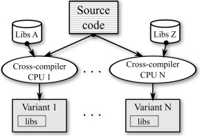

## Table of Contents:
  - [**Libraries**](https://github.com/anaskhamees/Embedded_Linux/blob/main/EmbeddedLinuxTasks/01.Static_Dynamic_Lib/README.md#libraries)
    - [**Static Library**](https://github.com/anaskhamees/Embedded_Linux/blob/main/EmbeddedLinuxTasks/01.Static_Dynamic_Lib/README.md#1-static-library)
      - [*How to create static library in C*](https://github.com/anaskhamees/Embedded_Linux/blob/main/EmbeddedLinuxTasks/01.Static_Dynamic_Lib/README.md#11-how-to-create-static-library-in-c)
      - [*Example (Calculator Application)*](https://github.com/anaskhamees/Embedded_Linux/blob/main/EmbeddedLinuxTasks01.Static_Dynamic_Lib/README.md#12-example-calculator-application)
    - [**Dynamic Library**](https://github.com/anaskhamees/Embedded_Linux/blob/main/EmbeddedLinuxTasks/01.Static_Dynamic_Lib/README.md#2-dynamic-libraries)
      - [*How to create dynamic library in C*](https://github.com/anaskhamees/Embedded_Linux/blob/main/EmbeddedLinuxTasks/01.Static_Dynamic_Lib/README.md#21-how-to-make-dynamic-library)
      - [*Example (Calculator Application)*](https://github.com/anaskhamees/Embedded_Linux/blob/main/EmbeddedLinuxTasks/01.Static_Dynamic_Lib/README.md#22-example-calculator-application)
    - [**The difference between Dynamic and Static Linking**](https://github.com/anaskhamees/Embedded_Linux/blob/main/EmbeddedLinuxTasks/01.Static_Dynamic_Lib/README.md#3-the-difference-between-dynamic-and-static-linking)
    - [**References**](https://github.com/anaskhamees/Embedded_Linux/blob/main/EmbeddedLinuxTasks/01.Static_Dynamic_Lib/README.md#4-references)
# Libraries 

A library is like a treasure trove of ready-made code, including functions, variables, and more. It's like a handy toolkit that programmers can use to save time and avoid redoing common tasks and instead of reinventing the wheel. Simply, there is a collection of pre-compiled code which forms a package called library. There are two types of libraries: 

### GCC

>GCC, the GNU Compiler Collection, is a powerful and versatile collection of compilers for various programming languages, most notably C, C++, and Fortran. It is an essential tool in the development and compilation of software on Unix-like operating systems, including Linux.
>
>**Multi-Language Support**
>
>- **C**: The original language supported by GCC.
>- **C++**: Comprehensive support for C++ with full adherence to the standard.
>- **Fortran**: Support for the Fortran language, widely used in scientific computing.
>- **Objective-C**: Support for Objective-C, commonly used in macOS and iOS development.
>- **Ada, Go, and others**: GCC also supports other languages through its modular design.

### GCC Options

>#### Basic Options
>
>- `-o <file>`: Specify the output file name.
>- `-c`: Compile the source files without linking.
>- `-S`: Compile the source files to assembly code.
>- `-E`: Preprocess the source files and output the result.
>
>#### Optimization Options
>
>- `-O0`: No optimization (default).
>- `-O1`: Basic optimization.
>- `-O2`: Moderate optimization, including almost all supported optimizations that do not involve a space-speed tradeoff.
>- `-O3`: High-level optimization, includes `-O2` plus more aggressive optimizations.
>- `-Os`: Optimize for size.
>- `-Ofast`: Optimize for speed without strict adherence to standards compliance.
>
>#### Debugging Options
>
>- `-g`: Generate debugging information in the default format (e.g., DWARF).
>- `-g1`, `-g2`, `-g3`: Control the amount of debugging information generated.
>- `-ggdb`: Generate debugging information specifically for GDB.
>
>#### Warning Options
>
>- `-Wall`: Enable a common set of warnings.
>- `-Wextra`: Enable additional warnings not included in `-Wall`.
>- `-Werror`: Treat all warnings as errors.
>- `-pedantic`: Enforce strict ISO C and ISO C++ compliance.
>- `-Wpedantic`: Enable warnings required by strict ISO C and ISO C++.
>
>#### Language Options
>
>- `-std=<standard>`: Specify the language standard to be used (e.g., `-std=c11`, `-std=c++14`).
>- `-ansi`: Support ANSI C (equivalent to `-std=c90` and `-pedantic`).
>
>#### Linking Options
>
>- `-static`: Link the executable statically.
>- `-shared`: Create a shared library.
>- `-L<dir>`: Add a directory to the library search path.
>- `-l<library>`: Link with the specified library.
>
>#### Preprocessor Options
>
>- `-D<macro>[=<value>]`: Define a macro.
>- `-U<macro>`: Undefine a macro.
>- `-I<dir>`: Add a directory to the include file search path.
>- `-nostdinc`: Do not search the standard system directories for header files.
>
>#### Code Generation Options
>
>- `-march=<arch>`: Generate code for a specific architecture (e.g., `-march=x86-64`).
>
>- `-mtune=<arch>`: Tune code for a specific architecture (does not restrict the code to that architecture).
>
>- `-fPIC`: Generate position-independent code for shared libraries.
>
>- `-fPIE` and `-pie` flags in GCC are used to generate Position-Independent Executables (PIE), which enhance security by allowing the executable to be loaded at different memory addresses each time it is run.
>
>  **Differences between `fPIE` and `pie`**
>
>  >1. **Stage of Use**:
>  >   - `-fPIE` is used at the **compilation** stage.
>  >   - `-pie` is used at the **linking** stage.
>  >2. **Functionality**:
>  >   - `-fPIE` generates position-independent code for object files.
>  >   - `-pie` creates a position-independent executable from the object files.
>  >3. **Code and Executable**:
>  >   - `-fPIE` affects how individual source files are compiled, generating code that can be relocated.
>  >   - `-pie` affects how the final executable is produced, ensuring that the entire executable can be relocated.
>
>- `-fstack-protector`: Enable stack protection to prevent stack overflows.
>
>#### Miscellaneous Options
>
>- `-v`: Enable verbose output.
>- `--version`: Display the compiler version.
>- `-pipe`: Use pipes rather than temporary files for communication between the various stages of compilation.
>- `-ffunction-sections` and `-fdata-sections`: Place each function or data item into its own section in the output file.
>- `-Wl,<option>`: Pass options to the linker (e.g., `-Wl,-rpath,/path/to/lib`).
>
>### C Standards
>
>- `-std=c89` or `-std=iso9899:1990`: Conform to the 1989 ANSI C standard, also known as C89 or ANSI C.
>- `-std=iso9899:199409`: Conform to the 1994 ISO C amendment (C89 with amendments).
>- `-std=c99` or `-std=iso9899:1999`: Conform to the 1999 ISO C standard, also known as C99.
>- `-std=c11` or `-std=iso9899:2011`: Conform to the 2011 ISO C standard, also known as C11.
>- `-std=c17` or `-std=iso9899:2017`: Conform to the 2017 ISO C standard, also known as C17 or C18.
>- `-std=c2x`: Conform to the draft version of the next C standard (expected to be C23).

## 1. Static Library 

It is a group of objects files (*.o) that link with the application during linking phase of build process.  The linker copies the code inside the library and merges it to main application to generate executable file and making the program self-contained and not dependent on external libraries at runtime.


### 1.1. How to create static library in C

- Select your compiler in my case **gcc**.
- Compile the source files and generate object files **(*.o)** but do not link them.

```c
gcc -c -Wall -Werror -Wextra *.c
```

> Let's explain the command: 
>
> - ***gcc***  specify your complier.
>
> - ***c***   flag tells the compiler to generate object files (.o) from the  source files (.c) without linking them. Object files contain compiled  code but are not yet executable. 
>
> - ***Wall***  flag enables a set of common warning messages. The "Wall" stands for "all Warnings".
>
> - ***Werror***  flag treats warning messages as errors. If the compiler encounters  any warnings, it will stop the compilation process and report an error to enforce the developer to follow the standard.
>
> - ***Wextra***  flag activates additional warning messages that are not included in the `-Wall` set.
>
>   > we can neglect **-Wall, -Werror and Wextra** flags but they are useful in compilation to enhance code quality  and improve the bugs.  
>   >
>   > ```
>   > gcc -c file.c
>   > ```
>   >
>   > or 
>   >
>   > ```
>   > gcc -c *.c  
>   > ```
>
> - **(*.c)** : this is a wildcard that specifies all C source files (`*.c`) in the current directory.

- Create static library by run this command: 

  ```c
  ar -rcs libName.a *.o		    
  ```

  or

  ```c
   ar -rcs libName.a file1.o file2.o file3.o  
  ```

  > We make archive file contains all object files of the functions to merges it with the main application 
  >
  > - **ar** :  archive command to create archive file.
  >
  > - **r**   :  insert or replace the object file if exist to the archive .
  >
  > - **c**   : create the archive file if not exist.
  >
  > - **s**   : add symbol table to the archive.
  >
  > - **libName.a**: the static library file  
  >
  >   > (**lib** for standard , **Name** is the name of static library, **a** stand for any static library)   
  >
  > - **(*.o)** : this is a wildcard that specifies all object files (`*.o`) in the current directory.
  >
  >   

- To show the object files (*.o) included in the library : 

  ```
  ar t libName.a
  ```

  

### 1.2. Example (Calculator Application)

- We have some functions that be used in the main program (add, sub, multi, div, mod).

- Create a directory and files for functions in any location on Home directory :

  ```bash
  mkdir calculator
  ```

  ```bash
  cd calculator
  touch main.c
  ```

  ```
  mkdir Lib_Src
  cd Lib_Src
  ```

  ```bash
  touch add.c sub.c multi.c div.c mod.c
  ```

  ```bash
  
  mkdir ~/calculator/includes
  cd includes
  ```

  ```
  touch add.h sub.h multi.h div.h mod.h
  ```

- The Project hierarchy becomes like that:


- You can open the file using vim and write the code

  ```bash
  vim file.c
  ```

  - ##### Addition function  (add.c , add.h)

    ```c
    /*This is the header file of addition function*/
    float add_fun(float Number1,float Number2); // function prototype (decleration)
    ```

    ```c
    /*This is the source file of addition function*/
    #include "add.h"
    float add_fun(float Number1,float Number2)
    {
    	return (Number1+Number2);
    }
    ```

  - Subtraction function (sub.c , sub.h).


  ```c
  /*This is the header file of subtraction function*/
  float sub_fun(float Number1,float Number2); // function prototype (decleration)
  ```

  ```c
  /*This is the source file of subtraction function*/
  #include "sub.h"
  float sub_fun(float Number1,float Number2)
  {
  	return (Number1-Number2);
  }
  ```

  - Division function (div.c , div.h).


  ```c
  /*This is the header file of division function*/
  float div_fun(float Number1,float Number2); // function prototype (decleration)
  ```

  ```c
  /*This is the source file of division function*/
  #include "div.h"
  float div_fun(float Number1,float Number2)
  {
  	return (Number1/Number2);
  }
  ```

  - Multiplication function (multi.c , multi.h).


  ```c
  /*This is the header file of multiplication function*/
  float multi_fun(float Number1,float Number2); // function prototype (decleration)
  ```

  ```c
  /*This is the source file of multiplication function*/
  #include "multi.h"
  float div_fun(float Number1,float Number2)
  {
  	return (Number1/Number2);
  }
  ```

  - Modulus function (mod.c , mod.h).


  ```c
  /*This is the header file of modulus function*/
  int mod_fun(int Number1,int Number2); // function prototype (decleration)
  ```

  ```c
  /*This is the source file of modulus function*/
  #include "mod.h"
  int mod_fun(int Number1,int Number2)
  {
  	return (Number1%Number2);
  }
  ```

- main function (main.c)

  ```c
  /*this is the main application (calculator)*/
  #include "includes/add.h"
  #include "includes/div.h"
  #include "includes/mod.h"
  #include "includes/multi.h"
  #include "includes/sub.h"
  #include <stdio.h>
  
  int main(void)
  {
    printf("Add operation 5 + 5  =  %f\n",add_fun(5,5));
    printf("Sub operation 10 - 5 =  %f\n",sub_fun(10,5));
    printf("Multi operation 4 * 4=  %f\n",multi_fun(4,4));
      
     return 0;
  }
  ```

  

- Let's compile the source files and generate object files: 

  ```
  cd ~/calculator/Lib_Src
  gcc -c -Wall -Werror -Wextra *.c
  ```


- Creating Static Library (its name **operation**) using the object files :

  ```
  ar -rcs liboperation.a *.o		    
  ```


- Show the object files included in the static library:


- Link the static library **(liboperation.a)** with the **main.c** to generate executable application. 

```
gcc -static main.c  -o Calculator -loperation -L./Lib_Src  -I ./includes
```

> - **static** flag	: to linking the library statically (we must use this flag because libraries linked 			    dynamically by default .
> - **-o Calculator** : the name of executable output.
> - **-l**(L small)        : specify the name of your library after **l** flag without the prefix "lib" and postfix "".a".
> - **-L** flag              : specify the path of the function source files of the library.
> - **-I** ( *i* capital)     : specify the path of the header files of the library.


- Run the application (Calculator)


## 2. Dynamic Libraries

Dynamic libraries are  shared object files that contain functions, variables and so on.
The linking with the application occurs at runtime in the RAM, thanks to the dynamic loader. This system loader resolves symbols (references to functions or variables) dynamically, allowing the application to use the library's functionality.

>**System loader** (often simply referred to as a loader) is a part of the operating system responsible for loading and linking shared libraries (also known as dynamic libraries) when an application is executed.
>
>Here are the key functions of a system loader in this context:
>
>1. **Loading the Program**: When a program is executed, the loader reads the executable file and loads it into memory. It also identifies the shared libraries that the program depends on.
>2. **Resolving Dependencies**: The loader locates the required shared libraries and loads them into memory. It ensures that all necessary libraries are available and loads them in the correct order to resolve dependencies.
>3. **Relocating Symbols**: Since shared libraries can be loaded at different memory addresses, the loader adjusts the addresses (relocates the symbols) in the executable and the libraries to ensure that all references to functions and variables are correct.
>4. **Linking Symbols**: The loader resolves references to symbols (functions, variables) in the shared libraries that the program uses. This dynamic linking process ensures that the program can correctly call functions and use variables defined in the shared libraries.
>5. **Managing Shared Library Versions**: The loader handles different versions of shared libraries. It ensures that the correct version of a library is used based on the program's requirements.
>6. **Optimizing Performance**: The loader may perform optimizations such as pre-linking or pre-loading libraries to improve the startup time of applications.
>
>In Unix-like operating systems, the loader is typically part of the dynamic linker (e.g., `ld.so` or `ld-linux.so`), which is invoked automatically when an executable that depends on shared libraries is run. In Windows, the loader functionality is integrated into the operating system's loader, which is responsible for loading **DLL (Dynamic-Link Library)** files.


### 2.1. How to make Dynamic Library

- Compile the source files and generate position independent object files (*.o)

  ```
  gcc -c -fPIC -Wall -Werror *.c
  ```

  >- ***c*** 	: compile and assemble but don't link.
  >- ***fPIC***   : ***field Position Independent*** Code flag is a compiler options that generate code suitable for use in shared libraries ,PIC is a feature that allows a compiled library to be loaded into memory at any address. This is essential for shared libraries because the exact memory location where a library is loaded can vary between different programs and is determined at run time.


- Create Dynamic Library using the object files (*.o)

  ```
  gcc -shared -o liboperation.so *.o
  ```

  > - **shared **       :  this option tells the linker to generate shared library instead of executable file.
  > - ***o***  flag          :  to specify the name of the library.
  > - **lib**                :  postfix to follow the standard.
  > - **operation** : the name of the shared library.
  > - **so**                : postfix stand for **shared object** .


```
file liboperation.so
```


- To show the symbol table of the shared library :

  ```
  objdump -T liboperation.so 
  ```


- You need to  add the location of your dynamic library, there is **three options**:

  - **First priority** (for loader): use `-rpath` flag when compiling, for example

    ```bash
    gcc -L/path/to/lib -Wl,-rpath,/path/to/lib -o myprogram myprogram.c -lmylib
    ```

    - Try to use those commands :

      ```bash
      strings myexecutable
      ```

      - >The `strings` command in Unix-like operating systems is used to extract printable strings from a binary executable or any other file that contains printable characters. When applied to an executable file (`myexecutable` in this case), `strings` searches through the binary file and extracts sequences of printable characters (usually sequences longer than 4 characters by default), displaying them to the terminal.
        >
        >**We use it to ensure the name of dynamic library in the header of the executable** 

      ```bash
      ldd myexecutable
      ```

      >The `ldd` command in Unix-like operating systems is used to print the shared library dependencies of an executable or a shared library. When you run `ldd` on `myexecutable`, it will display a list of shared libraries that `myexecutable` depends on.
      >
      >**example** of the output:
      >
      >```
      >linux-vdso.so.1 (0x00007ffd3cbfc000)
      >libpthread.so.0 => /lib/x86_64-linux-gnu/libpthread.so.0 (0x00007f5a8cf51000)
      >libc.so.6 => /lib/x86_64-linux-gnu/libc.so.6 (0x00007f5a8cd5f000)
      >/lib64/ld-linux-x86-64.so.2 (0x00007f5a8d15a000)
      >
      >```
      >
      >>**linux-vdso.so.1**: Virtual dynamic shared object provided by the kernel (not a physical file).
      >>
      >>**libpthread.so.0**: POSIX thread library.
      >>
      >>**libc.so.6**: C standard library.
      >>
      >>**ld-linux-x86-64.so.2**: Dynamic linker/loader.

  - **Second priority **(for loader): **set environmental variable   LD_LIBRARY_PATH** so the compiler knows where is  the object codes of the functions you use.

  ```
  export LD_LIBRARY_PATH= your/path/of/library
  ```

  > > Open the terminal in the directory of the dynamic library and run PWD, then copy the path and paste it in LD_LIBRARY_PATH

  - If you want to ensure that the current directory is always included in `LD_LIBRARY_PATH`, you can add the export command to your shell configuration file .

    ```
     vim ~/.bashrc
    ```

    - In the tail of the file write this : export LD_LIBRARY_PATH= your/path/of/library, then save.
  


```bash
source ~/.bashrc
```

- The third priority for loader to search for the dynamic libraries is `/usr/lib` 	 

### 2.2. Example (Calculator Application)

- Link the dynamic Library with the  main.c (calculator):

  ```
  gcc main.c -o CalculatorDynamic -L ./Lib_Src -loperation -I ./includes
  ```

- Run the application (**CalculatorDynamic**)

```
./CalculatorDynamic
```


## 3. The difference between Dynamic and Static Linking


|               |                       Static Libraries                       |                      Dynamic Libraries                       |
| :-----------: | :----------------------------------------------------------: | :----------------------------------------------------------: |
|   **Size**    | Object codes are bigger because including the actual code not an address | binary files is smaller because including the addresses of functions |
|  **Update**   | If there is any change in the code, it must be compile again |  The shared objects can be replaced without compiling again  |
|   **Time**    | It is faster because does not need additional time to load the library in run time |        consumes more time loading the shared objects         |
| **Execution** |           does not dependent on any external files           | dependent on the shared library, if not exist ,the execution fails |


## 4.  Compilation

### 4.1. Native Compilation

Native compilation refers to the process of compiling source code directly on the target machine where the compiled program will be run. This approach is common in software development, particularly for software that is intended to run on the same platform (same architecture) where it is developed.

### 4.2. Cross Compilation

Cross-compiling is the process of compiling source code into executable binaries on a different platform (architecture or operating system) than the one where the code will eventually run. This is particularly useful for developing software for embedded systems, where the target device might not have the necessary resources (CPU power, memory, storage) to perform the compilation itself.

### 

### 4.2.1. glibc (GNU C Library)

**glibc**, or the GNU C Library, is the most widely used C library on GNU/Linux systems. It provides the core libraries for the GNU system and GNU/Linux operating systems, offering essential APIs for system calls, basic data types, string handling, and more.

####  Features:

- **POSIX Compliance**: Fully compliant with the POSIX standard, ensuring compatibility with many Unix-like systems.
- **Wide Adoption**: The default C library for many Linux distributions, including Debian, Ubuntu, Fedora, and Red Hat.
- **Rich Functionality**: Provides a comprehensive set of APIs for file operations, process control, threading, and more.
- **Internationalization**: Supports internationalization and localization, making it suitable for global software development.
- **Dynamic Loading**: Supports dynamic loading of shared libraries (`dlopen`, `dlsym`).

### 4.2.2. uClibc (micro C Library)

**uClibc** is a smaller C library designed for embedded systems. It aims to be a smaller, lighter alternative to glibc, suitable for systems with limited resources.

####  Features:

- **Compact Size**: Much smaller footprint compared to glibc, making it ideal for embedded systems.
- **POSIX Compliance**: Mostly POSIX compliant, although some features might be missing or simplified.
- **Customizability**: Highly configurable, allowing developers to include only the components they need.
- **Embedded Focus**: Optimized for use in embedded systems with limited CPU power, memory, and storage.
- **Compatibility**: Supports a wide range of architectures, including ARM, MIPS, PowerPC, and more.

### 2.2.3. musl (Lightweight C Library)

**musl** is a lightweight, fast, and simple implementation of the standard C library, aiming for correctness, clarity, and portability. It's designed as an alternative to glibc and uClibc, particularly for static linking and small systems.

####  Features:

- **Efficiency**: Designed to be efficient in both memory usage and performance.
- **Static Linking**: Highly optimized for static linking, reducing binary sizes.
- **Simplicity**: Focuses on simplicity and minimalism, avoiding unnecessary complexity.
- **Standard Compliance**: Adheres to POSIX and C99 standards, ensuring broad compatibility.
- **Portability**: Supports various architectures and platforms, making it a good choice for cross-platform development.

### Comparison

- **Size**:
  - **glibc**: Largest, with extensive functionality.
  - **uClibc**: Smaller, designed for embedded systems.
  - **musl**: Lightweight, focusing on simplicity and efficiency.
- **Performance**:
  - **glibc**: High performance but larger memory footprint.
  - **uClibc**: Good performance for its size, optimized for embedded use.
  - **musl**: Efficient and fast, particularly for static linking.
- **Standards Compliance**:
  - **glibc**: Fully POSIX compliant with extensive extensions.
  - **uClibc**: Mostly POSIX compliant with some limitations.
  - **musl**: POSIX and C99 compliant, with a focus on correctness.
- **Use Cases**:
  - **glibc**: General-purpose Linux systems with rich functionality requirements.
  - **uClibc**: Embedded systems where memory and storage are limited.
  - **musl**: Systems needing efficient static linking and small binary sizes, such as lightweight containers.


### 4.2.4. crosstool-NG

**crosstool-NG** is a versatile and highly configurable tool used for building cross-compilation toolchains. A cross-compilation toolchain allows developers to compile software on a host machine for a different target architecture or operating system. crosstool-NG simplifies the process of creating these toolchains, supporting a wide range of architectures and configurations.

#### Features of crosstool-NG:

1. **Configurability**: Allows extensive configuration options for the toolchain components, such as the compiler, C library, binutils, and more.
2. **Support for Multiple Architectures**: Supports a variety of target architectures, including ARM, MIPS, PowerPC, x86, and many others.
3. **Ease of Use**: Provides a user-friendly configuration interface (similar to the Linux kernel configuration) to help set up the toolchain.
4. **Reproducibility**: Ensures that the same toolchain can be recreated consistently, which is important for debugging and maintaining build environments.
5. **Integration**: Can be integrated into larger build systems and automated workflows.

**Crosstool-NG Configurations**

- Architecture Type

- Compilation type (cross or native)

- Libraries types (glibc - uclib - musl )

- bin utilities :

  >- gcc
  >- ld
  >- ldd
  >- objdump
  >- objcopy
  >- strings
  >- ar
  >- strip
  >- g++
  >- strace
  >- make
  >- ....etc
  >
  >

- Linux Kernel Headers
- The compiler will run on OS or bare-metal 

### 4.2.5. Install Crosstool NG

- clone crosstool-ng repo

- ./bootstrap

- ./configure --enable-local

- make

- ./ct-ng

- ./ct-ng list-samples

- ./ct-ng cortex-a9

- ./ct-ng menuconfig

- Open the GUI and configure :

- >- select the library
  >- Gdb
  >- strace
  >- c++
  >- make
  >  - if you want to search about configuration in menuconfig **"write forward slash /"**

- ./ct-ng build

  

**====================================================================================**

**===================================== sooooon =======================================**

**====================================================================================**

##  References 

1. https://omaryahia4444.medium.com/static-library-vs-dynamic-library-210f740fc014
2. https://dev.to/iamkhalil42/all-you-need-to-know-about-c-static-libraries-1o0b
3. https://www.linkedin.com/pulse/dynamic-libraries-c-linux-agustin-flom/
