## Table of Contents 
  - [**1. What is the Server machine**](https://github.com/anaskhamees/Embedded_Linux/tree/main/EmbeddedLinuxTasks/Bootloader/Booting_TFTP_Server#1-what-is-the-server-machine)
  - [**2. What is TFTP**](https://github.com/anaskhamees/Embedded_Linux/tree/main/EmbeddedLinuxTasks/Bootloader/Booting_TFTP_Server#2-what-is-tftp)
    - [2.1. Benefits of booting from the Server](https://github.com/anaskhamees/Embedded_Linux/tree/main/EmbeddedLinuxTasks/Bootloader/Booting_TFTP_Server#21-benefits-of-booting-from-the-server)
    - [2.2. Booting from the server prerequisites](https://github.com/anaskhamees/Embedded_Linux/tree/main/EmbeddedLinuxTasks/Bootloader/Booting_TFTP_Server#22-booting-from-the-server-prerequisites)
  - [**3. Install TFTP Package on Linux (Computer)**](https://github.com/anaskhamees/Embedded_Linux/tree/main/EmbeddedLinuxTasks/Bootloader/Booting_TFTP_Server#3-install-tftp-package-on-linux-computer)
    - [3.1. Install tftp package on linux](https://github.com/anaskhamees/Embedded_Linux/tree/main/EmbeddedLinuxTasks/Bootloader/Booting_TFTP_Server#31-install-tftp-package-on-linux)
    - [3.2. Connect the Server (computer) with the target (qemu)](https://github.com/anaskhamees/Embedded_Linux/tree/main/EmbeddedLinuxTasks/Bootloader/Booting_TFTP_Server#32--connect-the-server-computer-with-the-target-qemu)
        - [3.2.1. Server (computer) IP Address](https://github.com/anaskhamees/Embedded_Linux/tree/main/EmbeddedLinuxTasks/Bootloader/Booting_TFTP_Server#321-server-computer-ip-address)
        - [3.2.2. The script of Server network interface (TAP)](https://github.com/anaskhamees/Embedded_Linux/tree/main/EmbeddedLinuxTasks/Bootloader/Booting_TFTP_Server#322-the-script-of-server-network-interface-tap)
        - [3.2.3. The IP Address of Target (qemu) network interface (NIC) .](https://github.com/anaskhamees/Embedded_Linux/tree/main/EmbeddedLinuxTasks/Bootloader/Booting_TFTP_Server#323-the-ip-address-of-target-qemu-network-interface-nic-)
  - [**4. Test the Connection between the server and qemu**](https://github.com/anaskhamees/Embedded_Linux/tree/main/EmbeddedLinuxTasks/Bootloader/Booting_TFTP_Server#4-test-the-connection-between-the-server-and-qemu)
    - [4.1. Run Qemu](https://github.com/anaskhamees/Embedded_Linux/tree/main/EmbeddedLinuxTasks/Bootloader/Booting_TFTP_Server#41-run-qemu)
    - [4.2. Set U-boot environment variables](https://github.com/anaskhamees/Embedded_Linux/tree/main/EmbeddedLinuxTasks/Bootloader/Booting_TFTP_Server#42--set-u-boot-environment-variables)
    - [4.3. Loading the files from Server or SD card to target RAM](https://github.com/anaskhamees/Embedded_Linux/tree/main/EmbeddedLinuxTasks/Bootloader/Booting_TFTP_Server#43--loading-the-files-from-server-or-sd-card-to-target-ram)
      - [4.3.1. Loading the files ( Zimage and hardware.dbt which I created them above)](https://github.com/anaskhamees/Embedded_Linux/tree/main/EmbeddedLinuxTasks/Bootloader/Booting_TFTP_Server#431-loading-the-files--zimage-and-hardwaredbt-which-i-created-them-above)
  - [**5. References**](https://github.com/anaskhamees/Embedded_Linux/tree/main/EmbeddedLinuxTasks/Bootloader/Booting_TFTP_Server#5-references) 
    
    
    


-----------------------------------------------------------------------------------------------------------------------------------------------------------


# Booting from TFTP Server 

As we discussed before about the U-boot [Here](https://github.com/anaskhamees/Embedded_Linux/tree/main/EmbeddedLinuxTasks/Bootloader#u-boot-bootloader-1)  and booting form SD Card, now we will boot form TFTP server.


### 1. What is the Server machine 

It is a computer or device has network interface that provides services or resources (Hardware) to other devices, known as clients, on a network. The clients communicate with the server through networks protocols like TFTP , SSH, HTTP, NFS and so on. These network protocols is the language which the servers understood so, if we want communicate with the server we should follow those protocols.

.gif)

### 2. What is TFTP 

Trivial File Transfer Protocol (TFTP) is **a network protocol for exchanging files between two machines**.  **TFTP** is commonly used in scenarios where a lightweight file transfers. **TFTP** typically uses UDP port 69 for communication. In Embedded Linux booting, **TFTP** is used to transfer essential files like kernel image and the bootloader in case of new bootloader from the server to the embedded device during the bootstrapping process.

.jpg)

#### 2.1. Benefits of booting from the Server 

- Save space on SD card in case of limited storage.
- Embedded Linux board can be designed without the huge sizes of local storage devices , reducing hardware complexity and cost.
- TFTP servers allows for centralized software updates. Devices can fetch updated bootloaders or kernels from a central server, simplifying the update  process.
- Using a TFTP server allows for development and testing of  kernel changes without the need to write them to SD card.
-  Multiple embedded devices can fetch the Kernel from a TFTP server, enabling  parallel booting.

#### 2.2. Booting from the server prerequisites 

- The server must support **TFTP** network protocol.
- U-boot must support **TFTP** network protocol.
- The embedded Linux board must has a network interface (such as Ethernet).

### 3. Install TFTP Package on Linux (Computer)

In my case I use qemu emulator as a embedded linux board (target)


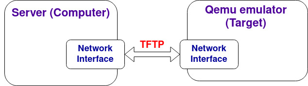

#### 3.1. Install ***tftp package*** on linux

```
sudo apt-get install tftpd-hpa
```

> - **apt-get:** This is the package management command-line tool used in Debian-based systems for handling packages, including installation, removal, and updating.
>
> - **install:** This sub-command is used to install the specified package or packages.
>
> - **tftpd-hpa:** This is the name of the TFTP server package that you are installing. The "hpa" stands for the original author's initials, H. Peter Anvin.

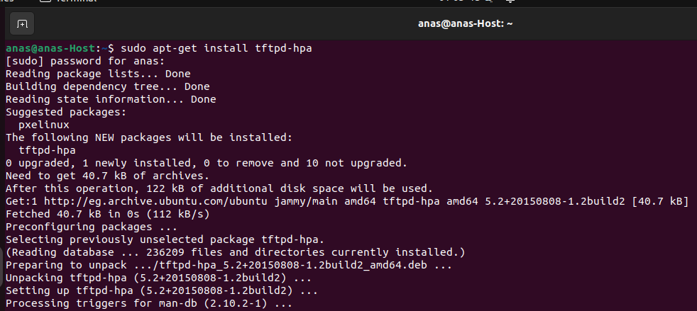

- Run this command to ensure the *tftp* software package installed successfully

  ```
  sudo ss -tulpn | grep :69
  ```

  > *tftp* uses port 69 , so we will ensure who uses port 69 
  >
  > - **ss:** It is a command-line utility used to display socket statistics. It is used to show information about network sockets.
  >
  > - **tulpn:** These are options passed to the `ss` command:
  >
  > - **-t:** Show TCP sockets.
  > - **-u:** Show UDP sockets.
  > - **-l:** Display only listening sockets.
  > - **-p:** Display process information.
  > - **-n:** Do not resolve service names (show numerical addresses instead of names).
  >
  > - **| grep :69:** It pipes the output of the `ss` command to the `grep` command, which filters the results based on the specified pattern (`:69`). This pattern corresponds to UDP port 69.
  >
  > 

Or

```
sudo systemctl status tftpd-hpa
```

>the command provides  information about the current state of the TFTP server service, including whether it is running, its process ID  (PID), active and inactive states.
>
>- `systemctl` is a command-line utility in Linux  that interacts with the `systemd` service manager. `systemd` is a system and service manager that is widely used to manage system processes.
>
>- `status:` This is a sub-command of `systemctl` used to display the current status and information about a specified service.
>
>- `tftpd-hpa:` This is the name of the service (TFTP server service) whose status you want to check.

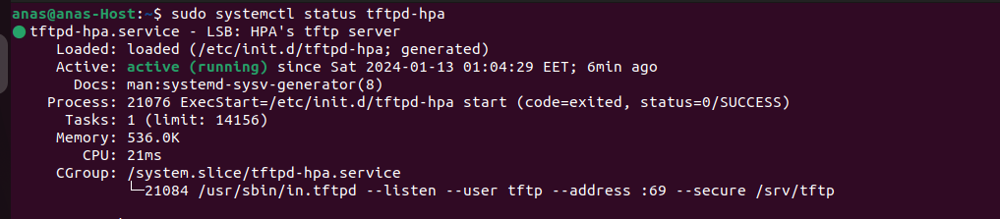

- There is a file created called *tftpd-hpa* inside **/etc/default**

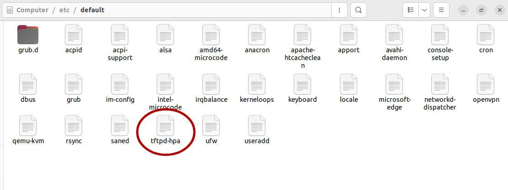

- If we open it , there is some default configurations inside here

  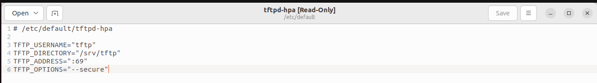

- Edit the configuration inside this file this  , add the line below 

  - open the file using nano / Vi / Vim/...etc. [don't forget to use sudo because you are in root directory]

    ```
    sudo vim /etc/default/tftpd-hpa
    ```

  - Insert the line below on the file (in case of there is already exist edit on it only don't duplicate it).

    ```
    TFTP_OPTIONS="--secure --create"
    ```

    >`secure:`
    >
    >- This option restricts the TFTP server to a specific directory enhance security. The **TFTP** server will only allow file transfers within this specified directory and its subdirectories.
    >
    >`create:`
    >
    >- This option allows the creation of new files on the server during file uploads. Without this option, the **TFTP** server might only allow reading or overwriting existing files, but not creating new ones.
    >
    >

    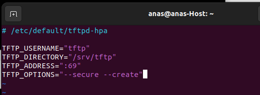

- Restart the protocol 		

  ```
  systemctl restart tftpd-hpa
  ```

- Ensure that  the *tftp* protocol is running

  ```
  systemctl status tftpd-hpa
  ```

  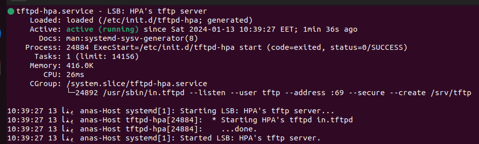

- There is a directory `/srv/tftp` created automatically when installed `tftp` package.

  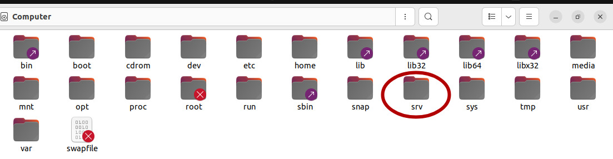

  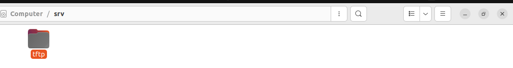

- If not exist, create  `/etc/srv` directory inside the root.

  ```
  mkdir /srv/tftp
  ```

  

- Then change the file/directory owner from root to `tftp` system user.

  ```
  cd /srv
  ```

  ```
  chown tftp:tftp tftp 
  ```

  - Before :

  

  - After :

  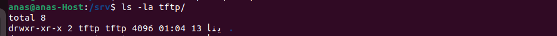

​		

- Create 2 files into `tftp` directory (`/srv/tftp`)

  - The first called Zimage (simulation of kernel) and write any thing in it.

  - The second called hardware.dtb (file has the board information like DIO, interfaces).

    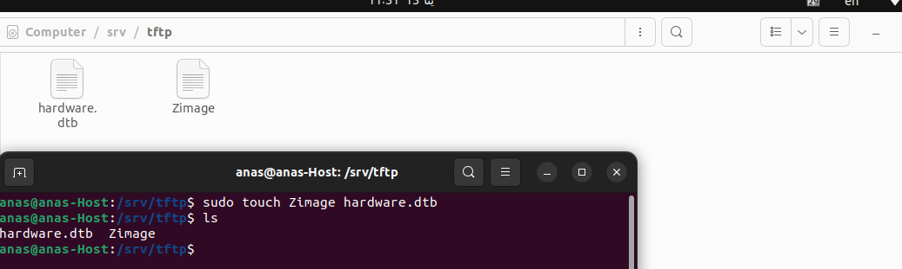

- open the files and write any message inside them

  ```
  sudo vim Zimage 
  sudo vim hardware.dtb
  ```

  OR

  ```
  sudo gedit Zimage
  sudo gedit hardware.dtb
  ```

  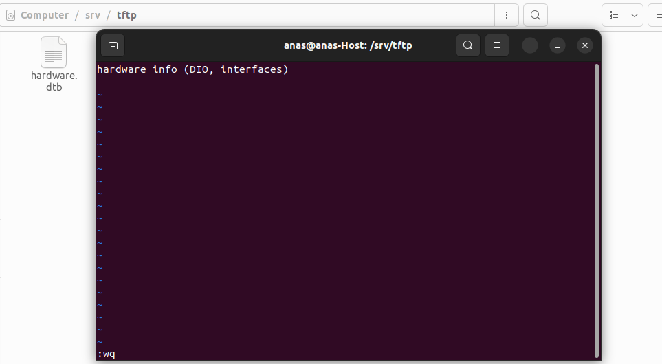

​	

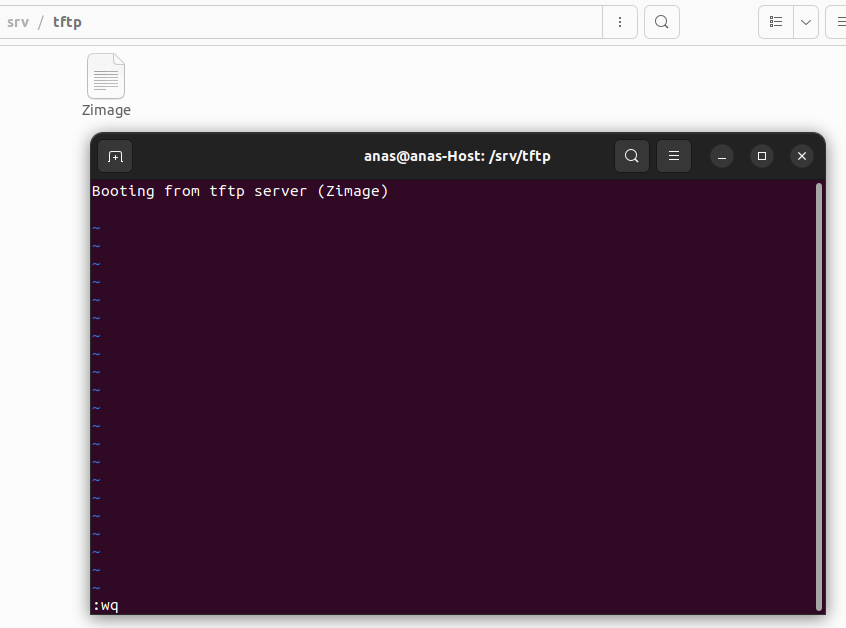

#### 3.2.  Connect the Server (computer) with the target (qemu) 

##### 3.2.1. Server (computer) IP Address

Run this command to know  your IP address of your labptop

```
ip addr
```

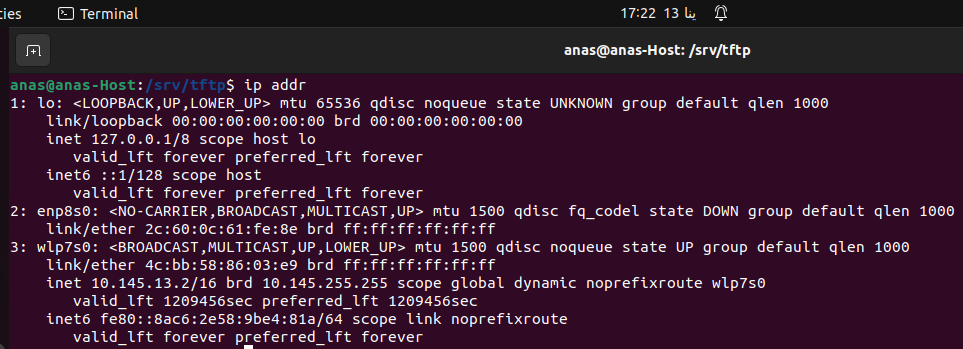

 >Based on the output of the `ip addr` command, here are the relevant network interfaces on your system:
 >
 >1. **Loopback Interface (`lo`):**
 >
 >   - IP address: 127.0.0.1
 >
 >   - IPv6 address: ::1
 >
 >   - This is the loopback interface, allowing communication within the local machine.
 >
 >     It is used for communication within the same device (loopback interface).
 >
 >     Any traffic sent to `127.0.0.1` stays within the device and does not go out to the network.
 >
 >2. **Ethernet Interface (`enp8s0`):**
 >
 >   - Status: NO-CARRIER (indicating that the interface is not currently connected)
 >   - MAC address: 2c:60:0c:61:fe:8e
 >   - This is an Ethernet interface that is currently not connected (NO-CARRIER).
 >
 >3. **Wireless Interface (`wlp7s0`):**
 >
 >   - Status: UP (indicating that the interface is active)
 >   - IP address: 10.145.13.2/16
 >   - IPv6 address: fe80::8ac6:2e58:9be4:81a/64
 >   - This is a wireless interface (Wi-Fi) that is currently active and has obtained the IP address 10.145.13.2.
 >
 >The `inet` field shows the IPv4 address, while the `inet6` field shows the IPv6 address. In this case, the wireless interface (`wlp7s0`) has an IPv4 address of **10.145.13.2** . 
 >
 >So, IP address assigned to a **network interface** on my laptop (`wlp7s0`) is **10.145.13.2** .
 >
 >If you are setting up a TAP interface for QEMU, you may want to use the wireless interface (`wlp7s0`) for your virtual machine networking setup. Ensure that the `qemu-ifup` script is appropriately configured for the wireless interface.


#### 3.2.2. The script of Server network interface (TAP) 

You should create a script called  `qemu-ifup` . It is responsible for configuring the Server network interface (TAP). (You will understand the purpose of this script below)

```bash
#!/bin/sh
ip a add <YourIPAddress> dev $1
ip link set $1 up
```

In my case

```bash
#!/bin/sh
ip a add 10.145.13.2/16 dev $1
ip link set $1 up
```

then give the script the execute permission, run the follow command

```
chmod +x qemu-ifup
```

Make sure that the script in the same directory of the u-boot 

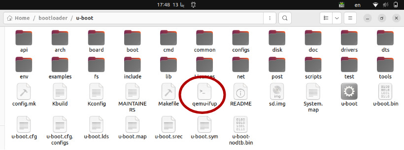

#### 3.2.3. The IP Address of Target (qemu) network interface (NIC) .

I assigned the IP address of qemu  bigger than the Server IP Address.

In my case qemu virtual IP address is  `10.145.13.3` (assumption)


### 4. Test the Connection between the server and qemu

#### 4.1. Run Qemu 

```
sudo qemu-system-arm -M vexpress-a9 -m 128M -nographic -kernel path/u-boot -sd path/sd.img -net tap,script=./qemu-ifup -net nic

```

>- `qemu-system-arm`: QEMU emulator for ARM architecture.
>- `-M vexpress-a9`: Specify the machine type, in this case, the Versatile Express ARM Cortex-A9.
>- `-m 128M`: Set the amount of RAM for the virtual machine to 128 megabytes.
>- `-nographic`: Disable graphical output, running the emulator in a terminal rather than a graphical window.
>- `-kernel u-boot/u-boot`: Specify the path to the U-Boot bootloader binary that will be loaded by the virtual machine.
>- `-sd sd.img`: Attach an SD card image (`sd.img`) to the virtual machine as a storage device.
>- `-net tap,script=./qemu-ifup -net nic`: Configure networking for the virtual machine.
>  - `-net tap,script=./qemu-ifup`: Create a TAP (network tap) interface for the virtual machine with the specified script (`qemu-ifup`).
>  - `-net nic`: Attach a network interface card (NIC) to the virtual machine.
>
>Now, let's break down the networking part with more details:
>
>- **TAP Interface (`-net tap,script=./qemu-ifup`):**
>  - `tap`: This specifies the use of a TAP interface for networking (network interface name of server).
>  - `script=./qemu-ifup`: This specifies a script (`qemu-ifup`) to be executed to set up the TAP interface. This script is responsible for configuring the host side of the TAP interface.
>- **NIC (`-net nic`):**
>  - `nic`: This option attaches a network interface card to the virtual machine (network interface name of server of the target [qemu]).

In my case , I created the **SD imag** and the **qemu-ifup** script in the same directory of U-boot.

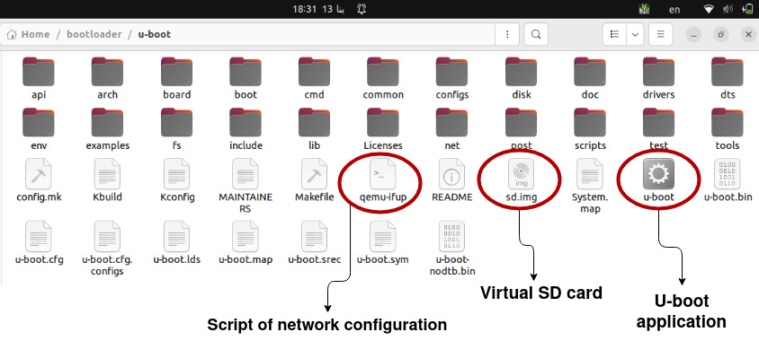

```
sudo qemu-system-arm -M vexpress-a9 -m 128M -nographic -kernel u-boot -sd sd.img -net tap,script=./qemu-ifup -net nic
```

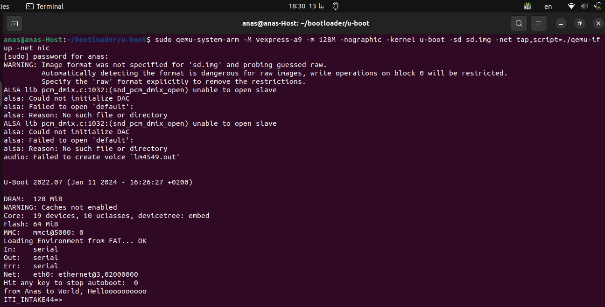

#### 4.2.  Set U-boot environment variables

After the bootloader application run , we will use some of U-boot command to set the IP addresses of the server and the target .

- Set Server IP address "use the same name **serverip**"

  ```
  setenv serverip [host ip address]
  ```

  - In my case :

    ```
    setenv serverip 10.145.13.2
    ```

- Set Target (qemu) IP address (Apply IP address bigger than server)

  ```
  setenv ipaddr [chose]
  ```

  - In my case  "Make sure that this IP address not used by other system user "

    ```
    setenv ipaddr 10.145.13.3
    ```

​	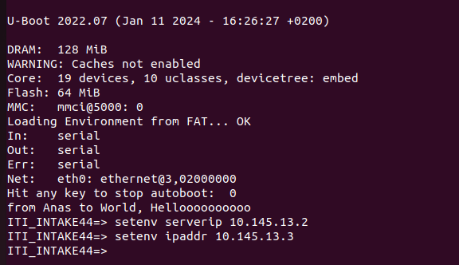

```
#save the environment variable in U-boot
saveenv
```

#### 4.3.  Loading the files from the TFTP Server or SD card to target RAM

- We can the board information and the ram start address by running this command below :

  ```
  bdinfo
  ```

  > The `bdinfo` command in U-Boot is used to display information about the board's memory configuration. It provides details about the  memory map, such as the base addresses, sizes.

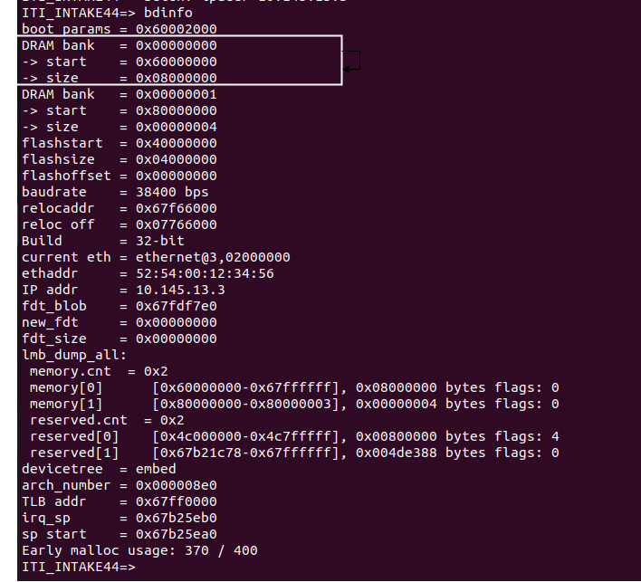

> Target DRAM start Address is 0x60000000

#### 4.3.1. Loading the files ( Zimage and hardware.dbt which I created them above)

- **Loading from SD card (FAT) into the DRAM** 

```
fatload mmc 0:1 [addressRam] [fileName]
```

In my case 

```
fatload mmc 0:1 0x60000000 Zimage
```

- **Loading the files from the  *tftp* server to DRAM**

  ```
  tftp [addressRam] [fileName]
  ```

   In my case 

  ```
  tftp 0x60000000 Zimage
  ```

  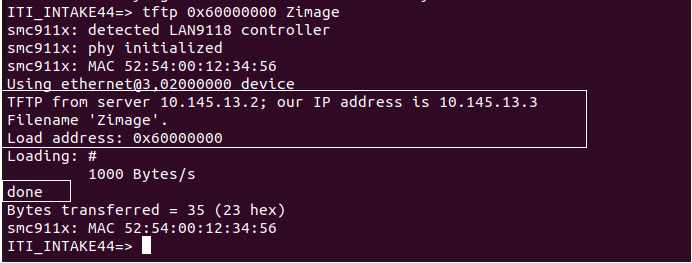

  - Let's see the content of memory location (0x60000000) in DRAM 

    ```
    md [address] [count]
    ```

    >command in U-Boot stands for "memory display." It is used to display the contents of memory starting from a specified address.
    >
    >- `address`: The memory address where you want to start displaying data.
    >
    >- `count`: The number of memory locations to display.
    >
    >  

```
md 0x60000000
```

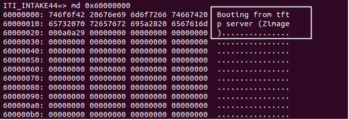

Booting from ***tftp*** server is DONE 

- **For Readability I create Variables and assign the commands and the DRAM address on them.**

  ```
  setenv Kernel_AddressInDRAM 0x60000000
  ```

  ```
  setenv ftd_FileAddress 0x60000020
  ```

  ```
  setenv Booting_Kernel_TFTPserver "tftp ${Kernel_AddressInDRAM} Zimage"
  ```

  > - **Kernel_AddressInDRAM** : The address in DRAM which the Zimage is stored.
  > - **Zimage** : simple file contain text, that is simulate the Kernel image

  ```
  setenv Booting_ftd_TFTPserver "tftp ${ftd_FileAddress} hardware.dtb"
  ```

  > - **ftd_FileAddress** :  The address in DRAM which the hardware.dtb is stored.
  > - **hardware.dtb**    : It is a file contains Embedded board Information like (DIO, Interfaces of the hardware)

​	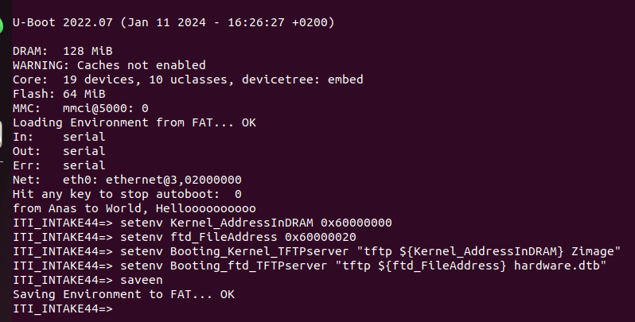

- **Let's Run the U-boot environment variables**

  ```
  run Booting_Kernel_TFTPserver
  ```

  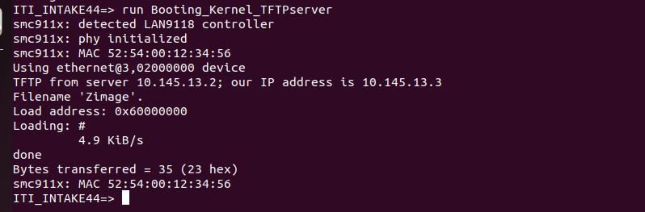

  ```
  run Booting_ftd_TFTPserver
  ```

  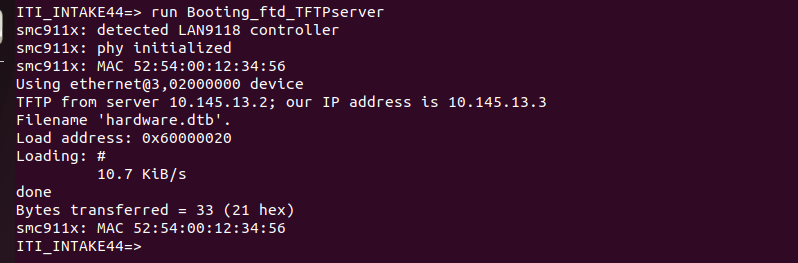

- Ensure that the Zimage file booted from *tftp* server and stored in target DRAM

  ```
  md ${Kernel_AddressInDRAM}
  ```

  >`md` : Memory display command
  >
  >`Kernel_AddressInDRAM` : The address in target DRAM which the Zimage is stored in it.

​	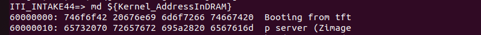

- Ensure that the hardware.dtb file booted from *tftp* server and stored in target DRAM

  ```
  md ${ftd_FileAddress}
  ```

  >`md` : Memory display command
  >
  >`Kernel_AddressInDRAM` : The address in target DRAM which the Zimage is stored in it.

​	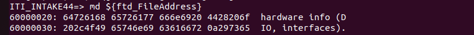

- **U-boot loads Zimage Automatically** 

  We can do that by put the command inside **bootcmd** , So after Autobooting delay time U-boot will boot the files into target ram.

  ```
  setenv bootcmd "echo "Anas Khamees, Hello World !"; run Booting_Kernel_TFTPserver;run Booting_ftd_TFTPserver"
  ```

  >- U-boot will load the files from *tftp* server to target DRAM automatically.

​	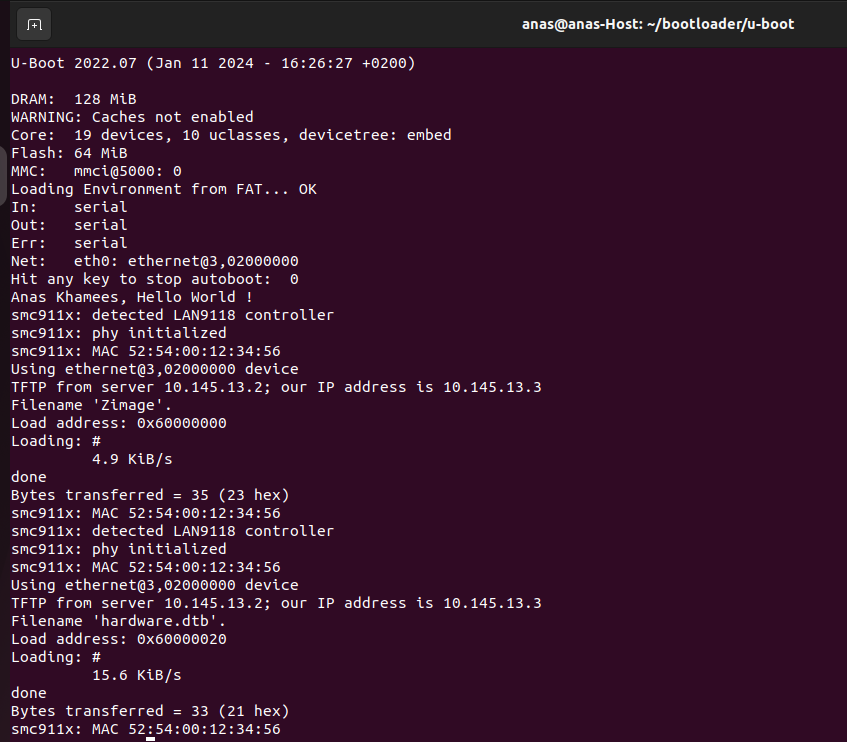


### 5. References 

1. https://github.com/FadyKhalil/EmbeddedLinux/blob/main/3-Uboot/README.md

2. https://github.com/moelomda/Embedded-Linux/tree/main/Embedded_Linux_Concepts/U-Boot#boot-configuration-and-tftp-setup

3. https://www.linkedin.com/posts/brijpandeyji_want-to-know-how-devices-talk-to-each-other-activity-7131604458588758016-D5qa/

4. https://www.keil.com/pack/doc/mw/Network/html/group__net_t_f_t_ps___func.html

   
