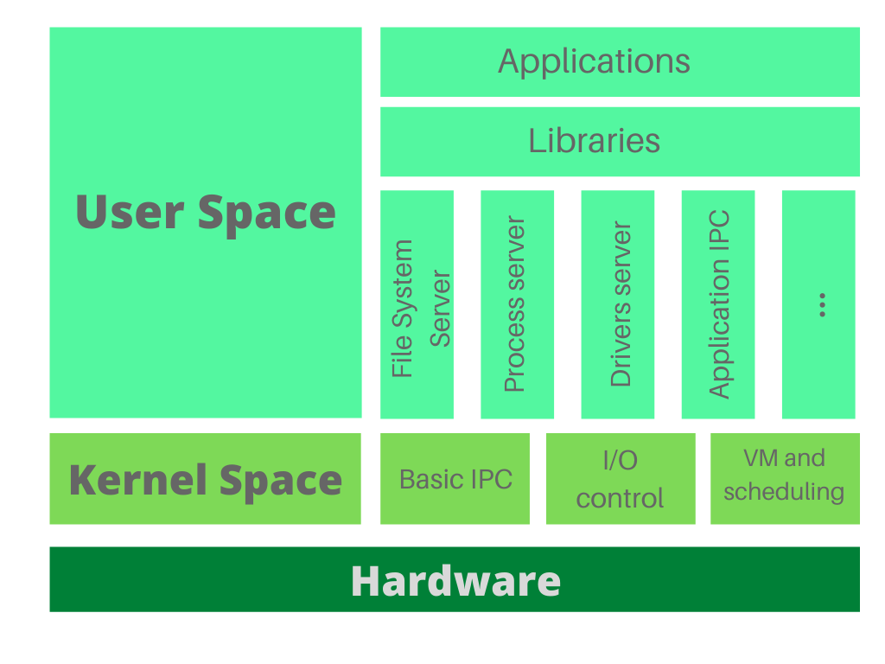
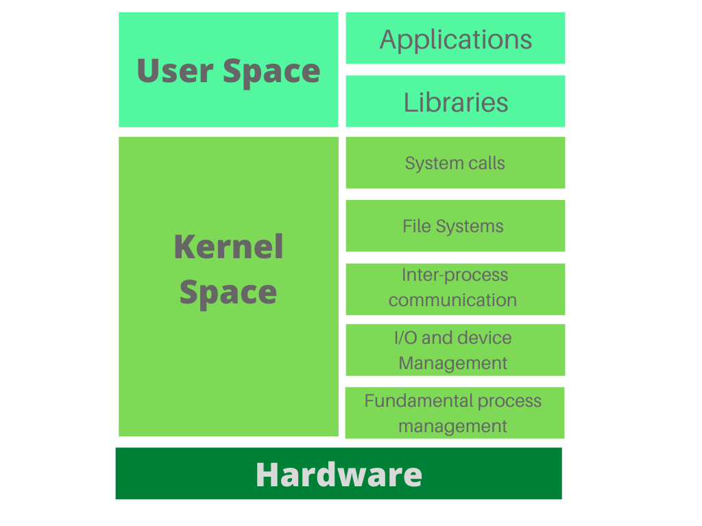
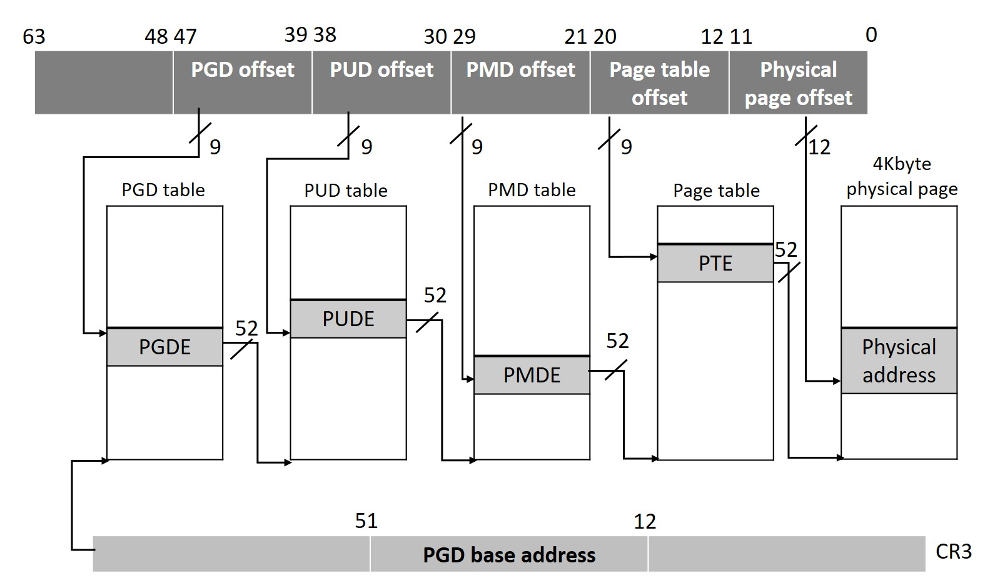

# Table of Contents

---------------

## 1. Kernel

### what should kernel do ?

The kernel is the core component of an operating system (OS). It manages the system's resources and facilitates interactions between hardware and software. Here’s a detailed breakdown of its functions and design approaches:

#### 1.1. Functions of the Kernel

#### 1.1.1. **Resource Management**

- **CPU Management**: Allocates CPU time to various processes through scheduling. The scheduler decides which process runs at a given time based on priority and other factors.
- **Memory Management**: Manages the system's memory, including allocation and deallocation of memory spaces, ensuring that applications do not interfere with each other's memory.
- **Device Management**: Manages communication between the system and connected devices (e.g., hard drives, printers, keyboards), providing a standard interface for device drivers.
- **I/O Management**: Handles input and output operations, ensuring efficient data transfer between the CPU and peripheral devices.
- **Bus Management**: Manages internal and external buses, facilitating communication between different hardware components.

#### 1.1.2. **Providing Standard APIs**

- The kernel provides standard Application Programming Interfaces (APIs) for developers to interact with hardware resources without needing to know the low-level details of the hardware. This abstraction simplifies programming and enhances portability across different hardware platforms.

#### 1.1.3. **Process Management**

- **Process Creation and Termination**: Handles the creation, scheduling, and termination of processes.
- **Inter-process Communication (IPC)**: Manages communication between processes, ensuring they can share information securely and efficiently.
- **Concurrency Control**: Manages concurrent execution of processes, ensuring data integrity and efficient CPU utilization.

### 1.2. Kernel Design Approaches

#### 1.2.1. **Microkernel**

- **Definition** : A microkernel is a minimalistic kernel that includes only the essential functions required for the system to operate, such as basic process and memory management.
- **Characteristics :**
  - Smaller codebase, potentially increasing reliability and security.
  - Many OS services (e.g., file systems, network protocols) run in user space as separate processes.
  - Communication between the microkernel and user space services is done via message passing.
- **Advantages :**
  - Better modularity and separation of concerns.
  - Easier to maintain and extend.
  - Potentially more secure due to reduced code running in kernel mode.
- **Disadvantages :**
  - Performance overhead due to context switching and message passing between the kernel and user space services.

#### 1.2.2. **Monolithic Kernel**

- **Definition**: A monolithic kernel includes all operating system services (e.g., device drivers, file systems, network protocols) in a single large block of code running in kernel mode. Linux kernel considered as **monolithic kernel** .
- **Characteristics :**
  - All kernel services share the same address space, leading to faster execution due to fewer context switches.
  - Typically larger and more complex than microkernels.
- **Advantages :**
  - High performance due to direct communication between kernel components.
  - Efficient access to system resources and low-level hardware operations.
- **Disadvantages :**
  - Difficult to maintain and extend due to the large codebase.
  - Higher risk of system crashes and security vulnerabilities because all services run in kernel mode.

#### MicroKernel  Vs  Monolithic

### 1.3. Kernel Basic Elements

#### 1.3.1. **Scheduler**

- Manages process scheduling, deciding which process runs at any given time based on priorities, time slices, and other criteria.

#### 1.3.2. **Memory Manager**

- Handles allocation and deallocation of memory spaces, manages virtual memory, and ensures efficient use of physical memory.

#### 1.3.3. **Device Drivers**

- Provides a standard interface for hardware devices, allowing the kernel and user applications to interact with hardware without needing to understand hardware-specific details.

#### 1.3.4. **System Calls Interface**

- Provides a set of functions that user applications can call to request services from the kernel, such as file operations, process management, and communication.

#### 1.3.5. **Inter-process Communication (IPC) Mechanisms**

- Facilitates communication and data sharing between processes through mechanisms like pipes, message queues, shared memory, and signals.

### 2. Process Address space 

A process address space is the range of memory addresses that a process can use. It includes various regions such as code, data, heap, and stack, each serving different purposes:

- **Code Segment (Text Segment)**: Contains the executable code of the program.
- **Data Segment**: Contains global and static variables that are initialized before execution.
- **BSS Segment**: Contains uninitialized global and static variables.
- **Heap**: Used for dynamic memory allocation. It grows upwards as more memory is allocated.
- **Stack**: Used for function call management and local variables. It grows downwards as functions are called and new variables are declared.

### 2.1. Virtual Address Space vs. Physical Address Space

#### 2.1.1. Virtual Address Space

- **Definition**: The virtual address space is the set of addresses that a process can use to access memory. Each process has its own virtual address space.
- **Characteristics :**
  - **Isolation**: Each process has its own isolated virtual address space, preventing one process from accessing the memory of another.
  - **Address Translation**: The virtual addresses are translated to physical addresses by the Memory Management Unit (MMU) using page tables.
  - **Flexibility**: The operating system can map the virtual address space to any available physical memory, providing flexibility in memory management.
  - **Protection**: Virtual memory systems provide mechanisms to protect memory regions, ensuring that a process cannot accidentally or maliciously access memory it shouldn't.

#### 2.1.2. Physical Address Space

- **Definition**: The physical address space refers to the actual addresses on the physical memory (RAM) hardware.
- **Characteristics :**
  - **Direct Hardware Access**: The physical address space corresponds directly to the hardware memory addresses.
  - **Fixed Size**: The size of the physical address space is limited by the amount of installed physical memory.
  - **Shared Resource**: The physical memory is a shared resource among all processes and the operating system itself.

### 2.1.3. Differences Between Virtual and Physical Address Space

#### 1. **Isolation and Independence**

- **Virtual Address Space**: Each process has its own independent virtual address space, providing isolation between processes.
- **Physical Address Space**: The physical address space is shared among all processes, but access is controlled by the operating system and hardware.

#### 2. **Address Translation**

- **Virtual Address Space**: Virtual addresses are translated to physical addresses through the use of page tables managed by the MMU.
- **Physical Address Space**: Physical addresses correspond directly to locations in physical memory.

#### 3. **Size and Flexibility**

- **Virtual Address Space**: Can be larger than the actual physical memory due to techniques like paging and swapping. This allows for more flexible memory management.
- **Physical Address Space**: Limited by the amount of physical RAM installed in the system.

#### 4. **Security and Protection**

- **Virtual Address Space**: Provides mechanisms to protect memory regions, preventing unauthorized access. This is enforced by the operating system and hardware.
- **Physical Address Space**: Protection is provided by controlling access at the hardware level, but without virtual memory, processes could potentially access any part of physical memory.

#### 5. **Memory Management**

- **Virtual Address Space**: Managed by the operating system using complex algorithms to allocate, deallocate, and map virtual to physical memory.
- **Physical Address Space**: Managed by the operating system and hardware to ensure efficient use of available physical memory.

### Example

When a process accesses a variable in its code, it uses a virtual address. The MMU translates this virtual address to a corresponding physical address in RAM. This translation allows the operating system to control memory access and ensure isolation between processes.

--------------------------------------------------------------------

This image illustrates the process of translating a 64-bit virtual address to a physical address using a multi-level page table system, specifically with four levels. Here's a detailed breakdown of the components and the steps involved in the translation:

### Components:

1. **Virtual Address**:
   - Divided into several parts, each part used to index into a different level of the page tables.
   - Parts include offsets for the Page Global Directory (PGD), Page Upper Directory (PUD), Page Middle Directory (PMD), Page Table, and Physical Page.
2. **Page Tables**:
   - **PGD Table**: Top-level table.
   - **PUD Table**: Second-level table.
   - **PMD Table**: Third-level table.
   - **Page Table**: Fourth-level table that directly maps to the physical pages.
3. **Offsets**:
   - Each part of the virtual address indexes into the respective page table.
   - **PGD Offset**: Bits 47-39
   - **PUD Offset**: Bits 38-30
   - **PMD Offset**: Bits 29-21
   - **Page Table Offset**: Bits 20-12
   - **Physical Page Offset**: Bits 11-0 (used within the physical page)

### Translation Process:

1. **CR3 Register**:
   - Holds the base address of the PGD table. The CR3 register is used by the CPU to start the translation process.
2. **PGD Table**:
   - The PGD Offset (9 bits) from the virtual address indexes into the PGD table.
   - Each entry in the PGD table (PGDE) points to a PUD table.
3. **PUD Table**:
   - The PUD Offset (9 bits) from the virtual address indexes into the PUD table.
   - Each entry in the PUD table (PUDE) points to a PMD table.
4. **PMD Table**:
   - The PMD Offset (9 bits) from the virtual address indexes into the PMD table.
   - Each entry in the PMD table (PMDE) points to a Page Table.
5. **Page Table**:
   - The Page Table Offset (9 bits) from the virtual address indexes into the Page Table.
   - Each entry in the Page Table (PTE) points to a physical page.
6. **Physical Page**:
   - The Physical Page Offset (12 bits) from the virtual address is used to find the exact location within the physical page.
   - The final physical address is obtained by combining the address from the PTE with the Physical Page Offset.

### Detailed Explanation of the Process:

1. **Starting with CR3**:
   - The CR3 register contains the base address of the PGD table.
   - The PGD Offset from the virtual address is used to select an entry in the PGD table.
2. **PGD to PUD**:
   - The selected PGDE contains the base address of a PUD table.
   - The PUD Offset is then used to select an entry in the PUD table.
3. **PUD to PMD**:
   - The selected PUDE contains the base address of a PMD table.
   - The PMD Offset is then used to select an entry in the PMD table.
4. **PMD to Page Table**:
   - The selected PMDE contains the base address of a Page Table.
   - The Page Table Offset is then used to select an entry in the Page Table.
5. **Page Table to Physical Address**:
   - The selected PTE contains the base address of the physical page.
   - The Physical Page Offset is added to this base address to get the final physical address.

### Summary:

- The 64-bit virtual address is divided into multiple parts to navigate through the hierarchical page tables.
- Each part of the address is used to index into a specific level of the page table.
- The final physical address is obtained by combining the base address from the PTE with the Physical Page Offset.
- This multi-level approach helps manage large address spaces efficiently, reducing the memory overhead compared to a single large page table.
