## Table of Contents 
 [**Kernel**](https://github.com/anaskhamees/Embedded_Linux/tree/main/EmbeddedLinuxTasks/Kernel#kernel)
 - [**1. Linux Kernel**](https://github.com/anaskhamees/Embedded_Linux/tree/main/EmbeddedLinuxTasks/Kernel#1-linux-kernel)
    - [1.1. Linux Kernel Architecture](https://github.com/anaskhamees/Embedded_Linux/tree/main/EmbeddedLinuxTasks/Kernel#11-linux-kernel-architecture)
 - [**2. System Calls**](https://github.com/anaskhamees/Embedded_Linux/tree/main/EmbeddedLinuxTasks/Kernel#2-system-calls)
    - [2.1. System call workflow](https://github.com/anaskhamees/Embedded_Linux/tree/main/EmbeddedLinuxTasks/Kernel#21-system-call-workflow)
    - [2.2. Examples of System Calls](https://github.com/anaskhamees/Embedded_Linux/tree/main/EmbeddedLinuxTasks/Kernel#22-examples-of-system-calls)
 - [**3. Install Linux Kernel**](https://github.com/anaskhamees/Embedded_Linux/tree/main/EmbeddedLinuxTasks/Kernel#3-install-linux-kernel)
    - [3.1. Download Linux Kernel](https://github.com/anaskhamees/Embedded_Linux/tree/main/EmbeddedLinuxTasks/Kernel#31-download-linux-kernel)
    - [3.2. Linux Kernel Configuration](https://github.com/anaskhamees/Embedded_Linux/tree/main/EmbeddedLinuxTasks/Kernel#32-linux-kernel-configuration)
    - [3.3. Linux Kernel Modules](https://github.com/anaskhamees/Embedded_Linux/tree/main/EmbeddedLinuxTasks/Kernel#33-linux-kernel-modules)
       - [3.3.1. Compile Dynamic Kernel Modules](https://github.com/anaskhamees/Embedded_Linux/tree/main/EmbeddedLinuxTasks/Kernel#331-compile-dynamic-kernel-modules)
 - [**4. Boot the Kernel from TFTP server**](https://github.com/anaskhamees/Embedded_Linux/tree/main/EmbeddedLinuxTasks/Kernel#4-boot-the-kernel-from-tftp-server)
    - [4.1. Vexpress board (target) over Qemu Emulator](https://github.com/anaskhamees/Embedded_Linux/tree/main/EmbeddedLinuxTasks/Kernel#41--vexpress-board-target-over-qemu-emulator)
    - [4.2. Start Qemu to boot on U-boot](https://github.com/anaskhamees/Embedded_Linux/tree/main/EmbeddedLinuxTasks/Kernel#42-start-qemu-to-boot-on-u-boot)
    - [4.3. Boot The zImage (my Kernel Image) and Vexpress DTB file](https://github.com/anaskhamees/Embedded_Linux/tree/main/EmbeddedLinuxTasks/Kernel#43-boot-the-zimage-my-kernel-image-and-vexpress-dtb-file)
 - [**5. References**](https://github.com/anaskhamees/Embedded_Linux/tree/main/EmbeddedLinuxTasks/Kernel#5-references)
   


-----------------------------------------------------------------------------------------------------------------------------------------------------------


 # Kernel

[**Kernel**](https://www.geeksforgeeks.org/kernel-i-o-subsystem-in-operating-system/) is main component of an any operating system that manages operations of  software and hardware. It basically manages operations of memory and CPU time. Kernel acts as a  bridge between user applications and hardware  level using system calls. 


## 1. Linux Kernel 

**Linux Kernel** is the heart of **Linux operating system**. Kernel considered as the middle layer between the user application and the hardware resources to manage the computer’s hardware  resources efficiently and fairly among all the various processes running on the computer. It is developed in C language and file system architecture.

A user application (Process) requests from Linux Kernel to access hardware resource using a **System Call**.

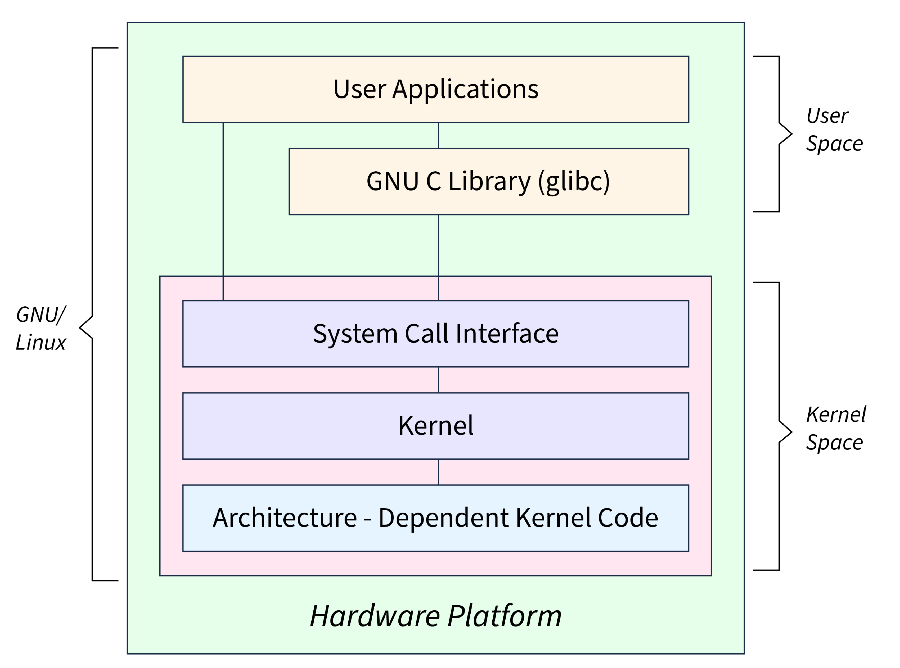

#### 1.1. Linux Kernel Architecture

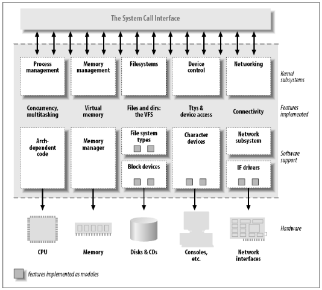


## 2. System Calls 

The system call is a method for the user applications to interact with Kernel. A system call is initiated by the program executing a specific instruction, which triggers a switch to [kernel ](https://www.geeksforgeeks.org/kernel-in-operating-system/)mode (software interrupt is generated), allowing the program to request a service from the Kernel. The Kernel then  handles the request, performs the necessary operations, and returns the  result back to the program.

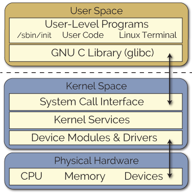


### 2.1. System call workflow 

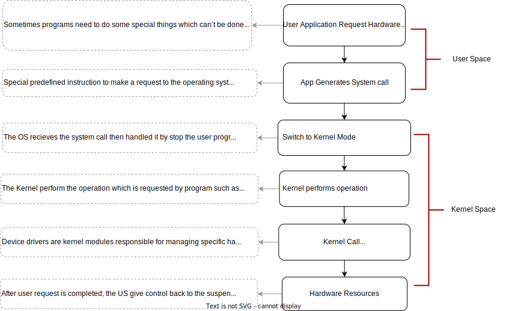


### 2.2. Examples of System Calls

| Operation             | Windows                                 | Linux                               |
| --------------------- | --------------------------------------- | ----------------------------------- |
| **Process Control**   | CreateProcess() - ExitProcess()         | Fork() - Exit()                     |
| **File manipulation** | CreateFile() - ReadFile() - WriteFile() | Open() - Read() - Write() - Close() |
| **Device Management** | ReadConsole() - WriteConsole()          | Read() - Write()                    |

For more details about System Call read those articles : [SystemCalls](https://www.geeksforgeeks.org/introduction-of-system-call/) , [LibCalls Vs SysCalls](https://www.geeksforgeeks.org/difference-between-system-call-and-library-call/) , [LinuxSysCalls](https://www.geeksforgeeks.org/linux-system-call-in-detail/)


## 3. Install Linux Kernel


### 3.1. Download Linux Kernel

- In my Case I use **Qemu Emulator (Vexpress a9)**

  ```bash
  git clone --depth=1 git://git.kernel.org/pub/scm/linux/kernel/git/stable/linux.git
  ```

  > The command is  used to clone a Git repository of the linux kernel.
  >
  > - `git clone`: This is the command to clone a Git repository.
  > - `--depth=1`: This option specifies that only the latest commit and its associated files should be cloned. This can be useful when you are only interested in the latest state of the repository and don't need the entire history. The number '1' indicates the depth of the clone.
  > - `git://git.kernel.org/pub/scm/linux/kernel/git/stable/linux.git`: This is the URL of the Kernel  repository we want to clone.

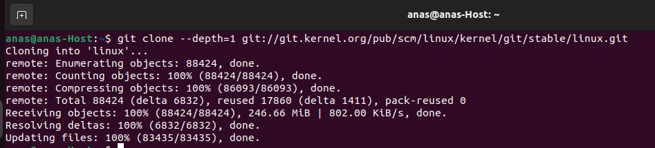

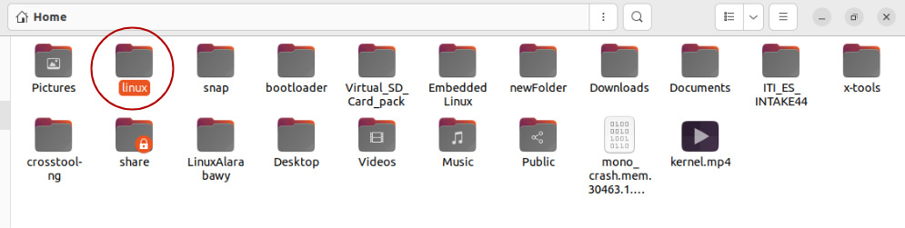

```bash
cd linux
```

- **Don't Switch to Specific branch remain in Main branch** 

- Configure the Kernel to specific Target (Vexpress a9)

  - **Set The Cross Compiler**

    ```bash
    export CROSS_COMPILE=path/to/cross/compiler/arm-cortexa9_neon-linux-musleabihf-
    ```

  - In my Case 

    ```bash
    export CROSS_COMPILE=~/x-tools/arm-cortexa9_neon-linux-musleabihf/bin/arm-cortexa9_neon-linux-musleabihf-
    ```

  - **Set the Architecture type**

    ```bash
    export ARCH=arm
    ```

  - **Then Run Make to configure the Vexpress a9**

```bash
make vexpress_defconfig
```

​	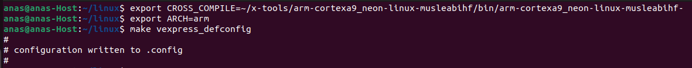


If you faced this Error **[SOLVED]** : 
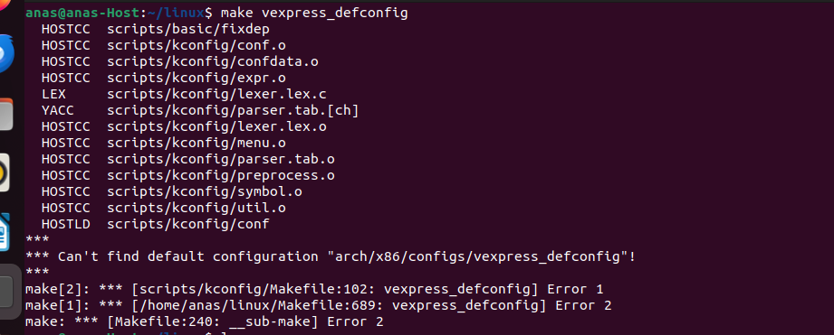

**[SOLUTION]** : Select the Cross compiler (*arm-cortexa9_neon-linux-musleabihf*) and Set the Architecture (*arm*).


### 3.2. Linux Kernel Configuration

Customize your Kernel image as you want by run this command :

```bash
make menuconfig
```

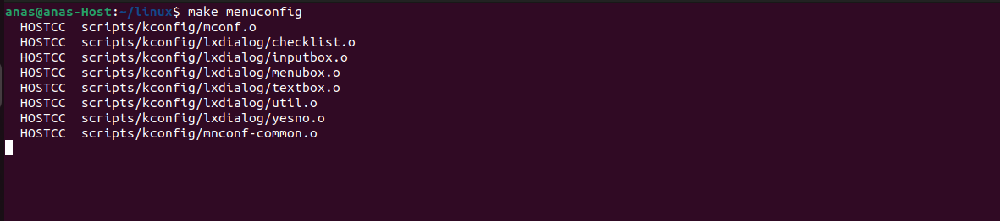

and User interface window will open :


- **We will Select some mandatory options** 

  - [x] Enable **devtmpfs**  

    - Select ***Device Drivers*** 

      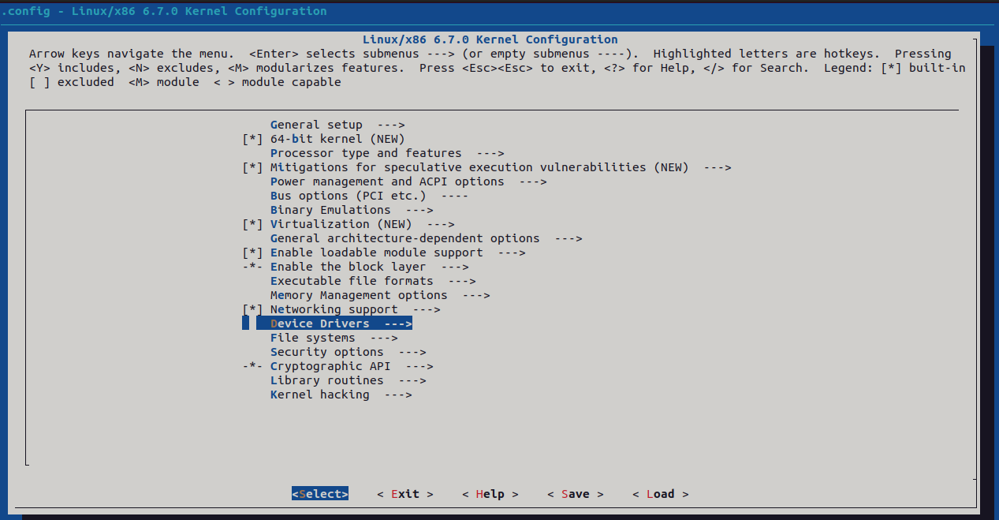

    - Then select **Generic Driver options**

      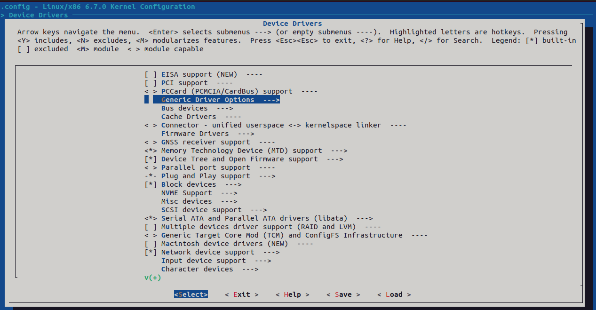

    - Select **Automount devtmpfs** by press **Y** and **< save >**

      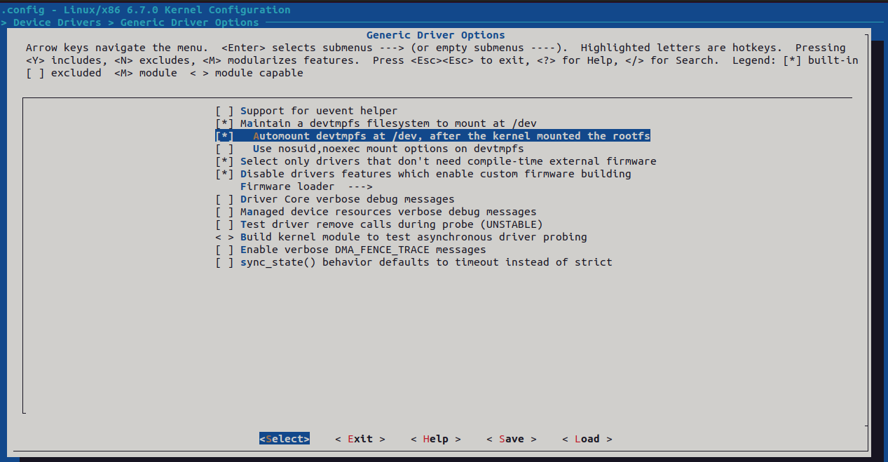

​	You can read more details about *devtmpfs*  by Press   **/**   and write "devtmpfs" in search bar: 			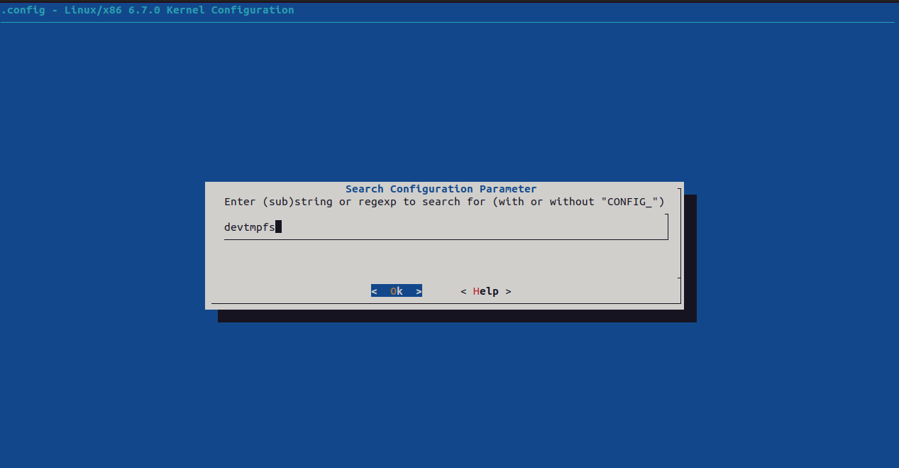

 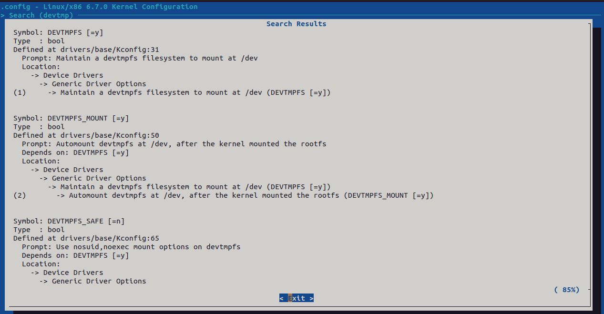

- **devtmpfs** : 

  `devtmpfs` stand for *device temporary filesystem* , it is type of file systems in Linux that is used to manage device nodes dynamically. Device nodes are special files mounted on the `/dev` directory during the system's initialization, that represent various hardware devices. These  device nodes act as interfaces for **user-space applications** to  communicate with and control **hardware devices or kernel modules**.

  There are two main types of device nodes:

  1. **Character Device Nodes (`c`):**

     - Represent devices that are accessed character by character, such as serial ports or terminals.
     - These devices are often used for streaming data, and they allow for byte-level access.
     - `/dev/ttyS0` represents the first serial port.

  2. **Block Device Nodes (`b`):**

     - Represent block-oriented devices, typically used for storage devices like hard drives and partitions.
     - Block devices work with data in fixed-size blocks, and they provide a more efficient way to handle large amounts of data.
     - `/dev/sda` represents the entire first hard drive.
     - `/dev/sda1` represents the first partition on the first hard drive.

     

- [x] Change kernel compression to **XZ** (use XZ compression algorithm)

- Select  **General setup** :

  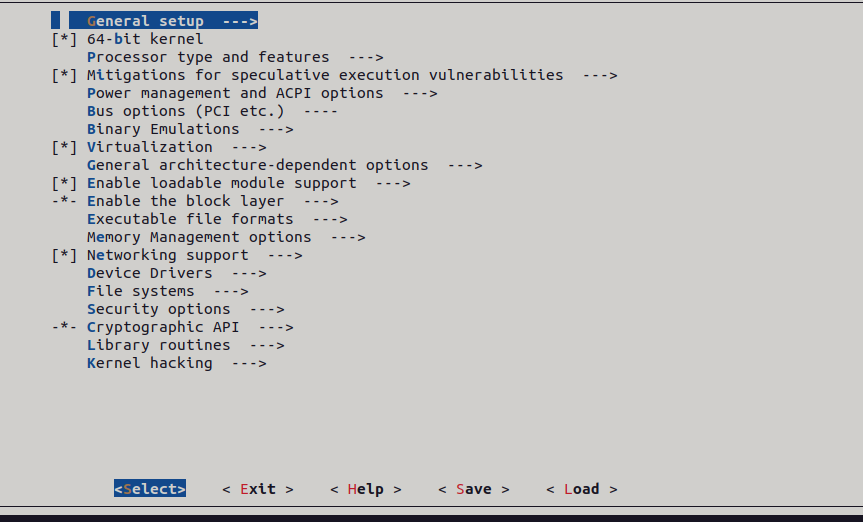 

- Then Select  **Kernel compression mode** :

  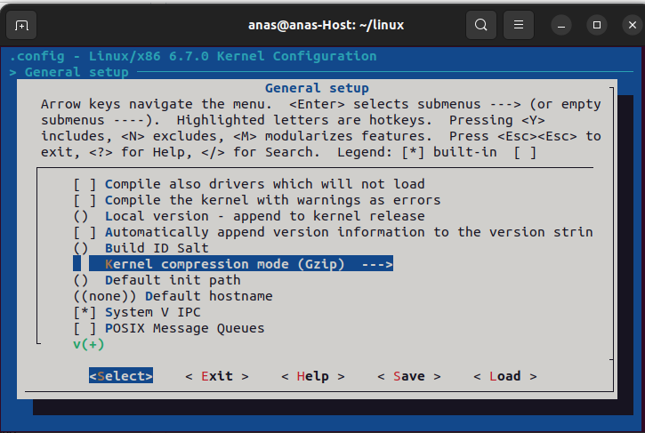

- Select **XY** and press **Enter** (Don't forget to save):

  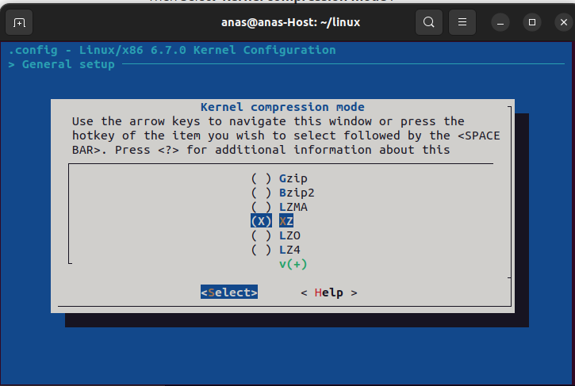
  
  - [x]  **Change your kernel local version to your name and append on it -v1.0**
  
    For example my kernel name is **"AnasKernel-v1.0"**
  
    - Select **General Setup** 
  
      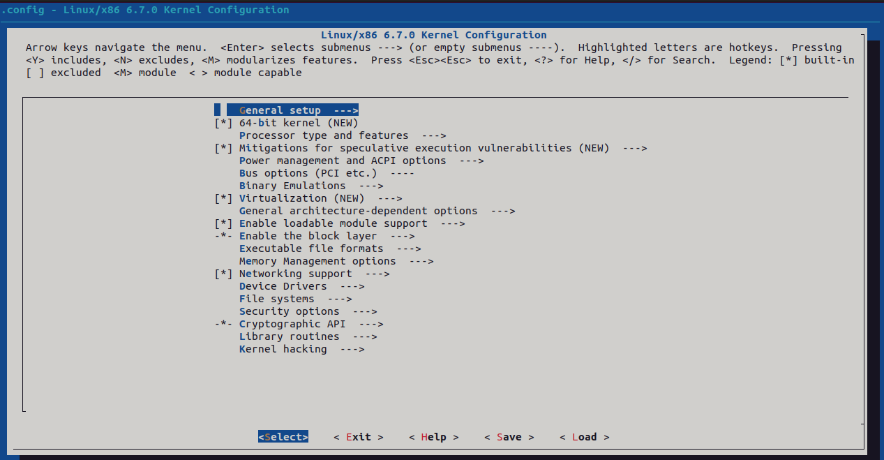
  
      - Then select **Local version - append to kernel release**
  
        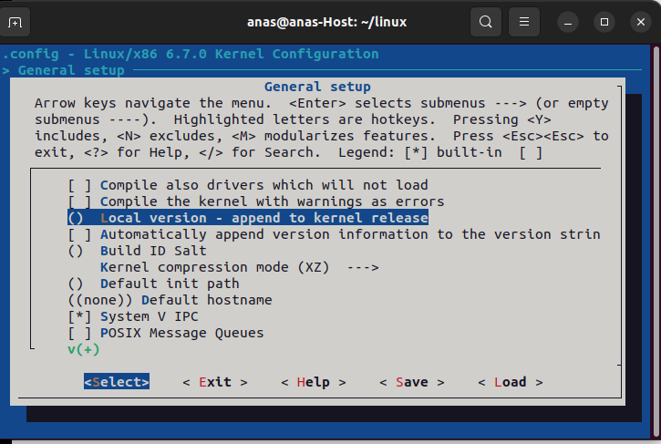
  
      - Write your name and you version and save
  
        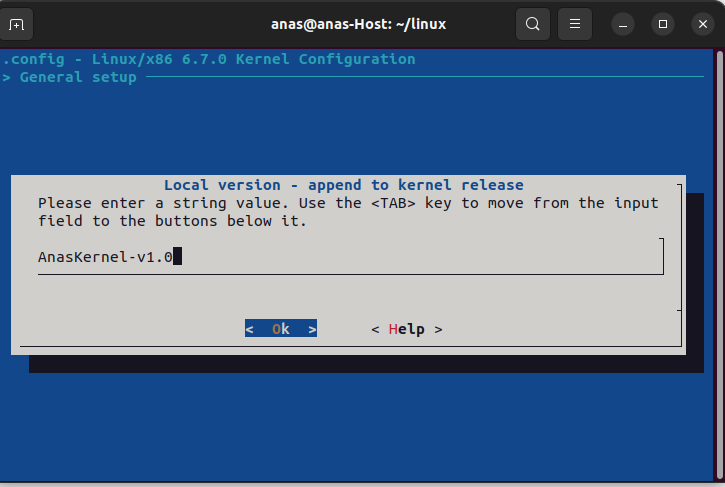
  
        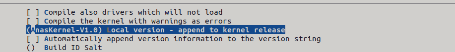

- Build the Kernel Configuration

  ```bash
   make -j4 zImage modules dtbs
  ```

  >- **`make`:** This is the command to automatically  build the kernel files.
  >
  >- **`-j4`:** This option specifies the number of parallel jobs to run during the build process,`-j4` indicates that the build system should use 4 parallel jobs to speed up the compilation. Using multiple jobs in parallel can significantly reduce the time it takes to build the kernel.
  >
  >  >Note that : each core can do 2 job, and in my case  my Computer has 4 cores (2 cores do the build job and the other 2 cores for the linux OS). This command to know your cores number
  >  >
  >  >```bash
  >  >lscpu
  >  >```
  >
  >- **`zImage`:** This is a compressed Linux kernel image (`zImage`). The `zImage` is the core executable that gets loaded into memory by the bootloader.
  >
  >- **`modules`:** This target instructs the build system to compile loadable kernel modules. Kernel modules are pieces of code that can be dynamically loaded into or unloaded from the kernel, providing additional functionality.
  >
  >- **`dtbs`:** This target instructs the build system to build the device tree blobs (DTBs). Device tree is a data structure that describes the hardware board.

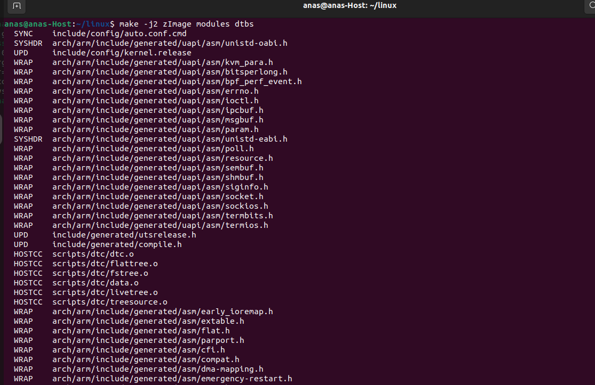

- **Error 1 : But You may face this *Error***  [Solved]

```c
/home/anas/x-tools/arm-cortexa9_neon-linux-musleabihf/lib/gcc/arm-cortexa9_neon-linux-musleabihf/11.2.0/plugin/include/system.h:698:10: fatal error: gmp.h: No such file or directory
  698 | #include <gmp.h>
```

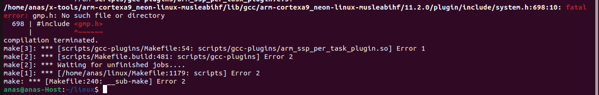

>This error message indicates that the build process is failing because it cannot find the "gmp.h" header file. This file is part of the GMP (GNU  Multiple Precision Arithmetic Library) package, and it seems that it is  not installed or not in the expected location on your system.
>
>To resolve this issue, you need to install the GMP development package.

```bash
sudo apt-get install libgmp-dev
```

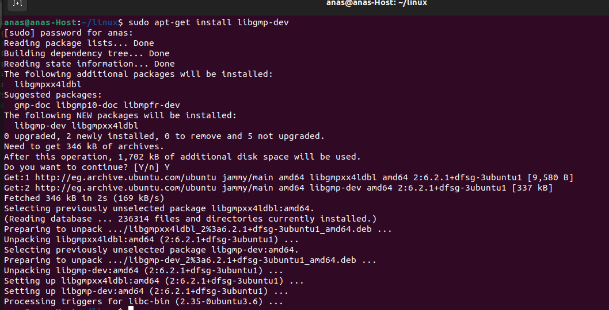

> Ensure that the library installed 
>
> 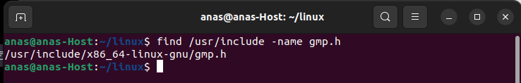


- **Error 2 : But You may face this *Error***  [Solved]

```c
/home/anas/x-tools/arm-cortexa9_neon-linux-musleabihf/lib/gcc/arm-cortexa9_neon-linux-musleabihf/11.2.0/plugin/include/builtins.h:23:10: fatal error: mpc.h: No such file or directory
   23 | #include <mpc.h>
      |          ^~~~~~~
compilation terminated.
make[3]: *** [scripts/gcc-plugins/Makefile:54: scripts/gcc-plugins/arm_ssp_per_task_plugin.so] Error 1
make[2]: *** [scripts/Makefile.build:481: scripts/gcc-plugins] Error 2
make[1]: *** [/home/anas/linux/Makefile:1179: scripts] Error 2
make: *** [Makefile:240: __sub-make] Error 2

```

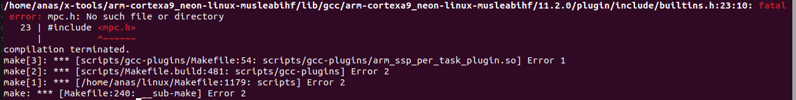

> This error message indicates that the compiler is unable to find the "mpc.h" header file. Similar to the previous case with GMP, this header file is part of the MPC (Multiple Precision Complex Library) package. To resolve this issue, you need to install the MPC development package.

```bash
sudo apt-get install libmpc-dev
```

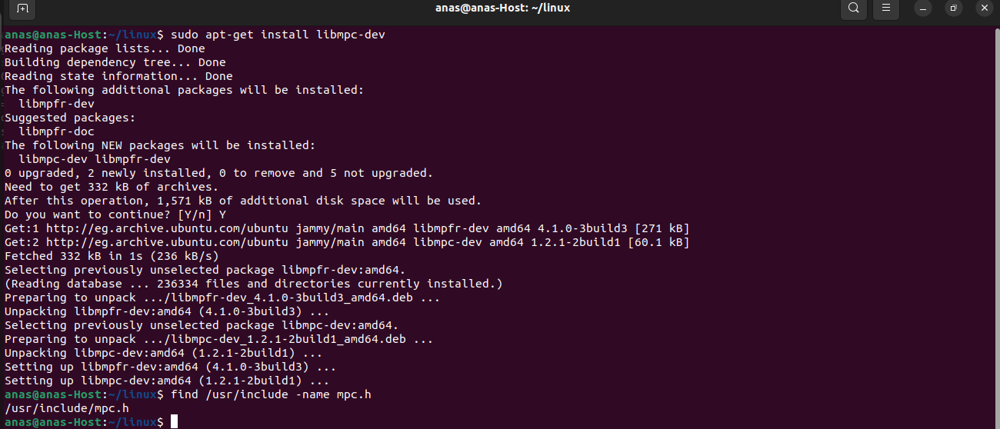

- Continue  Building the kernel files (It takes some time depend on your computer cores )

  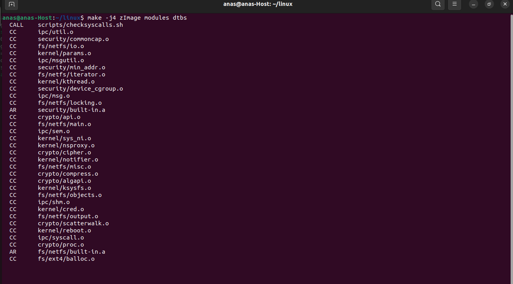

  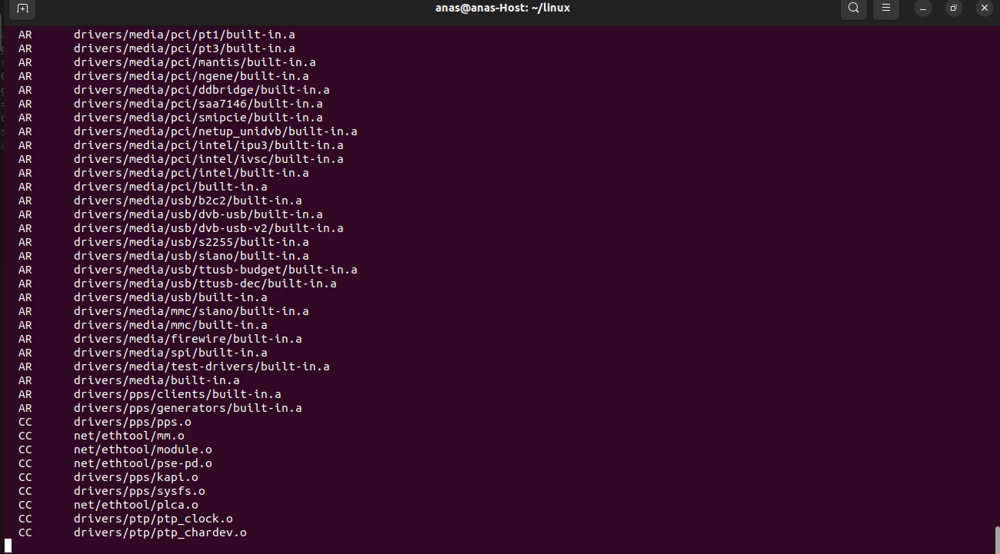

​	The Building of Kernel is DONE  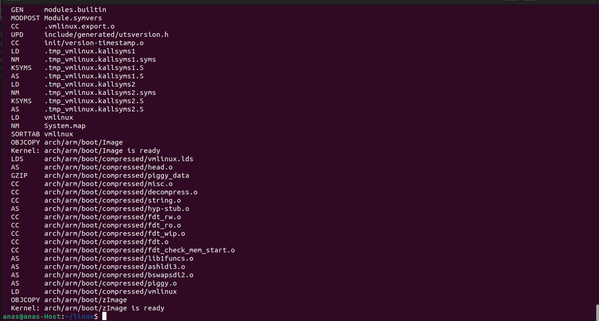


- You can See Your Compiled Kernel Image (In my Case `AnasKernel - V1.0`) 

  ```bash
  make kernelrelease
  ```

  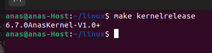

  >- `6.7.0` : This is the Linux Kernel release (main Version of *Linus*  *Torvalds*  the creator of the *Linux* kernel).
  >- `AnasKernel-V1.0` : This is my local Customized Linux Kernel Version.
  >- `+`  at the end  indicate that there are additional changes beyond the base version (main).


### 3.3. Linux Kernel Modules

Kernel modules are pieces of code that can be statically compiled with the kernel OR dynamically loaded into or unloaded from the Linux kernel at runtime. They extend the functionality of the kernel by adding support for new hardware, file  systems at running kernel without rebooting the system.

- Examples of Kernel Modules : Device Drivers (USB , Wifi..etc) , Network protocols, Virtual File Systems...

  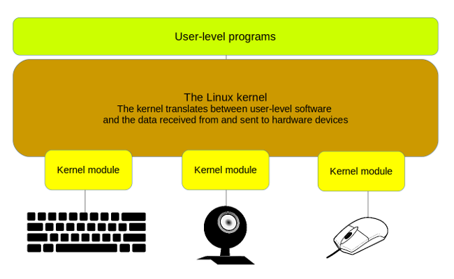  

**[For More details about Static and dynamic Kernel Modules Read this [Article](https://medium.com/@adilrk/kernel-modules-86f07c93362a)]**


#### 3.3.1. Compile Dynamic Kernel Modules

Let's Compile kernel modules and organize them in a specific directory within a root filesystem. When you compile these modules, they are generated with a **".ko"** file extension. By default, when you compile them, they are created in the same directory as the source code.

To organize and store the compiled modules (.ko) in a specific location within a root filesystem, you can use the `INSTALL_MOD_PATH` variable during the installation process.

```bash
make -j4 ARCH=arm CROSS_COMPILE=arm-cortex_a8-linux-gnueabihf- INSTALL_MOD_PATH=$HOME/rootfs modules_install
```

>- **`make -j4`**: Initiates the build process using the `make` command with the option `-j4`, which specifies that up to 4 parallel jobs can be used during the build process. 
>
>- **`ARCH=arm`**: Specifies the target (Vexpress) architecture as ARM.
>
>- **`CROSS_COMPILE=arm-cortex_a8-linux-gnueabihf-`**: 
>
>   This tells the build system to use the specified compiler for ARM architecture.
>
>- **`INSTALL_MOD_PATH=$HOME/rootfs`**: It specifies the directory where the compiled kernel modules will be installed. It's set to `$HOME/rootfs`. `$HOME` is a shell variable that typically represents the home directory of the user developer. 
>
>- **`modules_install`**: It is a `make` target that tells the build system to install the compiled kernel modules.
>
>In the context of cross-compilation for a target board (vexpress / BeagleBone), this command is setting up a directory (`$HOME/rootfs`) on your development machine where the compiled kernel modules will be organized and stored. Once you have the modules organized , you can transfer them to the root filesystem of your target board, typically via a method like copying over a network, using a removable storage device...etc)

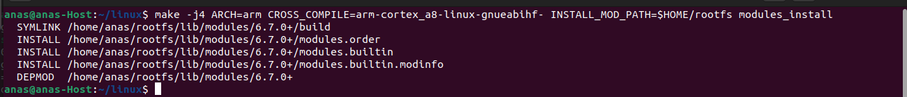


- You can see the Compiled Kernel Modules by open `rootfs/lib/modules`

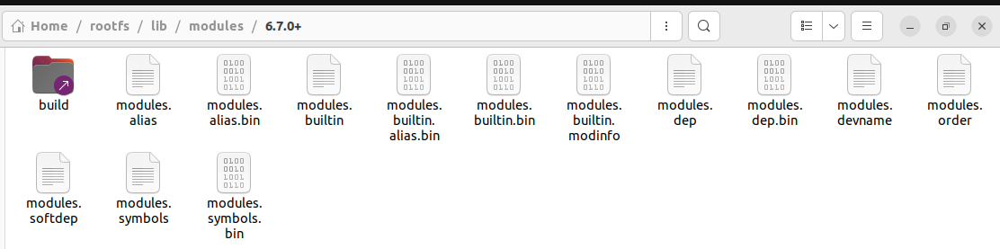


## 4. Boot the Kernel from TFTP server

In my case I use Qemu emulator and Vexpress Arm based as a target board. After compile the Kernel files we want 2 important files (`zImage `  which is our kernel image) and (`.dtb file `  has the hardware Info ).


#### 4.1.  Vexpress board (target) over Qemu Emulator

.svg)

- Copy the zImage and dtb files from `linux/arch/arm/boot`to the `tftp server` 

  

```bash
sudo cp linux/arch/arm/boot/zImage /srv/tftp/
```

>- **`cp`**: This is the copy command in Linux.
>- **`linux/arch/arm/boot/zImage`**: This is the source file. It specifies the location of the compiled Linux kernel image (`zImage`). The kernel image is located in the `linux` directory, under the `arch/arm/boot/` subdirectory.
>- **`/srv/tftp/`**: This is the destination directory. It specifies the directory where the `zImage` file will be copied. The `/srv/tftp/` directory is  used in network environments, particularly for TFTP (Trivial File Transfer Protocol), which is commonly used for booting embedded devices or systems over the network.

```bash
sudo cp linux/arch/arm/boot/dts/arm/*-ca9.dtb /srv/tftp/
```

>- **`linux/arch/arm/boot/dts/\*-ca9.dtb`**: It specifies all files with a ".dtb" extension in the `linux/arch/arm/boot/dts/` directory that match the pattern "*-ca9.dtb". 
>
>- **`/srv/tftp/`**: This is the destination directory. It specifies the directory where the DTB files will be copied. 

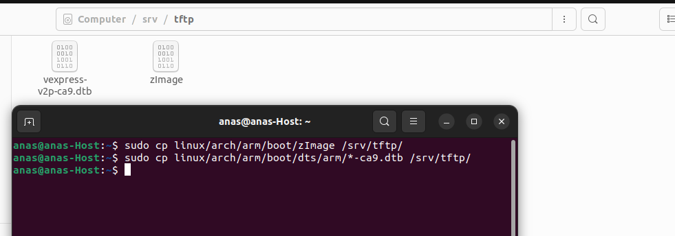


#### 4.2. Start Qemu to boot on U-boot

- Go to U-boot Directory and run qemu

  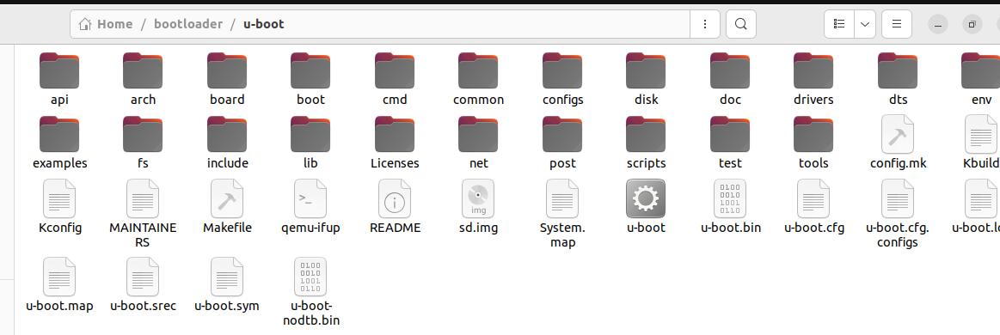

```bash
sudo qemu-system-arm -M vexpress-a9 -m 128M -nographic -kernel u-boot -sd sd.img -net tap,script=./qemu-ifup -net nic
```

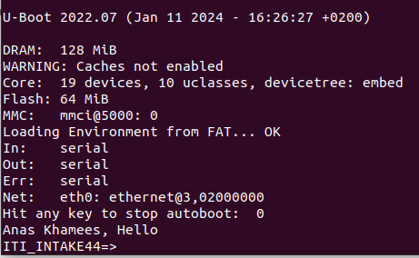

- Set `bootarg` Environment variable

  ```bash
  setenv bootargs console=ttyAMA0 
  saveenv
  ```

   >1. **`setenv bootargs console=ttyAMA0`**:
   >   - This command sets the environment variable named "bootargs" to the value "console=ttyAMA0". The "bootargs" variable often contains command-line arguments passed to the Linux kernel during the boot process.
   >   - The console for kernel messages should be directed to the serial port (ttyAMA0).
   >2. **`saveenv`**:
   >   - This command saves the changes made to the U-Boot environment variables, making them persistent across reboots.
   >   - After using `setenv` to modify environment variables, `saveenv` is usually required to store these changes in non-volatile memory, ensuring that they are retained even after a power cycle or reboot.

​	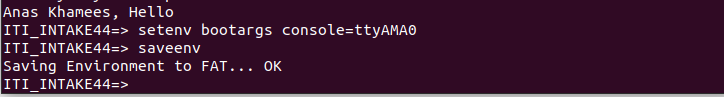

- Run `bdinfo` to know RAM addresses :

  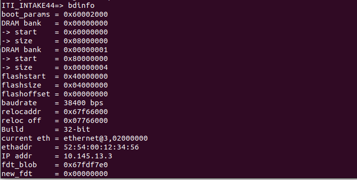

- Load kernel image `zImage` and DTB `vexpress-v2p-ca9.dtb` from **TFTP** server into target RAM.-  

  - Create Environment variables for RAM addresses  

  ```bash
  setenv Zimag_RAM_Add 60000000
  ```

  >- IMP note : Don't Select near addresses (such as 60000000 and 60000020) because the DTB will be overwritten on zImage in the RAM.
  >
  >- Make sure that the loading addresses and sizes are aligned properly, and that there is no overlap between the zImage and DTB file memory  regions.
  >
  >

  ```bash
  setenv dtb_hardware_Add 65000000
  ```

  ```bash
  saveenv
  ```


  - Load  my customized Kernel from *tftp* Server to Vexpress RAM.

    ```bash
    tftp $Zimag_RAM_Add zImage
    ```

    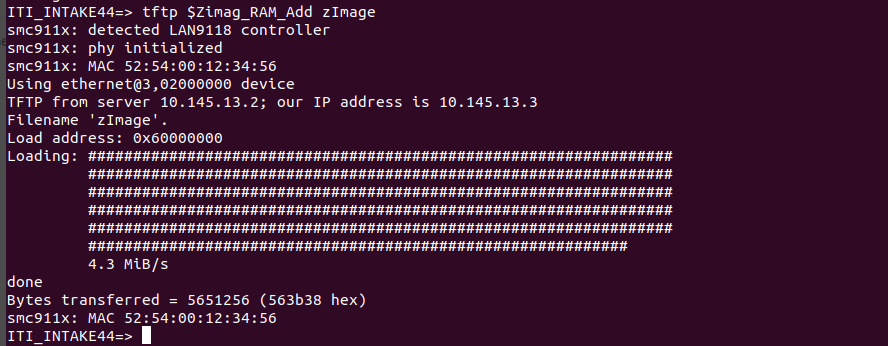

    ```bash
    # Memory display to ensure that the Kernel loaded into RAM correctly
    md $Zimag_RAM_Add 
    ```

    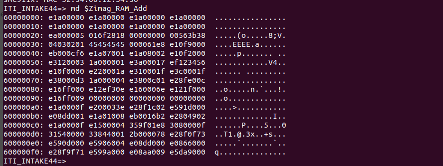

  - Load  `vexpress dtb file` from *tftp* Server to Vexpress RAM.

    ```bash
    tftp $dtb_hardware_Add vexpress-v2p-ca9.dtb
    ```

    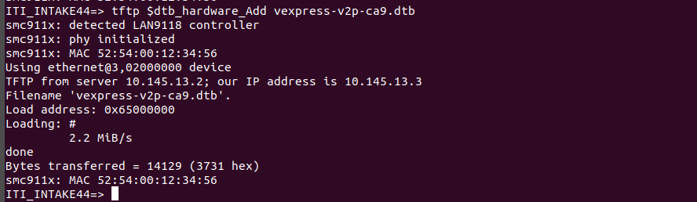

    ```bash
    # Memory display to ensure that the DTB file loaded into RAM correctly
    md $dtb_hardware_Add 
    ```

    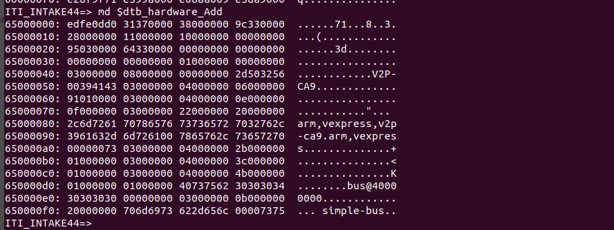


#### 4.3. Boot The zImage (my Kernel Image) and Vexpress DTB file

The `bootz` command in U-Boot is used to boot a Linux kernel  image along with its device tree blob (DTB) on an embedded board. 

```bash
bootz $Zimag_RAM_Add - $dtb_hardware_Add
```

>- **`bootz`**: This is the U-Boot command for booting a Linux kernel image.
>- **`$Zimag_RAM_Add`**: This is a custom U-Boot environment variable representing the memory address where the Linux kernel image is loaded.
>- **`-`**: The hyphen (`-`) is used as a separator between the kernel image and the device tree blob (DTB) in the `bootz` command.
>- **`$dtb_hardware_Add`**: This is another custom U-Boot environment variable representing the memory address where the device tree blob (DTB) is loaded. 

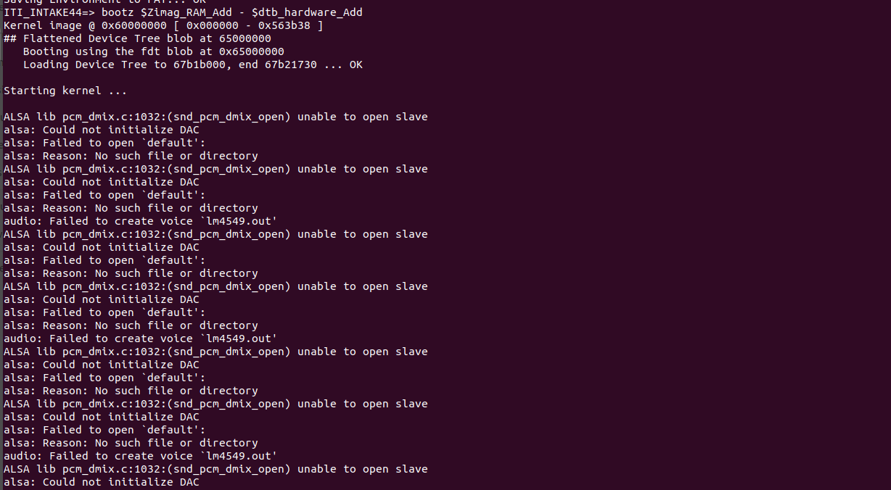

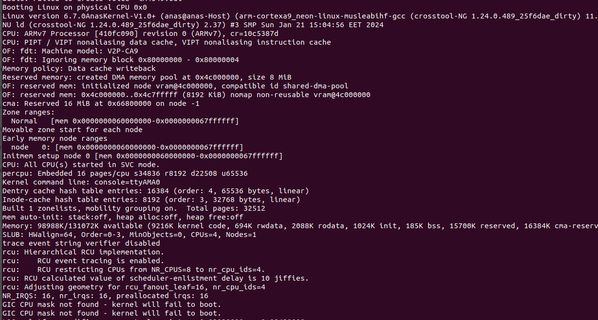

- Unfortunately the Booting Will not complete Successfully and you should face this **Panic** :

  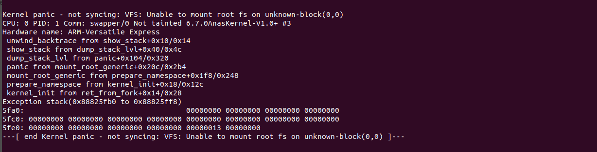 

>The error message `Kernel panic - not syncing: VFS: Unable to mount root fs on unknown-block(0,0)` indicates that the Linux kernel is unable to  mount the root filesystem during the boot process. This error often  occurs when the kernel cannot find the specified root filesystem or  encounters issues with the block device.


**We Will Solve this Panic Next Session, The Task DONE HERE :)** 

To Be Cont'd . . . . . . . . . . . . . . . . . . . . . . . 


## 5. References

1.  https://www.geeksforgeeks.org/introduction-of-system-call/
2.  https://github.com/FadyKhalil/EmbeddedLinux/blob/main/4-kernel/README.md
3.  [Engineer: Yassmin Helmy Notes](https://github.com/yasminehelmy2001)
4.  https://xdecroc.wordpress.com/2016/03/04/an-introduction-to-linux-loadable-kernel-modules/
5.  https://www.engineersgarage.com/kernel-architecture-of-linux-part-7-15/
