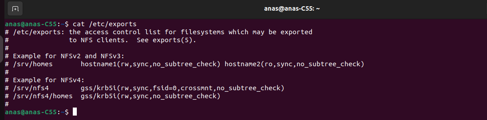
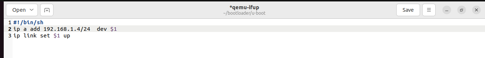
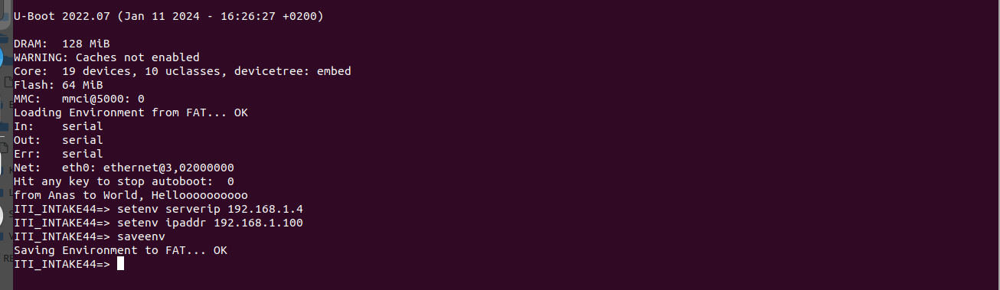

## Table of Contents

- [**1. BusyBox**](https://github.com/anaskhamees/Embedded_Linux/tree/main/EmbeddedLinuxTasks/BusyBox_NFS#1-busybox)
   - [1.1. why all binaries and executables are symbolic linked to busybox ?](https://github.com/anaskhamees/Embedded_Linux/tree/main/EmbeddedLinuxTasks/BusyBox_NFS#11-why-all-binaries-and-executables-are-symbolic-linked-to-busybox-)
   - [1.2. Embedded Linux Board RAM without BusyBox](https://github.com/anaskhamees/Embedded_Linux/tree/main/EmbeddedLinuxTasks/BusyBox_NFS#12-embedded-linux-board-ram-without-busybox)
   - [1.3. How BusyBox (Dynamically Compiled) deals with RAM](https://github.com/anaskhamees/Embedded_Linux/tree/main/EmbeddedLinuxTasks/BusyBox_NFS#13-how-busybox-dynamically-compiled-deals-with-ram)
- [**2. Network File System NFS**](https://github.com/anaskhamees/Embedded_Linux/tree/main/EmbeddedLinuxTasks/BusyBox_NFS#2-network-file-system-nfs)
   - [2.1. Linux Network File System](https://github.com/anaskhamees/Embedded_Linux/tree/main/EmbeddedLinuxTasks/BusyBox_NFS#21-linux-network-file-system)
     - [2.1.1. NFS in Embedded Linux](https://github.com/anaskhamees/Embedded_Linux/tree/main/EmbeddedLinuxTasks/BusyBox_NFS#211-nfs-in-embedded-linux)
   - [2.2. Install NFS on Linux (Ubuntu)](https://github.com/anaskhamees/Embedded_Linux/tree/main/EmbeddedLinuxTasks/BusyBox_NFS#22-install-nfs-on-linux-ubuntu)
- [**3. Mount Root File System through NFS server**](https://github.com/anaskhamees/Embedded_Linux/tree/main/EmbeddedLinuxTasks/BusyBox_NFS#3-mount-root-file-system-through-nfs-server)
- [**4. U-boot Configuration**](https://github.com/anaskhamees/Embedded_Linux/tree/main/EmbeddedLinuxTasks/BusyBox_NFS#4-u-boot-configuration)
   - [4.1. Run Qemu](https://github.com/anaskhamees/Embedded_Linux/tree/main/EmbeddedLinuxTasks/BusyBox_NFS#41-run-qemu)
   - [4.2. Load the Kernel from TFTP server](https://github.com/anaskhamees/Embedded_Linux/tree/main/EmbeddedLinuxTasks/BusyBox_NFS#42-load-the-kernel-from-tftp-server)
   - [4.3. Boot the Kernel and mount rootfs from NFS server](https://github.com/anaskhamees/Embedded_Linux/tree/main/EmbeddedLinuxTasks/BusyBox_NFS#43-boot-the-kernel-and-mount-rootfs-from-nfs-server)
   - [4.4. Navigate your own OS](https://github.com/anaskhamees/Embedded_Linux/tree/main/EmbeddedLinuxTasks/BusyBox_NFS#44-navigate-your-own-os)

- [**5. References**](https://github.com/anaskhamees/Embedded_Linux/tree/main/EmbeddedLinuxTasks/BusyBox_NFS#5-references)
  


------------------------------------------------------------------------

# BusyBox With NFS


## 1. BusyBox 

 As we said [Here](https://github.com/anaskhamees/Embedded_Linux/tree/main/EmbeddedLinuxTasks/BusyBox#2-busy-box) , The BusyBox is one Binary (executable) contains all the commands /binaries of rootfs. All binaries  of rootfs is **symbolic linked** to the **busybox** executable.

 


#### 1.1. why all binaries and executables are symbolic linked to busybox ?

Symbolic links are used to map the standard command names (e.g., `ls`, `cat`, `cp`) to the BusyBox binary. When you run a command, you are essentially invoking the BusyBox binary with the name of the command as an argument.

**1.1.1. Space Efficiency:**

BusyBox is designed for embedded systems with limited storage space . Combining multiple utilities (Binaries) into a single binary saves space compared to having individual binaries for each utility.

**1.1.2. Simplified Maintenance:**

With a single BusyBox binary, the maintenance and updating process is simplified. Instead of updating multiple binaries, you only need to replace or update the BusyBox binary.

**1.1.3. Reduced I/O Operations:**

Using symbolic links reduces the number of separate files that need to be read and executed. This can result in reduced I/O operations, which is beneficial in resource-constrained environments.

#### 1.2. Embedded Linux Board RAM without BusyBox

.svg)

#### 1.3. How BusyBox (Dynamically Compiled) deals with RAM

When you run a command, the operating system creates a new process for that command. The memory (RAM) is allocated to the new process, and it  includes the memory required for the binary (code, data, stack, and heap)  associated with that process.

Each command in **BusyBox** may has dependencies on shared libraries. These libraries contain code that is common to multiple commands. When a command is executed, the dynamic linker (System Loader) loads the necessary shared libraries into RAM if they are **not already loaded**. **In a typical setup, shared libraries are loaded into memory once and can be shared among multiple processes.**

- For example, if you run `ls`, the symbolic link `ls` points to the BusyBox binary, and the command is executed as:

```
busybox ls
```

The `ls` argument tells BusyBox which command to execute.

- **Command Execution Process:**

  - BusyBox determines which command to execute based on the argument passed to it. The internal logic of BusyBox includes a mechanism to identify the requested command and execute the corresponding function within the binary.

  - The dynamic linker takes care of resolving symbols and loading necessary libraries as required by the specific command being executed.

.svg)


## 2. Network File System NFS

**Network File System (NFS)** is a distributed file system protocol that  allows a user on a client computer to access files over a network as if  they were on the local file system. NFS enables seamless sharing of  files and resources between computers in a network, providing a  mechanism for centralized file storage and access. **A distributed file system** is a file system that allows multiple  computers (nodes) to share and access files as if they were stored on a  single, centralized file server. 


### 2.1. Linux Network File System

**NFS** allows a system (servers) to share directories and files with others (clients) over a network. Users and programs can access files on remote devices almost as if they were local files. Also, allows you to share directories and files with other Linux clients over a network. Shared directories  are typically created on a file server. The default port for NFS server communication is port 2049. This port is used for exchange of data between NFS clients and servers.


>- **Network Interface Card/Controller (NIC)** is a **hardware component** in computer. It Converts the Digital data to Electrical Signal (or Radio wave signal) to transmits the data over the network. Also, It connects different networking devices such as computers and servers to share data over the network. 
>
>  
>
>- **RPC **
>
>  Remote Procedure Call (RPC) is a communication protocol that enables  programs to execute functions on a remote server as if  they were local.
>
>- **RPC stub**
>
>   **stub** is a piece of code that acts as an intermediary between the client and server. The RPC stub is responsible for marshaling (packaging) and unmarshaling (unpackaging) Data and managing the communication between the client and server.
>
>  
>
>  
>
>  1. **Client Side:**
>
>     - When a client wants to invoke a remote function (operation) on a server (i.e., make a remote function call), it calls a local procedure (the client stub) that looks like the actual remote procedure.
>     - The client stub marshals the parameters of the procedure into a format suitable for transmission over the network. This involves converting data structures, arguments, and other information into a format that can be easily sent to the server.
>     - The client stub then initiates the communication with the server using the RPC mechanism. This could involve sending the packaged parameters over the network.
>
>  2. **Network Communication:**
>
>     - The packaged data (parameters and other information) is transmitted over the network to the server.
>
>  3. **Server Side:**
>
>     - On the server side, the received data is received by another piece of code, the server stub.
>     - The server stub unmarshals the data, extracting the parameters and any other information needed for the execution of the remote procedure. It converts the data back into a format that can be used by the server's programming language.
>     - The server stub then calls the actual implementation of the remote procedure. The server-side implementation performs the necessary computation and returns the result.
>
>  4. **Result Transmission:**
>
>     The result of the remote procedure call, if any, is then marshaled (packaged) by the server stub and sent back to the client over the network.
>
>  5. **Client Side (Again):**
>
>     The client stub on the client side receives the result then, un-marshals (unpackaged) it, and presents it to the local client code as if it had called a regular local procedure.


#### 2.1.1. NFS in Embedded Linux

- **Root File System Over NFS:**

   Mount the root file system of an embedded device over NFS during development or debugging. This allows developers to make changes to the file system on the host machine and see the effects on the embedded device without the need for frequent flashing or updating of the device's storage.

- **Cross-Compilation :**

   Developers can cross-compile applications on a more powerful host machine and deploy the binaries to the embedded device via NFS.

- **File Sharing and Collaboration:**

  In scenarios where multiple embedded devices or development boards are connected to the same network, NFS can facilitate file sharing and collaboration. Shared directories can be mounted on different devices, allowing them to access common resources.

- **Remote Debugging :**

  NFS can be useful for remote debugging of applications running on an embedded system. Developers can use tools like GDB (GNU Debugger) or profiling tools to analyze and optimize the performance of applications.

- **Software Updates and Distribution:**

  NFS can simplify the process of distributing software updates to multiple embedded devices. The 	updated binaries or files can be hosted on an NFS server, and devices can mount the shared directory to access the latest software.

.svg)

### 2.2. Install NFS on Linux (Ubuntu)

- Install **NFS** Debian Package

```
sudo apt install nfs-kernel-server
```


- Check If **NFS** Installed successfully 

  ```
  systemctl status nfs-kernel-server
  ```

   

- check if the NFS server is listening on the default port (2049)

  ```
  ss -tulpen | grep 2049
  ```

  >- **`ss`**: This is the command itself, standing for "socket statistics" or "socket show."
  >- **`-t`**: This option specifies that the output should include only TCP sockets.
  >- **`-u`**: This option specifies that the output should include only UDP sockets.
  >- **`-l`**: This option stands for "listening" and instructs `ss` to display only listening sockets.
  >- **`-p`**: This option shows the process that owns each socket. It displays the process ID (PID) and the process name associated with each socket.
  >- **`-e`**: This option displays additional information, including extended socket information.
  >- **`-n`**: This option disables name resolution (converting IP addresses to hostnames). It displays numeric values instead.
  >
  >So, when you run `ss -tulpen`, you are asking the `ss` command to show information about listening TCP and UDP sockets, including the associated processes, in numeric form without resolving hostnames.


>The output indicating that the NFS server is listening on port 2049 for both IPv4 and IPv6 connections. The lines with "LISTEN" state show that the NFS server is actively waiting for incoming connections on these ports. The additional lines with "Failed to open cgroup2 by ID" messages are unrelated to the NFS server status.

- **Check NFS Kernel Modules:** Ensure that the NFS kernel modules are loaded. 

  ```bash
  lsmod | grep nfs
  ```

  >This command is used to list kernel modules related to the Network File System (NFS).

  

After installation, the **NFS server configuration** is stored in the `/etc/exports` file. This file will contain the exported directories which will be stored in the server (rootfs directory). In the beginning there is not exported directories. You can view **NFS configuration file** :

```bash
 cat /etc/exports
```



The contents of your `/etc/exports` file are currently  commented, meaning that there are no active export path of directory. To configure NFS exports and make directories accessible to NFS clients, you need to add specific entries to this file.


## 3. Mount Root File System through NFS server

We created a dynamic root file system in the previous task [HERE](https://github.com/anaskhamees/Embedded_Linux/tree/main/EmbeddedLinuxTasks/BusyBox#5-build-busybox-dynamically) ,We want to put the rootfs on the server.

- Make a directory under `/srv` called `nfs-share`  which will be the Shareable Directory between the server (computer) and the client (target) .

  >[ This step is Not a must but for organization only, you can put the path of rootfs in `/etc/exports` file, and rootfs directory can be in any place in your computer  ]

 

```bash
sudo mkdir /srv/nfs-share
```


- Copy Your **rootfs** in `/srv/nfs-share directory ` which will be my exported directory

  ```bash
  sudo cp -rp ~/rootfs_Dynamic/* /srv/nfs-share
  ```

  

- To know your `IP Address ` of your host machine (Computer)

  - Install net-tools package

  ```bash
  sudo apt install net-tools
  ```

```
ifconfig
```


My network assigned IP_Address `192.168.1.4` to my computer , I will assign `192.168.1.100` to the Target (Qemu) 

>Note that : My router assigned this IP address to my computer `192.168.1.4`, this IP will change if you change the network or the router restart.

- Let's check that This  `92.168.1.100` IP address Does Not assigned to any device .

```bash
 ping 192.168.1.100
```


>`ping` command is used to test network connectivity between two devices.
>
>The output suggests that the host machine (192.168.1.4) is unable to  reach the specified destination host (192.168.1.100) because there is no route to the host.

So, We make sure that there is no device connected with this IP address and We can use it As qemu IP.

- Configure the NFS file `/etc/exports` by add this line inside the file :

  ```bash
  path/to/rootfs  client_IP(rw,sync,no_subtree_check)
  ```

  In my case

  ```bash
  /srv/nfs-share 192.168.1.100(rw,no_root_squash,no_subtree_check)
  ```

  >- `/srv/nfs-share` : this is the absolute path to the directory you want to export. Replace it with your path to the directory you want to share.
  >
  >- `192.168.1.100`: This is the IP address of my NFS client (qemu) that is allowed to access the exported directory. Replace it with your actual IP address of your NFS client. If you want to allow access from any client, you can use the wildcard `*` like that :
  >
  >  ```
  >  /srv/nfs-share  *(rw,sync,no_subtree_check,no_root_squash)
  >  ```
  >
  >- `(rw,no_root_squash,no_subtree_check)`: These are export options:
  >
  >  - `rw`: Allows the NFS client to read from and write to the exported directory.
  >
  >  - `no_root_squash`: By default, NFS maps the root user to the `nobody` user. Using `no_root_squash` ensures that the root user on the NFS client is treated as the root user on the NFS server.
  >
  >  - `no_subtree_check`: Disables subtree checking. Subtree checking is a security feature that verifies if the requested file is within the exported tree. Disabling it can improve performance.

- Open `/etc/exports` by vim :

  ```
  sudo vim /etc/exports
  ```

  

- Refresh the exports configuration file to update it by :

  ```bash
  sudo systemctl restart nfs-kernel-server
  ```

  Or 

  ```bash
  sudo exportfs -r
  ```

  >`exportfs`: This is the command-line tool used to manage the list of file systems that are exported to NFS clients. It allows you to add, modify, or delete entries in the list of exported file systems.
  >
  >`-r`: This option stands for "refresh" and is used to refresh the exports without modifying the current list. When you make changes to the NFS exports configuration file (`/etc/exports`), you need to refresh the exports for the changes to take effect without restarting the entire NFS server.

- Make sure that NFS server is running 

  ```bash
  ps -ef | grep nfs
  ```

  >- `ps`: This command is used to display information about currently running processes on a Linux operating system.
  >- `-ef`: The options used with `ps`:
  >  - `-e`: Lists information about all processes (equivalent to `ps aux`).
  >  - `-f`: Provides a full-format listing, displaying more details about each process.
  >- `|`: This is a pipe operator, which takes the output of the command on the left (`ps -ef`) and uses it as input for the command on the right (`grep nfs`).
  >- `grep nfs`: This command searches for lines in the input that contain the term "nfs." 
  >
  >Putting it all together, the command retrieves a list of all running processes (`ps -ef`) and filters the output to only show lines containing "nfs" (`grep nfs`).


>- The first line shows a process named `/usr/sbin/nfsdcld` with process ID `182196`. This is the NFS (Network File System) daemon control process.
>- The next eight lines show processes in square brackets `[nfsd]`. These are individual instances of the NFS server daemon (`nfsd`). They handle NFS requests from clients.
>- The last line is the `grep` command itself (`grep --color=auto nfs`). The `grep` command is searching for lines containing the term "nfs" in the output of the `ps` command.
>- The presence of multiple `[nfsd]` processes indicates that the NFS server is active and capable of serving NFS requests from clients.


## 4. U-boot Configuration 

We should configure the new IP Addresses of Server (Computer) and Client (Qemu) , I will boot the kernel from **TFTP server** and mount the root file system of target from **NFS server** 

### 4.1. Run Qemu 

```bash
sudo qemu-system-arm -M vexpress-a9 -m 128M -nographic -kernel u-boot -sd sd.img -net tap,script=./qemu-ifup -net nic
```


- Don't forget to edit the **qemu-ifup** script of Server *ip* configuration

  

- Configure the IP addresses of Server (Computer) and Client (Qemu)

```
setenv serverip 192.168.1.4
setenv ipaddr 192.168.1.100
```



- Set **bootargs** variable 

  ```bash
  setenv bootargs 'console=ttyAMA0  root=/dev/nfs ip=192.168.1.100:::::eth0 nfsroot=192.168.1.4:/srv/nfs-share,nfsvers=3,tcp rw init=/sbin/init'
  
  ```

  

>```
>
>```
>
>- **`console=ttyAMA0`**: This parameter specifies the console device, it is set to `ttyAMA0`, which is often used for the serial console on ARM-based systems.
>- **`root=/dev/nfs`**: This parameter indicates that the root filesystem is located on an NFS (Network File System) share rather than a local disk. The actual root filesystem is specified later in the `nfsroot` parameter.
>- **`ip=192.168.1.100:::::eth0`**: This parameter sets the IP address and network interface for the target machine. It specifies the static IP address `192.168.1.100` and the network interface as `eth0` (Ethernet).
>- **`nfsroot=192.168.1.4:/srv/nfs-share,nfsvers=3,tcp`**: This parameter specifies the NFS root filesystem location on Server (Computer) , it is `192.168.1.4:/srv/nfs-share`. It also specifies NFS version 3 (`nfsvers=3`) and the use of `tcp` for communication.
>- **`rw`**: This parameter specifies that the root filesystem should be mounted as read-write.
>- **`init=/sbin/init`**: This parameter defines the path to the initial process that gets executed after the kernel has initialized. In this case, it points to the `init` process.
>
>The purpose of this `bootargs` configuration is to instruct the Linux kernel during the boot process to use NFS as the root filesystem, set the IP address, specify the serial console device (`ttyAMA0`), and define the initial process. This is a common setup for embedded systems where the root filesystem is hosted on an NFS server.


### 4.2. Load the Kernel from TFTP server

 We copied **zImage** and **DTB** file of Vexpress to `/srv/tftp` directory before in Kernel Task [HERE](https://github.com/anaskhamees/Embedded_Linux/tree/main/EmbeddedLinuxTasks/Kernel#4-boot-the-kernel-from-tftp-server)  , If you lost them re-copy the files again.

- Create Environment variables for RAM addresses

```
setenv Zimag_RAM_Add 60000000
```

```
setenv dtb_hardware_Add 65000000
```

```
saveenv
```


- Load the Kernel to Target RAM 

  ```bash
  tftp $Zimag_RAM_Add zImage
  ```

  
  
  ```bash
  md $Zimag_RAM_Add
  ```
  
  

- Load The Vexpress DTB file into Target RAM

  ```bash
  tftp $dtb_hardware_Add vexpress-v2p-ca9.dtb
  ```

  


- I will put the loading from tftp server commands in **bootcmd** to execute them automatically after booting delay 

  ```bash
  setenv bootcmd "echo "Anas Khamees, Hello World !"; tftp $Zimag_RAM_Add zImage;tftp $dtb_hardware_Add vexpress-v2p-ca9.dtb"
  ```

  

- Run the **U-boot** again 

  

### 4.3. Boot the Kernel and mount rootfs from NFS server

```bash
bootz $Zimag_RAM_Add - $dtb_hardware_Add
```


**Congratulation you are run your own OS by booting from TFTP server and mount your rootfs from NFS server** . You DONE a great Job 😁  

- We can Automate The booting Steps by edit `bootcmd` variable

  ```bash
  setenv bootcmd "echo "Anas Khamees, Hello World !"; tftp $Zimag_RAM_Add zImage;tftp $dtb_hardware_Add vexpress-v2p-ca9.dtb;bootz $Zimag_RAM_Add - $dtb_hardware_Add"
  ```

  ```bash
  saveenv
  ```

Then Close qemu and Run again , The following steps will run automatically :

- **Loading zImage from TFTP server to Target RAM**
- **Loading Vexpress DTB file from TFTP server to Target RAM**
- **Booting the Kernel** 
- **Mount the Root File System from NTS server**


### 4.4. Navigate your own OS

- Let's Re-boot the system 

  ```bash
  reboot
  ```

  


- Let's Shutdown the system 

  ```bash
  poweroff
  ```

  


## 5. References

1. https://developer.technexion.com/docs/using-an-nfs-root-filesystem
2. https://www.javatpoint.com/network-interface-card
3. https://bluexp.netapp.com/blog/azure-anf-blg-linux-nfs-server-how-to-set-up-server-and-client
4. https://ubuntu.com/server/docs/service-nfs
5. https://github.com/FadyKhalil/EmbeddedLinux/blob/main/5-Busybox/README.md

