# Yocto 

-----------------------------------------------------------------------------------------------------------------------------------------------------------

## Table of content

- [**1. Create Layers**](https://github.com/anaskhamees/Embedded_Linux/tree/main/EmbeddedLinuxTasks/10.Yocto/10.3.Yocto_Recipes%26Layers#1-create-layers)
- [**2. Create Recipe**](https://github.com/anaskhamees/Embedded_Linux/tree/main/EmbeddedLinuxTasks/10.Yocto/10.3.Yocto_Recipes%26Layers#2-create-recipe)
- [**3. Create Simple C Application**](https://github.com/anaskhamees/Embedded_Linux/tree/main/EmbeddedLinuxTasks/10.Yocto/10.3.Yocto_Recipes%26Layers#3-create-simple-c-application)
- [**4. Run the Recipe**](https://github.com/anaskhamees/Embedded_Linux/tree/main/EmbeddedLinuxTasks/10.Yocto/10.3.Yocto_Recipes%26Layers#4-run-the-recipe)
- [**5. Run APP on BeagleBone over Qemu**](https://github.com/anaskhamees/Embedded_Linux/tree/main/EmbeddedLinuxTasks/10.Yocto/10.3.Yocto_Recipes%26Layers#5-run-beaglebone-over-qemu)


-----------------------------------------------------------------------------------------------------------------------------------------------------------

I will create Embedded Linux Distribution on Virtual BeagleBone (on Qemu) and I will make an application Prints My Name in the terminal and this executable should run on BeagleBone (Run over qemu).

- I should create App.c
- I should create My Layer
- I should create My Recipe
- Run Bitbake 
- Make sure that the Recipe work correctly and the Application installed on "beaglebone Rootfs"
- Project Hierarchy
  -  **meta-anas_layer**
    - **recipes-example**
      - **my_recipes**
        - **myrecipe_1.0.bb**
        - **files** directory
          - **app.c**

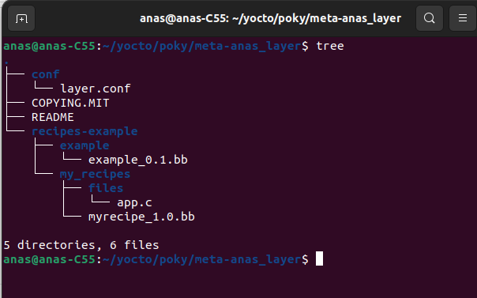

# 1. Create Layers

To remember what is the Yocto Layers Read This [Part](https://github.com/anaskhamees/Embedded_Linux/tree/main/EmbeddedLinuxTasks/10.Yocto/10.1.Yocto_Introduction#3-yocto-terminologies) , But for create a layer follow the following steps:

```bash
bitbake-layers create-layer <path/to/meta-layername>
```

- Go to `poky` directory and source the script:

  ```bash
  source oe-init-build-env
  ```

  

- In my case I created Layer in `/home/anas/yocto/poky` , Called `anas_layer`

```
bitbake-layers create-layer /home/anas/yocto/poky/meta-anas_layer
```

>Note that you must start the Layer name by **meta-**

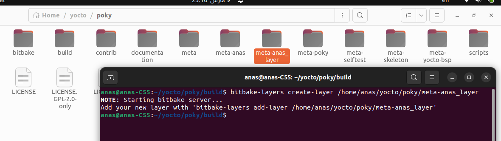

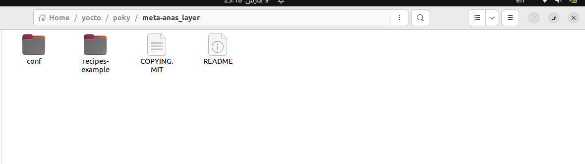

Poky Created a reference of an example recipe in your layer and `layer.conf` file is created also.

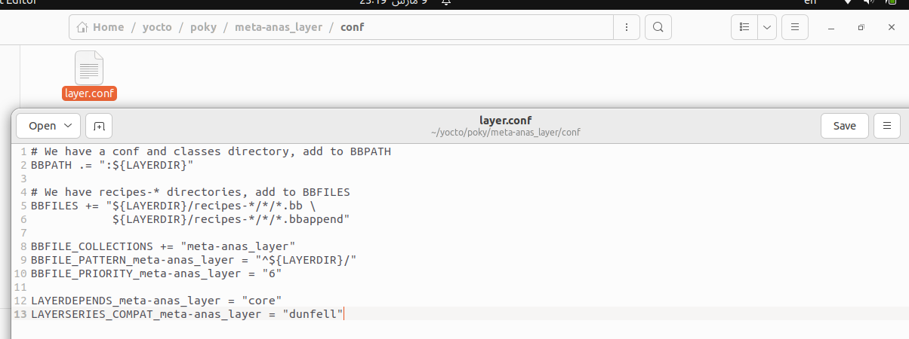

- Add Your Layer in Poky

  ```bash
  bitbake-layers add-layer <path/to/meta-layername>
  ```

  ```bash
  bitbake-layers add-layer /home/anas/yocto/poky/meta-anas_layer
  ```

- Make sure that the Layer Created 

  ```
  bitbake-layers show-layers
  ```

  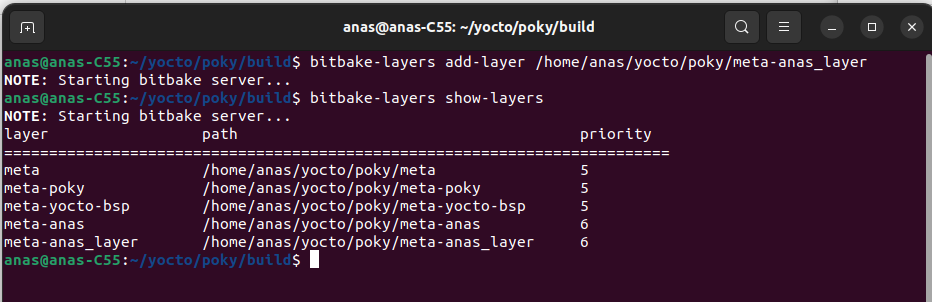

Also, go to `/home/anas/yocto/poky/build/conf` and open **bblayers.config** to see your new Layer.

.svg)

>The `bblayers.conf` file is a configuration file used to define the layers (collections of recipes and configuration files) that should be included in the build environment.

## 2. Create Recipe

After you create a Layer, Poky will create a example of **Recipe** Automatically, you can use it or create your own recipes. But you should create your recipes into `recipes-example` directory, because **Bitbake** will search for recipes in directories which start with `recipes-` 

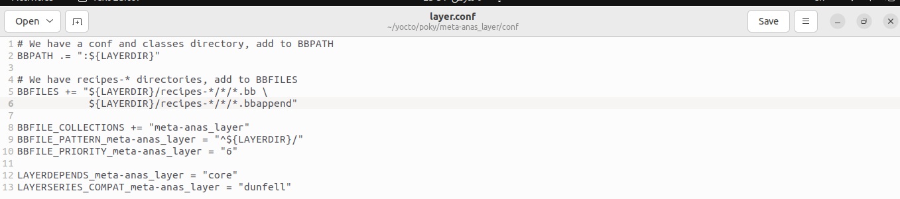

- Create Directory with any name in `recipes-example` , in my case I created **my_recipes**

  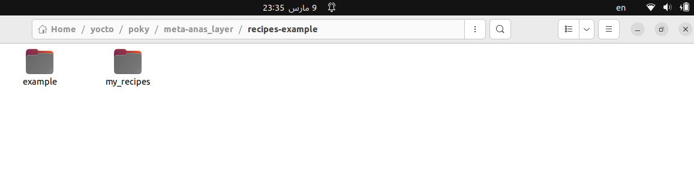

- Create a recipe file `.bb`  in `my_recipes` directory (In my case **myrecipe_1.0.bb**) ,  So the recipe name is **myrecipe**. Don't forget the file version "1.0"

  ```python
  DESCRIPTION = "A friendly program that prints my name"
  PRIORITY = "optional"
  SECTION = "examples"
  LICENSE = "MIT"
  
  LIC_FILES_CHKSUM = "file://${COMMON_LICENSE_DIR}/MIT;md5=0835ade698e0bcf8506ecda2f7b4f302"
  
  
  SRC_URI = "file://app.c"
  S = "${WORKDIR}"
  do_compile() {
  ${CC} ${CFLAGS} ${LDFLAGS} app.c -o app
  }
  do_install() {
  install -d ${D}${bindir}
  install -m 0755 app ${D}${bindir}
  }
  
  python do_display_banner() {
      bb.plain("***********************************************");
      bb.plain("*                                             *");
      bb.plain("*  Hello World From Anas !!!!!                *");
      bb.plain("*                                             *");
      bb.plain("***********************************************");
  }
  addtask do_display_banner after do_patch before do_compile
  ```

  - Recipe Explanation

    >it is a recipe file written in the Yocto Project's BitBake format. It defines metadata and instructions for building and installing a software package. Let's break down each part of the recipe:
    >
    >1. **DESCRIPTION**:
    >
    >   - This variable provides a brief description of the software package. In this case, it describes the package as "A friendly program that prints my name!"
    >
    >2. **SECTION**:
    >
    >   - This variable specifies the section or category to which the package belongs. Here, it is set to "examples".
    >
    >3. **LICENSE**:
    >
    >   - Specifies the license under which the software is distributed. In this case, it is licensed under the MIT License.
    >
    >4. **LIC_FILES_CHKSUM**:
    >
    >   - This variable specifies a checksum for the license file to ensure its integrity. It references the MIT license file from the common license directory (${COMMON_LICENSE_DIR}) and provides an MD5 checksum.
    >
    >   - **To know your check Sum :** 
    >
    >     go to `/home/anas/yocto/poky/meta/files/common-licenses` directory and run this :
    >
    >     ```
    >     md5sum MIT
    >     ```
    >
    >     > >The `md5sum` command is used to calculate and display the MD5 checksum (a cryptographic hash function) of a file. In this case, `md5sum MIT` indicates that you want to calculate the MD5 checksum of the file named "MIT".
    >     > >
    >     > >Here's how the command works:
    >     > >
    >     > >1. **md5sum**:
    >     > >   - This is the name of the command-line utility used to calculate MD5 checksums.
    >     > >2. **MIT**:
    >     > >   - This is the filename or path of the file for which you want to calculate the MD5 checksum. In this context, it refers to a file named "MIT".
    >     > >
    >     > >When you run `md5sum MIT`, the `md5sum` command reads the contents of the "MIT" file, calculates its MD5 checksum, and then displays the checksum as a 32-character hexadecimal number. This checksum uniquely represents the contents of the file, allowing you to verify its integrity or compare it with other checksums to ensure the file has not been tampered with or corrupted.
    >     > >
    >     > >
    >     >
    >     > 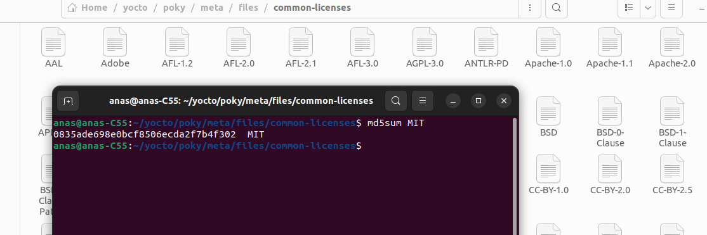
    >
    >     - **Copy "0835ade698e0bcf8506ecda2f7b4f302" and assign to md5.**
    >
    >5. **SRC_URI**:
    >
    >   - This variable specifies the source URI from which the source code of the software package will be fetched. Here, it references a local file named "app.c" located in `files` directory in the same directory as the recipe file.
    >
    >6. **S**:
    >
    >   - This variable specifies the directory where the source code will be unpacked and where build operations will take place. It is set to "${WORKDIR}", which represents the working directory where BitBake performs its operations.
    >
    >7. **do_compile()**:
    >
    >   - This function defines the compilation process for the software package. It is executed during the compilation phase.
    >   - It invokes the C compiler (`${CC}`) with specified compiler flags (`${CFLAGS}`) and linker flags (`${LDFLAGS}`) to compile the source file "app.c" and produce an executable named "app".
    >
    >8. **do_install()**:
    >
    >   - This function defines the installation process for the software package. It is executed during the installation phase.
    >   - It creates the destination directory for the executable (`${D}${bindir}`) and installs the executable "app" with the appropriate permissions (755) into the destination directory.
    >
    >9. **Additional Task - do_display_banner()**:
    >
    >   - This is a custom task defined using Python syntax. It prints a banner message to the console.
    >   - It is executed after the "do_patch" task and before the "do_compile" task.
    >   - The banner message is defined within the Python function, and it is displayed using `bb.plain()`.


## 3. Create Simple C Application

```c
#include "stdio.h"
int main(void)
{
  printf("ITI_44  ------  ITI_44 ------  ITI_44  ------  ITI_44 \n");
  printf("Hello world, I am Anas Khamees \n");
  return 0;
}
```

You must Create Directory called `"files" `, because **bitbake** search for app.c in the directory called **"files**"

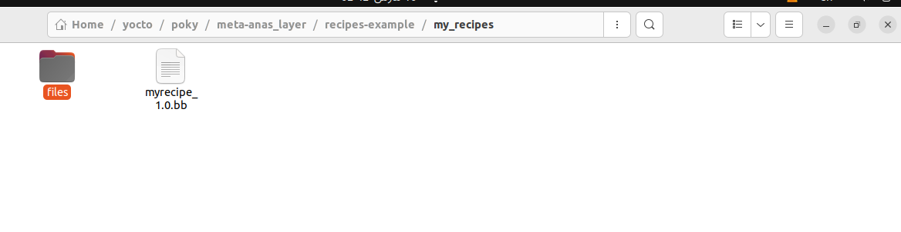

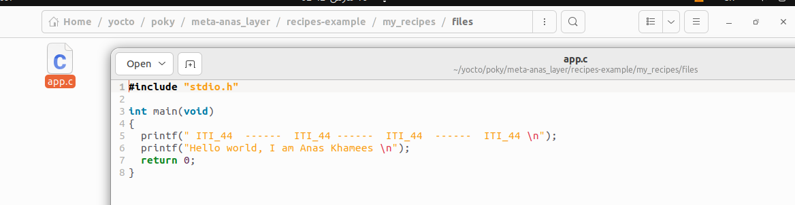

## 4. Run the Recipe 

Go to `/home/anas/yocto/poky/build` and source the script

- Then Run bitbake  : 

  ```
  bitbake <recipeName>
  ```

  ```
  bitbake myrecipe
  ```

  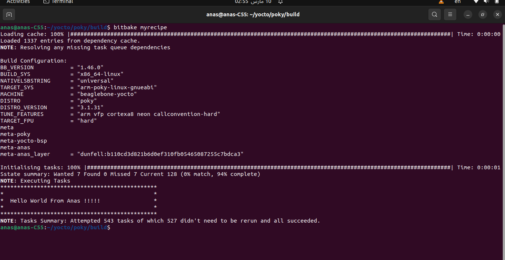


- Go to `/home/anas/yocto/poky/build/tmp/work/cortexa8hf-neon-poky-linux-gnueabi` and you can see, you app executable

  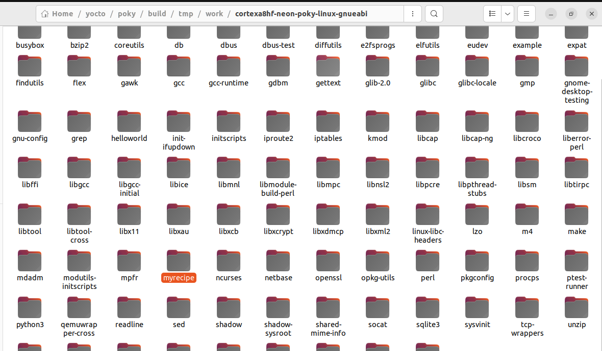 


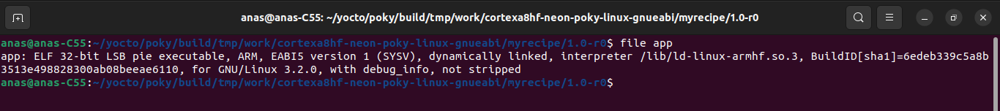

- You should add your recipe name in the Variable **IMAGE_INSTALL** to install the **app** in root file systen of beagleBone (on qemu)

  >- Append value to The variable by use (Take care of the space )
  >
  >  ```
  >  IMAGE_INSTALL_append = " recipe1"
  >  ```
  >
  >- Remove value from the variable
  >
  >  ```
  >  IMAGE_INSTALL_remove = "recipe1"
  >  ```

- Open **local.config** file in `/home/anas/yocto/poky/build/conf`and add the variable and assign your recipe name in it.

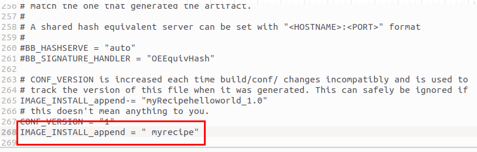

- Let's check the Variable Value 

  ```bash
  bitbake-getvar IMAGE_INSTALL
  ```

  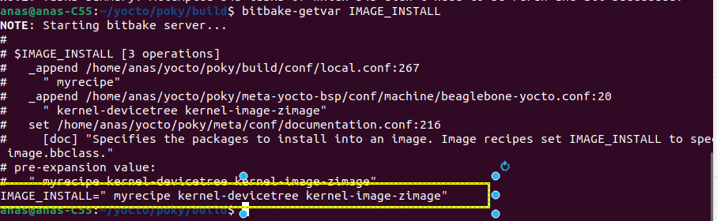

- Build the image 

  ```
  bitbake core-image-minimal
  ```

  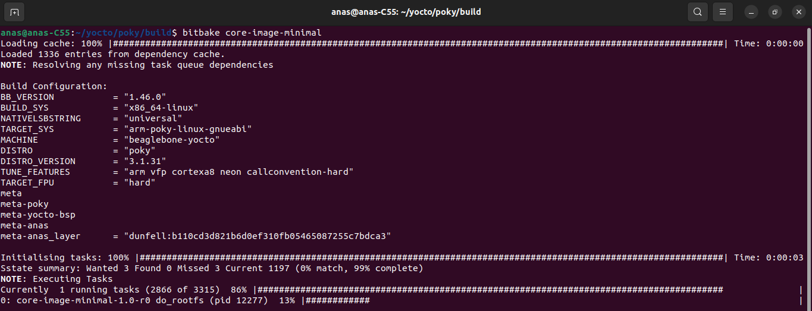

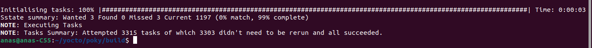

>1. **Sstate summary**: This section provides a summary of the Shared State (Sstate) cache, which is a cache of build artifacts used to speed up the build process by reusing previously built files. Here's what each part means:
>   - **Wanted**: The number of tasks that requested files from the Sstate cache.
>   - **Found**: The number of tasks where the requested files were found in the Sstate cache.
>   - **Missed**: The number of tasks where the requested files were not found in the Sstate cache and had to be rebuilt.
>   - **Current**: The total number of entries in the Sstate cache.
>   - **(0% match, 99% complete)**: Indicates the matching rate of tasks requesting files from the Sstate cache. In this case, 0% of the requested files matched exactly, but 99% of the requested files were successfully reused from the cache.
>2. **NOTE: Executing Tasks**: This indicates that the build system is now executing the tasks required to build the target image or package.
>3. **NOTE: Tasks Summary**: This section provides a summary of the tasks executed during the build process:
>   - **Attempted**: The total number of tasks attempted.
>   - **Didn't need to be rerun**: The number of tasks that didn't need to be rerun because their dependencies were unchanged since the last build.
>   - **All succeeded**: Indicates that all attempted tasks completed successfully.


## 5. Run BeagleBone over Qemu

```
runqemu
```

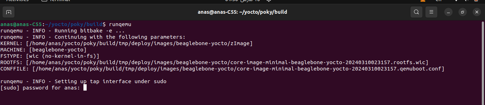

Write your password, then qemu will open 

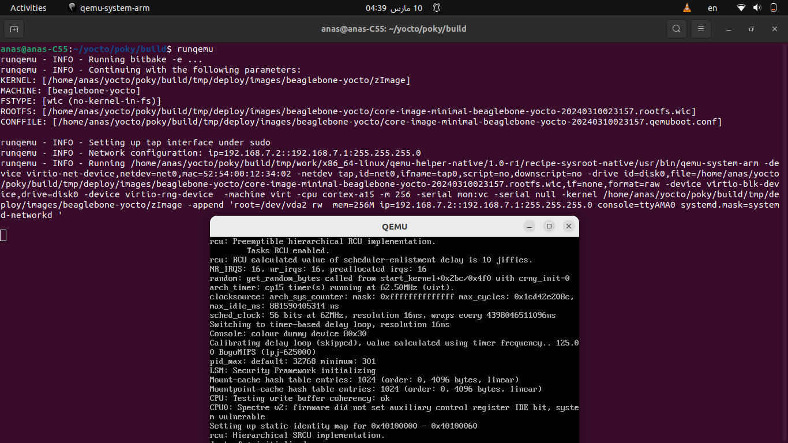

- Make the user to be root

  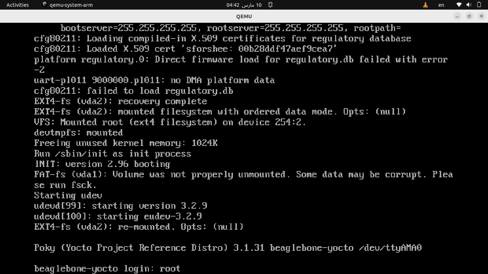

- Let's Navigate our Embbeded Linux Distribution 

  - go to root directory 

  ```
  cd /
  ```

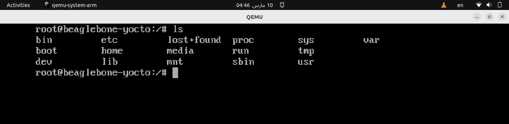

- go to `usr/bin` to see my application **app**

  ```
  cd usr/bin
  ```

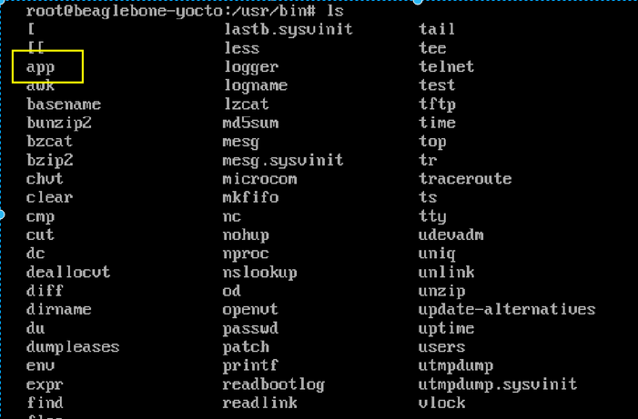

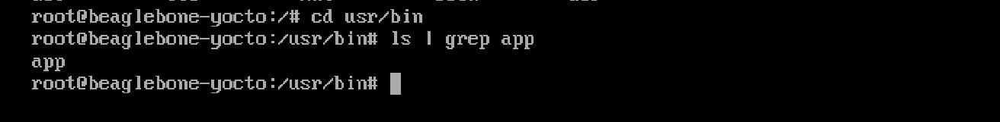

- Let's Run our Application **App**

```
./app
```

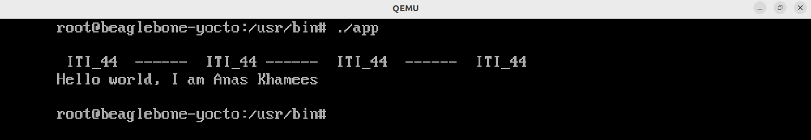
