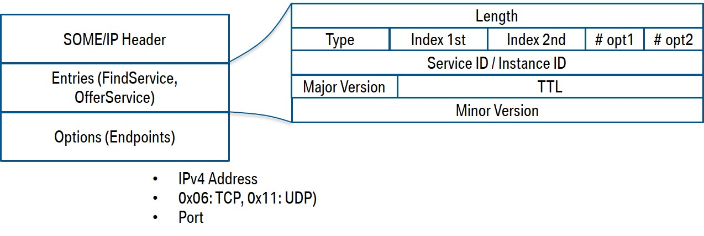

# SOME/IP

SOME/IP (Scalable service-Oriented Middleware over IP) is a middleware solution designed for automotive communication systems, particularly in contexts like AUTOSAR (Automotive Open System Architecture). It provides a framework for devices (or services) in a vehicle to communicate efficiently over IP (Internet Protocol) networks.

### **1. Inter-Process Communication (IPC)**

#### **What is IPC?**

- **IPC** is a mechanism that allows processes (which could be running on the same machine) to communicate with each other.
- In automotive systems, different software components or processes often run in isolation for safety and reliability. IPC enables these components to exchange information and work together.

#### **How does SOME/IP facilitate IPC?**

- SOME/IP can be used as a protocol to facilitate communication between different processes running on the same Electronic Control Unit (ECU) or across different ECUs within the vehicle.
- It enables the exchange of data and commands between these processes, ensuring that they can work together in a coordinated manner.

#### **Example Scenario:**

Imagine a modern vehicle where the **Infotainment System** and the **Climate Control System** are separate processes running on different ECUs.

- **Communication Need:** When the driver adjusts the temperature using the infotainment system's touchscreen, the climate control system needs to receive this input to change the temperature.
- IPC with SOME/IP:
  1. The Infotainment System process sends a **SOME/IP message** containing the temperature change command to the Climate Control System process.
  2. The Climate Control System process receives this message and adjusts the temperature accordingly.
- Example Flow:
  - **Client (Infotainment System):** `Request setTemperature(22°C)`
  - **Server (Climate Control System):** `Response Temperature set to 22°C`

In this case, SOME/IP acts as the protocol that enables IPC, allowing these two processes to communicate seamlessly even though they are running independently on different ECUs.

### **2. Remote Procedure Call (RPC)**

#### **What is RPC?**

- **RPC** is a protocol that allows a program to execute a procedure (subroutine) on a remote system as if it were a local call.
- It abstracts the details of network communication, allowing developers to invoke remote services easily.

#### **How does SOME/IP facilitate RPC?**

- SOME/IP is designed to support RPC by allowing services on one ECU to be invoked by another ECU over a network (which could be within the same vehicle).
- This is particularly useful in distributed automotive systems where different functionalities are spread across multiple ECUs.

#### **Example Scenario:**

Consider a **Telematics Unit** (which handles things like GPS, vehicle diagnostics, and remote communication) and a **Vehicle Data Logger**.

- **Communication Need:** The Vehicle Data Logger needs to periodically collect diagnostic data from the Telematics Unit.
- RPC with SOME/IP:
  1. The Data Logger makes an **RPC call** using SOME/IP to request the latest diagnostic data.
  2. The Telematics Unit receives the request, processes it, and sends back the requested data.
- Example Flow:
  - **Client (Vehicle Data Logger):** `Request getDiagnosticData()`
  - **Server (Telematics Unit):** `Response DiagnosticData { speed: 60km/h, engine_temp: 90°C }`

In this scenario, the Data Logger and Telematics Unit are likely running on different ECUs. SOME/IP handles the communication, making it seem like the Data Logger is simply calling a local function, even though the procedure is executed remotely on the Telematics Unit.

### **Summary:**

- **IPC (Inter-Process Communication):** Facilitates communication between processes that could be running on the same or different ECUs. SOME/IP can be used to send and receive messages between these processes, enabling them to work together.
- **RPC (Remote Procedure Call):** Allows a procedure or service on one ECU to be invoked from another ECU as if it were a local call. SOME/IP abstracts the complexity of network communication, making it easy to invoke remote services.

### Understanding SOME/IP Step-by-Step

**Core Components**: SOME/IP has three main components:

- **On-Wire Format**: Defines the structure of the messages exchanged over the network.
- **Protocol**: Governs the communication rules between devices.
- **Service Discovery**: Allows devices to find and communicate with available services dynamically.


## 3. SOME/IP On-Wire Format

 SOME/IP communication is structured into messages that have a header and payload.


#### 3.1. Header Fields

#### 3.1.1. **Service ID**

- The **Service ID** is a 16-bit field used to uniquely identify a service within a system.
- Each service represents a specific function or capability provided by a device. For example, in an automotive context, a service could be responsible for controlling the climate system or managing sensor data.
- The Service ID is essential in routing messages to the correct service within a device, ensuring that the communication is directed to the intended function.

#### 3.1.2. **Method ID**

- The **Method ID** is another 16-bit field, providing more specificity within a service.
- The range of values is split into two categories:
  - `0-32767` (0x0000 - 0x7FFF): Used for methods, which are the functions or actions that a service can perform. For example, a climate control service might have methods to adjust temperature or control fan speed.
  - `32768-65535` (0x8000 - 0xFFFF): Reserved for events. These are notifications or callbacks that a service might send. For instance, a service might emit an event when a sensor reading exceeds a threshold.
- Together, the Service ID and Method ID form a unique identifier for a specific function within a service.

#### 3.1.3. **Length**

- The **Length** field is 32 bits and specifies the size of the entire SOME/IP message in bytes, including the header and payload.
- The length calculation includes 8 additional bytes (Service ID + Method ID + Length field itself).
- Example: If the payload is 100 bytes, the Length would be 108 bytes (including the header).

#### 3.1.4. **Client ID**

- The **Client ID** is a 16-bit field used to uniquely identify the client making a request. The ID is unique within a device but also needs to be unique across the entire vehicle network.
- This allows the receiving service to know which client sent the request and to keep track of ongoing sessions.

#### 3.1.5. **Session ID**

- The **Session ID** is another 16-bit field used to track sessions. It should be incremented for each new request made by the client.
- This is particularly useful when handling multiple requests simultaneously, ensuring that responses are matched with the correct requests.

#### 3.1.6. **Protocol Version**

- The **Protocol Version** is an 8-bit field that specifies the version of the SOME/IP protocol being used.
- The current version is `0x01`. This field is important for ensuring compatibility between devices using different protocol versions.

#### 3.1.7. **Interface Version**

- The **Interface Version** is also 8 bits and represents the major version of the service’s interface.

- It’s useful when updates or changes are made to the service interface, helping ensure that clients are compatible with the interface they are communicating with.

  >**Interface** refers to the *collection of methods and events* that a service exposes to clients. It essentially defines the "contract" or "API" (Application Programming Interface) for interacting with the service. The interface includes details like the methods available, the parameters they accept, and any events that the service can emit.
  >
  >### Understanding the Interface
  >
  >Think of the interface as the blueprint or description that tells a client how to communicate with a service. For example:
  >
  >1. **Service**: Let's consider a Climate Control Service.
  >
  >2. Interface
  >
  >   : The interface of this service would include methods like:
  >
  >   - `setTemperature(int temperature)`
  >   - `adjustFanSpeed(int speed)`
  >
  >   And events like:
  >
  >   - `onTemperatureChange(int newTemperature)`
  >
  >The interface ensures that any client communicating with this service knows exactly what methods it can call and what data it can expect.
  >
  >### Interface Version
  >
  >The **Interface Version** in SOME/IP helps track changes or updates to this blueprint. For example:
  >
  >- **Version 1.0**: The interface might initially have the methods `setTemperature(int)` and `adjustFanSpeed(int)`.
  >- **Version 2.0**: Later, the interface might be updated to include a new method like `setAirflowMode(int mode)`.
  >
  >When the interface is updated (e.g., from version 1.0 to 2.0), the **Interface Version** field in SOME/IP messages ensures that:
  >
  >- Clients and services that communicate with each other are using compatible versions.
  >- If a client uses an outdated version of the interface, it may receive an error indicating a version mismatch (like `E_WRONG_INTERFACE_VERSION`), preventing potential issues due to incompatibility.
  >
  >### Why Interface Version Matters
  >
  >Imagine a situation where a service is updated with new features. If the interface version is not tracked, clients using older versions may try to invoke methods that no longer exist or are changed. The interface version acts as a safeguard, ensuring that communication between clients and services remains consistent and compatible.
  >
  >

#### 3.1.8. **Message Type**

- The Message Type  field (8 bits) defines the nature of the message. Here are the different possible values:
  - **REQUEST (0x00)**: A request expecting a response, even if it’s void (no data returned).
  - **REQUEST_NO_RETURN (0x01)**: A fire-and-forget request, which expects no response.
  - **NOTIFICATION (0x02)**: A message notifying a subscribed client of an event.
  - **RESPONSE (0x80)**: The response to a request message.
  - **REQUEST_ACK (0x40)**: Acknowledgment of a request.
  - **NOTIFICATION_ACK (0x42)**: Acknowledgment of a notification.
  - **ERROR (0x81)**: Indicates an error occurred.
  - **RESPONSE_ACK (0xC0)**: Acknowledgment of a response.
  - **ERROR_ACK (0xC1)**: Acknowledgment of an error.
  - **UNKNOWN (0xFF)**: Used when the message type is unrecognized.

#### 3.1.9. **Return Code**

- The Return Code field (8 bits) is used to indicate the status of the operation. Some key return codes are:
  - **E_OK (0x00)**: No error occurred; the operation was successful.
  - **E_NOT_OK (0x01)**: An unspecified error occurred.
  - **E_WRONG_INTERFACE_VERSION (0x08)**: Interface version mismatch.
  - **E_MALFORMED_MESSAGE (0x09)**: The message payload could not be deserialized.
  - **E_WRONG_MESSAGE_TYPE (0x0A)**: An unexpected message type was received (e.g., a fire-and-forget request for a method that requires a response).
  - **E_UNKNOWN_SERVICE (0x02)**: The service ID was not recognized.
  - **E_UNKNOWN_METHOD (0x03)**: The method ID was not recognized.
  - **E_NOT_READY (0x04)**: The service is not ready to process the request.
  - **E_NOT_REACHABLE (0x05)**: The service is unreachable.
  - **E_TIMEOUT (0x06)**: The request timed out.
  - **E_WRONG_PROTOCOL_VERSION (0x07)**: The protocol version is incompatible.
  - **E_UNKNOWN (0xFF)**: An unknown error occurred.

#### 3.1.10. **Message Types and Error Handling**

- There are both **REQUEST** and **RESPONSE** message types, allowing for normal function calls. Notifications are used for event messages that clients subscribe to.
- Errors are reported either as responses or notifications, using the appropriate return code to indicate the type of failure.

#### 1.1.11. **Payload Serialization**

- The payload contains the serialized data. Serialization flattens the structure, meaning the data is written sequentially, element by element, into the payload.

- For a simple nested structure like:

  ```c
  struct x1 {
      uint32 a;
      float32 b_0;
      float32 b[2];
      struct x2 {
          uint32 d;
          float32 e[2];
          uint8 f;
      } x2;
  }
  ```

- The elements are serialized in the order they appear, which means `a`, `b_0`, the array `b`, followed by the nested structure `x2` are flattened into the payload.

### Example Use Case

Let’s consider a scenario:

- A **Climate Control Service** has a Service ID of `0x0100`. It provides methods for setting temperature (`Method ID = 0x0001`) and controlling the fan speed (`Method ID = 0x0002`).
- A client (e.g., a user interface module) sends a **REQUEST** message to adjust the temperature. The Service ID is `0x0100`, the Method ID is `0x0001`, and the payload includes the desired temperature.
- The client increments the Session ID for each new request, ensuring responses are matched to the correct session.
- If the operation succeeds, the climate control system responds with a **RESPONSE** message containing `E_OK`. If there’s an issue (e.g., an interface version mismatch), the response contains the appropriate error code (e.g., `E_WRONG_INTERFACE_VERSION`).

This level of detail in the SOME/IP protocol ensures reliable and standardized communication across automotive systems, facilitating everything from basic diagnostics to complex feature controls in modern vehicles.

## 4. SOME IP Protocol

### 4.1. **Transport Bindings: UDP and TCP**

Transport bindings define the underlying transport protocols used to carry SOME/IP messages. The two supported protocols are UDP (User Datagram Protocol) and TCP (Transmission Control Protocol).

#### 4.1.1.**UDP Binding**

- **Characteristics:**
  - UDP is connectionless and does not guarantee message delivery, ordering, or reliability.
  - It is lightweight and faster, making it suitable for scenarios where low latency is critical and some packet loss is acceptable (e.g., live data streaming).
- **SOME/IP Messages in UDP:**
  - SOME/IP messages are typically small and fit within the limits of a single UDP packet (up to 1400 bytes).
  - Multiple SOME/IP messages can be packed into a single UDP packet, but **one SOME/IP message cannot be split across multiple UDP packets**.
  - If a message exceeds 1400 bytes, it **cannot** be sent over UDP and should be handled via TCP instead.

#### 4.1.2.**TCP Binding**

- **Characteristics:**
  - TCP is connection-oriented, ensuring reliable delivery, ordered data streams, and error checking.
  - It is better suited for larger, more critical messages where reliability is essential (e.g., configuration data, software updates).
- **SOME/IP Messages in TCP:**
  - Large SOME/IP messages that exceed the 1400-byte limit are sent using TCP.
  - Since TCP is a stream-based protocol, SOME/IP can leverage its robustness features (like retransmission and flow control).
  - **Synchronization Issues**: In case of data corruption or desynchronization in the TCP stream, SOME/IP introduces "magic cookies"—special markers in the data stream that help in re-aligning and detecting the start of the next valid message.

### 4.2. **Communication Patterns: Publish/Subscribe and Request/Response**

SOME/IP supports two fundamental communication patterns: **publish/subscribe** and **request/response**.

#### **a. Request/Response Pattern**

- **Usage**: This pattern is commonly used when a client requests information or an action from a service and expects a response.
- **How It Works:**
  1. **Client Sends a Request**: The client sends a message (e.g., to read sensor data or perform an operation) using either UDP or TCP.
  2. **Server Responds**: The server processes the request and sends back a response message.
  3. **Message Types:** SOME/IP defines specific message types for this pattern:
     - `REQUEST (0x00)`: A standard request expecting a response.
     - `RESPONSE (0x80)`: The server’s response message.
     - `REQUEST_NO_RETURN (0x01)`: A fire-and-forget request that does not expect a response.
- **Examples:**
  - A client requests the current temperature from a climate control service.
  - The client sends a `REQUEST` message with the method ID corresponding to the temperature reading.
  - The service responds with a `RESPONSE` message containing the temperature data.

#### **b. Publish/Subscribe Pattern**

- **Usage**: This pattern is suitable for situations where clients want to be informed of certain events or data changes without continuously polling the service.
- **How It Works**:
  1. **Client Subscribes to an Event**: The client subscribes to a specific event or data stream (e.g., sensor data updates).
  2. **Service Publishes Notifications**: The service periodically sends out notifications whenever the subscribed event occurs or data changes.
  3. **Message Types:** SOME/IP defines message types for publish/subscribe:
     - `NOTIFICATION (0x02)`: Used by the service to publish event data to subscribed clients.
     - `NOTIFICATION_ACK (0x42)`: Acknowledgment that a notification was received.
- **Examples**:
  - A client subscribes to an event that triggers whenever the vehicle’s speed exceeds a certain threshold.
  - The service continuously monitors the vehicle’s speed and sends a `NOTIFICATION` whenever the threshold is crossed.

### How These Concepts Work Together

1. **Small, Frequent Messages (UDP)**:
   - Example: A service sends real-time sensor data (e.g., GPS coordinates) using the publish/subscribe pattern over UDP. Messages are small and time-sensitive, so UDP is preferred for its low latency.
2. **Large, Critical Messages (TCP)**:
   - Example: A client requests a software update from a service. The update file is large, so the request/response pattern over TCP is used to ensure reliable data transfer.
3. **Synchronization in TCP**:
   - If a desynchronization occurs in a TCP stream (e.g., due to network issues), SOME/IP’s "magic cookies" help realign the data stream so that the next valid SOME/IP message can be identified and processed.

### 4.3. Service Instance ID 

In the SOME/IP protocol, a **service** represents a set of functionalities provided by a software component within an automotive system. These services could be anything from controlling the climate system, managing navigation, or handling infotainment.

A **service instance** refers to a specific occurrence or realization of that service within a network or ECU (Electronic Control Unit). Since a single vehicle might have multiple instances of the same service running on different devices (or even the same device), each instance needs to be uniquely identifiable.

### 4.3.1. What is an Instance ID?

The **Instance ID** is a unique identifier that distinguishes between different instances of the same service. This ensures that when a client application communicates with a service, it interacts with the correct instance, especially in systems where multiple instances of the same service are running.

- **Uniqueness:** The Instance ID ensures that multiple instances of the same service can coexist without confusion.
- **Purpose:** It allows clients to target a specific instance of a service for communication.

### 4.3.2. Examples

#### -   Scenario 1 : Climate Control

Imagine a vehicle equipped with a climate control system that offers separate controls for the driver and passenger sides. In this scenario, the climate control service could have two instances:

- **Service:** Climate Control
- **Instance 1:** Manages the driver's side temperature (Instance ID: `0x01`)
- **Instance 2:** Manages the passenger's side temperature (Instance ID: `0x02`)

**Scenario:**

- The climate control system has been designed to allow separate temperature settings for the driver and passenger.
- The "Climate Control" service, therefore, is instantiated twice within the vehicle's network—once for the driver's side and once for the passenger's side.
- Each of these instances is assigned a unique Instance ID (`0x01` for the driver and `0x02` for the passenger).

When a client (like the car's infotainment system) sends a request to adjust the temperature:

- **Driver's Climate Control:** The system would use Instance ID `0x01` to ensure it is sending the request to the correct instance managing the driver's side.
- **Passenger's Climate Control:** Conversely, to adjust the passenger-side temperature, it would use Instance ID `0x02`.

#### -  Scenario 2 : Vehicle Diagnostic Services

Imagine a modern vehicle equipped with multiple Electronic Control Units (ECUs), each responsible for different functions, such as the engine control unit (ECU), transmission control unit (TCU), and body control module (BCM). These ECUs offer diagnostic services to monitor and report on various parameters.

- **Service**: Vehicle Diagnostics
- **Service ID**: 0x1234 (a unique identifier for the Vehicle Diagnostics service)

Within this service, different ECUs might each have their own instance of the diagnostics service, as follows:

- Engine ECU (ECU1):
  - **Instance ID**: 0x01
  - **Service Instance**: Engine Diagnostics
- Transmission ECU (ECU2):
  - **Instance ID**: 0x02
  - **Service Instance**: Transmission Diagnostics
- Body Control Module (ECU3):
  - **Instance ID**: 0x03
  - **Service Instance**: Body Diagnostics

Each instance provides the same type of diagnostic information, but specific to the component it is controlling (e.g., engine, transmission, body).

#### -  Scenario 3 : Infotainment System

Consider an in-vehicle infotainment system that offers various media services like audio playback, navigation, and climate control.

- **Service**: Media Control
- **Service ID**: 0x5678 (unique identifier for Media Control service)

Different components of the infotainment system might offer their own instances of the media control service:

- **Audio Control**:
  - **Instance ID**: 0x01
  - **Service Instance**: Audio Playback Control
- **Navigation Control**:
  - **Instance ID**: 0x02
  - **Service Instance**: Navigation System Control
- **Climate Control**:
  - **Instance ID**: 0x03
  - **Service Instance**: Climate Control Management

Here, each instance allows the infotainment system to control different aspects of the user experience, such as playing music, managing the GPS, or adjusting the cabin temperature.

#### -  Scenario 4 : Autonomous Driving System

In an autonomous vehicle, different sensors and control systems provide data and decision-making capabilities.

- **Service**: Autonomous Driving
- **Service ID**: 0x9ABC (unique identifier for Autonomous Driving service)

The car might have different instances for various driving modes:

- **City Driving**:
  - **Instance ID**: 0x01
  - **Service Instance**: Autonomous Driving in Urban Areas
- **Highway Driving**:
  - **Instance ID**: 0x02
  - **Service Instance**: Autonomous Driving on Highways
- **Parking Assistance**:
  - **Instance ID**: 0x03
  - **Service Instance**: Autonomous Parking

Each service instance corresponds to a specific mode or function of the autonomous driving system, allowing the vehicle to operate in different environments.

### Summary

- **Service ID**: A unique identifier that represents a specific type of service offered by an ECU.
- **Instance ID**: A unique identifier within the service that differentiates between multiple occurrences of the same service type, often linked to specific components, functions, or contexts.bn          

### 4.3.3. Instance ID in SOME/IP

In SOME/IP, Instance IDs are crucial because they allow multiple instances of the same service to be managed separately:

- **Port Numbers:** Different instances of the same service typically cannot share the same port number, as the port number helps identify the instance in some transport layers.
- **Communication:** When a client communicates with a service, it uses the Instance ID to ensure it’s interacting with the correct instance, thereby preventing any miscommunication between multiple instances of the same service.

This architecture is vital in complex automotive systems where the same service (like climate control) needs to be offered in different contexts or regions of the vehicle. The Instance ID ensures that each instance remains distinct and can be individually managed and controlled.

### 4.4. **Example to Illustrate the Concept**

Consider a vehicle with two instances of a temperature sensor service:

- **Service Interface:** `TemperatureSensorService`
  - Methods: `getTemperature()`, `calibrate()`
- Instance 1 (Engine Sensor):
  - Instance ID: `0x01`
  - Port: `5000`
- Instance 2 (Cabin Sensor):
  - Instance ID: `0x02`
  - Port: `5001`

When a client wants to communicate with the engine sensor instance, it sends its message to port `5000`. For the cabin sensor instance, it sends the message to port `5001`.

### 4.5. **Why Is This Important?**

- The use of port numbers for distinguishing instances simplifies the communication model. Rather than including the instance ID directly in the message header, which would increase the message size and complexity, SOME/IP leverages the transport protocol’s existing port mechanism.

- This design ensures that each service instance is uniquely identifiable based on the combination of interface and port, while also keeping the SOME/IP message format streamlined.

  ---------------------------------------------------------


### 4.6. **Method Calls (Synchronous Communication)**

- **Request/Response Pattern:**
  - **Client Request:** The client sends a request message to the server, containing the input parameters needed for a specific method (function).
  - **Server Response:** The server processes the request and sends back a response message with the corresponding output parameters or result.
- **Fire-and-Forget:**
  - Some method calls might be of the "fire-and-forget" type, meaning the client sends the request but doesn’t expect any response. This is useful for operations where acknowledgment is not needed.
  - In some cases, if an error occurs, the server can still send an error response.
- **Summary:** This type of communication is similar to traditional function calls where a client sends a request and waits for a response. This is useful for command-style operations that require immediate results.

### 4.7. **Event Callback (Asynchronous Communication)**

- **Subscription to Events:**
  - **Client Subscribe:** The client first subscribes to a specific event or event group on the server. This means the client expresses interest in being notified when the event occurs.
  - **Server Publish:** When the event occurs (like a sensor value reaching a threshold), the server publishes a message containing the relevant data to all subscribed clients.
- **Event Occurrence:** In the image above, the lightning bolt symbol indicates that an event occurred. The server then sends a notification to the client(s) who subscribed to that event.
- **Summary:** This pattern is useful for scenarios where the client needs to be informed about changes or updates, such as monitoring sensor data or system state changes.

### 4.8. **Notification Callback (Asynchronous Communication for Attribute Changes)**

- **Subscription to Attribute Changes:**
  - **Client Subscribe:** Similar to event subscriptions, the client subscribes to receive notifications when certain attributes change.
  - **Server Publish:** When a field or attribute changes on the server side, the server publishes a message with the updated value(s) to the client(s).
- **Field Change Notification:** The second lightning bolt symbol in the image indicates that a field has changed, prompting the server to send the updated information to the subscribed clients.
- **Summary:** This pattern is designed for attribute-level monitoring, where clients need to be notified of changes in specific fields, such as configuration settings or real-time status updates.

### 4.9. SOME/IP Communication Patterns:**

- **Request/Response:** Used for synchronous operations where the client expects an immediate reply.
- **Publish/Subscribe:** Used for asynchronous operations where the client subscribes to updates and the server publishes notifications when events or changes occur.
- **Event-Driven and Attribute-Driven Notifications:** Events are triggered by significant occurrences, while attributes are more granular and can represent any field in the data structure.

### 4.10.**Real-World Scenarios:**

- **Method Calls:** When a vehicle component, like a control unit, needs to adjust a setting or retrieve data, it sends a method call using the request/response pattern.
- **Event Callbacks:** An automotive system might monitor sensor data (e.g., tire pressure) and notify the control unit when a threshold is crossed.
- **Notification Callbacks:** Configuration settings might be updated across the system, and relevant modules receive notifications to apply the changes.

-----------------------------------------------------------------------------------------------------

>**Event Callback** is broader and might trigger due to a combination of conditions, while **Notification Callback** is more precise and occurs strictly when a particular data field or attribute changes.

--------------------------------------

### **Scenario: Adaptive Cruise Control (ACC) System**

In this scenario, a vehicle’s Adaptive Cruise Control (ACC) system allows the car to automatically maintain a safe distance from the car in front. The ACC system involves communication between multiple components:

1. **Radar Sensor Module**: Detects the distance and speed of the car in front.
2. **ACC Controller**: Processes data and adjusts the vehicle’s speed.
3. **Brake Control Module**: Applies braking if needed.

### **Roles in SOME/IP Communication:**

- **Client**: ACC Controller
- **Server**: Radar Sensor Module

### **Types of Communication Patterns:**

#### 1. **Method Call: Request/Response**

- **Purpose:** The ACC Controller needs to periodically retrieve the latest distance data from the Radar Sensor.
- Process:
  - **Request:** The ACC Controller sends a method call to the Radar Sensor asking for the distance to the car in front (e.g., `getDistance()`).
  - **Response:** The Radar Sensor replies with the measured distance (e.g., `Distance: 30 meters`).
- Example Message Flow:
  - Client: `Request getDistance()`
  - Server: `Response Distance: 30 meters`

#### 2. **Event Callback: Publish/Subscribe**

- **Purpose:** The ACC Controller wants to be immediately notified if the distance between the car and the vehicle ahead drops below a critical threshold (e.g., below 15 meters).
- Process:
  - **Subscribe:** The ACC Controller subscribes to an event called `criticalDistanceAlert`.
  - **Publish:** When the Radar Sensor detects that the distance has dropped below 15 meters, it triggers the event and publishes a notification to the ACC Controller.
- Example Message Flow:
  - Client: `Subscribe criticalDistanceAlert`
  - Server: `Publish criticalDistanceAlert: 14 meters`
- **Outcome:** The ACC Controller reduces the car’s speed or applies brakes based on this notification.

#### 3. **Notification Callback: Publish/Subscribe for Attribute Changes**

- **Purpose:** The ACC Controller needs to be informed when the Radar Sensor recalibrates itself (e.g., due to environmental conditions like heavy rain).
- Process:
  - **Subscribe:** The ACC Controller subscribes to a notification called `sensorCalibrationStatus`.
  - **Publish:** When the Radar Sensor recalibrates, it sends a notification with the updated calibration status (e.g., `calibrated: false`).
- Example Message Flow:
  - Client: `Subscribe sensorCalibrationStatus`
  - Server: `Publish sensorCalibrationStatus: calibrated: false`
- **Outcome:** The ACC Controller might alert the driver to take control or adjust the system’s behavior until the sensor is fully recalibrated.

###  Steps :

#### **1. Request/Response:**

- Client Request:

  ```
  Method: getDistance()
  Input Parameters: None
  ```

- Server Response:

  ```
  Response: Distance = 30 meters
  ```

#### **2. Event Callback:**

- Client Subscribe:

  ```
  Event: criticalDistanceAlert
  ```

- Server Publish:

  ```
  Event: criticalDistanceAlert
  Parameters: Distance = 14 meters
  ```

#### **3. Notification Callback:**

- Client Subscribe:

  ```
  Notification: sensorCalibrationStatus
  ```

- Server Publish:

  ```
  codeNotification: sensorCalibrationStatus
  Parameters: calibrated = false
  ```

### **Summary:**

This scenario demonstrates how the SOME/IP protocol can be used in a real-world automotive context, handling both synchronous (request/response) and asynchronous (publish/subscribe) communication patterns. The ACC Controller efficiently interacts with the Radar Sensor, receiving both on-demand and real-time updates to ensure safe driving conditions.

---------------------------------------------

---------------------------------------

## 5. **SOME/IP Service Discovery (SD) **

The **SOME/IP Service Discovery (SD)** is a crucial component of the SOME/IP protocol, which allows devices in a distributed system (such as an automotive network) to discover and interact with available services. This process ensures that devices can dynamically locate and connect to services offered by other devices on the network, even as services come online or go offline.

#### **5.1. Service Offer Messages:**

- **Purpose:** A device that offers one or more services will periodically send out **Offer Service** messages.
- **Mechanism:** These messages are sent using UDP multicast, which means they are broadcasted to all devices on the network.
- **Contents:** The message includes information about all the services that the device offers, such as Service IDs, Instance IDs, and any additional details needed for clients to connect to these services.

#### **Example:**

Imagine a vehicle with multiple ECUs, each responsible for different functions, such as a **Navigation ECU** and a **Climate Control ECU**.

- **Navigation ECU:** Offers a GPS service.
- **Climate Control ECU:** Offers a temperature control service.

When these ECUs start up, they send **Offer Service** messages:

- **Navigation ECU:** "I offer GPS service with Service ID `0x1001`."
- **Climate Control ECU:** "I offer Temperature Control service with Service ID `0x1002`."

These messages are sent over UDP multicast, so all other ECUs on the network can "hear" them.

#### **5.2. Service Find Messages:**

- **Purpose:** If a client device (an ECU that needs a service) requires a service that is not currently available, it can send a **Find Service** message.
- **Mechanism:** This message is also sent via UDP multicast, asking if any device on the network provides a particular service.
- **Contents:** The message includes the Service ID of the desired service.

#### **Example:**

Continuing with the scenario, suppose a **Dashboard ECU** needs to display the vehicle's GPS coordinates. It sends a **Find Service** message:

- **Dashboard ECU:** "Does anyone offer GPS service with Service ID `0x1001`?"

If the Navigation ECU is active and offering the GPS service, it will respond, letting the Dashboard ECU know that the service is available.

#### **5.3. Publish/Subscribe Handling:**

- **Publish:** When a service provider has an event that clients might be interested in (such as a change in data), it can **publish** this event. The clients that are interested in the event will have subscribed to this service.
- **Subscribe:** Clients interested in specific events or data changes from a service will send a **Subscribe** message, indicating which events they want to receive updates on.

#### **Example:**

Let's say the **Dashboard ECU** wants to display real-time temperature data. It will:

- **Subscribe to the Temperature Control Service:** "I want to subscribe to temperature updates."
- **Climate Control ECU:** "Acknowledged. I will send updates whenever the temperature changes."

Now, whenever the temperature changes, the Climate Control ECU will **publish** an event, and the Dashboard ECU will receive this update to display the new temperature.

#### **5.4. Use of UDP:**

- **Why UDP?** UDP is chosen for these discovery messages because it is a connectionless protocol, meaning it is efficient for broadcasting or multicasting messages to multiple devices without the overhead of establishing a connection like TCP.

### **5.5. Conclusion**

- **Service Offer Messages:** Devices announce the services they offer.
- **Service Find Messages:** Devices request the services they need if not already available.
- **Publish/Subscribe Handling:** Devices can publish events (like data changes) and other devices can subscribe to receive these events.
- **UDP Multicast:** Ensures efficient broadcasting of discovery messages.

### **5.6. Real-World Scenario:**

Imagine a **Vehicle Maintenance System** that needs to monitor the status of various subsystems in a car, such as the **Engine Control Unit (ECU)**, **Brake Control ECU**, and **Infotainment ECU**.

1. **Start-Up:** When the car starts, each ECU sends out an **Offer Service** message to announce its presence and the services it offers.
   - **Engine ECU:** "Offering Engine Diagnostics Service."
   - **Brake ECU:** "Offering Brake System Status Service."
   - **Infotainment ECU:** "Offering Media Player Service."
2. **Service Discovery:** The Vehicle Maintenance System needs to display the brake system status.
   - It sends a **Find Service** message: "Is there a Brake System Status Service available?"
   - The Brake ECU responds: "Yes, I'm offering it."
3. **Subscription:** The Vehicle Maintenance System wants to receive updates whenever the brake system status changes.
   - It sends a **Subscribe** message to the Brake ECU.
   - The Brake ECU now sends updates whenever there is a change in the brake system status.
4. **Real-Time Updates:** As the brake system status changes, the Brake ECU **publishes** these changes, and the Vehicle Maintenance System receives and displays the updated information.

This dynamic and flexible approach is what makes SOME/IP Service Discovery powerful in distributed automotive systems, allowing seamless interaction between various ECUs and their services.

### 5.7.  The structure of SOME/IP Service Discovery Message.




#### 5.7.1. **SOME/IP Header**

- **Description:** This is the standard header used in all SOME/IP messages. It contains metadata about the message, such as the message length, message ID, request ID, protocol version, interface version, and message type.
- **Purpose:** It identifies the message and ensures the message is handled correctly by the receiving system.

#### 5.7.2. **Entries (FindService, OfferService)**

- **Description:** This section contains entries that specify the actions being performed by the service discovery mechanism.
- Types of Entries:
  - **FindService:** A request sent by a client to locate a service on the network.
  - **OfferService:** A response sent by a server (or service provider) offering the service that was requested.
- Fields within Entries:
  - **Type:** Specifies the type of entry, such as FindService or OfferService.
  - **Index 1st:** The first index used to link the entry to its corresponding options.
  - **Index 2nd:** The second index used to further link entries and options.
  - **Service ID / Instance ID:** Uniquely identifies the service and instance being offered or requested.
  - **Major Version:** The major version of the service interface, used to ensure compatibility between client and server.
  - **TTL (Time to Live):** Specifies how long the service offer or find request is valid.
  - **Minor Version:** A more granular version of the service interface, often used to indicate backward-compatible changes.

#### 5.7.3. **Options (Endpoints)**

- **Description:** This section contains additional information about the network endpoints (e.g., IP addresses and ports) used to access the service.
- Fields within Options:
  - **IPv4 Address:** The IP address of the device offering or requesting the service.
  - Protocol Type:
    - `0x06`: Indicates TCP is used for communication.
    - `0x11`: Indicates UDP is used for communication.
  - **Port:** The port number on the device where the service is offered or where it expects requests.

### **5.7.4. Conclusion**

- **SOME/IP Header:** Provides metadata and context for the SD message.
- **Entries:** Specify what the service discovery message is trying to achieve (e.g., finding or offering a service).
- **Options:** Provide additional details on how to connect to the service, such as IP address, protocol type (TCP/UDP), and port number.

### **5.7.5. Example Scenario:**

Imagine a vehicle's **Navigation ECU** is starting up and needs to find a **Map Update Service** on the network. Here's how the process might look:

1. **FindService Entry:**
   - The Navigation ECU sends out a **FindService** entry in a SOME/IP SD message to locate the Map Update Service. This entry includes the **Service ID** and **Instance ID** of the Map Update Service it’s looking for.
2. **OfferService Entry:**
   - A server, such as the **Infotainment ECU**, that provides the Map Update Service receives this message and responds with an **OfferService** entry. This entry includes the same **Service ID** and **Instance ID** to confirm it can provide the service.
3. **Options:**
   - The **Options** section in the response message specifies the IP address and port where the Navigation ECU can access the Map Update Service. It also indicates whether TCP or UDP should be used for communication.

In this scenario, the Navigation ECU can now establish a connection with the Infotainment ECU to request map updates, using the provided IP address and port information.
