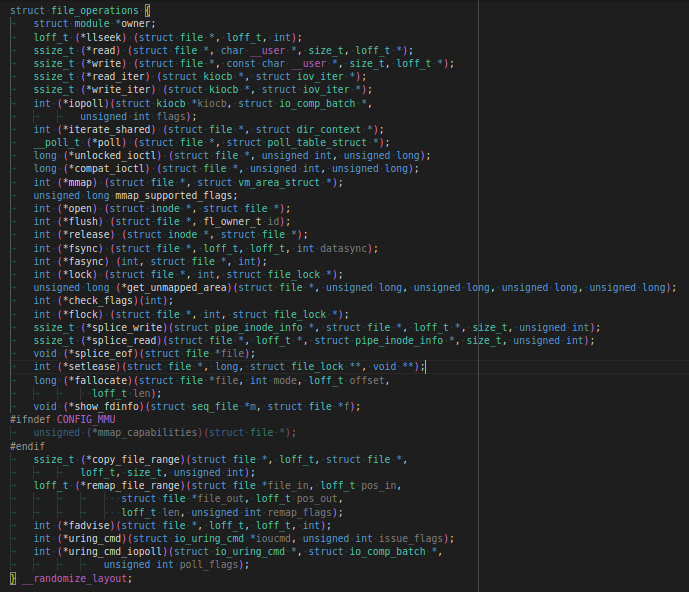
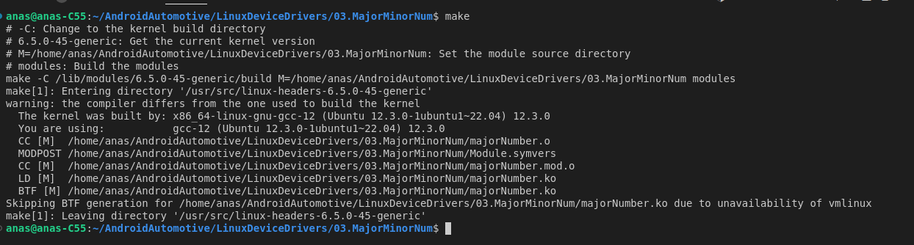
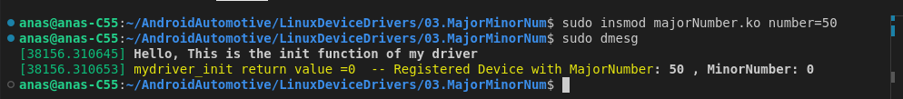
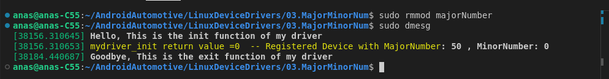
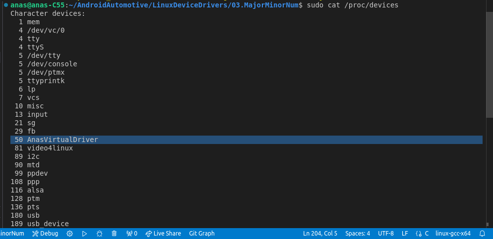
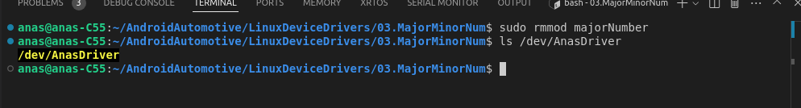
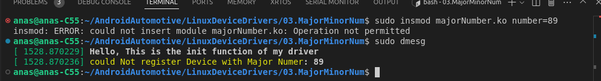

```c
/**
 * @file   : linux/module.h
 * @brief  : Core header file for creating loadable kernel modules.
 * 
 * @details:
 * - Provides the necessary macros, functions, and data structures that allow the kernel to interact with your module.
 * 
 * - Defines the following macros:
 *   - `MODULE_LICENSE`: Specifies the licensing information of the module.
 *   - `MODULE_AUTHOR`: Specifies the author of the module.
 *   - `MODULE_DESCRIPTION`: Provides a brief description of the module.
 * 
 * - Defines the following macros for module initialization and cleanup:
 *   - module_init()`: Specifies the function to be called when the module is loaded into the kernel.
 *   - module_exit()`: Specifies the function to be called when the module is removed from the kernel.
 * 
 * - Provides logging functionality:
 * - printk(): The kernel's version of `printf` in userspace, used to log messages from your module to the kernel's message buffer (viewable using `dmesg`).
 */
#include <linux/module.h>      

/**
 * @brief   : This header file provides functionality for handling module parameters.
 *            It allows you to define parameters that can be passed to your kernel module
 *            at the time of loading, enabling configurable behavior.
 * 
 * MODULE_PARAM and MODULE_PARM_DESC macros are defined here.
 * - module_param()     : 
 * Allows you to define parameters that users can pass to the module when it is loaded (in run time).
 * - MODULE_PARM_DESC() : 
 * Provides a description for the module parameters, which can be viewed via the `modinfo` command.
 * 
 * This header is essential when you need to create modules that accept user-defined parameters,
 * making your module more flexible and adaptable to different environments or use cases.
 */
#include <linux/moduleparam.h>  /* For handling module parameters */

/**
 * @brief   : This header file is crucial for implementing file operations in kernel modules,
 *            especially for character devices.
 * 
 * The following are defined in this header:
 * - struct file_operations:
 *  A structure used to define the set of functions (like open, read, write, close, etc.)
 *  that your module will use to interact with user space through device files.
 * - register_chrdev()     : 
 * Function used to register a character device driver with the kernel, associating it with a major number.
 * 
 * This header is used when you are developing modules that need to interface with the filesystem,
 * such as creating custom device drivers.
 */
#include <linux/fs.h>         


/**
 * @brief   : Specifies the license type for the module.
 * @details : GPL (General Public License) is used, which is a free software license. 
 *            It allows users to freely use, modify, and distribute the software.
 */
MODULE_LICENSE("GPL");

/**
 * @brief   : Specifies the author of the module.
 * @details : This macro defines the author of the module as "Anas Khamees".
 */
MODULE_AUTHOR("Anas Khamees");

/**
 * @brief   : Describes the purpose of the module.
 * @details : A simple  Kernel Module for educational purposes.
 */
MODULE_DESCRIPTION("A simple Kernel Module with major Num");

/**
 * @brief   : Defines a module parameter 'number'.
 * @param   : number - An integer parameter that can be passed during module load (run-time).
 * @details : The 'number' variable is declared as a module parameter, which can be set 
 *            when the module is loaded into the kernel. This allows dynamic configuration 
 *            of the module's behavior without recompiling the module.
 * 
 * The permissions:
 *  1. **S_IRUSR** (User Read) - (0400): Allows the owner (user) to read the parameter. 
 *     - (S)   stands for **STAT** syscall, which provides file status information.
 *     - (I)   stands for **INODE**, a data structure that holds file metadata.
 *     - (R)   stands for **READ**, indicating read permissions.
 *     - (USR) stands for **USER**, referring to the file owner.
 *  2. **S_IWUSR** (User Write) - (0200): Allows the owner (user) to write (modify) the parameter.
 *     - (S)   stands for **STAT** syscall.
 *     - (I)   stands for **INODE**.
 *     - (W)   stands for **WRITE**, indicating write permissions.
 *     - (USR) stands for **USER**.
 *  3. **S_IRGRP** (Group Read) - (0040): Allows the group members to read the parameter.
 *     - (S)   stands for **STAT** syscall.
 *     - (I)   stands for **INODE**.
 *     - (R)   stands for **READ**.
 *     - (GRP) stands for **GROUP**, referring to users in the file's group.
 *  4. **S_IWGRP** (Group Write) - (0020): Allows the group members to write (modify) the parameter.
 *     - (S)   stands for **STAT** syscall.
 *     - (I)   stands for **INODE**.
 *     - (W)   stands for **WRITE**.
 *     - (GRP) stands for **GROUP**.
 * 
 * These permissions enable both the user and group to read and modify the parameter's value.
 */
int number = 0;
module_param(number, int, S_IRUSR | S_IWUSR | S_IRGRP | S_IWGRP);

/**
 * @brief   : Provides a description of the module parameter.
 * @details : This macro describes the 'number' parameter as the "major number".
 */
MODULE_PARM_DESC(number, "major number");

/**
 * @brief   : Stores the major number of the device.
 * @details : The major number is used by the kernel to identify the device driver associated 
 *            with a particular device.
 */
int majorNumber = 0;

/**
 * @brief   : Opens the device file.
 * @param   : device_file - Pointer to the inode structure, representing the file on disk.
 * @param   : instance - Pointer to the file structure, representing an open file.
 * @return  : Always returns 0 (success).
 * @details : This function is called whenever the device file is opened. It logs a message 
 *            to the kernel log indicating that the 'open' function was called.
 */
static int driver_open(struct inode *device_file, struct file *instance)
{
    printk("%s  open function was called \n", __FUNCTION__);
    return 0;
}

/**
 * @brief   : Closes the device file.
 * @param   : device_file - Pointer to the inode structure, representing the file on disk.
 * @param   : instance - Pointer to the file structure, representing an open file.
 * @return  : Always returns 0 (success).
 * @details : This function is called whenever the device file is closed. It logs a message 
 *            to the kernel log indicating that the 'close' function was called.
 */
static int driver_close(struct inode *device_file, struct file *instance)
{
    printk("%s  close function was called \n", __FUNCTION__);
    return 0;
}

/**
 * @brief   : Defines the file operations for the device driver.
 * @details : This structure links the device file operations (open and release) 
 *            to their respective functions in the driver. The owner field is set 
 *            to THIS_MODULE, indicating that this module is responsible for these operations.
 */
struct file_operations fops = {
    .owner = THIS_MODULE,  /* this file structure related to this driver */
    .open = driver_open,
    .release = driver_close
};

/**
 * @brief   : Initializes the device driver module.
 * @return  : Always returns 0 (success).
 * @details : This function is called when the module is loaded into the kernel. It registers 
 *            a character device with the major number provided in the 'number' parameter 
 *            and links it with the file operations defined in the 'fops' structure.
 * @note    : The 'majorNumber' is set to the value of 'number' passed during module load.
 */
static int __init mydriver_init(void)
{
    majorNumber = number;
    register_chrdev(majorNumber, "AnasVirtualDriver", &fops);
    printk("Hello, This is the init function of my driver\n");
    return 0;
}

/**
 * @brief   : Cleans up the device driver module.
 * @details : This function is called when the module is removed from the kernel. 
 *            It unregisters the character device and logs a goodbye message to the kernel log.
 */
static void __exit mydriver_exit(void)
{
    unregister_chrdev(majorNumber, "AnasVirtualDriver");
    printk("Goodbye, This is the exit function of my driver\n");
}

/**
 * @brief   : Macros to define the module's entry and exit points.
 * @details : These macros tell the kernel which functions to call when the module is loaded 
 *            (mydriver_init) and unloaded (mydriver_exit).
 */
module_init(mydriver_init);
module_exit(mydriver_exit);

```


### 1. Header Files

```c
#include <linux/module.h>      
#include <linux/moduleparam.h>  
#include <linux/fs.h>          
```

- **`<linux/module.h>`**: Provides core functionalities for creating loadable kernel modules, including macros for licensing, author information, module initialization and cleanup, and logging.
- **`<linux/moduleparam.h>`**: Provides functionalities for defining module parameters that can be set at load time and providing descriptions for these parameters.
- **`<linux/fs.h>`**: Defines file operations and structures needed for implementing file operations in kernel modules, especially for character devices.

### 2. Module Metadata

```c
MODULE_LICENSE("GPL");
MODULE_AUTHOR("Anas Khamees");
MODULE_DESCRIPTION("A simple Kernel Module with major Num");
```

- **`MODULE_LICENSE("GPL")`**: Specifies that the module is licensed under the GNU General Public License (GPL). This is required to prevent the kernel from tainting and allows the module to be freely used, modified, and distributed.
- **`MODULE_AUTHOR("Anas Khamees")`**: Provides the author's name for the module, which is useful for tracking module authorship.
- **`MODULE_DESCRIPTION("A simple Kernel Module with major Num")`**: Provides a brief description of the module's purpose, which helps users understand what the module does.

### 3. Module Parameter

```c
int number = 0;
module_param(number, int, S_IRUSR | S_IWUSR | S_IRGRP | S_IWGRP);
MODULE_PARM_DESC(number, "major number");
```

- **`int number = 0;`**: Declares an integer variable `number` which is used as a module parameter.

- `module_param(number, int, S_IRUSR | S_IWUSR | S_IRGRP | S_IWGRP);`

  : Defines `number`as a module parameter of type `int` : with specified permissions:

  - **`S_IRUSR`**: User read permission.

  - **`S_IWUSR`**: User write permission.

  - **`S_IRGRP`**: Group read permission.

  - **`S_IWGRP`**: Group write permission.

    >**S_IRUSR** (User Read) - (0400): Allows the owner (user) to read the parameter. 
    >
    > *  (S)   stands for **STAT** syscall, which provides file status information.
    > *  (I)   stands for **INODE**, a data structure that holds file metadata.
    > *  (R)   stands for **READ**, indicating read permissions.
    > *  (USR) stands for **USER**, referring to the file owner.
    >
    >**S_IWUSR** (User Write) - (0200): Allows the owner (user) to write (modify) the parameter.
    >
    > *  (S)   stands for **STAT** syscall.
    > *  (I)   stands for **INODE**.
    > *  (W)   stands for **WRITE**, indicating write permissions.
    > *  (USR) stands for **USER**.
    >
    >**S_IRGRP** (Group Read) - (0040): Allows the group members to read the parameter.
    >
    > *  (S)   stands for **STAT** syscall.
    > *  (I)   stands for **INODE**.
    > *  (R)   stands for **READ**.
    > *  (GRP) stands for **GROUP**, referring to users in the file's group.
    >
    >**S_IWGRP** (Group Write) - (0020): Allows the group members to write (modify) the parameter.
    >
    > * (S)   stands for **STAT** syscall.
    >
    > * (I)   stands for **INODE**.
    >
    > * (W)   stands for **WRITE**.
    >
    > * (GRP) stands for **GROUP**
    >
    >    ----------------------
    >
    >>#### `stat` System Call
    >>
    >>- **Purpose**: Retrieves information about a file or directory.
    >>- Data Structure: `struct stat` :
    >>  - **`st_mode`**: File type and permissions.
    >>  - **`st_ino`**: Inode number (a unique identifier for the file within the filesystem).
    >>  - **`st_dev`**: Device ID.
    >>  - **`st_nlink`**: Number of hard links to the file.
    >>  - **`st_uid`**: User ID of the file's owner.
    >>  - **`st_gid`**: Group ID of the file's group.
    >>  - **`st_size`**: Size of the file in bytes.
    >>  - **`st_mtime`**: Time of the last modification.
    >>
    >>#### Inodes
    >>
    >>- **Purpose**: A data structure used to store metadata about a file.
    >>- **Details**: Contains information such as the file's size, ownership, and permissions. It is essential for managing file systems in UNIX-like operating systems.
    >>
    >>### How They Work Together:
    >
    >- **`S_IRUSR | S_IWUSR`**: This combination allows the owner of the parameter to **read** and **write** to it.
    >- **`S_IRGRP | S_IWGRP`**: This combination allows members of the group associated with the parameter to **read** and **write** to it as well.
    >- Together, `S_IRUSR | S_IWUSR | S_IRGRP | S_IWGRP` ensures that both the user and the group can fully access and modify the parameter.
    >
    >### Why It's Important:
    >
    >- These permissions control who can access and modify the parameter in the kernel module. By setting these, you're making sure that only authorized users and groups can interact with the parameter, adding a layer of security and control to your module.
    >
    >This level of granularity in permissions is essential in a multi-user environment like Linux, where different users and groups may need different levels of access to system resources.
    >
    >
  
- **`MODULE_PARM_DESC(number, "major number");`**: Provides a description for the `number` parameter, which can be viewed using the `modinfo` command.

### 4. Device Major Number

```c
int majorNumber = 0;
```

- **`int majorNumber = 0;`**: Declares an integer variable to store the major number of the device. The major number is used by the kernel to identify the device driver associated with the device.

### 5. File Operations

```c
static int driver_open(struct inode *device_file, struct file *instance)
{
    printk("%s  open function was called \n", __FUNCTION__);
    return 0;
}

static int driver_close(struct inode *device_file, struct file *instance)
{
    printk("%s  close function was called \n", __FUNCTION__);
    return 0;
}

```

- **`driver_open`**: Function called when the device file is opened. It used in Linux kernel modules, especially for device drivers. This function is meant to handle the "open" system call for a device file.
  
  - **`struct inode \*device_file`**: Pointer to the inode structure representing the file on disk.
  
    >The `inode` structure contains information about the file or device such as its type, permissions, owner, pointers to data blocks on the storage device (e.g., hard drive, SSD) on disk.
  
  - **`struct file \*instance`**: Pointer to the file structure representing an open file.
  
    >The `file` structure contains information specific to the current open instance of the file or device in the context of the current process. It includes details such as the current file descriptor, current file position, and any private data associated with the file. It is used by the kernel to manage operations on the file or device instance.
    >
    >ou might use `instance` to keep track of the state of the file descriptor, or to store and manage per-file/device data that needs to be maintained across multiple operations.
  
    > **`device_file` (inode)**: Provides metadata about the file/device stored on persistent storage. It’s part of the file system's structure.
  
    > **`instance` (file)**: Represents the current open file or device within the RAM, keeping track of the state and context of the file/device in the current process.
  
  - **Purpose**: Logs a message indicating the open function was called and always returns 0 to indicate success.
  
    >Let’s walk through the sequence of events when a file or device is opened in the context of the Linux kernel, including how `struct inode` and `struct file` fit into the process.
    >
    >### 1. **File or Device Request**
    >
    >- **User Request**: A user-space application makes a request to open a file or device (e.g., using the `open()` system call).
    >
    >### 2. **System Call Invocation**
    >
    >- **System Call**: The system call is intercepted by the kernel. For file operations, this would be handled by the VFS (Virtual File System) layer.
    >
    >### 3. **File System Lookup**
    >
    >- **Path Resolution**:  When an application requests a file or device, the kernel translates the file path (e.g., `/home/user/file.txt`) into an inode reference. This involves navigating the directory structure to find the file’s inode.
    >- **Inode Lookup**: The kernel looks up the inode associated with the file or device. This inode contains metadata about the file (e.g., permissions, size, file type, Timestamps and pointers to data blocks).
    >
    >### 4. **Inode Structure**
    >
    >- **`struct inode \*device_file`**: At this point, the kernel has a pointer to the inode structure that contains metadata about the file or device. This metadata is used to determine how the file or device should be handled.
    >
    >  >**File Systems**: Most file systems use inodes to manage files. Examples include ext4, XFS, and Btrfs.
    >  >
    >  >**Directory Entries**: Directories in the file system contain entries that map file names to their corresponding inodes. When you access a file, the kernel uses these entries to find the inode.
    >
    >### 5. **File Descriptor Allocation**
    >
    >- **File Table Entry**: The kernel allocates an entry in the file descriptor table for the process. This table keeps track of all open files and devices for the process.
    >
    >  >### What is a File Descriptor?
    >  >
    >  >A file descriptor is an integer value used by the operating system to identify an open file or device within a process. When a file or device is opened by an application, the operating system assigns a file descriptor to that file or device. This descriptor is used to refer to the open file or device in subsequent system calls.
    >  >
    >  >1. **File Descriptor Table**:
    >  >   - Each process has its own file descriptor table.
    >  >   - This table maps file descriptors (integers) to file objects that represent the open files or devices.
    >  >2. **Index/Descriptor**:
    >  >   - The file descriptor itself is simply an integer value (e.g., 0, 1, 2, 3, ...).
    >  >   - It acts as an index into the file descriptor table.
    >  >3. **File Descriptor Management**:
    >  >   - When a file is opened, the operating system allocates a file descriptor and adds an entry to the process’s file descriptor table.
    >  >   - This entry points to a `file` structure that contains details about the open file (e.g., the file's current position, access mode).
    >  >
    >  >### Example
    >  >
    >  >Here’s a simplified example to illustrate how file descriptors work:
    >  >
    >  >1. **Opening a File**:
    >  >
    >  >   ```c
    >  >   int fd = open("/path/to/file.txt", O_RDONLY);
    >  >   ```
    >  >
    >  >   - This system call opens the file `/path/to/file.txt` in read-only mode.
    >  >   - The operating system assigns a file descriptor (e.g., 3) to this open file and returns it.
    >  >
    >  >2. **Using the File Descriptor**:
    >  >
    >  >   ```c
    >  >   char buffer[100];
    >  >   ssize_t bytesRead = read(fd, buffer, sizeof(buffer));
    >  >   ```
    >  >
    >  >   - The `read` system call uses the file descriptor `fd` to read data from the open file into `buffer`.
    >  >   - The operating system looks up the file descriptor in the process’s file descriptor table to find the `file` structure and then performs the read operation.
    >  >
    >  >3. **Closing the File**:
    >  >
    >  >   ```c
    >  >   close(fd);
    >  >   ```
    >  >
    >  >   - This system call closes the file associated with file descriptor `fd`.
    >  >   - The operating system removes the entry from the file descriptor table and deallocates resources associated with the file.
    >  >
    >  >### Summary
    >  >
    >  >- **File Descriptor**: An integer used by the operating system to identify an open file or device within a process.
    >  >- **File Descriptor Table**: Maintains mappings of file descriptors to open file objects for the process.
    >  >- **Usage**: File descriptors are used in system calls to refer to and operate on open files or devices.
    >
    >### 6. **File Structure Creation**
    >
    >- `struct file *instance`: The kernel creates a `file` structure for the open file or device. This structure contains details specific to the open instance, such as:
    >  - **File Descriptor**: The index or descriptor for the open file.
    >  - **File Position**: The current offset in the file for read/write operations.
    >  - **Private Data**: Any data that the driver or file system may need to maintain about the open instance.
    >
    >### 7. **Open Function Call**
    >
    >- Driver's `open` Function: If it's a device file, the kernel calls the device driver’s  `open` function (driver_open in my example). Here’s what happens in this function:
    >  - Parameters:
    >    - **`device_file`**: Points to the `inode` structure with metadata about the device.
    >    - **`instance`**: Points to the `file` structure that represents the open instance of the device.
    >  - **Function Execution**: The driver performs any necessary setup or initialization for the device and returns a result indicating success or failure.
    >
    >### 8. **File or Device Ready**
    >
    >- **User Space**: The file or device is now open and ready for use by the application. The kernel updates the process’s file descriptor table with the new file descriptor, allowing the application to perform operations on the file/device.
    >
    >### Summary
    >
    >1. **User Request**: Application requests to open a file/device.
    >2. **System Call**: Handled by the kernel.
    >3. **File System Lookup**: Kernel finds the inode for the file/device.
    >4. **Inode Structure**: Contains metadata about the file/device.
    >5. **File Descriptor Allocation**: Kernel prepares to manage the file.
    >6. **File Structure**: Represents the open file/device with state information.
    >7. **Open Function Call**: Driver’s `open` function is invoked.
    >8. **File/Device Ready**: Application can interact with the file/device.
  
- **`driver_close`**: Function called when the device file is closed.
  
  - **`struct inode \*device_file`**: Pointer to the inode structure representing the file on disk.
  - **`struct file \*instance`**: Pointer to the file structure representing an open file.
  - **Purpose**: Logs a message indicating the close function was called and always returns 0 to indicate success.
  
- `printk` function :

  - **Syntax**: `printk(KERN_<LEVEL> "format string", args...)`
  - **Description**: `printk` is used for printing messages in the kernel log. It’s similar to `printf` in user space but is used for debugging and logging in kernel space.
  - **Levels**: `printk` supports various log levels like `KERN_INFO`, `KERN_WARNING`, and `KERN_ERR` to indicate the severity of the message.

  ```c
  struct file_operations fops = {
      .owner = THIS_MODULE,
      .open = driver_open,
      .release = driver_close
  };
  ```

  

- **`struct file_operations fops`**: Structure that defines the set of file operations for the device driver.
  
  - **`owner`**: Set to `THIS_MODULE`, indicating that this module owns these operations.
  - **`open`**: Points to `driver_open`, defining the function to be called when the device file is opened.
  - **`release`**: Points to `driver_close`, defining the function to be called when the device file is closed.
  
  >The `file_operations` structure is a fundamental part of the Linux kernel's device driver interface. It is used to define a set of functions that handle file operations on a device.
  >
  >The `file_operations` structure is used by device drivers to specify how different file operations (like opening, closing, reading, and writing) should be handled. It acts as a bridge between user space and the device driver, allowing the kernel to call driver-specific functions in response to file operations performed by user applications.
  >
  >###  Fields in `file_operations` Structure :
  >
  >
  >
  >1. **`struct module *owner`**
  >   - **Purpose**: Indicates the module that owns these file operations. This is typically set to `THIS_MODULE`, which helps ensure that the module isn’t unloaded while it’s still in use.
  >2. **`int (*open) (struct inode *, struct file *)`**
  >   - **Purpose**: Points to the function that handles the open operation for a file or device. This function is called when a file or device is opened.
  >3. **`int (*release) (struct inode *, struct file *)`**
  >   - **Purpose**: Points to the function that handles the close operation for a file or device. This function is called when the file or device is closed.
  >4. **`ssize_t (*read) (struct file *, char __user *, size_t, loff_t *)`**
  >   - **Purpose**: Points to the function that handles reading data from a file or device. This function is used to read data from the file into a buffer.
  >5. **`ssize_t (*write) (struct file *, const char __user *, size_t, loff_t *)`**
  >   - **Purpose**: Points to the function that handles writing data to a file or device. This function is used to write data from a buffer to the file.
  >6. **`long (*unlocked_ioctl) (struct file *, unsigned int, unsigned long)`**
  >   - **Purpose**: Points to the function that handles I/O control operations (ioctl) on the file. Ioctl is used for device-specific input/output operations.
  >7. **`int (*mmap) (struct file *, struct vm_area_struct *)`**
  >   - **Purpose**: Points to the function that handles memory mapping of a file or device. This function is used to map file contents into user space memory.
  >8. **`int (*fsync) (struct file *, loff_t, loff_t, int datasync)`**
  >   - **Purpose**: Points to the function that synchronizes a file’s in-memory state with storage. This ensures that changes to the file are physically written to disk.
  >9. **`int (*flush) (struct file *, fl_owner_t id)`**
  >   - **Purpose**: Points to the function that flushes any pending data to the file or device. This is often used for clean-up operations.
  >10. **`int (*fasync) (int, struct file *, int)`**
  >    - **Purpose**: Points to the function that handles asynchronous file notifications. This function is used to manage file descriptor notifications.
  >11. **`int (*lock) (struct file *, int, struct file_lock *)`**
  >    - **Purpose**: Points to the function that handles file locking operations. This is used to manage file locks.
  >12. **`ssize_t (*splice_write) (struct pipe_inode_info *, struct file *, loff_t *, size_t, unsigned int)`**
  >    - **Purpose**: Points to the function that handles writing data from a pipe to a file, using the splice mechanism for efficient data transfer.
  >13. **`ssize_t (*splice_read) (struct file *, loff_t *, struct pipe_inode_info *, size_t, unsigned int)`**
  >    - **Purpose**: Points to the function that handles reading data from a file to a pipe, also using splice.
  >14. **`long (*fallocate) (struct file *file, int mode, loff_t offset, loff_t len)`**
  >    - **Purpose**: Points to the function that handles file allocation operations. This can be used to allocate space for a file.
  >15. **`void (*show_fdinfo) (struct seq_file *m, struct file *f)`**
  >    - **Purpose**: Points to the function that provides information about the file descriptor, typically for debugging purposes.

### 6. Module Initialization and Cleanup

```c
static int __init mydriver_init(void)
{
    majorNumber = number;
    register_chrdev(majorNumber, "AnasVirtualDriver", &fops);
    printk("Hello, This is the init function of my driver\n");
    return 0;
}

static void __exit mydriver_exit(void)
{
    unregister_chrdev(majorNumber, "AnasVirtualDriver");
    printk("Goodbye, This is the exit function of my driver\n");
}

module_init(mydriver_init);
module_exit(mydriver_exit);
```

- **`mydriver_init`**: Initialization function called when the module is loaded.
  - **Purpose**: Registers the character device with the kernel using `register_chrdev`, setting the device name to **"AnasVirtualDriver"** and linking it with the `fops` structure. Logs an initialization message and returns 0 to indicate success.
- **`mydriver_exit`**: Cleanup function called when the module is removed.
  - **Purpose**: Unregisters the character device using `unregister_chrdev` and logs a message indicating that the cleanup function has been called.
- **`module_init(mydriver_init)`**: Macro to specify the initialization function to be called when the module is loaded.
- **`module_exit(mydriver_exit)`**: Macro to specify the cleanup function to be called when the module is unloaded.


### Build the driver

```c
make
```

>
>
>1. **Entering Directory**:`make[1]: Entering directory '/usr/src/linux-headers-6.5.0-45-generic'`
>
>   - `make` has entered the kernel headers directory to start the build process.
>
>2. **Warning**:
>
>   ```makefile
>   warning: the compiler differs from the one used to build the kernel
>     The kernel was built by: x86_64-linux-gnu-gcc-12 (Ubuntu 12.3.0-1ubuntu1~22.04) 12.3.0
>     You are using:           gcc-12 (Ubuntu 12.3.0-1ubuntu1~22.04) 12.3.0
>   ```
>
>   - This is a warning that the version of the GCC compiler used to build the kernel may differ from the one used to compile the module. However, in this case, I am using the same GCC version as used for the kernel (`gcc-12`), so this warning can typically be ignored unless  I encounter issues.
>
>3. **Building Module Objects**:
>
>   ```makefile
>   CC [M]  /home/anas/AndroidAutomotive/LinuxDeviceDrivers/03.MajorMinorNum/majorNumber.o
>   MODPOST /home/anas/AndroidAutomotive/LinuxDeviceDrivers/03.MajorMinorNum/Module.symvers
>   CC [M]  /home/anas/AndroidAutomotive/LinuxDeviceDrivers/03.MajorMinorNum/majorNumber.mod.o
>   LD [M]  /home/anas/AndroidAutomotive/LinuxDeviceDrivers/03.MajorMinorNum/majorNumber.ko
>   ```
>
>   - **`CC [M] majorNumber.o`**: Compiling the module source file (`majorNumber.c`) to an object file (`majorNumber.o`).
>   - **`MODPOST Module.symvers`**: Creating a symbol version file that helps ensure the module's symbols match the kernel's symbols.
>   - **`CC [M] majorNumber.mod.o`**: Compiling the module’s metadata file (`majorNumber.mod.c`) to an object file.
>   - **`LD [M] majorNumber.ko`**: Linking the object files to create the final kernel module (`majorNumber.ko`).
>
>4. **BTF Generation Skipped**:
>
>   ```
>   bashCopy codeBTF [M] /home/anas/AndroidAutomotive/LinuxDeviceDrivers/03.MajorMinorNum/majorNumber.ko
>   Skipping BTF generation for /home/anas/AndroidAutomotive/LinuxDeviceDrivers/03.MajorMinorNum/majorNumber.ko due to unavailability of vmlinux
>   ```
>
>   - **`BTF`**: BTF (BTF - BTF Type Format) generation is related to debugging and tracing. The kernel tries to generate BTF information for the module but skips it because the required `vmlinux` file (a symbolic link to the kernel image with debug information) is not available.
>
>5. **Leaving Directory**:
>
>   ```
>   make[1]: Leaving directory '/usr/src/linux-headers-6.5.0-45-generic'
>   ```
>
>   - `make` has finished the build process and is leaving the kernel headers directory.
>
>### 

### 





### Create File to Access the driver from user space

```
sudo mknod /dev/AnasDriver c 50 0
```

>When i remove my driver the file under **/dev** still exist , and this is a problem
>
>

#### Lets try to assign Major number exist already 


