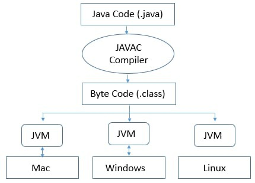
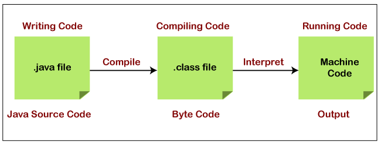
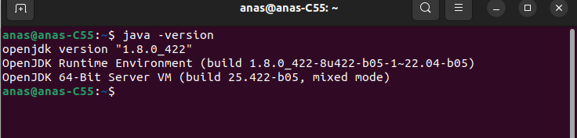

## Java

## 1. Introduction

Java is a high-level, object-oriented programming language designed to be simple, secure, and platform-independent. It was created by Sun Microsystems, with its first public release in 1995. The language has since become one of the most widely used programming languages in the world, particularly in web development, enterprise software, mobile applications, and large systems development.

###  Features of Java:

1. **Object-Oriented**: Java is Fully object oriented languages , which makes it easier to model real-world scenarios. It supports key object-oriented principles like inheritance, encapsulation, polymorphism, and abstraction.

   >**Note That C++ has Violation in OOP Concepts Like **:
   >
   >- Friend Function
   >- Main Function is stand alone function (entry point of the code)
   >- Multiple Inheritance (Diamond Problem)
   >- Inheritance types (Protected and Private) are NOT useful.
   >
   >

2. **Platform Independence**: Java is known for its **"Write Once, Run Anywhere"** capability. Java programs are compiled into bytecode, which can run on any device with a  **Java Virtual Machine (JVM)**, making it platform-independent. This means that Java applications can run on various platforms, including Windows, macOS, Linux, and others, without modification.

​	

1. **Simple and Familiar**: Java's syntax is similar to C++ but with simplified features. It removes complex aspects like pointers and operator overloading, making it easier for developers to learn and use.

2. **Robust and Secure**: Java provides strong memory management and exception-handling capabilities. It also has built-in security features, such as bytecode verification and sandboxing, which protect against malicious code.

3. **Multithreaded**: Java supports multithreading, allowing concurrent execution of two or more threads. This is useful for performing multiple tasks simultaneously, such as in web servers or graphical user interfaces.

   >### Examples of Multithreading in Java:
   >
   >1. **GUI Thread:**
   >   - In Java-based desktop applications (e.g., using Swing or JavaFX), the **GUI thread** (also known as the Event Dispatch Thread, or EDT) is responsible for handling user interface updates and interactions.
   >   - The GUI thread ensures that the application remains responsive to user actions, such as clicks and keystrokes, while other threads handle background tasks like file processing or network communication.
   >2. **Event Handling Thread:**
   >   - In event-driven programming, like GUI applications, the **Event Handling thread** processes events like mouse clicks, key presses, or window resizing.
   >   - This thread runs asynchronously, allowing the application to respond to user input or other events without blocking the main program execution.
   >3. **Garbage Collection (GC) Thread:**
   >   - Java has an automatic memory management system known as **Garbage Collection (GC)**.
   >   - The GC thread runs in the background, monitoring and reclaiming memory that is no longer in use by the application. This helps in managing memory efficiently without manual intervention by the programmer.

4. **Automatic Memory Management**: Java has a garbage collector that automatically handles memory allocation and deallocation, reducing the risk of memory leaks and freeing developers from manual memory management.

5. **Compiled and Interpreted**

   - **Compiled**: Java code is first compiled into bytecode by the Java compiler. This bytecode is platform-independent.
   - **Interpreted**: The bytecode is then interpreted (executed) by the JVM, making Java both compiled and interpreted.

   

8. **Networked**

   Java was designed with networking in mind, making it easy to create distributed applications. It includes a rich set of APIs for handling network operations, making Java a preferred choice for developing networked applications.

   >Predefined classes are available to simplify network programming through Sockets(TCP-UDP)

9. **Rich Standard Library**: Java comes with an extensive standard library that provides a wide range of functionality, from data structures to networking, making it easier to develop complex applications.

10. **Community and Ecosystem**: Java has a vast and active community, which contributes to a rich ecosystem of frameworks, libraries, and tools. Popular frameworks like Spring, Hibernate, and Apache Struts are built on Java, making it a strong choice for enterprise-level applications.

### Common Uses of Java:

- **Web Development**: Java is widely used for building scalable web applications. The Java EE (Enterprise Edition) platform provides APIs for building large-scale, distributed, and secure web applications.

- **Mobile Applications**: Java is the primary language for developing Android applications, making it a key player in the mobile app development space.

- **Enterprise Software**: Many large organizations use Java to build enterprise-level software solutions, such as **ERP** systems, **CRM**  platforms, and financial services applications.

  >**ERP (Enterprise Resource Planning) systems** are comprehensive software platforms that help organizations manage and integrate various core business processes in a unified system. These processes can include accounting, human resources, procurement, inventory management, supply chain operations, customer relationship management, and more. ERP systems provide a centralized database that allows for real-time data sharing across different departments, improving efficiency, accuracy, and decision-making.

  >**CRM (Customer Relationship Management) platforms** are software solutions designed to manage a company's interactions with current and potential customers. The primary goal of a CRM platform is to improve customer relationships, streamline processes, and increase profitability by organizing customer information and interactions in a centralized database.
  >
  >

- **Embedded Systems**: Java is also used in embedded systems, which are computers within larger systems, such as smart appliances, medical devices, and automotive systems.

- **Big Data and Cloud Computing**: Java is popular in the fields of big data and cloud computing, with frameworks like Apache Hadoop and Apache Spark being built in Java.

## 2. Differences between JDK, JRE and JVM

**2.1. JVM (Java Virtual Machine):**

- **Role:** It’s the part of the Java runtime environment that executes Java bytecode. The JVM is responsible for interpreting and executing Java programs, providing a platform-independent execution environment.
- **Functionality:** It includes the class loader, execution engine, and garbage collector. It doesn’t include development tools or libraries.
- **Platform:** The JVM is specific to the operating system and hardware architecture. Different platforms have their own JVM implementations.

**2.2. JRE (Java Runtime Environment):**

- **Role:** It provides the libraries, Java Virtual Machine, and other components necessary to run Java applications.
- **Functionality:** The JRE includes the JVM, core libraries (like `rt.jar`), and other resources needed for running Java programs. It doesn’t include development tools like compilers.
- **Use Case:** It’s used by end-users to run Java applications.

**2.3. JDK (Java Development Kit):**

- **Role:** It provides tools and libraries necessary for developing Java applications.
- **Functionality:** The JDK includes the JRE, as well as development tools like the Java compiler (`javac`), debugger, and other utilities for development. It also includes additional libraries and documentation.
- **Use Case:** It’s used by developers to create, compile, and debug Java applications.

**Summary:**

- **JVM** is the engine that runs Java applications.
- **JRE** includes the JVM and libraries to run Java applications but not the development tools.
- **JDK** includes everything in the JRE plus tools and libraries for developing Java applications.


## 3. Install Java SDK on Linux Ubuntu

```bash
sudo apt install openjdk-8-jdk
```




## 4. Hello World Example

- Create File with extension of  **.java**  (File name is **hello.java**)

```java
class HelloWorld
{
	public static void main(String[] args)
	{
		System.out.println(“Hello Java”);
	}
}
```

1. **Class Definition:**

   ```java
   class HelloWorld {
   ```

   - **`class HelloWorld`**: This defines a class named `HelloWorld`. In Java, everything is organized into classes, which are blueprints for creating objects. Even if you're not creating objects in a simple program like this, you still need to define a class.
   - **`HelloWorld`**: The name of the class must match the filename (e.g., `HelloWorld.java`).

2. **The `main` Method:**

   ```java
   public static void main(String[] args) {
   ```

   - **`public`**: This keyword makes the `main` method accessible from outside the class, which is necessary because the Java Virtual Machine (JVM) needs to call this method to start the program.
   - **`static`**: This means the method belongs to the class rather than an instance of the class. The JVM can call `main` without creating an instance of the `HelloWorld` class.
   - **`void`**: This specifies that the method does not return any value.
   - **`main`**: This is the name of the method. The `main` method is the entry point of any Java application. When you run a Java program, the JVM looks for this method to start the execution.
   - **`String[] args`**: This is an array of `String` objects, which stores any command-line arguments passed when the program is executed. Although it's not used in this example, it allows the program to handle input from the command line.

3. **Method Body:**

   ```java
   System.out.println("Hello Java");
   ```

   - **`System`**: This is a built-in class in Java that provides access to system-level resources and utilities, including standard input, output, and error streams.
   - **`out`**: `out` is a static reference in the `System` class. It refers to an instance of the `PrintStream` class, which is connected to the console (standard output).
   - **`println`**: This method is a part of the `PrintStream` class. It prints the string passed to it to the console, followed by a new line. In this case, it will print `Hello Java`.
   - **`"Hello Java"`**: This is the string that gets printed to the console.

4. **End of the Class and Method:**

   ```java
   }
   ```

   - The curly braces `{}` indicate the beginning and end of the `main` method and the `HelloWorld` class. They define the scope of the method and the class.

------------------------------

- **`main` Method Requirements:**
  - **Must be `public`**: So the JVM can access it.
  - **Must be `static`**: So it can be called without creating an instance of the class.
  - **Must return `void`**: Indicates it does not return any value.
  - **Accepts a `String[]` parameter**: This allows the program to accept command-line arguments.
- **`System.out.println`**:
  - `System`: Refers to the `System` class.
  - `out`: A static reference to a `PrintStream` object.
  - `println`: A method of `PrintStream` that prints the given string to the console and adds a new line.

### Running the Program:

When you compile and run this program, the following steps happen:

1. The JVM loads the `HelloWorld` class.
2. It calls the `main` method (`HelloWorld.main(args)`).
3. Inside `main`, `System.out.println("Hello Java")` is executed, which prints "Hello Java" to the console.

### Compile the Program 

```java
javac hello.java
```

### Run the Program

```java
java HelloWorld
```

### OUTPUT 

```
Hello Java
```


## 5. Packages

A package in Java is a namespace that organizes classes and interfaces. It helps in grouping related classes together and prevents name conflicts between classes.

**Purpose:** Packages provide a hierarchical structure that makes it easier to manage large codebases, control access to classes, and reuse code across different projects.

```java
package mypkg;
class HelloWorld
{
	public static void main(String[] args)
	{
		System.out.println("hello Java");
	}
}

class Anas
{
	
}
```

>- This line declares that the classes in this file belong to a package named `mypkg`.
>
>- A package is a namespace that organizes related classes and prevents naming conflicts. It's like a folder that groups similar files together.
>- By placing classes in a package, you can easily manage large projects by organizing classes into meaningful groups.
>
>- Why It’s Important:
>  - Declaring a package at the top of your Java file ensures that the classes are grouped within this specific package.
>  - If you want to use this `HelloWorld` class elsewhere, you'll need to import it using `import mypkg.HelloWorld;`.

### 5.1. Compile a Package 

```java
java -d . hello.java
```

### 5.2. Run 

```java
java mypkg.HelloWorld
```

## 6. JAR File

A JAR (Java ARchive) file is a package file format used in Java to aggregate multiple files into a single compressed file. Typically, a JAR file contains Java class files, associated metadata, and resources like images or sound files. It is essentially a ZIP file with a `.jar` extension and a specific structure tailored for Java applications.


1. **Purpose:**
   - **Distribution:** JAR files are used to distribute Java applications, libraries, and components. They bundle all necessary files into a single archive, making it easier to share and deploy Java programs.
   - **Execution:** Some JAR files are executable, meaning they can be run directly as standalone applications if they contain a `Main` class with a `main` method.
2. **Contents of a JAR File:**
   - **Class Files:** The compiled `.class` files from Java source code.
   - **Manifest File:** A special file named `MANIFEST.MF` located in the `META-INF` directory. This file contains metadata about the JAR file, including the entry point of the application if the JAR is executable.
   - **Resources:** Any other files needed by the application, such as configuration files, images, sound files, or text files.
3. **How to create JAR File**

```java
jar cf <fileName.jar> <files>
```

```java
jar cf myApp.jar HelloWorld.class Anas.class
```

4. **Run executable JAR file**

```java
jar cef <jarFile.jar> <EntryPoint> <files>
```

>**`c`:** Create a new archive.
>
>**`e`:** Specify the entry point of the application (i.e., the class with the `main` method).
>
>**`f`:** Specify the JAR file name.
>
>**`<jarFile.jar>`:** The name of the JAR file to be created.
>
>**`<EntryPoint>`:** The fully qualified name of the class that contains the `main` method (without **.class** extension). This class will be executed when the JAR file is run.
>
>**`<files>`:** classes files
>
>

```
jar cef myApp.jar HelloWorld HelloWorld.class Anas.class
```


## 7. Standard Naming Convention 

