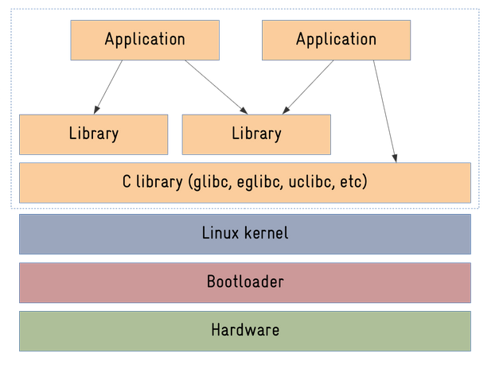
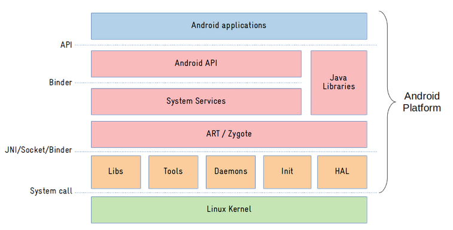

# Android Automotive 

## 1. Android Vs Linux

Android is built on the Linux kernel, but it differs significantly from the standard Linux operating system. Here’s an overview of key differences between Android and Linux, especially in the context of automotive applications:

### 1.1. **Kernel Differences:**

- **Linux Kernel:** The standard Linux kernel is a monolithic kernel that is used in a wide variety of systems, including servers, desktops, and embedded devices. It is highly versatile and configurable, but not specifically optimized for mobile devices.

- **Android Kernel:** Android uses the Linux kernel as its foundation but has been modified and optimized for mobile and touchscreen devices. The changes made to the Linux kernel focus on power efficiency, real-time task management, and handling specific hardware components in mobile devices.

  | Feature                | Linux Kernel                                                 | Android Kernel                                               |
  | ---------------------- | ------------------------------------------------------------ | ------------------------------------------------------------ |
  | **Kernel Type**        | [Monolithic kernel](https://www.geeksforgeeks.org/monolithic-kernel-and-key-differences-from-microkernel/) | Modified Linux kernel                                        |
  | **Optimization Focus** | General-purpose computing (servers, desktops)                | Optimized for mobile and touchscreen devices                 |
  | **Power Management**   | Basic power management                                       | Advanced power-saving features, deep sleep                   |
  | **Real-Time Support**  | Optional (via PREEMPT-RT patches)                            | Built-in real-time task management                           |
  | **Hardware Support**   | Generic drivers for a wide range of devices                  | Specific drivers for mobile hardware (touchscreen, sensors, camera) |
  | **Scheduler**          | General-purpose scheduler                                    | Modified scheduler optimized for mobile use                  |
  | **IPC System**         | System V IPC (generic)                                       | Binder IPC (optimized for mobile)                            |
  | **Security**           | Basic security features                                      | SELinux, additional cryptographic modules                    |

### 1.2. **C Libraries:**

- **Linux:** Linux uses **glibc**, the GNU C library, which is designed to be a highly flexible and feature-rich library.
- **Android:** Android uses a custom C library called **Bionic**. Bionic is optimized to be lighter and faster, which is crucial for the resource-constrained environments of mobile devices.

### 1.3. **Scheduler Differences:**

- **Linux Scheduler:** Linux uses the Completely Fair Scheduler (CFS), which provides fair scheduling of tasks but does not focus on real-time requirements.

  - #### **Example:**

    - **Task A:** A long-running program like a video rendering software that performs CPU-heavy computations.
    - **Task B:** A terminal that waits for user input and executes commands (interactive).

    Even if **Task B** is waiting for user input, CFS will give both tasks fair CPU time based on their waiting time. If **Task A** has been running longer, it will keep consuming the CPU, and **Task B** will have to wait its turn, causing some delay. While the system as a whole remains fair, **Task B** may experience noticeable lag because the scheduler doesn’t prioritize responsiveness.

- **Android Scheduler:** While Android uses the same Linux scheduler, it has been tuned for mobile devices, prioritizing responsiveness over fairness in some cases. Android also uses a low-latency mode for real-time interaction.

  - - #### **Example:**

      - **Task A:** A background service performing a network sync in the background.
      - **Task B:** A UI thread waiting for a user touch event to respond instantly.

      In this case, **Task B** (the UI thread) needs to respond to user interactions with minimal delay, so Android will prioritize **Task B** over **Task A** even if **Task A** has been running longer. The scheduler will give **Task B** more CPU time to ensure the UI remains responsive, and **Task A** may be temporarily paused or given lower priority. Additionally, Android’s low-latency mode may be used to ensure quick and smooth handling of real-time interactions like touch events or audio processing, where any delay would be noticeable to the user.

### 1.4. **Inter-Process Communication (IPC):**

- **Linux:** Linux uses traditional IPC mechanisms, such as System V IPC or POSIX message queues.
- **Android:** Android uses its own **Binder IPC** system, which is designed to be more efficient and suitable for high-performance, inter-process communication between apps and system services. Binder is tailored for mobile devices' limited resources and is more secure and reliable for Android's needs.

### 1.1.4.**Linux IPC Mechanisms:**

In a **Linux system**, traditional IPC mechanisms are used to facilitate communication between processes. These mechanisms have been around for decades and are designed for general-purpose systems. Linux provides several options for IPC:

1. **System V IPC**:
   This is one of the older IPC mechanisms that includes:
   - **Message Queues**: Allow processes to send and receive messages.
   - **Semaphores**: Used for synchronization between processes to control access to shared resources.
   - **Shared Memory**: A region of memory that can be mapped into the address space of multiple processes, allowing them to share data directly.
   - **Pipes**: A unidirectional communication channel between processes, typically used for simple data flow.
2. **POSIX IPC**:
   This is a more modern version of IPC that conforms to POSIX (Portable Operating System Interface) standards:
   - **POSIX Message Queues**: A more robust and flexible alternative to System V message queues.
   - **POSIX Shared Memory**: Allows multiple processes to share a region of memory in a POSIX-compliant way.
   - **Semaphores and Mutexes**: For process synchronization.
3. **Sockets**:
   A widely-used IPC method that enables communication between processes over networks or within the same system (local communication through Unix domain sockets).

------

**Example of Linux IPC:**

Imagine two processes:

- **Process A** that writes data to a shared memory segment.
- **Process B** that reads the data from the shared memory segment.

With **POSIX Shared Memory**, both processes can access the same memory region directly, without needing to go through the kernel for each communication. This allows fast, direct data transfer, but the programmer needs to handle synchronization to ensure that no data corruption occurs (e.g., using semaphores).

------

### **Android IPC - Binder:**

On **Android**, traditional IPC mechanisms are not used. Instead, Android uses a custom-designed **Binder IPC** system, which is more optimized for the mobile environment. Binder is tailored to meet the specific needs of mobile devices, such as low power consumption, security, efficiency, and interaction between apps and system services.

#### **Binder IPC Overview:**

- **Binder** is a high-performance, object-oriented IPC mechanism that enables communication between processes on the same device or between different devices.
- It uses a **client-server** model, where one process acts as a client (requesting services) and another process acts as a server (providing services).
- It is designed to be lightweight, fast, and secure, making it ideal for mobile systems with limited resources.

In Android, **Binder** facilitates communication between:

- **Apps**: Apps can interact with each other and access system-level services.
- **Apps and System Services**: Android’s system services (like the Camera, Location, or Audio Services) communicate with apps using Binder.

#### **How Binder Works:**

- **Client-Server Model**: A client process sends a request (like a method call) to a server process. The server executes the request and sends back the result.

- **Parceling (**Marshaling**) and Unparceling  (**De-Marshaling**)**: Binder communication involves “parceling” data, which means packaging it in a special format to send across process boundaries. This data is then “unparcelled” by the receiving process.

  >### **Parceling**:
  >
  >**Parceling** is the process of serializing (or packaging) data into a specific format so that it can be sent between processes. This process is necessary because processes in an operating system run in separate memory spaces, and they can’t directly access each other’s memory. For data to be transferred, it needs to be “flattened” into a format that can be easily passed across process boundaries.
  >
  >#### **Why Parceling is Needed**:
  >
  >- Data that needs to be transferred between processes cannot be shared directly due to memory isolation.
  >- Therefore, data is converted into a "parcel" format, which is essentially a serialized byte stream that represents the data in a compact, transferable form.
  >- The **Binder** system uses **parcels** to transmit this data across processes efficiently.
  >
  >#### **How Parceling Works**:
  >
  >1. **Serialization**: The data (such as integers, strings, arrays, or even complex objects) is converted into a flat byte stream.
  >2. **Packaging**: The serialized data is then packaged into a **Parcel object**, which is a special structure that can be transferred between processes.
  >3. **Transfer**: The **Parcel** is sent over to the target process, where it will be "unparcelled" (i.e., deserialized) for use.
  >
  >#### **Example**:
  >
  >If you're sending a simple string (e.g., `"Hello, World!"`) from one process to another, **parceling** will take the string and convert it into a byte stream that can be transferred across the process boundary.
  >
  >-----------------
  >
  >### **Unparceling**:
  >
  >**Unparceling** is the reverse of parceling. It refers to the process of taking the byte stream (the parcel) and deserializing it back into its original data structure in the receiving process’s memory.
  >
  >#### **Why Unparceling is Needed**:
  >
  >- After the data has been transferred across process boundaries, the receiving process must reconstruct the original data from the byte stream in the parcel.
  >- This ensures that the receiving process can use the data as it was originally intended.
  >
  >#### **How Unparceling Works**:
  >
  >1. **Deserialization**: The receiving process takes the byte stream and reconstructs the original data from it.
  >2. **Restoration**: The data (e.g., integers, strings, arrays, or objects) is then restored into its original form so that the receiving process can work with it.
  >
  >#### **Example**:
  >
  >If the receiving process gets the parcel containing `"Hello, World!"`, **unparceling** will convert the byte stream back into the string `"Hello, World!"` that can be used directly in the code.

  >-------------

- **Thread and Transaction Pool**: Binder uses threads and transaction pools to manage and dispatch requests, ensuring efficient, low-latency communication.

  >**1. Binder Threads**
  >
  >**Binder threads** are the threads responsible for handling the actual communication between the client (requester) and server (provider) in the Binder IPC system.
  >
  >**How Binder Threads Work:**
  >
  >- **Server Side**:
  >  - Each **Binder service** (a service implemented in a system or app) listens for requests from clients. These requests are sent through the Binder interface.
  >  - A **Binder thread** is assigned to each request that comes into the server, allowing the server to handle multiple requests concurrently.
  >  - When a request is made, it is received by the **Binder driver** in the kernel. The kernel then allocates a thread from the thread pool to handle the request. This thread performs the work required to process the request and sends a response back to the client.
  >- **Client Side**:
  >  - On the client side, the **Binder thread** is responsible for sending the request, waiting for a response, and processing it. This can be done in the same thread or a different thread depending on how the client is designed.
  >
  >**Why Threads are Important:**
  >
  >- **Concurrency**: Binder IPC often involves multiple requests at once, so multiple threads allow the server to handle many requests concurrently.
  >
  >- **Non-blocking**: By using different threads, each request can be processed independently. This means the server doesn't have to wait for one request to finish before processing the next one.
  >
  >- **Low Latency**: Using dedicated threads to handle requests ensures that requests are processed quickly, reducing the time it takes for communication between processes.
  >
  > -------------------------------------------------------------------------------
  >
  >**2. Transaction Pool**
  >
  >The **transaction pool** is a mechanism used by Binder to manage and efficiently handle **transactions** (requests and responses) between clients and services.
  >
  >**What is a Transaction?**
  >
  >A **transaction** refers to a unit of communication between a client and a service. For example, when a client sends a request to a service to retrieve some data, that request along with its response is considered a transaction.
  >
  >**How the Transaction Pool Works:**
  >
  >- **Transaction Queues**: Transactions are placed in a queue (the transaction pool) when they are received by the Binder driver. The pool ensures that each transaction is processed in an orderly manner.
  >- **Transaction Management**:
  >  - **Transaction Queuing**: Requests from multiple clients are queued up for processing. The kernel or server may use a **transaction pool** to keep track of these requests and handle them one by one or concurrently depending on the system's load.
  >  - **Transaction Reuse**: The **transaction pool** allows the system to reuse existing resources for handling transactions, which reduces the overhead of creating and destroying resources for each request. This is especially useful for handling a large number of requests efficiently.
  >- **Transaction Timeout**: If a request takes too long to process, it can be marked as a timeout, and the client may need to handle this situation (e.g., by retrying the request).
  >
  >**Why the Transaction Pool is Important:**
  >
  >- **Efficiency**: The transaction pool helps manage the flow of requests, ensuring that resources (like threads and memory) are not wasted. By reusing transaction slots and pooling resources, Binder can handle large volumes of requests with minimal overhead.
  >- **Orderly Processing**: By queuing transactions and assigning threads to handle them, the transaction pool ensures that requests are handled in an organized way, reducing the chances of race conditions or collisions.
  >- **Load Balancing**: The transaction pool can help balance the load by distributing requests efficiently across available threads. This reduces the chance of overloading a single thread, ensuring smoother performance.
  >
  >-----------------

- **Reference Counting and Memory Management**: Binder handles object references across processes, making it easier to manage shared resources without needing complex memory management techniques.

  >**Reference counting** is a memory management technique where the system keeps track of how many references (or pointers) there are to an object. When the number of references to an object drops to zero (i.e., no process or thread is using it anymore), the object is safely deleted, freeing the memory it occupied.
  >
  >**Binder** uses reference counting to automatically manage memory for objects that are shared between different processes. When no process is using an object anymore (the reference count is 0), Binder will clean it up for you.
  >
  >

------

**Binder IPC Example:**

Let’s say an app wants to use the **Camera Service** on an Android device.

1. The app (client) sends a request to the **Camera Service** (server) using the **Binder** IPC system.
2. The Camera Service processes the request (e.g., opening the camera or taking a picture).
3. The Camera Service sends back the result, such as an image or a success notification, using Binder.

This happens very efficiently, with minimal overhead, and without the need for the app or service to directly manage low-level system details.

####  Differences between Linux IPC and Android Binder:

1. **Purpose and Design**:
   - **Linux IPC**: General-purpose, flexible, and well-suited for desktop/server environments where resources are abundant.
   - **Android Binder**: Optimized for mobile devices, focusing on performance, security, and low power consumption.
2. **Performance**:
   - **Linux IPC**: May involve more overhead due to the variety of mechanisms, such as message queues, pipes, or shared memory.
   - **Android Binder**: Extremely fast and efficient for mobile use cases, minimizing CPU and memory usage.
3. **Security**:
   - **Linux IPC**: While secure, it typically requires explicit synchronization to avoid race conditions and data corruption.
   - **Android Binder**: More secure as it has built-in mechanisms for access control and permission management, ensuring only authorized processes can communicate with system services.
4. **Suitability for Mobile**:
   - **Linux IPC**: Not optimized for resource-constrained environments.
   - **Android Binder**: Specifically designed to be lightweight and efficient on devices with limited CPU, memory, and battery life.

### 1.5. **Hardware Abstraction Layer (HAL):**

- **Linux:** In standard Linux, hardware access is usually done directly via drivers.
- **Android:** Android has a **Hardware Abstraction Layer (HAL)**, which abstracts the underlying hardware from the Android framework. This allows developers to write apps without worrying about the hardware specifics, making the system more flexible and scalable across different devices.

### 1.6. **Memory Management:**

- **Linux:** Linux handles memory management via traditional mechanisms like **Virtual Memory** and **OOM (Out of Memory) Killer**.
- **Android:** Android adds the **Low Memory Killer**, which kills background apps when memory is low to ensure foreground tasks continue running smoothly, tailored to mobile device resource constraints.

### 1.7. **User Interface and Target Audience:**

- **Linux:** Linux is used in a broad spectrum of environments, from servers to desktops, and even embedded systems. It provides a traditional command-line interface (CLI), but also supports graphical interfaces with desktop environments like GNOME, KDE, etc.
- **Android:** Android is designed specifically for mobile devices with a touch interface. It’s heavily optimized for user interaction on smartphones, tablets, and, more recently, automotive infotainment systems. The interface is highly graphical, offering rich apps with gestures and touch support.

### 1.8. **Target Use Cases:**

- **Linux:** Linux is used in personal computers, servers, mainframes, embedded systems, and supercomputers. It's highly versatile, and its core design focuses on stability, security, and multitasking.
- **Android:** Android, on the other hand, is used primarily for mobile devices, with a focus on power efficiency, resource management, and ease of use. Android is heavily optimized for touch-based interactions and running apps that are downloaded from app stores.

### 1.9. **Security:**

- **Linux:** Linux has a strong security model based on traditional UNIX permissions and security modules like SELinux. However, its security can be complex to configure and is mostly set up by system administrators.
- **Android:** Android builds on Linux's security, but it has its own set of features, like **app sandboxing** (isolating apps from one another), and **Google Play Protect**, which helps keep devices secure by scanning apps for malicious activity. It also uses **cryptographic features** to protect sensitive data and ensure app integrity.

#### Why Use Android in Automotive Instead of Linux?

1. **Touch Interface and User Experience:** Android provides an intuitive user interface designed for touch interactions, which is ideal for automotive infotainment systems. It integrates well with modern touchscreens, offering a rich experience with apps, voice recognition, and gestures.
2. **App Ecosystem:** Android has access to a vast repository of applications from the **Google Play Store**, which makes it easier to build and integrate third-party applications for automotive infotainment systems, including navigation, media streaming, and productivity apps.
3. **Familiarity and Development Tools:** Android provides an established framework for developers, with robust development tools (like Android Studio) and APIs that are familiar to a large pool of developers. This helps accelerate development and reduces the learning curve compared to working with Linux directly.
4. **Google Services Integration:** Android integrates seamlessly with Google services such as **Google Maps**, **Google Assistant**, **Google Play Music**, and more, which are often desired features in modern infotainment systems.
5. **Real-Time Optimizations:** While Android doesn't support real-time computing natively, it provides a better experience for infotainment systems by optimizing task prioritization, memory management, and multitasking, ensuring a smooth user experience for the average consumer.
6. **Automotive-Specific Customizations:** Google has developed **Android Automotive OS**, a version of Android specifically tailored for the automotive industry. It supports deeper integration with vehicle hardware, sensors, and controls, enabling car manufacturers to customize the system to meet their specific needs.

   ### 1.10. Logging System

   #### **1.10.1. Logging in Linux**

   Linux uses a structured approach to logging for kernel and user-space services:

   1. **Kernel Logs:**
      - Accessed via the `dmesg` command.
      - Kernel messages are written to the kernel ring buffer.
      - Logs typically include system boot messages, hardware initialization, driver operations, and errors.
      - Useful for diagnosing low-level issues like driver failures or hardware faults.
   2. **Service Logs:**
      - Accessed using the `journalctl` command.
      - Part of the `systemd` framework (commonly used in modern Linux distributions).
      - Logs cover user-space services and applications, including system events, service status, and errors.
      - Logs are stored persistently and organized for easy filtering and searching using `journalctl`.

   #### **1.10.2. Logging in Android**

   Android, as a Linux-based system, extends logging mechanisms to address the requirements of a mobile and embedded environment:

   1. **Kernel Logs:**
      - Still accessed through `dmesg`, similar to Linux.
      - Includes low-level kernel messages, such as those related to the Android boot process, device initialization, and hardware interactions.
   2. **Application and System Service Logs:**
      - Logged through `logcat`:
        - A unique logging system provided by Android for both application-level and system-level logs.
        - Logs include output from applications, system services (like HALs and system managers), and Android framework components.
      - Log Levels:
        - Logs are categorized into levels: `VERBOSE`, `DEBUG`, `INFO`, `WARN`, `ERROR`, `ASSERT`.
        - Developers can filter logs by level or by tag (assigned to specific code modules).

   #### ** Differences Between Logging Systems**

   | Feature                      | Linux                                 | Android                                     |
   | ---------------------------- | ------------------------------------- | ------------------------------------------- |
   | **Kernel Logs**              | `dmesg`                               | `dmesg`                                     |
   | **Service/Application Logs** | `journalctl` (for systemd services)   | `logcat` (for apps and Android services)    |
   | **Purpose**                  | General-purpose OS and server logging | Focused on embedded/mobile use cases        |
   | **Log Storage**              | Persistent with `systemd` journal     | Circular buffers for performance efficiency |
   | **Filtering and Tagging**    | Filters via `journalctl` options      | Tags and priorities in `logcat`             |

   #### **Why the Difference?**

   1. **Device-Specific Needs:**
      - Android is tailored for resource-constrained devices like smartphones, tablets, and automotive systems.
      - It requires an efficient logging system that minimizes overhead while providing detailed debugging information.
   2. **Real-Time Debugging:**
      - `logcat` is optimized for real-time debugging during development. Developers can plug in a device and immediately start seeing relevant logs.
   3. **Application Ecosystem:**
      - Android's logging system accommodates the needs of app developers, with logs often including activity lifecycle events, errors, and performance metrics.
   4. **User-Centric Behavior:**
      - Android Automotive systems emphasize a smooth user experience, making it critical to have a dedicated logging mechanism for application-level issues that might affect user interactions.

   #### **Logging in Android Automotive Context**

   In Android Automotive, the logging system becomes even more crucial due to the integration of Android with vehicle systems:

   - **HAL (Hardware Abstraction Layer) Logs:**
     - Provide insights into communication between Android and vehicle hardware, like sensors and controls.
   - **Infotainment System Logs:**
     - Capture application and framework events in the automotive context.
   - **Diagnostic Tools:**
     - `logcat` and `dmesg` logs are vital for identifying issues in complex interactions between vehicle components and the Android framework.

   **By combining `dmesg` for low-level hardware logs and `logcat` for application and system logs, Android provides a robust logging system tailored for its use cases, distinct from general-purpose Linux systems.**

### 1.11. Linux Vs AOSP Architecture

#### 1.11.1. Linux Architecture

#### 1. **Hardware**:

- This is the physical layer consisting of the actual device's electronic components (e.g., CPU, RAM, storage, I/O interfaces, and peripherals).
- The hardware layer interacts directly with the **bootloader** and **Linux kernel**, which configure and control the hardware resources.

#### 2. **Bootloader**:

- The bootloader is the first software that runs after the device is powered on.
- Functions :
  - Initializes the hardware components (e.g., memory, CPU clocks, and peripherals).
  - Loads the Linux kernel into memory.
  - Passes control to the kernel to start the operating system.
- Examples of bootloaders:
  - **U-Boot**: Common in embedded systems.
  - **GRUB**: Used in some Linux distributions.
  - **Barebox**: Another alternative for embedded devices.

#### 3. **Linux Kernel**:

- The kernel is the core of the operating system, managing communication between the hardware and software.

- Responsibilities :

  - **Device Drivers**: Enable interaction with hardware components (e.g., USB, storage, network interfaces).
  - **Process Management**: Schedules tasks and manages system resources like CPU and memory.
  - **File System Management**: Provides support for file systems (e.g., EXT4, FAT, or custom filesystems).
  - **Networking**: Manages network protocols and connections.
  - **MMU (Memory Management Unit)**: Handles memory management for efficient allocation.
  - **IPC (Inter-Process Communication)**: Allows processes to communicate and share data.
  - **PM (Power Management)**: Manages energy consumption, which is crucial for mobile devices.
  - **VM (Virtual Memory)**: Provides memory visualization for efficient use of hardware memory.

- The Linux kernel is modular and can be customized for specific embedded applications by including only the necessary drivers and features.

  ---------------

#### 4. **System Calls Interface**:

- Acts as the bridge between the kernel space (drivers and Linux OS) and user space (libraries and applications).

- Provides standardized mechanisms for user applications to request services (e.g., file handling, process management, or networking) from the kernel.

  ---------------

#### 5. **C Library**:

- The C library provides the basic functionality needed for applications to communicate with the kernel.

- **Role:**

  - Acts as an interface between user-space applications and the kernel.
  - Implements standard system calls (e.g., `open()`, `read()`, `write()`).

- Common C libraries in embedded systems:

  - **glibc**: The GNU C Library, used in most general-purpose Linux distributions.

  - **eglibc**: A lightweight version of glibc, used for embedded systems (deprecated in favor of glibc).

  - **uClibc**: A smaller, more efficient alternative designed for embedded systems.

  - **musl**: A modern, lightweight alternative gaining popularity in embedded Linux.

    -------------------

#### 6. **Libraries**:

- These are collections of reusable code that provide specific functionality, such as graphics, networking, or database management.

- **Purpose:**

  - Allow applications to perform advanced tasks without needing to implement everything from scratch.

- Examples:

  - Graphics libraries like **OpenGL**.

  - Networking libraries like **libcurl**.

  - Embedded database libraries like **SQLite**.

    --------------------------

#### 7. Root Filesystem (Rootfs):

- The **rootfs** includes all the software required to run the system, excluding the kernel.

- Contains:

  - **Binaries**: Executable files for system utilities and applications.

  - **Libraries**: Supporting code for applications and system utilities.

  - **Configuration Files**: For initializing the system and controlling hardware/software behavior.

  - **Data**: Logs, temporary files, or application data.

    -----------------

#### 8. **Applications**:

- These are the user-facing programs that run on the embedded Linux system.

- **Examples:**

  - **In-vehicle infotainment (IVI) system**: An application that provides media, navigation, and communication services to the driver and passengers.
  - **Vehicle diagnostic tool**: A program used to monitor and troubleshoot the performance of various car components (e.g., engine, transmission, sensors).
  - **Advanced driver-assistance system (ADAS)**: Software responsible for features like lane-keeping assistance, automatic emergency braking, or adaptive cruise control.

  Applications interact with automotive libraries, sensors, and kernel (via the C library) to perform their tasks.

------

### 1.11.2. Android Architecture

#### 1.11.2.1. **Modified Linux Kernel (Androism)**:

- **Base Linux Kernel**: Android uses a modified version of the **Linux kernel**. The kernel itself is similar to the traditional Linux kernel but includes specific changes to support Android features and mobile hardware.

- **Changes** :

  - **Binder**: A custom **Inter-Process Communication (IPC)** mechanism that allows efficient communication between applications and system services. This is Android's primary mechanism for remote procedure calls (RPC), unlike traditional Linux systems that use **DBUS** for IPC.

  - **Ashmem**: Android uses a **custom shared memory** allocator called **Ashmem** for inter-process communication, replacing POSIX shared memory. This is designed to be more efficient on mobile devices.

  - **Low Memory Killer**: In a mobile environment, memory is limited. Android enhances the **Out-Of-Memory (OOM) killer** in the Linux kernel to provide **Low Memory Killer**, which proactively terminates processes when the system is running low on memory, based on priorities.

  - **Hardware Abstraction Layer (HAL)**: Android introduces a **Hardware Abstraction Layer** to simplify hardware integration, enabling Android to run on a wide variety of mobile devices with different hardware.

  - **ION (Input/Output Memory Manager)**

    > **ION** is a memory management system used in Android, primarily designed to handle efficient allocation and management of memory in devices with complex hardware, like smartphones and embedded systems. It allows different components of the system (like the CPU, GPU, and other hardware accelerators) to share memory buffers in an efficient way, improving overall performance and memory usage.
    >
    > - Purpose**: ION is designed to provide a more efficient way to manage **shared memory** between different components (like CPU, GPU, and DSPs) by allocating and managing memory regions that can be shared across hardware components without copying data. This is particularly important in systems with limited memory resources.
    > - **How it Works**:
    >   - ION uses **heap memory** pools, allowing for efficient allocation and deallocation of memory blocks that can be shared across multiple consumers in the system.
    >   - It provides an abstraction layer between the hardware and the system, allowing hardware components to access memory without needing to know the details of memory management.
    >   - The primary benefit is reduced memory overhead because multiple components can access the same physical memory region without copying the data, reducing CPU and memory bandwidth usage.
    > - **Usage in Android**: ION is mainly used by hardware drivers and components, such as video decoders, graphics drivers, and other multimedia components, to allocate and share memory buffers that are accessed by different hardware units.
    >
    > ##### Example use cases of ION:
    >
    > - **Video playback**: The GPU, CPU, and video decoding hardware can all access the same memory region for video frame buffers.
    > - **Camera hardware**: Both the camera and the display systems can use shared memory for storing images and videos.

  - **Wakelock**

    >A **wakelock** is a mechanism in Android that allows an application or the system to prevent the device from entering low-power states, like **sleep** or **doze mode**. Wakelocks are used to ensure that the system remains active when it needs to perform background tasks such as downloading data, playing music, or maintaining network connections.
    >
    >- **Purpose**: The main purpose of a wakelock is to **keep the device awake** (i.e., not allow the CPU to enter a low-power sleep mode) when an operation that requires continuous processing is running. This ensures the app or service can complete its task without interruption.
    >- **Types of Wakelocks**:
    >  - **Full Wakelock**: This type of wakelock keeps the CPU running and prevents the device from going into sleep mode. However, the screen might still turn off.
    >  - **Partial Wakelock**: This type keeps the CPU awake but allows the screen to turn off to save power.
    >  - **Screen Wakelock**: This type keeps the screen on while still allowing the CPU to sleep.
    >- **How Wakelocks Work**:
    >  - When an application or system process requires the CPU to stay awake (for example, for a long-running task), it acquires a wakelock.
    >  - If a wakelock is not released after the task is finished, it can lead to unnecessary battery consumption because the CPU stays on longer than needed. Thus, it’s important to release the wakelock once the task is completed.
    >- **Types of Wakelock Sources**:
    >  - **CPU Wakelocks**: These prevent the CPU from entering sleep modes.
    >  - **Display Wakelocks**: These prevent the screen from turning off.
    >- **Wakelock Example**: If an app is downloading a file in the background, it would request a wakelock to ensure that the phone does not go to sleep and interrupt the download. Once the download completes, the app would release the wakelock to allow the phone to return to its normal power-saving states.
    >
    >#### Potential issues with Wakelocks:
    >
    >- **Battery Drain**: Keeping the CPU and other components awake for too long can lead to significant battery consumption. Mismanagement of wakelocks (not releasing them when no longer needed) is a common cause of battery drain in Android devices.
    >- **Doze Mode**: Android introduced **Doze Mode** in Android 6.0 (Marshmallow) to help conserve battery by restricting network access and deferring background tasks when the device is not being actively used. However, apps that have acquired a wakelock can still prevent the system from entering Doze Mode, which can lead to higher power consumption.
    >
    >

    

#### 1.11.2.2. **Userspace Components**:

Android has a unique **userspace architecture** compared to standard Linux distributions. This userspace is divided into three main layers:

- **Native Layer**:
  - Contains native applications and libraries, primarily written in **C/C++**, that interact directly with the kernel. This layer abstracts the underlying Linux kernel for higher-level system functions like device drivers, memory management, and more.
  - Common examples include graphics and multimedia libraries, networking, and file system management.
- **Framework Layer**:
  - The **Android Framework** is a set of **Java-based** services that provide higher-level features and system services (e.g., camera, location services, notifications). These services are exposed to applications via the **Binder IPC**.
  - This layer implements core functionality that application developers can access through the **Android API** (Application Programming Interface).
  - **System services** include window management, UI rendering, security, networking, and resource management.
- **Application Layer**:
  - The topmost layer, where user applications run. These applications are typically written in **Java** or **Kotlin** and are executed within the **Android Runtime (ART)**.
  - The Android framework provides access to lower-level services via the exposed APIs.

#### 1.11.2.3. **Android Runtime (ART)**:

- While **Linux** generally uses **glibc** (GNU C Library) for system calls, **Android** replaces this with the **Android Runtime (ART)**.
- **ART** runs Java-based applications and is optimized for mobile devices. Before Android 5.0 (Lollipop), **Dalvik** was used as the runtime, but it was replaced by **ART**, which offers better performance by ahead-of-time (AOT) compilation of bytecode.
- **ART** is designed to handle Android-specific optimizations, such as **garbage collection** and **low-power execution** for mobile devices.

#### 1.11.2.4. **Application Framework and Services**:

- Android’s **application framework** is built around a set of **system services** (like **location, telephony, and notification services**) that are accessed via the Binder IPC mechanism.
- In a typical Linux system, applications directly interact with libraries and system calls to access hardware and services. In Android, many of these interactions are abstracted through **frameworks** and **system services** to simplify the development of mobile apps.
- **Binder** provides an efficient and scalable way for apps to access system resources and services, unlike the more traditional Linux approach with **DBUS** or other user-space IPC mechanisms.

#### 1.11.2.5. **Android Build System (AOSP)**:

- Unlike traditional Linux systems that are typically based on package managers (like **apt** for Debian-based distributions or **yum** for Red Hat), Android uses its own **build system** for creating the OS image.
- The Android Open Source Project (AOSP) is the **source code repository** for Android. It is built from scratch and requires specific tools like **repo** and **git** to manage the code.
- Android's **build system** is designed to integrate a large number of components, each specific to Android's needs, into a single, cohesive image that can be installed on devices. This build system integrates everything from the kernel to system libraries, framework, and user applications.

#### 1.11.2.6. **Google Services and App Ecosystem**:

- **Google Mobile Services (GMS)**: While AOSP provides the open-source Android system, Google also provides proprietary services and applications through **GMS**, including apps like **Google Maps**, **YouTube**, and **Gmail**. These applications are not included by default in AOSP and require certification through the **Android Compatibility Program (ACP)** to ensure device compatibility.
- GMS is a key differentiator for Android devices that run Google’s ecosystem of applications, services, and APIs, which are often not available on other Linux-based platforms.

#### 1.11.2.7. **Security Features**:

- **SELinux**: Android incorporates **Security-Enhanced Linux (SELinux)**, which provides mandatory access control (MAC) policies to restrict access to sensitive resources, offering enhanced security compared to traditional Linux systems.
- **App Sandboxing**: Android employs an app sandboxing model where each app runs in its own isolated environment with specific permissions, reducing the risk of system-wide compromises.
- **Google Play Protect**: This security layer helps detect and mitigate security threats from apps installed via the Google Play Store.

#### 1.11.2.8. **User Interface and Input Methods**:

- Android comes with its own **UI toolkit**, based on **Java** and **XML**. The **view system** in Android is built to work well with touchscreens, which are a primary input method for mobile devices.
- **Linux** systems typically use **X11** or **Wayland** for graphical interfaces, which are not optimized for touch-based interactions. In contrast, Android’s UI framework is tailored for mobile use cases, supporting touch gestures, multi-touch, and accelerometer-based inputs.
