## Extended HAL Lab 

In this lab We try to extend the existing VHAL in AOSP to add two features : 

1.  **Control LED (GPIO) > Set and Get **

2. **Read Analog value from Sensors Temperature, Speed, RPM .....etc (using potentiometer)**

   --------------------------

##### 1. Enable I2C and ADC peripherals in RPI 4 (AOSP) 

##### - Go to this path :

```
/mnt/aosp-build/android-14.0.0_r67/device/brcm/rpi4/boot/config.txt
```

1.1. **Enable ADC and I2C in (rpi4)**

```
# Kernel
arm_64bit=1
kernel=Image

# Ramdisk
initramfs ramdisk.img followkernel

# Audio
dtparam=audio=on

# Camera
camera_auto_detect=1
start_x=1

# CPU
arm_boost=1

# Display
disable_overscan=1

# Display panel
#dtoverlay=vc4-kms-dsi-7inch
#dtoverlay=rpi-backlight

# Graphics acceleration
disable_fw_kms_setup=1
dtoverlay=vc4-kms-v3d

################################################# I Add The Following ######################################################
# I2C
dtparam=i2c_arm=on
dtparam=i2c_arm_baudrate=400000
dtoverlay=ads1115

#ADC 
dtparam=cha_enable
dtparam=chb_enable
dtparam=chc_enable
dtparam=chd_enable
###################################################### The End #########################################################


# I2S
#dtparam=i2s=on

# Serial console
enable_uart=1

# SPI
dtparam=spi=on

# USB
dtoverlay=dwc2,dr_mode=peripheral
[cm4]
dtoverlay=dwc2,dr_mode=otg
[all]
```

#### 2. Create the Drivers for I2C and GPIO 

#### 2.1. GPIO Driver

#### 2.1.1.  GPIO Header File

```c++
#pragma once
#include <string>
class GpioHal {public:    bool exportGpio(int pin);
 bool setGpioDirection(int pin, const std::string& direction);
bool setGpioValue(int pin, bool value);    
bool getGpioValue(int pin, bool &value);};
```

**Go to the following path and put this header file in it** 

```
/mnt/aosp-build/android-14.0.0_r67/hardware/interfaces/automotive/vehicle/aidl/impl/fake_impl/hardware/include
```

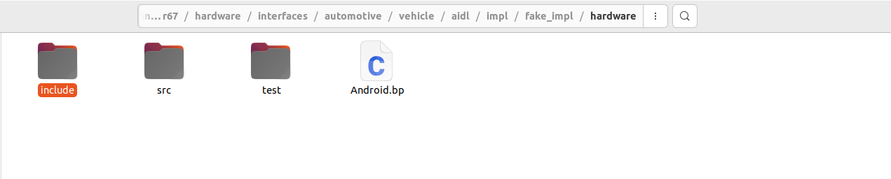

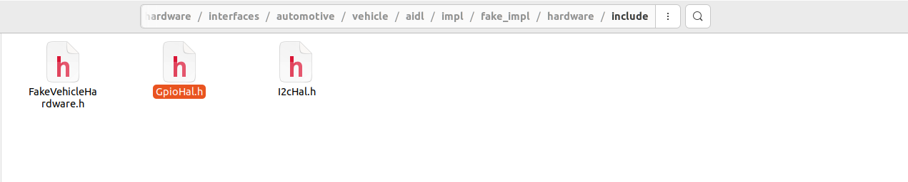


#### 2.1.2. GPIO Source File

```c++
#include "GpioHal.h"

#include <fstream>

#include <string>

bool GpioHal::exportGpio(int pin) {
    std::ofstream exportFile("/sys/class/gpio/export");
    if (!exportFile) return false;
    exportFile << pin;
    return exportFile.good();
}

bool GpioHal::setGpioDirection(int pin, const std::string& direction) {

std::string directionPath = "/sys/class/gpio/gpio" + std::to_string(pin) + "/direction";
    std::ofstream directionFile(directionPath);
    if (!directionFile) return false;
    directionFile << direction;
    return directionFile.good();
}

bool GpioHal::setGpioValue(int pin, bool value) {
std::string valuePath = "/sys/class/gpio/gpio" + std::to_string(pin) + "/value";
    std::ofstream valueFile(valuePath);
    if (!valueFile) return false;
    valueFile << (value ? "1" : "0");
    return valueFile.good();
}

bool GpioHal::getGpioValue(int pin, bool &value) {
std::string valuePath = "/sys/class/gpio/gpio" + std::to_string(pin) + "/value";
    std::ifstream valueFile(valuePath);
    if (!valueFile) return false;
    int gpioValue;
    valueFile >> gpioValue;
    value = (gpioValue == 1);
    return valueFile.good();
}
```

Go to the following path and put cpp file for GPIO driver in it

```
/mnt/aosp-build/android-14.0.0_r67/hardware/interfaces/automotive/vehicle/aidl/impl/fake_impl/hardware/src
```

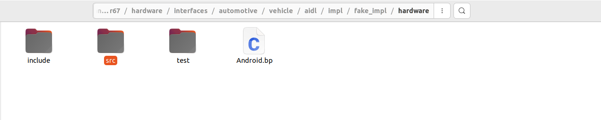

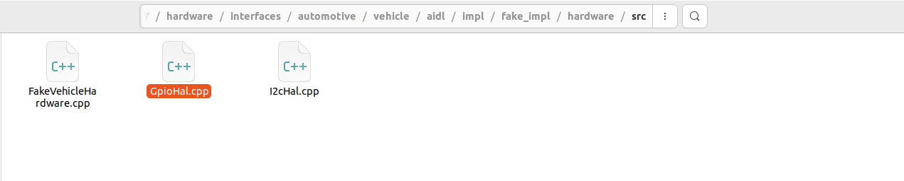


#### 2.2. I2c Driver

#### 2.2.1.  I2C Header File

```c++
#include <iostream>
#include <unistd.h>
#include <fcntl.h>
#include <sys/ioctl.h>
#include <linux/i2c-dev.h>
#include <stdint.h>
#include <stdexcept>

#define ADS1115_ADDRESS 0x48  // Default I2C address for ADS1115
#define ADS1115_CONVERSION_REGISTER 0x00
#define ADS1115_CONFIG_REGISTER 0x01


int open_i2c(const char* device, int address) ;
void configure_ads1115(int file, int channel);
int16_t read_ads1115(int file);
int getTemperatureVal(); // this function can be RPM,Speed...or any analog sensor
```

**Go to the following path and put this header file in it** 

```
/mnt/aosp-build/android-14.0.0_r67/hardware/interfaces/automotive/vehicle/aidl/impl/fake_impl/hardware/include
```


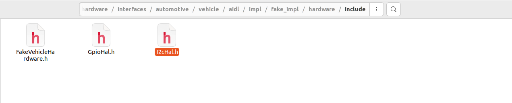


#### 2.2.2.  I2C Source File

```c++
#include "I2cHal.h"

#define ADS1115_ADDRESS 0x48  // Default I2C address for ADS1115
#define ADS1115_CONVERSION_REGISTER 0x00
#define ADS1115_CONFIG_REGISTER 0x01


// Function to open I2C device and set slave address
int open_i2c(const char* device, int address) {
    int file = open(device, O_RDWR);
    if (file < 0) {
        std::cerr << "Failed to open the bus" << std::endl;
        return -1;
    }

    if (ioctl(file, I2C_SLAVE, address) < 0) {
        std::cerr << "Failed to acquire bus access and/or talk to slave" << std::endl;
        close(file);
        return -1;
    }
    return file;
}

// Function to configure the ADS1115 (set input channel)
void configure_ads1115(int file, int channel) {
    uint16_t config = 0xC383;  // Default settings for 16-bit, 128 SPS, ±4.096V range

    // Set MUX to the selected channel
    switch (channel) {
        case 0: config |= 0x4000; break;  // AIN0
        case 1: config |= 0x5000; break;  // AIN1
        case 2: config |= 0x6000; break;  // AIN2
        case 3: config |= 0x7000; break;  // AIN3
        default:break;
            //throw std::invalid_argument("Invalid channel. Choose from 0, 1, 2, 3.");
    }

    uint8_t data[3];
    data[0] = ADS1115_CONFIG_REGISTER;
    data[1] = (config >> 8) & 0xFF;  // High byte
    data[2] = config & 0xFF;         // Low byte
    if (write(file, data, 3) != 3) {
        std::cerr << "Failed to write to the configuration register" << std::endl;
        close(file);
        exit(1);
    }
}

// Function to read the conversion result from the ADS1115
int16_t read_ads1115(int file) {
    uint8_t buf[2];
    buf[0] = ADS1115_CONVERSION_REGISTER;
    if (write(file, buf, 1) != 1) {
        std::cerr << "Failed to set conversion register" << std::endl;
        close(file);
        exit(1);
    }

    if (read(file, buf, 2) != 2) {
        std::cerr << "Failed to read conversion result" << std::endl;
        close(file);
        exit(1);
    }

    // Swap byte order
    int16_t result = (buf[0] << 8) | buf[1];
    return result;
}


int getTemperatureVal()
{
    const char* device = "/dev/i2c-1";  // Use the correct I2C bus (usually /dev/i2c-1 on Raspberry Pi)
    int file = open_i2c(device, ADS1115_ADDRESS);
    if (file < 0) return  1;

    int channel = 1;  // Set the channel to read (you can change this)
    
        // Start a new conversion
        configure_ads1115(file, channel);
        
        // Wait for the conversion to complete (typical delay 8 ms)
        usleep(10000);

        // Read the ADC value
        int16_t value = read_ads1115(file);
  
        sleep(1);
  
    close(file);
    return (int)value;
}


```

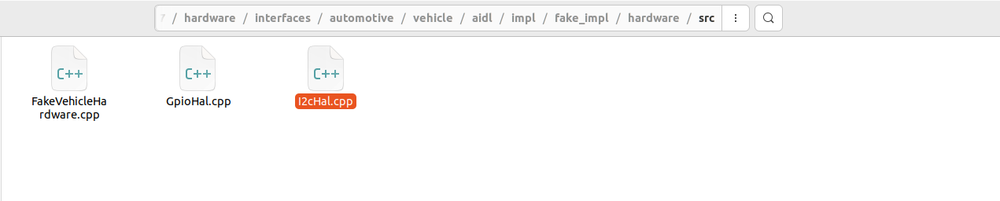


### 3. Extend the VHAL

#### 3.1. Add Properties for LED (GPIO) and AnalogSensor (I2c)

- Go to this path 

  ```
  /mnt/aosp-build/android-14.0.0_r67/hardware/interfaces/automotive/vehicle/aidl/impl/utils/test_vendor_properties/android/hardware/automotive/vehicle
  
  ```

  

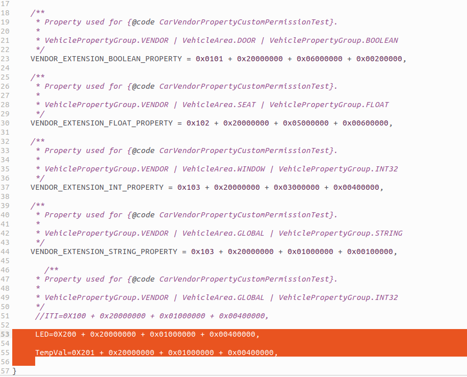


#### 3.2. Edit Test Properties Json 

-  Go to this path 

  ```
  /mnt/aosp-build/android-14.0.0_r67/hardware/interfaces/automotive/vehicle/aidl/impl/default_config/config
  ```

  

#### 3.3. Edit FakeVhalConfigParser

- go to this path :

  ```
  /mnt/aosp-build/android-14.0.0_r67/packages/services/Car/service/src/com/android/car/hal/fakevhal/FakeVhalConfigParser
  ```

  

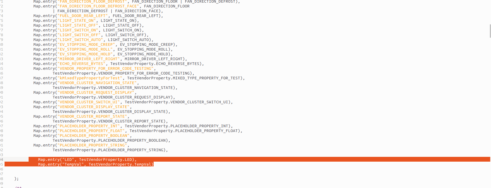


### 3.4. Extend the VHAL Functionality 

- go to this path 

  ```
  /mnt/aosp-build/android-14.0.0_r67/hardware/interfaces/automotive/vehicle/aidl/impl/fake_impl/hardware/src/FakeVehicleHardware
  ```

  

  - go to the function maybeSet function 

    ​	

    ```c++
    VhalResult<void> FakeVehicleHardware::maybeSetSpecialValue(const VehiclePropValue& value,bool* isSpecialValue)
    ```

    - add case statement in the switch case :

      ```c++
      case toInt(TestVendorProperty::LED):{
              *isSpecialValue = true;
              GpioHal gpioHal;
              int gpioPin = 18;
      
              // Export GPIO if not already exported
              gpioHal.exportGpio(gpioPin);
      
              // Set direction to output
              gpioHal.setGpioDirection(gpioPin, "out");
      
              // Get current GPIO state
              bool currentState;
      
              if (value.value.int32Values[0] == 1)
              {
                  gpioHal.setGpioValue(gpioPin, true);
              }
              else
              {
                  gpioHal.setGpioValue(gpioPin, false);
              }
              
              return {};
          }
      ```

      

  - go to the function maybeGet function for (Temperature sensor and LED)

    ```c++
    FakeVehicleHardware::ValueResultType FakeVehicleHardware::maybeGetSpecialValue(const VehiclePropValue& value, bool* isSpecialValue) const
    ```

    		

    - **Add this code inside the switch case**

```c++
case toInt(TestVendorProperty::TempVal):
	{
		*isSpecialValue = true;
        	int temperatureVal = getTemperatureVal();  // Call your function to retrieve the temperature value
        	result = mValuePool->obtainInt32(temperatureVal);
      	  	ALOGD("temp %d",temperatureVal);
       	 	result.value()->prop = propId;
        	result.value()->areaId = 0;
        	result.value()->timestamp = getTemperatureVal();
        	return result;
	}
	
	
	case toInt(TestVendorProperty::LED):
	{
		*isSpecialValue = true;
      	  	GpioHal gpioHal;
        	int gpioPin = 18;

        // Ensure GPIO is set as input to read its state
       		 gpioHal.exportGpio(gpioPin);
       		 gpioHal.setGpioDirection(gpioPin, "in");

        // Read GPIO state
        	bool gpioState = false;
        	gpioHal.getGpioValue(gpioPin, gpioState);

        // Return GPIO state as an integer (1 or 0)
        	result = mValuePool->obtainInt32(gpioState ? 1 : 0);
        	result.value()->prop = propId;
        	result.value()->areaId = 0;
        	result.value()->timestamp = elapsedRealtimeNano();
        	return result;	
	
	}
```


#### To SOLVE SE Linux Issue please edit [vhal-default-service.rc] file

- Go to  : **/mnt/aosp-build/android-14.0.0_r67/hardware/interfaces/automotive/vehicle/aidl/impl/vhal/vhal-default-service.rc**

  and add in **usr** and **group** The **root** usr

  ```
  service vendor.vehicle-hal-default /vendor/bin/hw/android.hardware.automotive.vehicle@V3-default-service
      class early_hal
      user root
      group system inet root
  ```

  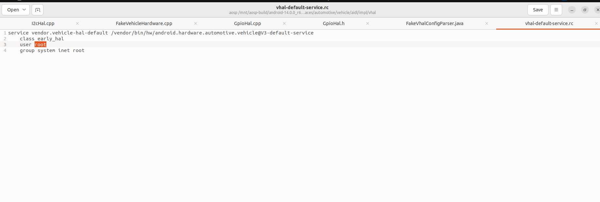

### 4. Build Android Image

- **Go to AOSP Path**

```
cd /mnt/aosp-build/android-14.0.0_r67
```

- Run The following commands

  ```
  source build/envsetup.sh
  ```

  ```
  lunch aosp_rpi4_car-ap2a-userdebug
  ```

  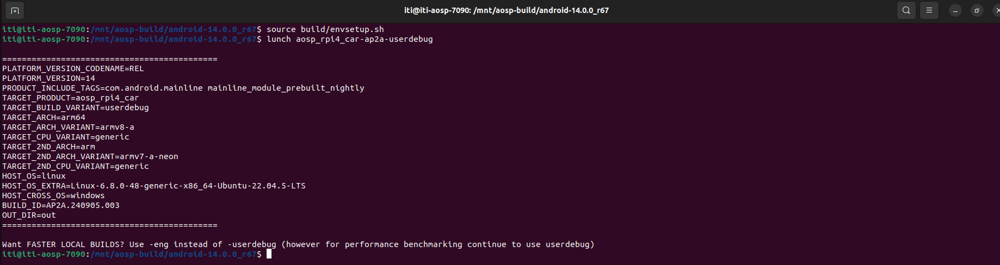

  

  ```
  make bootimage systemimage vendorimage -j$(nproc)
  ```

  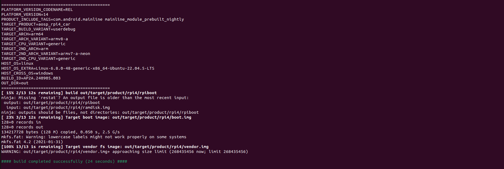


- Merge the 3 images into one image 

  ```
  ./rpi4-mkimg.sh 
  ```

  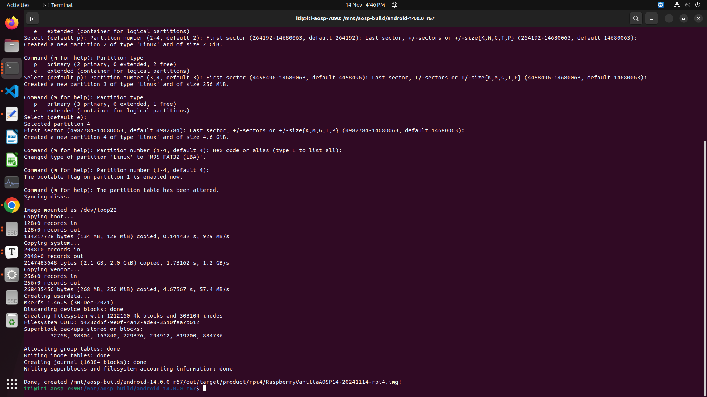

#### 5. Flash the image on SD card and open RPI

- Open **Kitchen Sink** App in Rpi4 
- Select **PROPERTY TEST**
- Select **The Property ID for TempSensor (I2c) then Press GET and change the POT value then press GET again to see the updated POT value**

- Select **The Property ID for LED (GPIO)** Then write **1** and Press **SET ** , The GPIO 18 on RPI 4 Will bright (**HIGH**) and then Write **0** and press **SET** , The Led will be OFF (**LOW**)


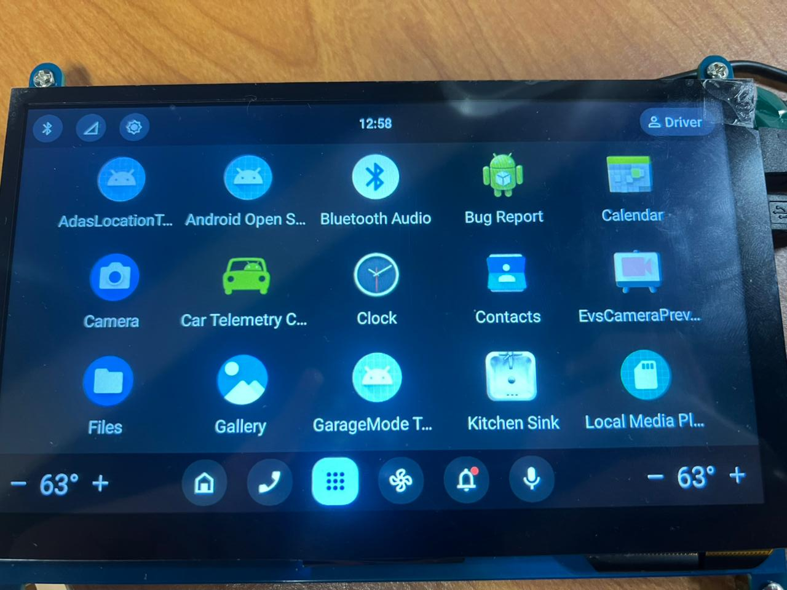

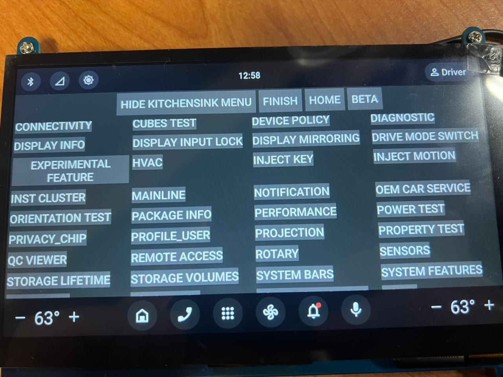

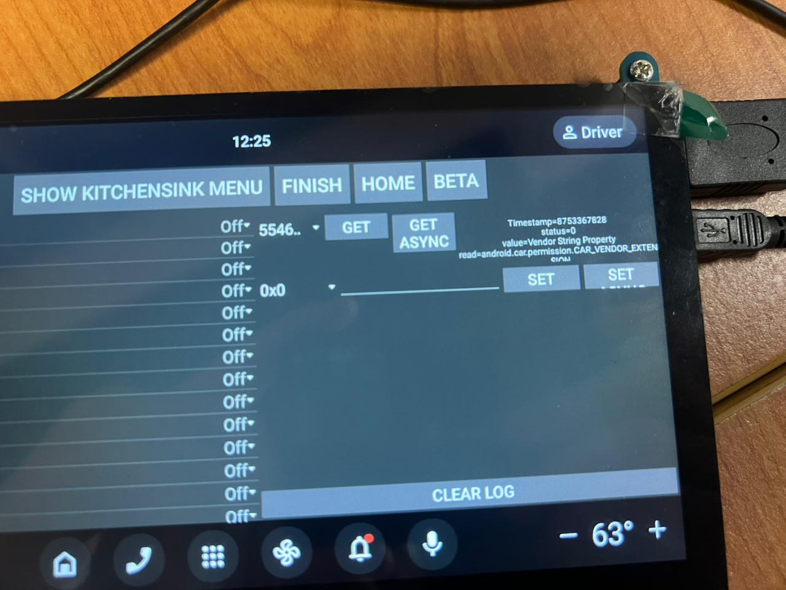
