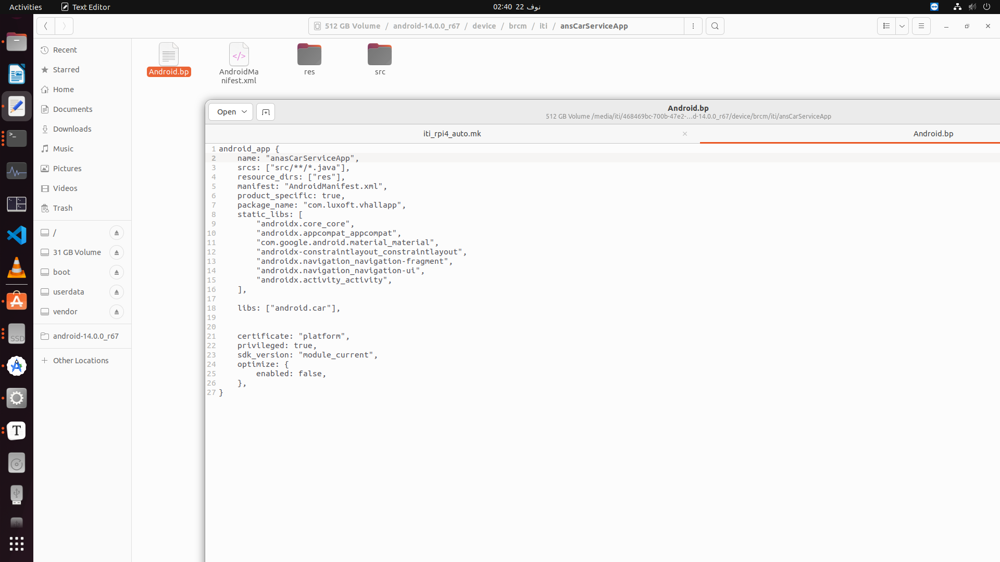

## CAR Service

- **Go to this Path to Create the HAL Drivers**

  ```c++
  /media/iti/468469bc-700b-47e2-ad57-0efb9731e806/android-14.0.0_r67/hardware/interfaces/automotive/vehicle/aidl/impl/fake_impl/hardware/src
  ```

  ### 1. Create GPIO Driver 

  #### 1.1. GPIO Header File 

  ```c++
  #pragma once
  #include<string>
  
  class GPIO_HAL
  { 
          public :
                  bool exportGPIO(int pin);
                  bool setGPIODirection(int pin,const std::string &pinDirection);
                  bool setGPIOValue(int pin, bool value);
                  bool getGPIOValue(int pin, bool *value);
  
  
  };
  ```

  #### 1.2. GPIO Source File 


```c++
#include "GPIO.h"
#include <fstream>
#include <string>

bool GPIO_HAL::exportGPIO(int pin)
{
	std::ofstream exportFile("/sys/class/gpio/export");
	if(!exportFile)
	{
		printf("Faild To Open The file [Export File]");
		return false;
	}

	exportFile <<pin;
	return exportFile.good();

}

bool GPIO_HAL::setGPIODirection(int pin, const std::string &pinDirection)
{
	std::string pinDirectionPath = "/sys/class/gpio/gpio" + std::to_string(pin) + "/direction";
	std::ofstream directionFile(pinDirectionPath);
	if(!directionFile)
		return false;
	directionFile<<pinDirection;
	return directionFile.good();

}


bool GPIO_HAL::setGPIOValue(int pin, bool pinValue)
{
	 std::string pinValuePath="/sys/class/gpio/gpio"+std::to_string(pin)+"/value";
	std::ofstream valueFile(pinValuePath);
        if(!valueFile)
                return false;
        valueFile <<(pinValue?"1":"0");
        return valueFile.good();
}

bool GPIO_HAL::getGPIOValue(int pin,bool *pinValue)
{
	std::string pinValuePath="/sys/class/gpio/gpio"+std::to_string(pin)+"/value";
        std::ifstream valueFile(pinValuePath);
        if(!valueFile)
                return false;

	int gpioValue;
	valueFile>>gpioValue;
	*pinValue=(gpioValue==1);
	return valueFile.good();

}
```


### Explanation of The GPIO Code 

```c++
bool GPIO_HAL::exportGPIO(int pin)
{ 
        std::ofstream exportFile("/sys/class/gpio/export");
        if(!exportFile)
        { 
                printf("Faild To Open The file [Export File]");
                return false;
        }

        exportFile <<pin;
        return exportFile.good();

}

```

>### Purpose of the Function
>
>This function is designed to "export" a specific GPIO pin for use by a user-space application on Linux. Exporting a GPIO pin makes it accessible through the Linux GPIO sysfs interface, located under `/sys/class/gpio`.
>
>#### **Line: `std::ofstream exportFile("/sys/class/gpio/export");`**
>
>- **What it does:**
> This creates an output file stream (`std::ofstream`) object named `exportFile`. It opens the file `/sys/class/gpio/export` for writing.
>- **Purpose of `/sys/class/gpio/export`:**
> In Linux, the `export` file in the GPIO sysfs interface is used to "export" a GPIO pin, making it accessible through sysfs. Writing the GPIO pin number to this file tells the kernel to expose the corresponding GPIO directory under `/sys/class/gpio/gpio<pin>`.
>- **Example:** If you write `22` to `/sys/class/gpio/export`, the kernel will create the directory `/sys/class/gpio/gpio22/`, where you can interact with the GPIO pin (e.g., setting its direction, value).
> - **Potential Error:**
> If the `export` file cannot be opened (e.g., due to missing permissions or incorrect path), this line will fail, and `exportFile` will be in a failed state.
> 
>------
>
> #### **Line: `exportFile << pin;`**
>
>- **What it does:**
> This writes the `pin` number (an integer) to the `exportFile`.
>
>- **How it works:**
> The `<<` operator is used in C++ to write data to a file. In this case, the `pin` number is written as plain text to `/sys/class/gpio/export`.
> 
>- **Purpose:**
> Writing the `pin` number to the `exportFile` tells the Linux kernel to export the specified GPIO pin. For example, if `pin = 17`, this operation effectively executes:
> 
> ```
>
>  ```
>
> 


```c++
bool GPIO_HAL::setGPIODirection(int pin, const std::string &pinDirection) 
{ 
        std::string pinDirectionPath="/sys/class/gpio/gpio"+std::to_string(pin)+"/direction";
        std::ofstream directionFile(pinDirectionPath);
        if(!directionFile)
                return false;
        directionFile<<pinDirection;
        return directionFile.good();

}

```

>### **Purpose of the Function**
>
>This function sets the direction of a specific GPIO pin (input or output) in the Linux GPIO sysfs interface.
>
>- **GPIO Direction:**
>  Each GPIO pin can typically be configured as an input (to read signals) or output (to send signals). This configuration is done by writing `"in"` or `"out"` to the `direction` file associated with the GPIO pin.
>
>------
>
>### **Line-by-Line Explanation**
>
>#### **Line: `std::string pinDirectionPath="/sys/class/gpio/gpio"+std::to_string(pin)+"/direction";`**
>
>- **What it does:**
>  This creates the file path to the `pinDirection` file for the specified GPIO pin.
>
>- **Details:**
>
>  - The directory `/sys/class/gpio/gpio<pin>/` is created when the GPIO pin is successfully exported.
>  - Inside this directory, the `direction` file (`pinDirection`) is used to configure the pin direction (input or output).
>
>- **Example:**
>  If `pin = 22`, the resulting path will be:
>
>  ```
>  
>  ```
>
>


```c++
bool GPIO_HAL::getGPIOValue(int pin, bool *pinValue)
{
        std::string pinValuePath = "/sys/class/gpio/gpio" + std::to_string(pin) + "/value";
        std::ifstream valueFile(pinValuePath);
        if (!valueFile)
                return false;

        int gpioValue;
        valueFile >> gpioValue;
        *pinValue = (gpioValue == 1);
        return valueFile.good();
}
```

>### **Line-by-Line Explanation**
>
>#### **Line: `std::string pinValuePath = "/sys/class/gpio/gpio" + std::to_string(pin) + "/value";`**
>
>- **What it does:**
>  Constructs the file path for the `value` file of the specified GPIO pin.
>
>- Purpose:
>
>  The 
>
>  ```
>  value
>  ```
>
>   file in the GPIO sysfs interface contains the current value of the GPIO pin. It is:
>
>  - `0` for low (logic level 0).
>  - `1` for high (logic level 1).
>
>------
>
>#### **Line: `std::ifstream valueFile(pinValuePath);`**
>
>- **What it does:**
>  Creates an input file stream (`std::ifstream`) to open the `value` file for reading.
>- **Purpose:**
>  This allows reading the current value of the GPIO pin.
>- **Error Handling:**
>  If the file does not exist (e.g., the GPIO pin was not properly exported), or if permissions are insufficient, the stream will fail to open, and `valueFile` will be in a failed state.
>
>------
>
>#### **Line: `if (!valueFile)`**
>
>- **What it does:**
>  Checks if the file stream failed to open.
>- **Purpose:**
>  If the file cannot be opened (e.g., due to missing permissions or an incorrect path), the function returns `false`, signaling failure.
>
>------
>
>#### **Line: `valueFile >> gpioValue;`**
>
>- **What it does:**
>  Reads the integer value from the `value` file into the variable `gpioValue`.
>- **Purpose:**
>  This retrieves the current state of the GPIO pin:
>  - `0` for low (logic level 0).
>  - `1` for high (logic level 1).
>
>------
>
>#### **Line: `\*pinValue = (gpioValue == 1);`**
>
>- **What it does:**
>  Sets the value of `*pinValue` based on whether `gpioValue` is `1` (true) or `0` (false).
>- **Purpose:**
>  Converts the integer read from the file into a `bool` type for use in the program.
>
>------
>
>#### **Line: `return valueFile.good();`**
>
>- **What it does:**
>  Checks whether the file stream is still in a good state after reading.
>- **Purpose:**
>  Ensures that the read operation was successful and no errors occurred during the process.
>
>


### 2. Create I2c Driver

 #### 2.1. I2c Header File

```c++
#pragma once
int getTemperatureValue();
```

#### 2.2. I2c Source File

```c++
#include "I2C.h"
#include <fstream>
#include <string>


#include <iostream>
#include <unistd.h>
#include <fcntl.h>
#include <sys/ioctl.h>
#include <linux/i2c-dev.h>
#include <stdint.h>
#include <stdexcept>

/********** Make sure Your I2C Address*************/
#define ADS1115_ADDRESS 0x49  // Default I2C address for ADS1115 
#define ADS1115_CONVERSION_REGISTER 0x00
#define ADS1115_CONFIG_REGISTER 0x01

// Function to open I2C device and set slave address
int open_i2c(const char* device, int address) {
    int file = open(device, O_RDWR);
    if (file < 0) {
        std::cerr << "Failed to open the bus" << std::endl;
        return -1;
    }

    if (ioctl(file, I2C_SLAVE, address) < 0) {
        std::cerr << "Failed to acquire bus access and/or talk to slave" << std::endl;
        close(file);
        return -1;
    }
    return file;
}

// Function to configure the ADS1115 (set input channel)
void configure_ads1115(int file, int channel) {
    uint16_t config = 0xC383;  // Default settings for 16-bit, 128 SPS, ±4.096V range

    // Set MUX to the selected channel
    switch (channel) {
        case 0: config |= 0x4000; break;  // AIN0
        case 1: config |= 0x5000; break;  // AIN1
        case 2: config |= 0x6000; break;  // AIN2
        case 3: config |= 0x7000; break;  // AIN3
        default:break;
            //throw std::invalid_argument("Invalid channel. Choose from 0, 1, 2, 3.");
    }

    uint8_t data[3];
    data[0] = ADS1115_CONFIG_REGISTER;
    data[1] = (config >> 8) & 0xFF;  // High byte
    data[2] = config & 0xFF;         // Low byte
    if (write(file, data, 3) != 3) {
        std::cerr << "Failed to write to the configuration register" << std::endl;
        close(file);
        exit(1);
    }
}

// Function to read the conversion result from the ADS1115
int16_t read_ads1115(int file) {
    uint8_t buf[2];
    buf[0] = ADS1115_CONVERSION_REGISTER;
    if (write(file, buf, 1) != 1) {
        std::cerr << "Failed to set conversion register" << std::endl;
        close(file);
        exit(1);
    }

    if (read(file, buf, 2) != 2) {
        std::cerr << "Failed to read conversion result" << std::endl;
        close(file);
        exit(1);
    }

    // Swap byte order
    int16_t result = (buf[0] << 8) | buf[1];
    return result;
}

int getTemperatureValue() {
    const char* device = "/dev/i2c-1";  // Use the correct I2C bus (usually /dev/i2c-1 on Raspberry Pi)
    int file = open_i2c(device, ADS1115_ADDRESS);
    if (file < 0) return 1;

    int channel = 1;  // Set the channel to read (you can change this)
    
   // while (true) {
   
    configure_ads1115(file, channel);
  
    // Wait for the conversion to complete (typical delay 8 ms)
    usleep(10000);
    // Read the ADC value
    int value = read_ads1115(file);
    // Print the ADC value to the terminal
    std::cout << "ADC Value for channel " << channel << ": " << value << std::endl;
    // Optional delay before starting the next conversion (e.g., 1 second)
    sleep(1);
//}

    close(file);
    return value;
}
```


## 2. Create properties for GPIO [LED] and I2c [Temperature Value] 

- Go to this path 

  ```
  /media/iti/468469bc-700b-47e2-ad57-0efb9731e806/android-14.0.0_r67/hardware/interfaces/automotive/vehicle/aidl/impl/utils/test_vendor_properties/android/hardware/automotive/vehicle/TestVendorProperty.aidl
  ```

  

- Go to this path to configure your properties in the JSON File

  ```
  /media/iti/468469bc-700b-47e2-ad57-0efb9731e806/android-14.0.0_r67/hardware/interfaces/automotive/vehicle/aidl/impl/default_config/config/TestProperties.json
  ```

  

- Edit The Fake Vehicle HAL (switch case)

- MaybeSet

  ```c++
  case toInt(TestVendorProperty::LED):
      {
      	GPIO_HAL gpio;
      	int pin=17;
      	gpio.exportGPIO(pin);
      	gpio.setGPIODirection(pin,"out");
      	
      	// Get current GPIO state
          bool currentState;
  
          if (value.value.int32Values[0] == 1)
          {
              gpio.setGPIOValue(gpioPin, true);
          }
          else
          {
              gpio.setGPIOValue(gpioPin, false);
          }
      	//gpio.setGPIOValue(pin,1);
      	
      	    return {};
      	
      }
  ```

  

- MaybeGet

  ```c++
   case toInt(TestVendorProperty::LED): {
              GPIO_HAL gpio; 
              int pin=17; 
              bool value;  // Declare a variable to store the GPIO value
              ALOGD("readvalue");
              bool state = gpio.getGPIOValue(pin, &value);
              ALOGD("readvalue + ")     ;   
              result = mValuePool->obtainInt32(value);
              return result;  // Return the status of the GPIO read operation
          }
          
           case toInt(TestVendorProperty::TemperatureAnasValue): {
                *isSpecialValue = true;
              int temperatureValue = getTemperatureValue();  // Call your function to retrieve the RPM value
              result = mValuePool->obtainInt32(temperatureValue);
              ALOGD("temperatureValue %d",temperatureValue);
              result.value()->prop = propId;
              result.value()->areaId = 0;
              //result.value()->timestamp = elapsedRealtimeNano();
              result.value()->timestamp = getTemperatureValue();
              return result;
   
          }
  
  ```

  

-----------------------------------

### Configure the Name and Permissions of the costume properties 

----------------------------------

- Go to the following path to name our properties ID and set the property permissions

```
/media/iti/468469bc-700b-47e2-ad57-0efb9731e806/android-14.0.0_r67/packages/services/Car/car-lib/src/android/car/VehiclePropertyIds.java
```

- I2C  ans GPIO Properties :

  

- Create My properties Permissions, go to this path 

  ```
  /media/iti/468469bc-700b-47e2-ad57-0efb9731e806/android-14.0.0_r67/packages/services/Car/car-lib/src/android/car/Car.java
  ```

  


- Create the Application Layer 

- Create Android Application Package

  ```
  package com.luxoft.vhalapp;
  ```
  
  - Main Activity 
  
  ```java
  package com.luxoft.vhallapp;
  
  import android.car.Car;
  import android.car.hardware.CarPropertyValue;
  import android.car.hardware.property.CarPropertyManager;
  import android.os.Bundle;
  import android.util.Log;
  import android.widget.Button;
  import android.widget.TextView;
  import android.widget.Toast;
  
  import androidx.appcompat.app.AppCompatActivity;
  
  public class MainActivity extends AppCompatActivity {
  
      private CarPropertyManager mCarPropertyManager;
      private Car mCar;
      private CarPropertyManager.CarPropertyEventCallback mPropertyCallback;
      private Button btnGpio;
      private TextView txtGetFuelValue;
      private TextView txtGetTempValue;
  
      @Override
      protected void onCreate(Bundle savedInstanceState) {
          super.onCreate(savedInstanceState);
          setContentView(R.layout.activity_main);
          
          btnGpio = findViewById(R.id.btnGpio);
          txtGetFuelValue = findViewById(R.id.txtGetGPIOValue);
          txtGetTempValue = findViewById(R.id.txtGetRPMValue);
  
          
          mCar = Car.createCar(this);
          mCarPropertyManager = (CarPropertyManager) mCar.getCarManager(CarPropertyManager.class);
  
         
          int fuelTankPropertyId = 557842944;
          int tempPropertyId = 557842945;
          int areaId = 0; 
  
          mPropertyCallback = new CarPropertyManager.CarPropertyEventCallback() {
              @Override
              public void onChangeEvent(CarPropertyValue carPropertyValue) {
                  if (carPropertyValue.getPropertyId() == fuelTankPropertyId) {
                      try {
                          int fuelLevel = (Integer) carPropertyValue.getValue();
                          txtGetFuelValue.setText("Fuel Tank Level: " + fuelLevel + "%");
                          Log.d("MainActivity", "Fuel tank updated to: " + fuelLevel + "%");
                      } catch (Exception e) {
                          Log.e("MainActivity", "Error processing FuelTank property value", e);
                      }
                  }
                  else if (carPropertyValue.getPropertyId() == tempPropertyId) {
                      try {
                          int temp = (Integer) carPropertyValue.getValue();
                          txtGetTempValue.setText("Temp: " + temp + "c");
                          Log.d("MainActivity", "Temp updated to: " + temp + "c");
                      } catch (Exception e) {
                          Log.e("MainActivity", "Error processing Temp property value", e);
                      }
                  }
              }
  
              @Override
              public void onErrorEvent(int propertyId, int zone) {
                  Toast.makeText(MainActivity.this, "Error: Property " + propertyId + " in zone " + zone, Toast.LENGTH_SHORT).show();
              }
          };
  
          mCarPropertyManager.registerCallback(mPropertyCallback, fuelTankPropertyId, CarPropertyManager.SENSOR_RATE_ONCHANGE);
          mCarPropertyManager.registerCallback(mPropertyCallback, tempPropertyId, CarPropertyManager.SENSOR_RATE_ONCHANGE);
  
          btnGpio.setOnClickListener(v -> {
              try {
                  CarPropertyValue<Integer> fuelTankValue = mCarPropertyManager.getProperty(Integer.class, fuelTankPropertyId, areaId);
                  CarPropertyValue<Integer> TempValue = mCarPropertyManager.getProperty(Integer.class, tempPropertyId, areaId);
                  int TempValue2= TempValue.getValue();
                  int currentFuelLevel = fuelTankValue.getValue();
                  
                  if (currentFuelLevel == 1) {
                      mCarPropertyManager.setProperty(Integer.class, fuelTankPropertyId, areaId, 0);
                  } else {
                      mCarPropertyManager.setProperty(Integer.class, fuelTankPropertyId, areaId, 1);
                  }
                  
                  currentFuelLevel = fuelTankValue.getValue();
                  txtGetFuelValue.setText("Fuel Tank Level:::: " + currentFuelLevel + "%");
                  txtGetTempValue.setText("Temp: " + TempValue2 + "c");
  
              } catch (SecurityException e) {
                  Toast.makeText(MainActivity.this, "Permission denied for FuelTank property.", Toast.LENGTH_SHORT).show();
              } catch (Exception e) {
                  Toast.makeText(MainActivity.this, "Error fetching FuelTank value.", Toast.LENGTH_SHORT).show();
                  e.printStackTrace();
              }
          });
      }
  
      @Override
      protected void onDestroy() {
          super.onDestroy();
          if (mCarPropertyManager != null && mPropertyCallback != null) {
              mCarPropertyManager.unregisterCallback(mPropertyCallback);
          }
      }
  }
  ```
  
  - XML File
  
    ```xml
    <?xml version="1.0" encoding="utf-8"?>
    <androidx.constraintlayout.widget.ConstraintLayout xmlns:android="http://schemas.android.com/apk/res/android"
        xmlns:app="http://schemas.android.com/apk/res-auto"
        xmlns:tools="http://schemas.android.com/tools"
        android:id="@+id/main"
        android:layout_width="match_parent"
        android:layout_height="match_parent"
        tools:context=".MainActivity">
    
        <TextView
            android:id="@+id/txtGetGPIOValue"
            android:layout_width="wrap_content"
            android:layout_height="wrap_content"
            android:layout_marginTop="10dp"
            android:text="Hello World!"
            app:layout_constraintBottom_toBottomOf="parent"
            app:layout_constraintEnd_toEndOf="parent"
            app:layout_constraintStart_toStartOf="parent"
            app:layout_constraintTop_toTopOf="parent" />
    
        <TextView
            android:id="@+id/txtGetTempValue"
            android:layout_width="wrap_content"
            android:layout_height="wrap_content"
            android:layout_marginTop="10dp"
            android:text="Hello World!"
            app:layout_constraintBottom_toBottomOf="parent"
            app:layout_constraintEnd_toEndOf="parent"
            app:layout_constraintStart_toStartOf="parent"
            app:layout_constraintTop_toBottomOf="@+id/txtGetGPIOValue"/>
    
        <Button
            android:id="@+id/btnGpio"
            android:layout_width="wrap_content"
            android:layout_height="wrap_content"
            android:layout_marginTop="20dp"
            android:text="Led"
            app:layout_constraintEnd_toEndOf="parent"
            app:layout_constraintHorizontal_bias="0.5"
            app:layout_constraintStart_toStartOf="parent"
            app:layout_constraintTop_toBottomOf="@+id/txtGetTempValue" />
    
    </androidx.constraintlayout.widget.ConstraintLayout>
    ```
    
    - Manifest File 
    
      ```xml
      <?xml version="1.0" encoding="utf-8"?>
      <manifest xmlns:android="http://schemas.android.com/apk/res/android"
          xmlns:tools="http://schemas.android.com/tools"
         package="com.luxoft.vhallapp">
          <uses-permission android:name="android.car.permission.READ_CAR_PROPERTY" />
          <uses-permission android:name="android.car.permission.WRITE_CAR_PROPERTY" />
              <uses-permission android:name="android.car.permission.FuelTank" />
          <uses-permission android:name="android.car.permission.CAR_VENDOR_EXTENSION"/>
          <uses-permission android:name="com.vendor.permission.FUELTANK" />
          <uses-permission android:name="android.car.permission.GPIO"/>
          <uses-permission android:name="android.car.permission.TEMPERATURE"/>
              
              <uses-permission android:name="android.car.hardware.property.VehicleVendorPermission.PERMISSION_GET_CAR_VENDOR_CATEGORY_INFO" />
              <uses-permission android:name="android.car.hardware.property.VehicleVendorPermission.PERMISSION_SET_CAR_VENDOR_CATEGORY_SEAT" />
      
      
      
          <application
              android:allowBackup="true"
              android:dataExtractionRules="@xml/data_extraction_rules"
              android:fullBackupContent="@xml/backup_rules"
              android:icon="@mipmap/ic_launcher"
              android:label="@string/app_name"
              android:roundIcon="@mipmap/ic_launcher_round"
              android:supportsRtl="true"
              android:theme="@style/Theme.VHallApp"
              tools:targetApi="31">
              <activity
                  android:name=".MainActivity"
                  android:exported="true">
                  <intent-filter>
                      <action android:name="android.intent.action.MAIN" />
      
                      <category android:name="android.intent.category.LAUNCHER" />
                  </intent-filter>
              </activity>
          </application>
      
      </manifest>
      ```
      
      - **Android BluePrint File (Android.bp)**
      
        ```java
        android_app {
            name: "vhall",
            srcs: ["src/**/*.java"],
            resource_dirs: ["res"],
            manifest: "AndroidManifest.xml",
            product_specific: true,
            package_name: "com.luxoft.vhallapp",
            static_libs: [
                "androidx.core_core",
                "androidx.appcompat_appcompat",
                "com.google.android.material_material",
                "androidx-constraintlayout_constraintlayout",
                "androidx.navigation_navigation-fragment",
                "androidx.navigation_navigation-ui",
                "androidx.activity_activity",
            ],
        
            libs: ["android.car"],
            
        
            certificate: "platform",
            privileged: true,
            sdk_version: "module_current",
            optimize: {
                enabled: false,
            },
        }
        ```
      
        



- Add the name of your App in rpi4 Make file , go to this path and add your app

  ```
  /media/iti/468469bc-700b-47e2-ad57-0efb9731e806/android-14.0.0_r67/device/brcm/rpi4/aosp_rpi4_car.mk
  ```

  


- Go to AOSP Path and Run 

  ```
  source build/envsetup.sh
  ```

  ```
  lunch aosp_rpi4_car-ap2a-userdebug
  ```

  ```
  make bootimage systemimage vendorimage -j$(nproc)
  ```

  ```
  ./rpi4-mkimg.sh 
  ```

  

then Flash your image