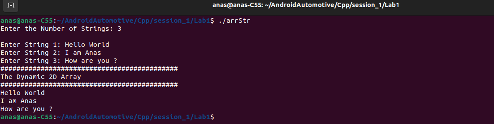

## Dynamic 2D Array [Array of Strings] Implementation


### Step 1: Include Necessary Headers

```c++
#include <iostream>
#include <cstring>
using namespace std;
```

- The program includes the `iostream` header for input and output operations.
- The `cstring` header is included but not used in this program.
- The `using namespace std;` line allows us to use the standard namespace without prefixing `std::`.

### Step 2: Declare Main Function and Variables

```c++
int main() {
    char** ptr = NULL;
    int strNum = 0;
```

- The `main` function is declared.
- `ptr` is a pointer to a pointer to a character (`char**`), used to create a dynamic array of C-style strings.
- `strNum` is an integer to store the number of strings.

### Step 3: Get the Number of Strings

```c++
	cout << "Enter the Number of Strings: ";
    cin >> strNum;
    cout << endl;
```

- The program prompts the user to enter the number of strings.
- The user input is stored in `strNum`.

### Step 4: Allocate Memory for the Array of Strings

```c++
	ptr = new char*[strNum];
    for (int i = 0; i < strNum; i++) {
        ptr[i] = new char[15]; /* Allocate memory for each string */
        cout << "Enter String " << i + 1 << ": ";
        cin >> ws; /* To consume any leading whitespace */
        cin.getline(ptr[i], 15); /* Use getline to read strings with spaces */
    }
```

- Memory is allocated for an array of `char*` (pointers to `char`), with `strNum` elements.
- A loop iterates `strNum` times to allocate memory for each string.
- Each string is allocated 15 characters.
- `cin >> ws;` consumes any leading whitespace to ensure `getline` works correctly.
- `cin.getline(ptr[i], 15);` reads a string of up to 14 characters (plus a null terminator) from the input.

### Step 5: Print the Strings

```c++
    cout << "############################################" << endl << "The Dynamic 2D Array" << endl << "############################################" << endl;
    for (int i = 0; i < strNum; i++) {
        cout << ptr[i] << endl;
    }
```

- The program prints a header to indicate the start of the output.
- A loop iterates `strNum` times to print each string stored in the dynamic array.

### Step 6: Free Allocated Memory

```c++
	for (int i = 0; i < strNum; i++) {
        delete[] ptr[i]; /* Deallocate memory for each string (array of char) */
    }
    delete[] ptr; /* Deallocate memory for the array of pointers */
```

- A loop iterates `strNum` times to deallocate the memory for each string.
- `delete[] ptr[i];` frees the memory allocated for each string.
- `delete[] ptr;` frees the memory allocated for the array of pointers.



