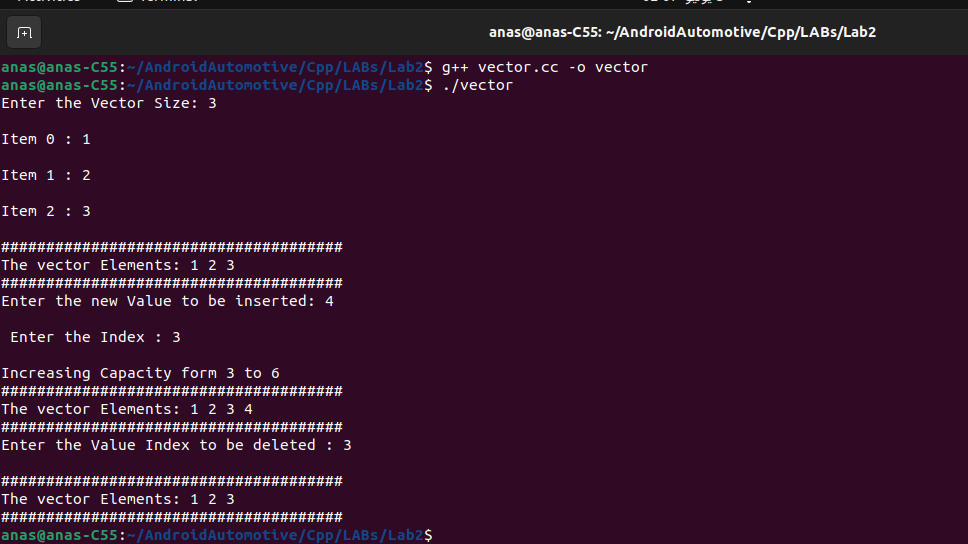

## Vector Implementation


### Step 1: Include Necessary Headers

```c++
#include <iostream>
using namespace std;
```

- The code includes the `iostream` header for input and output operations.
- The `using namespace std;` line allows us to use the standard namespace without prefixing `std::`.

### Step 2: Define the `vector` Struct

```c++
struct vector {
    int* data;
    int size;
    int capacity;
};
```

- The `vector` struct represents a dynamic array.
- `data` is a pointer to the dynamically allocated array.
- `size` represents the number of elements currently in the array.
- `capacity` represents the maximum number of elements that can be held in the current allocation.

### Step 3: Initialize the Vector

```c++
void vectorInit(vector& vec, int size, int capacity) {
    vec.size = size;
    vec.capacity = capacity;
    vec.data = new int[capacity];

    if (!vec.data) {
        cout << "Memory Allocation Failed" << endl;
        exit(1);
    }

    for (int i = 0; i < size; i++) {
        cout << "Item " << i << " : ";    
        cin >> vec.data[i];
        cout << endl;
    }
}
```

- The `vectorInit` function initializes the vector with a given size and capacity.
- It allocates memory for the array and checks if the allocation is successful.
- The function then prompts the user to input elements to fill the array.

### Step 4: Insert an Element into the Vector

```c++
void vectorInsert(vector& vec, int value, int index) {
    if (index < 0 || index > vec.size) {
        cout << "The index is out of range!" << endl;
        return;
    }
    if (vec.size >= vec.capacity) {
        cout << "Increasing Capacity from " << vec.capacity << " to " << vec.capacity * 2 << endl;
        vec.capacity *= 2;
        int* newData = new int[vec.capacity];
        if (!newData) {
            cout << "Memory Allocation failed!" << endl;
            return;
        }
        for (int i = 0; i < vec.size; i++) {
            newData[i] = vec.data[i];
        }
        delete[] vec.data;
        vec.data = newData;
    }

    for (int i = vec.size; i > index; i--) {
        vec.data[i] = vec.data[i - 1];
    }

    vec.data[index] = value;
    vec.size++;
}
```

- The `vectorInsert` function inserts a value at a specified index.
- It checks if the index is valid and if there is enough capacity.
- If the capacity is insufficient, it doubles the capacity and reallocates memory.
- It shifts elements to the right to make space for the new value and then inserts the value.

### Step 5: Remove an Element from the Vector

```c++
void vectorRemove(vector& vec, int index) {
    if (index < 0 || index >= vec.size) {
        cout << "The index is out of range!" << endl;
        return;
    }
    for (int i = index; i < vec.size - 1; i++) {
        vec.data[i] = vec.data[i + 1];
    }
    vec.size--;
}
```

- The `vectorRemove` function removes an element at a specified index.
- It checks if the index is valid.
- It shifts elements to the left to fill the gap left by the removed element and then decrements the size.

### Step 6: Print the Vector

```c++
void vectorPrint(vector& vec) { 
    cout << "######################################" << endl;
    cout << "The vector Elements: ";
    for (int i = 0; i < vec.size; i++) {
        cout << vec.data[i] << " ";
    }
    cout << endl << "######################################" << endl;
}
```

- The `vectorPrint` function prints all elements in the vector.

### Step 7: Main Function

```c++
int main() {
    int size = 0;
    int index = 0;
    int value = 0;
    vector vec;
    cout << "Enter the Vector Size: ";
    cin >> size;
    int capacity = size;
    cout << endl;

    vectorInit(vec, size, capacity);    
    vectorPrint(vec);

    cout << "Enter the new Value to be inserted: ";
    cin >> value;
    cout << endl;
    cout << "Enter the Index: ";
    cin >> index;
    cout << endl;

    vectorInsert(vec, value, index);
    vectorPrint(vec);
    cout << "Enter the Value Index to be deleted: ";
    cin >> index;
    cout << endl;

    vectorRemove(vec, index);
    vectorPrint(vec);

    return 0;
}
```

- The `main` function prompts the user to enter the size of the vector and initializes it.
- It then allows the user to insert a value at a specified index and print the vector.
- Finally, it allows the user to remove a value at a specified index and print the vector again.

### 


