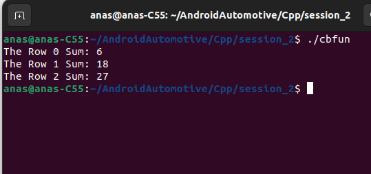

### Includes and Typedefinition

```c++
#include <stdio.h>
#include <stdlib.h>

typedef int* (*cbFun)(int** Arr2D, int colSize, int* rowSizes, int (*fun)(int*, int));
```

- **Includes**: `#include <stdio.h>` and `#include <stdlib.h>` are standard headers in C. They provide functions like `printf()` for output and `malloc()` for dynamic memory allocation.
- **Typedefinition**: `typedef int* (*cbFun)(...)` defines `cbFun` as a type that represents a function pointer. This function pointer can point to a function that takes parameters `(int** Arr2D, int colSize, int* rowSizes, int (*fun)(int*, int))` and returns `int*`.

### Function Definitions

#### `ArrSum`

```c++
int ArrSum(int* arr, int size)
{
    int sum = 0;
    for (int i = 0; i < size; i++)
    {
        sum += arr[i];
    }
    return sum;
}
```

- **ArrSum**: This function calculates the sum of elements in an integer array `arr` of size `size`.

#### `GetrowSum`

```c++
int* GetrowSum(int** Arr2D, int colSize, int* rowSizes, int (*rowSum)(int*, int))
{
    int* arrSum = (int*)malloc(sizeof(int) * colSize);
    for (int i = 0; i < colSize; i++)
    {
        arrSum[i] = rowSum(Arr2D[i], rowSizes[i]);
    } 
    return arrSum;
}
```

- GetrowSum

  : This function computes row sums for a 2D array . It takes:

  - `Arr2D`: A pointer to an array of integer arrays.
  - `colSize`: The number of columns (number of integer arrays in `Arr2D`).
  - `rowSizes`: An array where each element indicates the size of each row.
  - `rowSum`: A function pointer that computes the sum of elements in a single integer array.

### Main Function

```c++
int main()
{
    int arr1[] = {1, 2, 3};
    int arr2[] = {5, 6, 7};
    int arr3[] = {8, 9, 10};
    int* Arr2D[] = {arr1, arr2, arr3};
    int rowSizes[] = {3, 3, 3};
    int colSize = 3;

    cbFun callback = GetrowSum;
    int* rowSum = callback(Arr2D, colSize, rowSizes, ArrSum);

    for (int i = 0; i < colSize; i++)
    {
        printf("The Row %i Sum: %i\n", i, rowSum[i]);
    }

    free(rowSum);

    return 0;
}
```

- **Main Function**: This is where the program execution starts.
  - **Arrays Initialization**: Three integer arrays (`arr1`, `arr2`, `arr3`) are defined.
  - **2D Array Initialization**: `Arr2D` is an array of pointers to these arrays (`arr1`, `arr2`, `arr3`).
  - **Row Sizes**: `rowSizes` indicates that each row in `Arr2D` has 3 elements.
  - **Column Size**: `colSize` is 3, indicating there are three rows in `Arr2D`.
- **Callback and Row Sum Calculation**:
  - `cbFun callback = GetrowSum;`: `callback` is a function pointer of type `cbFun` pointing to `GetrowSum`.
  - `int* rowSum = callback(Arr2D, colSize, rowSizes, ArrSum);`: `GetrowSum` is called with parameters `Arr2D`, `colSize`, `rowSizes`, and `ArrSum`. It computes the sum of each row using `ArrSum` and returns an array `rowSum` containing these sums.
- **Printing Results**:
  - The `for` loop iterates through `rowSum` and prints each row's sum using `printf`.
- **Memory Deallocation**:
  - `free(rowSum);`: Frees the dynamically allocated memory for `rowSum` to prevent memory leaks.

### 
