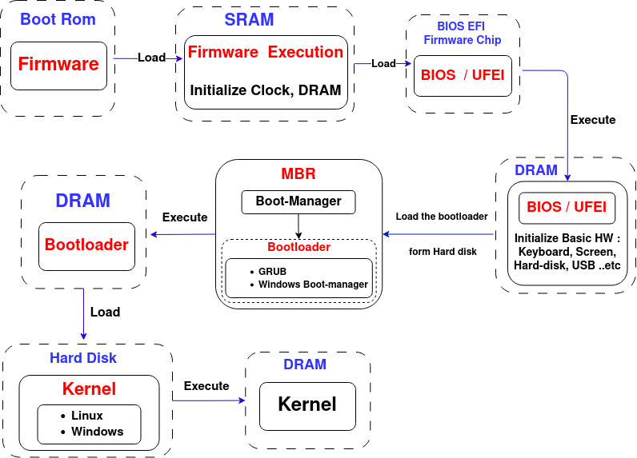
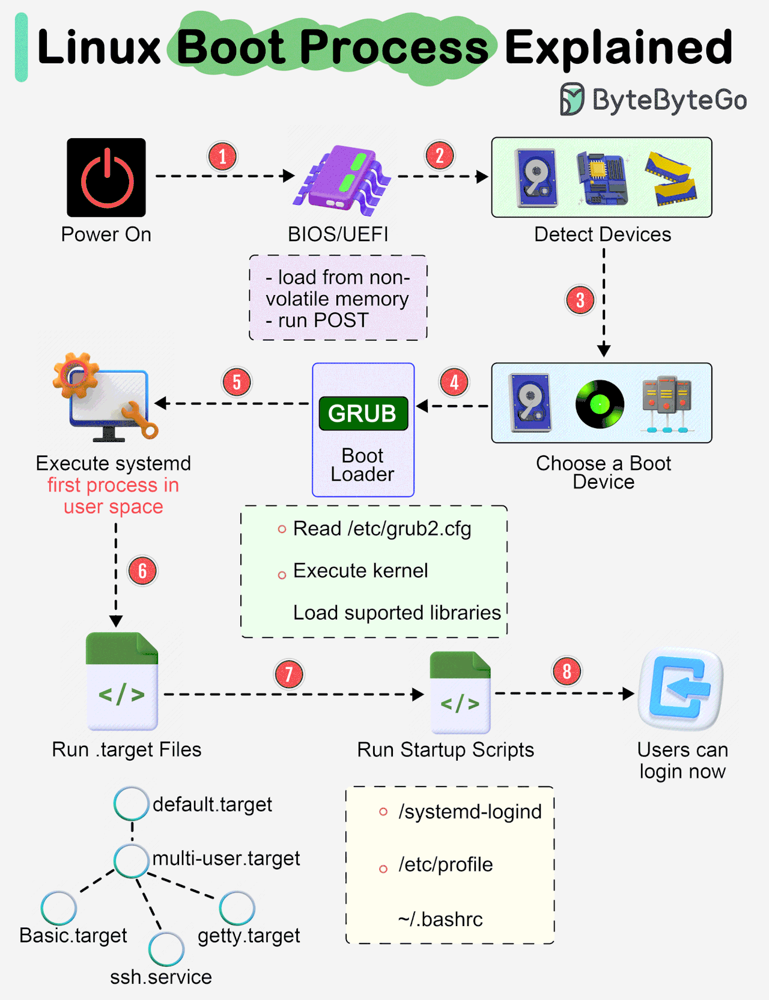
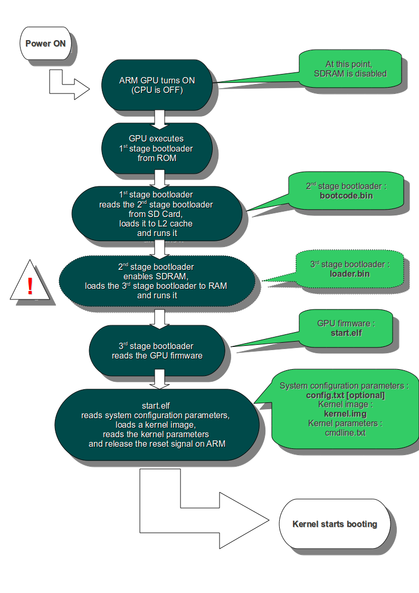

## Table of Contents

- **Bare-metal booting sequence**
- **Computer booting sequence x86**
- **Linux booting sequence**
- **Raspberry Pi booting sequence** 

----------------------------

# Booting Sequence

### 1. Bare-metal (microcontrollers without OS) Booting sequence

#### 1.1. Initialize Stack Pointer

- The first step in the booting sequence is to initialize the stack pointer. This involves setting the initial value of the stack pointer to point to the top of the stack, which is usually specified in the vector table.

#### 1.2. Reset Handler

- The reset handler is the first function executed after the microcontroller is powered on or reset. This function is responsible for performing the initial setup required to bring the system into a known good state.

#### 1.3. Call Startup Code

- The startup code performs several crucial tasks before calling the main function. This includes:

  #### 1.3.1. Vector Table

  - The vector table is an array of pointers to exception handlers, including the reset handler. It is usually located at a fixed memory address and contains the addresses of all the interrupt service routines (ISRs).

  #### 1.3.2. Initialize BSS Segment

  - The BSS segment contains uninitialized global and static variables. The startup code initializes this segment to zero.

  #### 1.3.3. Initialize Data Segment

  - The data segment contains initialized global and static variables. The startup code copies the data from the read-only memory (usually flash) to the RAM.

  #### 1.3.4. Initialize Hardware

  - The startup code performs any necessary hardware initialization, such as configuring clocks, setting up peripheral devices, and initializing memory controllers.

  #### 1.3.5. Call Main

  - After completing all the above steps, the startup code calls the main function, which is the entry point of the user application.

#### 1.4. Main Function

- The main function is where the user application begins executing. This function contains the application-specific code and continues running until the microcontroller is reset or powered off.

## 2. Computer Booting Sequence (X86) 

### 2.1. Power On or Reset

When the computer is powered on or reset, the program counter (PC) starts at a predefined memory address pointing to the firmware application in the Boot ROM.

### 2.2. Firmware Execution

- **Loading Firmware**: The firmware in the Boot ROM is loaded into SRAM.
- **Execution**: The firmware initializes essential hardware components, such as the clock and DRAM.

### 2.3. BIOS/UEFI Initialization

- **Loading BIOS/UEFI**: The firmware loads the BIOS/UEFI from the firmware chip into DRAM and transfers control to it.
- **BIOS/UEFI Execution**: The BIOS/UEFI initializes basic hardware components, including the keyboard, screen, hard disk, USB devices, etc.

### 2.4. Boot Device Selection

- **User Input**: The user can select the storage device to boot from (if prompted).
- **MBR Loading**: The BIOS/UEFI reads the Master Boot Record (MBR) from the selected storage device to detect the bootable partition.

### 2.5. Bootloader Execution

- **Loading Bootloader**: The BIOS/UEFI loads the bootloader (e.g., GRUB, Windows Boot Manager) from the bootable partition into DRAM.
- **Executing Bootloader**: The bootloader is executed and is responsible for loading the operating system kernel.

### 2.6. Kernel Initialization

- **Loading Kernel**: The bootloader loads the kernel from the hard disk into DRAM.
- **Executing Kernel**: The kernel takes control and performs several initialization tasks.

### 2.7. Kernel Tasks

- **Mount Root Filesystem**: The kernel mounts the root filesystem.
- **Initialize Static Modules**: The kernel initializes static kernel modules.
- **Start Init Process**: The kernel starts the init process (the first process run by the kernel).
- **Initialize Dynamic Modules**: The init process initializes dynamic kernel modules.
- **Start Shell**: Finally, the init process starts the shell or another user interface.

### 3. Linux Booting Sequence (X86) 

### 3.1. Power On

- The computer is powered on.
- This starts the flow of electricity through the computer components, initiating the boot process.

### 3.2. BIOS/UEFI Initialization

- The BIOS/UEFI firmware is loaded from non-volatile memory.
- **POST (Power-On Self-Test)**: The BIOS/UEFI performs a POST to check the system hardware components such as RAM, CPU, and storage devices.
- **Detect Devices**: The BIOS/UEFI detects and initializes hardware devices.

### 3.3. Choose a Boot Device

- The BIOS/UEFI determines the boot device based on the configured boot order.
- **Boot Order**: The BIOS/UEFI checks the boot order configured in the firmware settings to decide which device to boot from (e.g., hard drive, CD-ROM, USB).

### 3.4. GRUB Bootloader

- The BIOS/UEFI loads the GRUB bootloader from the selected boot device.
- **Reading Configuration**: GRUB reads its configuration file (e.g., `/etc/grub2.cfg`) to determine which kernel to load and other boot parameters.
- **Execute Kernel**: GRUB loads the Linux kernel into memory.
- **Load Supported Libraries**: GRUB loads necessary libraries and initial RAM disk (initramfs or initrd).

### 3.5. Kernel Initialization

- The Linux kernel is executed.
- **Kernel Decompression**: If compressed, the kernel decompresses itself.
- **Hardware Initialization**: The kernel initializes the CPU, memory management, and other hardware components.
- **Mounting initramfs**: The kernel mounts the initial RAM filesystem which contains temporary files needed for early user-space.
- **Executing init process**: The kernel executes the `init` process (usually `/sbin/init` or `systemd`).

### 3.6. Execute `systemd` (First Process in User Space)

- The `init` process starts `systemd`, the first process in user space.
- **`systemd` Initialization**: `systemd` is a system and service manager for Linux. It initializes the system and manages system services.
- **Reading Unit Files**: `systemd` reads its configuration files called unit files, which define how services are started and managed.

### 3.7. Run Target Files

- `systemd` switches to the appropriate target (similar to runlevels in SysVinit).
- **Default Target**: Typically, `default.target` is used to bring the system to the desired state (e.g., multi-user, graphical).
- **Other Targets**: Includes `basic.target`, `multi-user.target`, and `graphical.target`.

### 3.8. Run Startup Scripts

- `systemd` runs various startup scripts.
- **`/systemd-logind`**: Manages user logins.
- **`/etc/profile`**: System-wide configuration for user environments.
- **`~/.bashrc`**: User-specific configuration for the bash shell.

### 3.9. Users Can Log In

- The system is fully booted and users can log in.
- **Login Prompts**: Users are presented with login prompts (TTY for command-line or graphical login screen).
- **User Sessions**: Users can start their sessions, and user-space applications can be executed.

### In General

The Linux booting sequence involves the following steps:

1. **Power On**: Electrical power starts the boot process.
2. **BIOS/UEFI Initialization**: Firmware initializes hardware and performs POST.
3. **Choose a Boot Device**: BIOS/UEFI selects the boot device.
4. **GRUB Bootloader**: GRUB loads the kernel and initial RAM disk.
5. **Kernel Initialization**: The kernel initializes hardware and mounts initramfs.
6. **Execute `systemd`**: The first user-space process manages system initialization.
7. **Run Target Files**: `systemd` switches to the appropriate target state.
8. **Run Startup Scripts**: `systemd` runs startup scripts to configure user environments.
9. **Users Can Log In**: The system is ready for user interaction.

## 4.1. Raspberry Pi booting sequence

The Raspberry Pi (RPI) has a unique booting sequence due to its reliance on the GPU for initial boot tasks and the specific firmware files on the SD card. Here’s a detailed explanation of the Raspberry Pi boot sequence: Booting Sequence.

#### 4.1.1. Power On

- The Raspberry Pi is powered on.
- This starts the flow of electricity through the Raspberry Pi’s components, initiating the boot process.

#### 4.1.2. Boot ROM (Firmware)

- The Boot ROM is executed from the GPU.
- **Initial Steps**: The BootROM is a read-only memory located on the GPU. When power is applied, the GPU executes the BootROM code.
- **Fetching and Executing in RAM**: The BootROM initializes the stack pointer and performs a reset handler.
- **Hardware Initialization**: Basic hardware initialization is done, including setting up DRAM and checking the SD card for the presence of the required boot files.

#### 4.1.3. bootcode.bin

- The BootROM loads `bootcode.bin` from the SD card into RAM.
- **Closed Source**: `bootcode.bin` is a closed-source firmware file that functions similarly to a BIOS but is specific to the Raspberry Pi.
- **Initialization**: `bootcode.bin` further initializes the hardware, such as the system clock.

#### 4.1.4. start.elf

- `bootcode.bin` loads `start.elf` from the SD card.
- **GPU Firmware**: `start.elf` is the main GPU firmware and bootloader for the Raspberry Pi.
- **CPU Initialization**: `start.elf` initializes the CPU and sets up the system for kernel loading.

#### 4.1.5. config.txt

- `start.elf` reads the `config.txt` file.
- **Configuration Settings**: `config.txt` contains configuration settings for the Raspberry Pi, such as overclocking parameters and display settings.
- **Kernel Selection**: `config.txt` specifies which kernel file to load, typically `kernel.img` or `kernel7.img` for ARMv7 and ARMv8 architecture, respectively.

#### 4.1.6. Kernel Loading

- `start.elf` loads the kernel (e.g., `zImage`) into RAM.
- **Kernel Execution**: The kernel image (`zImage`) is loaded into RAM and executed.
- **System Initialization**: The Linux kernel initializes the remaining hardware, mounts the root filesystem, and starts the `init` process or `systemd`.

#### 4.1.7. Linux Kernel Initialization

- The Linux kernel starts executing.
- **Hardware Initialization**: The kernel initializes various hardware components and configurations.
- **Mounting Root Filesystem**: The kernel mounts the root filesystem, which contains the essential user-space utilities and configurations.
- **Executing init/systemd**: The kernel starts the `init` process or `systemd` to manage the user-space initialization and system services.

### Summary of Raspberry Pi Boot Sequence

1. **Power On**: Starts the boot process with power application.
2. **BootROM (Firmware)**: Executes from the GPU, initializes basic hardware, and checks the SD card.
3. **bootcode.bin**: Loaded from the SD card, initializes further hardware components.
4. **start.elf**: Main GPU firmware and bootloader, initializes the CPU and reads `config.txt`.
5. **config.txt**: Configuration file specifying kernel and settings.
6. **Kernel Loading**: `start.elf` loads the kernel into RAM.
7. **Linux Kernel Initialization**: Kernel initializes hardware, mounts the root filesystem, and starts the `init` process or `systemd`.

###################################################################################################### will organize soon ######################################

#############################################################################

## Mounting

#### Block storage

- RAM
- HDD
- SSD
- SD

##### File sysem 

- FAT
- EXT4
- NTFS

1. user space
2. Kernel : VFS
3. Hardware (SD card)