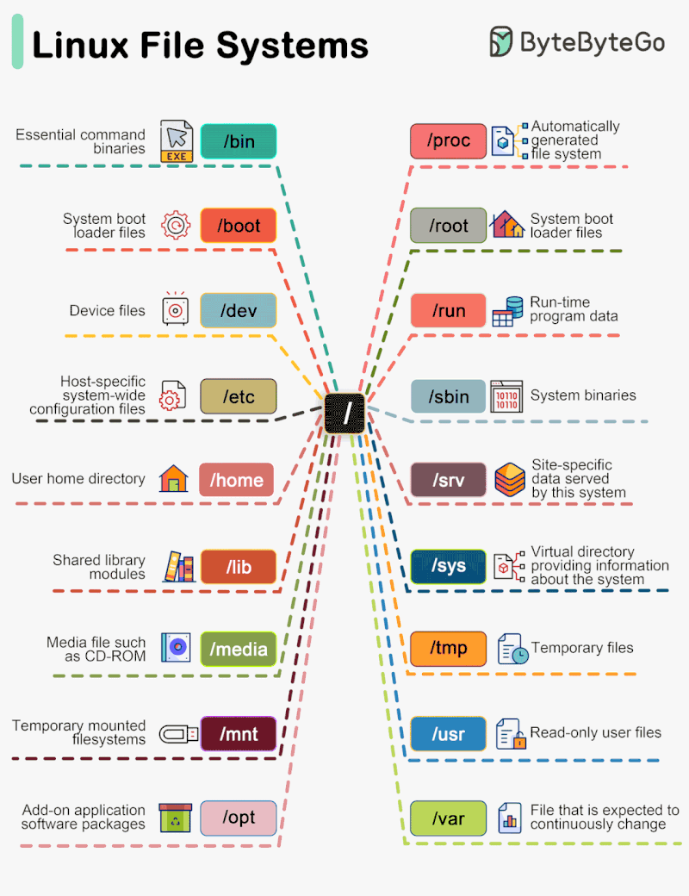
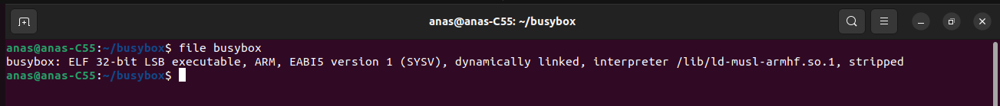

## Table of Contents 
- [**1. Recap : What is DONE till-now ?**](https://github.com/anaskhamees/Embedded_Linux/tree/main/EmbeddedLinuxTasks/BusyBox#1-recap--what-is-done-till-now-)
- [**2. Busy Box**](https://github.com/anaskhamees/Embedded_Linux/tree/main/EmbeddedLinuxTasks/BusyBox#2-busy-box)
  - [2.1. Why We Use BusyBox in Embedded Linux](https://github.com/anaskhamees/Embedded_Linux/tree/main/EmbeddedLinuxTasks/BusyBox#21-why-we-use-busybox-in-embedded-linux)
  - [2.2. Root File System (rootfs)](https://github.com/anaskhamees/Embedded_Linux/tree/main/EmbeddedLinuxTasks/BusyBox#22-root-file-system-rootfs)
       - [2.2.1. Linux File system](https://github.com/anaskhamees/Embedded_Linux/tree/main/EmbeddedLinuxTasks/BusyBox#221-linux-file-system)
       - [2.2.2. Root File System (rootfs)](https://github.com/anaskhamees/Embedded_Linux/tree/main/EmbeddedLinuxTasks/BusyBox#222-root-file-system-rootfs)
  - [2.3. Install BusyBox](https://github.com/anaskhamees/Embedded_Linux/tree/main/EmbeddedLinuxTasks/BusyBox#23-install-busybox)
       - [2.3.1. BusyBox Configurations (Build Statically)](https://github.com/anaskhamees/Embedded_Linux/tree/main/EmbeddedLinuxTasks/BusyBox#231-busybox-configurations-build-statically)
       - [2.3.2. Create Root File System (rootfs) for Embedded Linux Target](https://github.com/anaskhamees/Embedded_Linux/tree/main/EmbeddedLinuxTasks/BusyBox#232--create-root-file-system-rootfs-for-embedded-linux-target)
       - [2.3.3. Attach SD Image to Loop device](https://github.com/anaskhamees/Embedded_Linux/tree/main/EmbeddedLinuxTasks/BusyBox#233-attach-sd-image-to-loop-device)
- [**3. Mount rootfs of SD Card to host file system**](https://github.com/anaskhamees/Embedded_Linux/tree/main/EmbeddedLinuxTasks/BusyBox#3-mount-rootfs-of-sd-card-to-host-file-system)
- [**4. Boot the Kernel**](https://github.com/anaskhamees/Embedded_Linux/tree/main/EmbeddedLinuxTasks/BusyBox#4-boot-the-kernel)
     - [4.1. Run Qemu](https://github.com/anaskhamees/Embedded_Linux/tree/main/EmbeddedLinuxTasks/BusyBox#41-run-qemu)
     - [4.2. Set U-boot Environment variables](https://github.com/anaskhamees/Embedded_Linux/tree/main/EmbeddedLinuxTasks/BusyBox#42-set-u-boot-environment-variables)
     - [4.3. Boot the zImage and DTB file from SD card](https://github.com/anaskhamees/Embedded_Linux/tree/main/EmbeddedLinuxTasks/BusyBox#43-boot-the-zimage-and-dtb-file-from-sd-card)

- [**5. Build BusyBox Dynamically**](https://github.com/anaskhamees/Embedded_Linux/tree/main/EmbeddedLinuxTasks/BusyBox#5-build-busybox-dynamically)
     - [5.1. BusyBox dynamic Configurations](https://github.com/anaskhamees/Embedded_Linux/tree/main/EmbeddedLinuxTasks/BusyBox#51-busybox-dynamic-configurations)
     - [5.2. Build BusyBox Dynamically](https://github.com/anaskhamees/Embedded_Linux/tree/main/EmbeddedLinuxTasks/BusyBox#52-build-busybox-dynamically)
     - [5.3. SYSROOT](https://github.com/anaskhamees/Embedded_Linux/tree/main/EmbeddedLinuxTasks/BusyBox#53-sysroot)
     - [5.4. Create Root File System (rootfs) for Embedded Linux Target](https://github.com/anaskhamees/Embedded_Linux/tree/main/EmbeddedLinuxTasks/BusyBox#54-create-root-file-system-rootfs-for-embedded-linux-target)
     - [5.5. Boot the Kernel](https://github.com/anaskhamees/Embedded_Linux/tree/main/EmbeddedLinuxTasks/BusyBox#55--boot-the-kernel)
- [**6. Common Errors**](https://github.com/anaskhamees/Embedded_Linux/tree/main/EmbeddedLinuxTasks/BusyBox#6-common-errors)
- [**7. References**](https://github.com/anaskhamees/Embedded_Linux/tree/main/EmbeddedLinuxTasks/BusyBox#7-references)
  


-----------------------------------------------------------------------------------------------------------------------------------------------

# Kernel and BusyBox


## 1. Recap : What is DONE till-now ?

- **Installed Cross Complier to compile Applications source files to run on different targets** (boards).

​	We used a software application (tool) called [CrossTool-NG](https://github.com/crosstool-ng/crosstool-ng) to build our Cross compiler called **"x-tools"** .     	***x-tools*** is a cross-Toolchain used to compile applications that will be run on different architectures 	  	such as  (x86, Arm...etc). 

- **Created Virtual SD card  instead of buying physical hardware to act as ROM memory**

   Because of we don't have the Embedded Linux board (raspberry pi , BeagleBone , Vexpress ) , we used a software emulator called **"Qemu"** [Here](https://github.com/anaskhamees/Embedded_Linux/blob/main/EmbeddedLinuxTasks/Virtual_SD_Card/README.md) . The SD card must exist to save the bootloader and the kernel in Non-volatile memory. So, we emulated the SD card by using "qemu" .

- **Compiled the Bootloader source files and generated U-boot Application** 

  - **Tried to booting from Virtual SD card [HERE](https://github.com/anaskhamees/Embedded_Linux/blob/main/EmbeddedLinuxTasks/Bootloader/Booting_SD_card/README.md)** .
  - **Tried to booting from *tftp* Server [HERE](https://github.com/anaskhamees/Embedded_Linux/tree/main/EmbeddedLinuxTasks/Bootloader/Booting_TFTP_Server)**.

- **Compiled the Kernel source files and booting the kernel without rootfs (PANIC) [HERE](https://github.com/anaskhamees/Embedded_Linux/tree/main/EmbeddedLinuxTasks/Kernel)**.

The next step is creating Root File System of target (board) and run our Operating system successfully.


## 2. Busy Box

[BusyBox](https://busybox.net) is a software suit which provides various  Linux utilities  as single executable. The utilities are kept lightweight compare to  their full version. It was specifically created for embedded operating systems with very limited resources . The authors dubbed it **"The Swiss Army knife of Embedded Linux"**, as the single executable replaces basic functions of more than 400 common command such as **ls , mv , ln , mkdir , more , ps , gzip , bzip2 , tar , and grep**  and more. 

>**software suite** (also known as an application suite) is a collection of application software of related functionality, sharing a similar user interface.


### 2.1. Why We Use BusyBox in Embedded Linux

The root file system of the target machine requires essential Linux commands and libraries to support various  applications. These commands are essentially binaries (applications) have corresponding source files. To execute these commands on the target machine (e.g., Vexpress, BeagleBone), it is  necessary to compile these source files using a Cross Compiler supports  ARM architecture. This compilation process generates the  executables of the commands, including commonly used utilities like `ls`, `touch`, `ar`, `gcc`, `rm`, `echo`, and more.

.svg)

Instead of Compiling all Commands and binaries source files manually, **BusyBox** is here to do that automatically. It creates Root file system commands and binaries (such as "init") for Embedded Linux Boards. We can select the needed rootfs commands and the type of linking **Statically** (Merged with Kernel) and **Dynamically** (loaded after Kernel run) . More Details [HERE](https://github.com/anaskhamees/Embedded_Linux/blob/main/EmbeddedLinuxTasks/Static_Dynamic_Lib/README.md#3-the-difference-between-dynamic-and-static-linking) about Static and Dynamic Linking.


### 2.2. Root File System (rootfs)

#### 2.2.1. Linux File system 

the Linux file system is a hierarchical structure that organizes and  manages files and directories on a Linux-based operating system. It  defines how files are named, stored, and retrieved from storage devices. The file system is integral to various operations, such as opening,  copying, editing, and deleting files, as well as accessing data over the Internet. It provides a unified and organized approach to managing data and resources on the system. For more info read those articles [FileSystem](https://www.freecodecamp.org/news/file-systems-architecture-explained/) , [LinuxFS](https://www.baeldung.com/linux/rootfs).



#### 2.2.2. Root File System (rootfs)

The root file system in Linux serves as the top-level directory  hierarchy and is fundamental for the operating system's basic functions. It includes critical files necessary for booting the system and  supports various mount points where additional filesystems can be  mounted. This hierarchical structure forms the foundation for organizing and accessing files and directories on the Linux operating system. Read more Info [HERE](https://www.baeldung.com/linux/rootfs) .

| Root directory | Description                                                  |
| -------------- | ------------------------------------------------------------ |
| */etc*         | Contains system local configuration files and scripts. Configuration files for various software applications and system settings are stored  here. |
| */bin*         | Symbolic link to  `/usr/bin` directory. contains user commands binaries. |
| */sbin*        | Contains system binaries (commands) used for system boot, administration and maintenance tasks such as  mount the `/usr` file system. |
| */dev*         | Contains device files that represent hardware/emulated devices and peripheral  components. Devices such as hard drives, terminals, SD cards and printers .... |
| */usr*         | Contains user-related programs, libraries, and ASCII documentation. |
| */home*        | Home directories for user accounts are located here. Each user typically has a subdirectory with their username under `/home`. |
| */temp*        | **contains files that are temporary**. Many of these files  are created by currently running processes on our system that store  their temporary data under this directory. Therefore, a clearing out of  this directory may happen at booting or at system shutdown. |
| */boot*        | Contains the bootloader and kernel executable and configuration files required to boot a Linux OS. |
| */lib*         | Contains shared libraries needed by programs at runtime. `/lib` is used for 32-bit libraries, and `/lib64` (or `/lib/x86_64-linux-gnu`) is used for 64-bit libraries on some systems. |
| */opt*         | **contains optional software packages,  those that are not part of the system such as, third-party software that we install as add-ons. |
| */root*        | The `/root` directory is the **home directory of the root user** of the system. |
| /*srv*         | Contains, service data such as (TFTP, HTTP,SSH....), if we’re using an HTTP server to serve a website, then we may store files related to our website inside this directory. |
| */proc*        | virtual file system created when the system boots and is dissolved at the time of system shutdown. It contains useful information about the processes that are currently running,   also provides a communication medium between kernel space and user space. |
| */mnt*         | is a mount point **where we can [mount](https://man7.org/linux/man-pages/man2/mount.2.html) a temporary filesystem that resides on a storage device** like a hard-disk drive, USB stick, or CD-ROM. Unlike */media*, where the system mounts removable media automatically, under */mnt* we need to [mount manually](https://www.baeldung.com/linux/mount-unmount-filesystems). This directory can be empty or may have subdirectories to mount individual devices. |
| */media*       | Contains subdirectories that are utilized as mount points when we connect any removable media devices to the system. We can find subdirectories or [symbolic links](https://www.baeldung.com/linux/symbolic-and-hard-links#symbolic-links) to directories representing different removable media devices like SD-card and USB . For example, on inserting a SD card into our Linux system, a directory will **automatically** be created inside the */media* directory. We can use this to access the contents of the SD card inside this directory. |

- **Difference between `/mnt` and `/media` ** 

  1. **`/mnt`:**
     - The `/mnt` directory is a general-purpose location for mounting temporary filesystems or directories. It was traditionally used for mounting temporary filesystems or other devices.
     - System administrators often use `/mnt` when they need to temporarily mount a filesystem for tasks such as system maintenance or recovery.
     - It doesn't have a specific standard structure, and the subdirectories under `/mnt` are usually created based on the administrator's needs.
  2. **`/media`:**
     - The `/media` directory is typically used as a mount point for removable media, such as USB drives, optical discs, and external hard drives.
     - Modern Linux distributions often automatically create subdirectories under `/media` when removable media is inserted or connected, providing a more user-friendly experience.
     - The subdirectories under `/media` are usually named after the volume label or some identifier of the connected media.

  So, while both `/mnt` and `/media` can be used for mounting external storage, `/mnt` is more general-purpose and might require manual setup, while `/media` is often used by the system to automatically manage and organize mounted removable media. The specific usage can vary based on system configuration and administrator preferences.

### 2.3. Install BusyBox 

- **Download Busy Box** 

  ```bash
  git clone https://github.com/mirror/busybox.git
  ```

  


- **Configure your Cross-Compiler and the Target Architecture**

  ```bash
  export CROSS_COMPILE=path/to/compiler/arm-cortexa9_neon-linux-musleabihf-
  export ARCH=arm
  ```

  In my case

  ```bash
  export CROSS_COMPILE=~/x-tools/arm-cortexa9_neon-linux-musleabihf/bin/arm-cortexa9_neon-linux-musleabihf-
  ```

  

  ### 2.3.1. BusyBox Configurations (Build Statically) 

  - This is the MenuConfig Control Keys

    

  I Will Configure busybox to be static build from menuconfig as follow :

  ```bash
  make menuconfig
  ```

  

- [x] **Select The Linking Type in the build process (Static)**

  - Select Settings and then go to *Build option*  and select **build static library**

  .svg)

Then Save and exit 


- Build the commands source files

```bash
make
```


> There is **warning will appear (Ignore it)** `warning: ignoring return value` 
>
> The warnings says that the return values of these functions are not being checked, return value contains  information about the success or failure of the function operation.

At the end of building process the following logs will appear :


>1. **`LINK busybox_unstripped`**:
>
>   This line indicates that the linker is creating an executable named `busybox_unstripped`.
>
>2. **`Static linking against glibc, can't use --gc-sections`**:
>
>   It mentions that static linking is performed against the GNU C Library (glibc). The `--gc-sections` option, which is commonly used with the GNU linker, is not applicable in this case.
>
>3. **`Trying libraries: crypt m resolv rt`**:
>
>   The build system is attempting to link against several libraries, including `crypt`, `m` (math library), `resolv` (resolver library), and `rt` (real-time library).
>
>4. **`Library crypt is not needed, excluding it`**:
>
>   It indicates that the `crypt` library is not needed and will be excluded from the final linking.
>
>5. **`Library m is needed, can't exclude it (yet)`**:
>
>   The `m` library (math library) is needed and cannot be excluded from the final linking.
>
>6. **`Library resolv is needed, can't exclude it (yet)`**:
>
>   The `resolv` library (resolver library) is needed and cannot be excluded from the final linking.
>
>7. **`Library rt is not needed, excluding it`**:
>
>   The `rt` library (real-time library) is not needed and will be excluded from the final linking.
>
>8. **`Final link with: m resolv`**:
>
>   The final linking is performed with the `m` and `resolv` libraries.
>
>9. **`DOC busybox.pod`, `DOC BusyBox.txt`, `DOC busybox.1`, `DOC BusyBox.html`**:
>
>   These lines indicate the generation of various documentation files for BusyBox in different formats.
>
>

- Let's Check BusyBox is compiled Statically or NOT


- Generate the Binaries of the **rootfs** 

  ```bash
  make install
  ```

  >This command will create folder its name **"_install"**  contains the binaries of target root file system


The above message remember you to change the owner of the binary files to be owned by **root** , because you compiled those files in your host machine and now the owner of files is host user (***anas***) , when you copy those files to your target machine (vexpress or BeagleBone...) , there is permission denied error will occur because the target machine user hasn't the permission to execute  `anas` files or write permission if you want to edit the configuration in your target board.

 


- Let's check who is the files owner 

  ```bash
  ls -l _install/
  ```

  

The files owner is Host user (`anas`), it should be `root`  So, we will Solve this point later. 

### 2.3.2.  Create Root File System (rootfs) for Embedded Linux Target

I will Create a Directory called **"rootfs_Static"** in my home directory to prepare my `rootfs `and then copy it to the *ext4* (partition2) in Virtual SD card.

```bash
cd ~
mkdir rootfs_Static
```


- Copy the Content of `~/busybox/_install` to `rootfs_Static`  by unsing "*cp* or *rsync*"

  ```bash
  rsync -av /path/to/source /path/to/destination
  ```

  In my case 

  ```bash
  rsync -av ~/busybox/_install/* ~/rootfs_Static/
  ```

  >the `rsync` command with the specified options is used to copy the contents of the `_install` directory (inside the `busybox` directory) to the `rootfs_Static` directory, preserving various attributes of the files and directories in the process.
  >
  >- `rsync`:  used for file and directory synchronization or copying with synchronization.
  >- `-av`: Options passed to `rsync`:
  >  - `-a` (archive mode): This option is a shortcut that combines several options, including `-r` (recursive), `-l` (preserve symbolic links), `-p` (preserve permissions), `-t` (preserve modification times), and others. It helps in maintaining the properties of the files and directories during the synchronization.
  >  - `-v` (verbose): This option increases the verbosity of the output, providing more details about the files being copied.
  >- `~/busybox/_install/*`:  it's the contents of the `_install` directory inside the `busybox` directory in the user's home directory (`~`). The `*` is a wildcard character that matches any file or directory in the `_install` directory.
  >- `~/rootfs_Static/`: Destination directory where the files and directories will be copied. In this case, it's the `rootfs_Static` directory in the user's home directory (`~`).
  >
  >


- Copy the Dynamic Kernel modules from the last task ([Here](https://github.com/anaskhamees/Embedded_Linux/blob/main/EmbeddedLinuxTasks/05.Kernel/README.md#331-compile-dynamic-kernel-modules)) to `rootfs_Static` .

  >Note:  **Static** in `rootfs_Static` refer to Compiling the BusyBox (Command source files) Statically. It does not any relation with **Dynamic** in `dynamic kernel module` . 

  

  ```bash
  cp -rp ~/rootfs/* ~/rootfs_Static
  ```

  >`cp` command  is used to copy the contents of the `rootfs`  directory (dynamic kernel modules)     to the `rootfs_Static` directory, preserving the ownership, permissions, and timestamps of the original files and directories.
  >
  >- `cp`: used for copying files and directories without synchronization (overwriting).
  >- `-rp`: Options passed to `cp`:
  >  - `-r` (recursive): Copy directories recursively, including their contents.
  >  - `-p` (preserve): Preserve the specified attributes of the original files, such as ownership, permissions, and timestamps.
  >- `~/rootfs/*`: Source directory or files to be copied.The `*` is a wildcard character that matches any file or directory in the `rootfs` directory.
  >- `~/rootfs_Static`: Destination directory where the files and directories will be copied. 

  -1706487567298-5.svg)

- In `root_Static` Directory,  create the other root directories manually 

  ```bash
  mkdir boot dev etc home mnt proc root srv sys
  ```

  

  - Create a startup script called `rcS`  in `etc/init.d/` to do initialization tasks when booting the kernel

    ```bash
    mkdir etc/init.d
    touch etc/init.d/rcS
    ```

      

    - Open `rcS` file and write the following commands then **change its permission to make it executable** :

      ```bash
      vim etc/init.d/rcS
      ```

      ```bash
      #!/bin/sh
      # mount a filesystem of type `proc` to /proc
      mount -t proc nodev /proc
      # mount a filesystem of type `sysfs` to /sys
      mount -t sysfs nodev /sys
      # mount devtmpfs if you forget to configure it in Kernel menuconfig
      #there is two options uncomment one of them  
      #option1: mount -t devtmpfs devtempfs /dev
      #option2: mdev -s 
      ```

      >This script is a simple initialization script that mounts essential filesystems to their respective mount points. These mount operations are crucial during the boot process, especially  when a minimal environment needs to be set up before  transitioning to the main root filesystem. The proc and sysfs  filesystems provide access to kernel and system information, and the  devtmpfs or mdev options to mount device nodes in the `/dev` directory.
      >
      >```bash
      >#!/bin/sh
      >```
      >
      >- This line is known as a shebang. It indicates that the script should be executed using the Bourne shell (`/bin/sh`).
      >
      >  ```bash
      >  # mount a filesystem of type `proc` to /proc
      >  mount -t proc nodev /proc
      >  ```
      >
      >  - This line uses the `mount` command to mount a proc filesystem (`proc`) to the `/proc` directory. The `nodev` option indicates that the filesystem being mounted doesn't have a block device associated with it.
      >
      >  ```bash
      >  # mount a filesystem of type `sysfs` to /sys
      >  mount -t sysfs nodev /sys
      >  ```
      >
      >  - This line uses the `mount` command to mount a sysfs filesystem (`sysfs`) to the `/sys` directory. Again, `nodev` signifies that no block device is associated.
      >
      >  ```
      >  # mount devtmpfs if you forget to configure it in Kernel menuconfig
      >  # there are two options, uncomment one of them
      >  # option1: mount -t devtmpfs devtempfs /dev
      >  # option2: mdev -s
      >  ```
      >
      >  - This section provides two options for handling the `/dev` directory:
      >
      >    - Option 1: If devtmpfs is not configured in the Kernel menuconfig, you can manually mount it using `mount -t devtmpfs devtempfs /dev`.
      >
      >    - Option 2 : Alternatively, if you have a busybox binary with `mdev` support, you can use `mdev -s` to populate the `/dev` directory with device nodes.
      >
      >      **Note** : Don't use those options if you enable **Auto-mount for `devtempfs` configuration in kernel menuconfig.**

    In my case :

    

    ​		

  - Change the Script permission to make it executable

    ```bash
    chmod +x etc/init.d/rcS
    ```

    

- Create a Configuration file called `inittab` in `etc` directory 

  ```bash
  touch etc/inittab
  ```

  >The `inittab` file is a configuration file used by the init process on Linux operating systems to determine the behavior of the system initialization process. The`inittab` file is responsible for run some initialization scripts.
  >
  >The init process is the first process that is executed by the kernel during the boot sequence, and it is responsible for starting and managing other processes on the system.

>Note that if you make `touch /etc/inittab` , **/etc** is the directory under your root (computer), Not under `rootfs_Static ` directory. **Take care to damage your Linux Root files**. 
>
>**Any directory starts with `/` refer to your Linux Root file system**
>
>


- Open the file and write the follow lines on it: 

  ```bash
  # inittab file 
  #-------------------------------------------------------
  #When system startup,will execute "rcS" script
  ::sysinit:/etc/init.d/rcS
  #Start"askfirst" shell on the console (Ask the user firslty to press any key) 
  ttyAMA0::askfirst:-/bin/sh
  #when restarting the init process,will execute "init" 
  ::restart:/sbin/init
  ```

  >These entries are part of the configuration that dictates the behavior of the init process. The inittab file is read and interpreted by the init process to determine what actions to take in initialization.
  >
  >- **Entry** : refers to a line or a rule that defines a  particular action to be taken during the system's boot process. 
  >
  >1. `::sysinit:/etc/init.d/rcS`
  >   - This line specifies that when the system is initializing (referred to as "sysinit"), it should execute the script `/etc/init.d/rcS`. The `::` indicates that no particular terminal or user is associated with this entry ( applies to all terminals and users).
  >2. `ttyAMA0::askfirst:-/bin/sh`
  >   - This line associates the terminal `ttyAMA0` with the "askfirst" action. When the system encounters this terminal, it will prompt the user before starting the `/bin/sh` shell. If the user agrees, the shell is started. The `-` before the shell path indicates that the shell should replace the specified terminal in case it exits.
  >3. `::restart:/sbin/init`
  >   - This line indicates what should happen when the init process is restarted. It specifies that the `/sbin/init` process should be started. This is a common practice to ensure that if the init process is somehow terminated or restarted, it will bring the system back to the initial state.

```bash
vim etc/inittab
```


- Check Who is the owner of `rootfs_Static` files that is will be the rootfs of target.

  ```
  ls -lh ~/rootfs_Static
  ```

  

This Files owner should be `Root` to enable the Embedded Linux board to write /execute the commands.

```bash
chown -R root:root /path/to/directory
```

 In my case 

```bash
sudo chown -R root:root ~/rootfs_Static
```

.svg)


### 2.3.3. Attach SD Image to Loop device 

Now we should copy the all the contents under `~/rootfs_Static` to the **ext4** partition (p2) in SD card

- **Attach the Virtual SD card to loop device (if you forget Remember [HERE](https://github.com/anaskhamees/Embedded_Linux/tree/main/EmbeddedLinuxTasks/Virtual_SD_Card))**

Go to SD image location and run the follow commands :

```bash
sudo losetup -f --show --partscan sd.img
```


.svg)


## 3. Mount `rootfs` of SD Card to host file system

we want to mount the *ext4* (rootfs) partition of virtual SD card to our local file system to copy the Root file system of target under `~/rootfs_Static` to partition2 of SD card (ext4).

- I created a directory under `/media/anas/` and named it "rootfs"

```bash
sudo mkdir /media/anas/rootfs
```


- Mount the Partition2 of SD card

```bash
sudo mount -o rw /dev/loop18p2 /media/anas/rootfs
```

>- `mount`: The command used to mount filesystems.
>- `-o rw`: This option specifies that the filesystem should be mounted with read-write permissions. It stands for "read-write."
>- `/dev/loop18p2`: This is the block device file representing the second partition (`p2`) on the loopback device `loop18`. 
>- `/media/anas/rootfs`: This is the mount point, the directory where the contents of the specified filesystem will be made accessible.
>
>So, Mount the filesystem from the specified block device as read-write on the specified directory. After this command, you should be able to read/write with the contents of the filesystem under `/media/anas/rootfs`.

.svg)

- **Copy the Contents of `~/rootfs_Static` to `/media/anas/rootfs`**  

  .svg)

- In case of Empty SD card you can use `cp` command But, if the SD card Not empty us `rsync` command.

```bash
cp -rp ~/rootfs_Static/* /media/anas/rootfs
```

>The `cp` command is used to copy files and directories, and the options used in this case are:
>
>- `-r`: Recursively copy directories and their contents.
>- `-p`: Preserve the ownership, permissions, and timestamps of the original files.
>
>- `~/rootfs_Static/*`: This is the source directory from which files and directories are being copied. The `*` is a wildcard character that matches all files and directories in the specified directory (`~/rootfs_Static`).
>- `/media/anas/rootfs`: This is the destination directory where the files and directories will be copied.
>
>Putting it all together, the command is copying all the contents (recursively and preserving attributes) from the `~/rootfs_Static` directory to the `/media/anas/rootfs` directory. 


- Don't forget to copy the **zImage** (our kernel image) and vexpress DTB file to the **boot** partition in SD card.

  - I created a directory called `boot` under `/media/anas` 

    

  - Let's mount the `boot` partition (p1) of SD card 

    ```bash
    sudo mount -o rw /dev/loop18p1 /media/anas/boot
    ```

    .svg)

  >**Error** may be appear when you open the SD partition  **"structure needs cleaning"** [SOLVED]
  > 

  >```bash
  >sudo fsck /dev/loop<device number><partition number>
  >```
  >fsck stands for File System ChecK, and it is a command-line utility used to check and repair file systems on Linux operating   >systems. It is commonly used to ensure the integrity of file systems and fix any inconsistencies that may have occurred due    >to unexpected shutdowns,hardware failures, or other issues.
  
  >
  > **Ignore This part If the ERROR DOES NOT OCCURED**


  - **Copy the Kernel image (zImage)  to `boot` partition of SD card**

    ```
    sudo cp  path/linux/arch/arm/boot/zImage /media/anas/boot/
    ```

    In my case

    ```bash
    sudo cp  ~/linux/arch/arm/boot/zImage /media/anas/boot/
    ```

    .svg)

  - **Copy Vexpress DTB file to `boot` partition in SD card**

    ```bash
    sudo cp path/linux/arch/arm/boot/dts/arm/*-ca9.dtb /media/anas/boot
    ```

     In my case

    ```bash
    sudo cp ~/linux/arch/arm/boot/dts/arm/*-ca9.dtb /media/anas/boot
    ```

    


## 4. Boot the Kernel 

### 4.1. Run Qemu

Go to U-boot directory and run this command

```bash
qemu-system-arm -M vexpress-a9 -m 128M -nographic -kernel path/u-boot -sd path/sd.img
```

In my case

```bash
qemu-system-arm -M vexpress-a9 -m 128M -nographic -kernel u-boot -sd sd.img
```


### 4.2. Set U-boot Environment variables 

is a variable that holds the command line arguments passed to the Linux kernel during the boot process. The `bootargs` variable is typically used to specify various parameters :

- **Command Line Parameters:** The `bootargs` variable contains a string that represents the command line parameters passed to the Linux kernel. These parameters can include options like root filesystem, console settings, kernel parameters, etc.
- **Kernel Initialization:** When U-Boot loads the Linux kernel, it passes the contents of the `bootargs` variable to the kernel. The Linux kernel then uses these arguments during its initialization process.
- **Customization:** Users can customize the `bootargs` variable based on the requirements of their specific embedded board. For example, setting the root filesystem location, specifying console settings, enabling or disabling certain kernel features, etc.

```bash
setenv bootargs 'console=ttyAMA0 root=/dev/mmcblk0p2 rootfstype=ext4 rw rootwait init=/sbin/init' 
```

>- **`setenv`:** This U-Boot command is used to set the value of an environment variable.
>- **`bootargs`:** It is used to store command line arguments that will be passed to the Linux kernel during boot.
>- **`'console=ttyAMA0 root=/dev/mmcblk0p2 rootfstype=ext4 rw rootwait init=/sbin/init'`:** This is the value assigned to the `bootargs` variable. It represents the command line arguments that will be passed to the Linux kernel during boot. Let's break down the components of these arguments:
>  - **`console=ttyAMA0`:** Specifies the console device. It's set to the serial port (`ttyAMA0`).
>  - **`root=/dev/mmcblk0p2`:** Specifies the root filesystem's block device. It indicates that the root filesystem is located on the SD card partition 2 (`/dev/mmcblk0p2`).
>  - **`rootfstype=ext4`:** Specifies the filesystem type of the root filesystem, it's set to ext4.
>  - **`rw`:** Indicates that the root filesystem should be mounted as read-write.
>  - **`rootwait`:** Causes the kernel to wait for the root device to become available before proceeding with the boot process.
>  - **`init=/sbin/init`:** Specifies the path to the init process, which is the first process started by the Linux kernel.


- Run this command to know Vexpress RAM addresses 

  ```
  bd
  ```

  

- I created variables to save the addresses of zImage and DTB file in the Vexpress RAM

  ```bash
  setenv Zimag_RAM_Add 0x60000000
  ```

  ```
  setenv dtb_hardware_Add 0x65000000
  ```

  

### 4.3. Boot the zImage and DTB file from SD card

- Load the zImage from SD card (fat partition) to Target (Vexpress) RAM

  ```
  fatload mmc 0:1 $Zimag_RAM_Add zImage
  ```

  

  - Let's Check The Ram Content in `Zimag_RAM_Add` 

    ```
    md $Zimag_RAM_Add
    ```

    

- Load Vexpress DTB file from SD card (fat partition) to Target (Vexpress) RAM

  ```
  fatload mmc 0:1 $dtb_hardware_Add vexpress-v2p-ca9.dtb
  ```

  

  - Let's Check The Ram Content in `dtb_hardware_Add` 

    ```
    md $dtb_hardware_Add
    ```

    

- Booting the Kernel and DTB file 

  ```
  bootz $Zimag_RAM_Add - $dtb_hardware_Add
  ```

  >Note That : **PANIC** Not appear and It is Booting Successfully. 


- The Kernel Will Ask You Which Shell (Terminal) you will use (because we configure it in **inittab**)

.svg)


- Press **ENTER**  To continue 


- To see my Kernel Local Version run this command

  ```bash
  uname -r
  ```

  

**Congratulations You are run your own kernel Successfully**.

- Let's Navigate our system (for example let's see the `/dev` directory)

  

>When the kernel boots, it initializes various device drivers and creates corresponding device files in the `/dev` directory to allow user-space applications to communicate with those  devices. These devices can include physical hardware devices (like  disks, terminals, etc.) 
>
>


## 5. Build BusyBox Dynamically

By default Busybox compiled dynamically in case of **disable the "Build BusyBox as a static binary" option** in BusyBox Menuconfig.


### 5.1. BusyBox dynamic Configurations

- Set Cross Compiler and Architecture
   ```bash
  export CROSS_COMPILE=~/x-tools/arm-cortexa9_neon-linux-musleabihf/bin/arm-cortexa9_neon-linux-musleabihf-
  ```
   ```bash
  export ARCH=arm
   ```
- Go to BusyBox directory and run this command then Select **Settings**

```bash
make menuconfig
```

 

- Go to build option and Disable those options by Press **SPACE** , Then Save and exit.

.svg)


### 5.2. Build BusyBox Dynamically

```bash
make
```


- Ensure that The building is Done Dynamically 




- Generate the Binaries of the **rootfs** (dynamically Based) 

  ```bash
  make install
  ```

  >This command will create folder its name **"_install"**  contains the binaries of target root file system


**Building Dynamic BusyBox:** When you build BusyBox with dynamic linking, the resulting BusyBox executable will have depend on certain shared libraries. When you execute a command with BusyBox, the system loader dynamically links the BusyBox executable with the required shared libraries. This happens at runtime. The system loader (`ld.so` ) is responsible for locating and loading the necessary shared libraries. It resolves symbols and sets up the runtime environment for the executables (commands, Binaries).

### 5.3. SYSROOT

The Shared objects(`.so`) which the BusyBox depends on is located under `sysroot` directory in `x-tools` cross compiler directory.


### 5.4. Create Root File System (rootfs) for Embedded Linux Target

```bash
cd ~
mkdir rootfs_Dynamic
```

.svg)

- Copy All the Contents of `busybox/_install` which is created above 

  ```bash
  cp -rp ~/busybox/_install/* ~/rootfs_Dynamic/
  ```

  

- Create The rest of `rootfs` directories

  ```bash
  cd rootfs_Dynamic
  mkdir boot dev etc home mnt proc root srv sys
  ```

  

- Ensure that the BusyBox executable file linked Dynamically 

  ```bash
  file ~/rootfs_Dynamic/bin/busybox
  ```

  .svg)

- Go to `sysroot` directory in the `x-tools` directory

  ```bash
  cd ~/x-tools/arm-cortexa9_neon-linux-musleabihf/arm-cortexa9_neon-linux-musleabihf/sysroot
  ```

  

  
  
  - Copy the `lib` directory to `rootfs_Dynamic`
  
    ```bash
    cp -rp ./lib/ ~/rootfs_Dynamic/
    ```
  
    
  
    
  
  - Copy the `sysroot/usr/lib` and `sysroot/usr/includes` to the `rootfs_Dynamic/usr`
  
  ```bash
  cp -rp ./usr/lib/ ~/rootfs_Dynamic/usr/
  cp -rp ./usr/include/ ~/rootfs_Dynamic/usr/
  ```


.svg)

 - Create a startup script called `rcS`  in `etc/init.d/` to do initialization tasks when booting the kernel

   ```bash
   cd ~/rootfs_Dynamic
   mkdir etc/init.d
   touch etc/init.d/rcS
   ```

   ```bash
   vim etc/init.d/rcS
   ```

   ```bash
   #!/bin/sh
   # mount a filesystem of type `proc` to /proc
   mount -t proc nodev /proc
   # mount a filesystem of type `sysfs` to /sys
   mount -t sysfs nodev /sys
   # mount devtmpfs if you forget to configure it in Kernel menuconfig
   #there is two options uncomment one of them  
   #option1: mount -t devtmpfs devtempfs /dev
   #option2: mdev -s 
   ```

   - Change the Script permission to make it executable

     ```bash
     chmod +x etc/init.d/rcS
     ```

     

     

 - Create the `inittab` configuration file in `etc` directory .

   ```bash
   cd ~/rootfs_Dynamic/etc
   touch inittab
   ```

   ```bash
   # inittab file 
   #-------------------------------------------------------
   #When system startup,will execute "rcS" script
   ::sysinit:/etc/init.d/rcS
   #Start"askfirst" shell on the console (Ask the user firslty to press any key) 
   ttyAMA0::askfirst:-/bin/sh
   #when restarting the init process,will execute "init" 
   ::restart:/sbin/init 
   ```

 - change the files owner to `root`

  ```bash
  sudo chown -R root:root ~/rootfs_Dynamic
  ```

  

- Copy the `rootfs_Dynamic` contents to SD card (ext4 partition)

  - Mount the virtual SD card (*ext4* partition)     (If Not Mounted)

    ```bash
    sudo mount -o rw /dev/loop<device number> <partition number> /media/anas/rootfs
    ```

    ```bash
    sudo mount -o rw /dev/loop18p2 /media/anas/rootfs
    ```
  
  - Delete the old files in the *ext4* parition (Statically compiled files )

    ```bash
    sudo rm -r /media/anas/rootfs/*
    ```
  
    

  - Copy the new Files from `rootfs_Dynamic` to *ext4* partition in SD card
  
    ```bash
    sudo cp -rp ~/rootfs_Dynamic/* /media/anas/rootfs
    ```


### 5.5.  Boot the Kernel 

#### 5.5.1 Run Qemu

Go to U-boot directory and run this command

```bash
qemu-system-arm -M vexpress-a9 -m 128M -nographic -kernel path/to/u-boot -sd path/to/sd.img
```
In my case

```bash
qemu-system-arm -M vexpress-a9 -m 128M -nographic -kernel u-boot -sd sd.img
```


- The Environment Variables should be saved from above steps(Static busybox) , but make sure 

  ```bash
  echo ${bootargs}
  ```

  

#### 5.5.2.  Boot the zImage and DTB file from SD card

- Load the zImage from SD card (fat partition) to Target (Vexpress) RAM

  ```
  fatload mmc 0:1 $Zimag_RAM_Add zImage
  ```

  

- Load Vexpress DTB file from SD card (fat partition) to Target (Vexpress) RAM

  ```
  fatload mmc 0:1 $dtb_hardware_Add vexpress-v2p-ca9.dtb
  ```

  

- Booting the Kernel and DTB file 

  ```
  bootz $Zimag_RAM_Add - $dtb_hardware_Add
  ```

  >Note That : **PANIC** Not appear and It is Booting Successfully. 


- Navigate in Our Operating system 

  


**Congratulations , You are build your own Operating System**  😁 😁


## 6. Common Errors 

There are common errors may appear such as : 

#### 6.1. Kernel PANIC [SOLVED]


- This Error means that You forget to Select **Auto-mount  devtempfs** 

- Add one of those commands in `rcS` script

  ```bash
  # option1: mount -t devtmpfs devtempfs /dev
  # option2: mdev -s
  ```

#### 6.2. Kernel PANIC [SOLVED]


- This Error Means that, there are an issue in  the dynamic libraries which is Kernel depends on in run time (`sysroot`) 
- [Solution] : check this steps carefully again  [HERE](https://github.com/anaskhamees/Embedded_Linux/tree/main/EmbeddedLinuxTasks/BusyBox#54-create-root-file-system-rootfs-for-embedded-linux-target)

#### 6.3. Kernel PANIC [SOLVED]

.svg)

- Let's Check the Executables ARM Architecture Based or NOT 

  - unMount SD card (partition 2)

    ```
    umount /media/anas/rootfs
    ```

    - Make sure that `/dev/loop18` Not mounted with any thing

      ```bash
      lsblk | grep loop18
      ```

      

  - Mount SD card (partition) again

    ```bash
    sudo mount -o rw /dev/loop18p2 /media/anas/rootfs
    ```

    .svg)

- Go to `/media/anas/rootfs`  and Check the BusyBox Executable 

  ```bash
  cd /media/anas/rootfs
  ```

  ```
  file bin/busybox
  ```

  

**IF The output is x86 Architecture like that :**

.svg)

You should Identify the Arm Architecture again 

```bash
export CROSS_COMPILE=path/to/compiler/arm-cortexa9_neon-linux-musleabihf-
export ARCH=arm
```

The Compile the BusyBox again (In **BusyBox Configurations** Section Above)


In General We Work with Emulator (Virtual machine ), So you may face un-logic Issues , If the error Not solved :

- Try To d-attach the Device loop 

  ```bash
  sudo losetup -d /dev/loop<x>
  ```

- Attach Device loop again 

  ```bash
  sudo losetup -f --show --partscan sd.img
  ```

- Delete the SD Card (Parition 2) contents 

- Copy the `rootfs_Statically` or `rootfs_Dynamic` again to SD card.


## 7. References

1. https://www.devopsschool.com/blog/linux-tutorials-root-file-systems-in-linux/
2. https://www.baeldung.com/linux/rootfs
3. https://www.linkedin.com/pulse/what-busybox-linux-itsfoss
4. https://github.com/FadyKhalil/EmbeddedLinux/blob/main/5-Busybox/README.md
