# Yocto 

## Table of Contents

- [**1. Poky**](https://github.com/anaskhamees/Embedded_Linux/tree/main/EmbeddedLinuxTasks/10.Yocto/10.2.Yocto_Variables%26Files#1-poky)
- [**2. BitBake Variables**](https://github.com/anaskhamees/Embedded_Linux/tree/main/EmbeddedLinuxTasks/10.Yocto/10.2.Yocto_Variables%26Files#2-bitbake-variables)
- [**3. Variable Assignment**](https://github.com/anaskhamees/Embedded_Linux/tree/main/EmbeddedLinuxTasks/10.Yocto/10.2.Yocto_Variables%26Files#3-variable-assignment)

-----------------------------------------------------------------------------------------------------------------------------------------------------------

## 1. Poky 

After we installed **Yocto** [HERE](https://github.com/anaskhamees/Embedded_Linux/tree/main/EmbeddedLinuxTasks/10.Yocto/10.1.Yocto_Introduction) ,Let's Navigate the **Poky** Folder

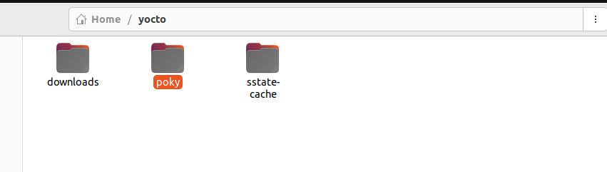

### 1.1. Poky Directory

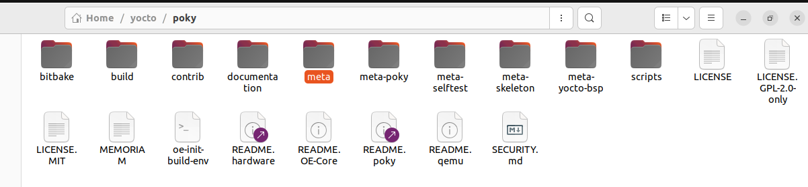

- **Bitbake**: This directory contains the BitBake tool such as scripts, which is the task execution engine used by the Yocto Project for building software. BitBake is responsible for parsing recipes, resolving dependencies, scheduling tasks, and executing the build process.

  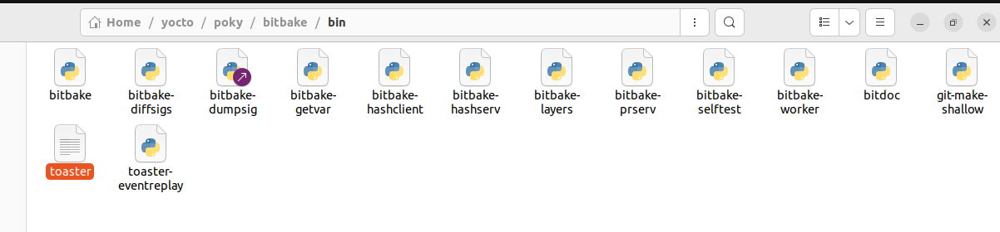

- **Build**: This directory is used to store the build output generated during the Yocto build process. It typically includes compiled binaries, package files, and other artifacts produced during the build.

  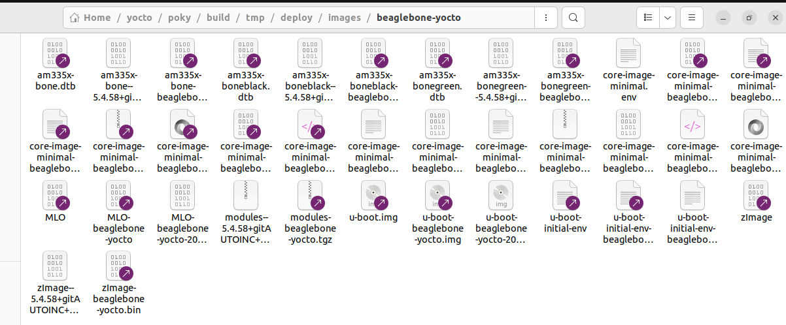

- **Documentation**: This directory contains documentation files and resources related to the Yocto Project. It may include user guides, manuals, release notes, and other documentation to help users understand and use Yocto effectively.

- **Meta**: This directory contains metadata layers developed by **OpenEmbedded** and used by the Yocto Project. Metadata layers define recipes, configurations, and other metadata necessary for building software with Yocto. 

- **Meta-poky**: This directory contains the Poky layer, which is the reference distribution of the Yocto Project. The Poky layer provides essential recipes, configurations, and metadata for building a basic Linux distribution with Yocto.

- **Meta-self**: This directory contain additional metadata or customization specific to your Yocto Project setup. It include custom recipes, configurations, or other metadata tailored to your project's requirements.

- **Meta-skeleton**: This directory contains a skeleton layer that serves as a template for creating custom Yocto layers. It includes example recipes, configuration files, and other resources to help users create their own layers for extending or customizing Yocto.

- **Meta-yocto-bsp**: This directory contains the Yocto Board Support Package (BSP) layer, which provides support for specific hardware platforms. The BSP layer includes recipes, configurations, and other metadata like **Uboot** configuration and start address of Target Ram and other configurations for  various embedded hardware platforms supported by Yocto.

- **Scripts**: This directory contains various scripts and utilities used by the Yocto build system. These scripts may automate common tasks. Various integration scripts which implement extra functionality in the poky environment for example the qemu scripts. This directory is appended to the 
  PATH environmental variable.

- **oe-init-build-env**:  This script is used to setup the poky build environment. Sourcing this file in a shell makes changes to PATH and sets other core bitbake variables based on the current working directory. You need to use this before running poky commands. Internally it uses scripts within the *scripts/* directory to do the bulk of the  work.

Overall, the directories and files within the "Poky" folder provide the essential components, resources, and tools needed to build custom Linux distributions for embedded systems using the Yocto Project.


## 2. BitBake Variables

BitBake relies on variables to control its behavior during the build process. These variables can be set to default values, or explicitly provided by the user. Here's an overview of these variable categories:

- **Derived Variables**: BitBake derives some variables internally. These variables are automatically set by BitBake and are not directly manipulated by users. Examples include variables related to the build environment (**CC**), target architecture.

- **Default Variables**: Certain variables are set to default values by the `bitbake.conf` file, which is part of the BitBake framework. These defaults are applied unless explicitly overridden by users or modified in the configuration files. Default variables often include settings related to the build environment, toolchain paths.

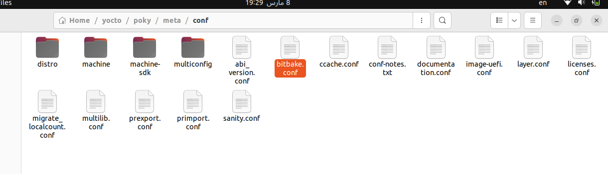

- **User-Provided Variables**: Users can explicitly provide settings for specific variables in their project configuration files. These settings allow users to customize the build process according to their requirements. Users typically define these variables in configuration files such as `local.conf` or recipe files. Examples of user-provided variables include custom compiler flags, source code locations.

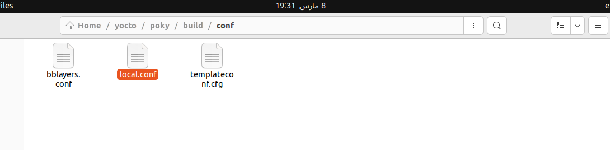

### 2.1. Internally Derived Variables

- **FILE:** It is the Full path of the file that BitBake is currently processing. The file can be a
  configuration file, a recipe, a class, and so on.

  - Let's try to show this variable :

    ```bash
    bitbake-getvar FILE
    ```

    > Make sure to run this command in yocto/poky/build and source the script

  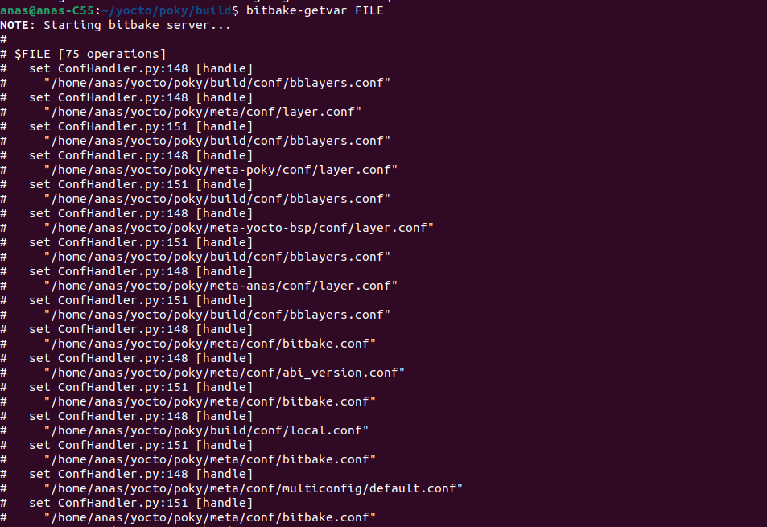

  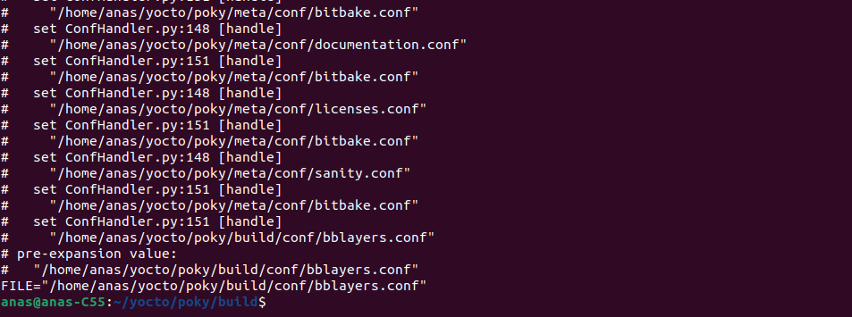

  >As you see, these are the paths of files which currently processed by bitbake 

- **LAYERDIR:** BitBake sets this variable to the full path to the directory of the current
  layer when it processes the files of that layer. **LAYERDIR** variable provides the path of the current layer

  ```bash
  bitbake-getvar LAYERDIR
  ```

  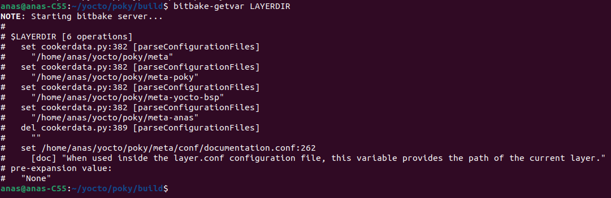

- **TOPDIR:** BitBake sets this variable to the full path to the directory from where you
  have executed BitBake. **TOPDIR** refers to the top-level directory of the build environment. 

  ```bash
  bitbake-getvar TOPDIR
  ```

  Typically, `TOPDIR` is the root directory of your Yocto Project. For example, In my case, `TOPDIR` is `/home/anas/yocto/poky/build` 

  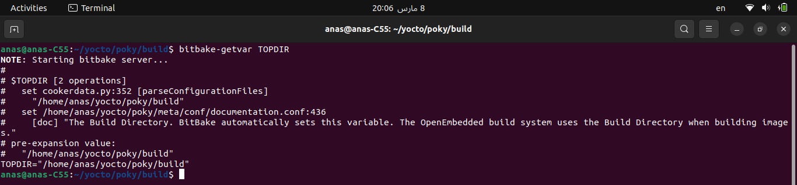

  >Note that , I run the command from **build** directory

### 2.2. Project-Specific Variables 
These variables are  specific to the configuration and setup of your BitBake project. These  variables are not predefined by BitBake itself but are set explicitly by you (developer), to customize the behavior of BitBake according to  your project's requirements. These variables are located at `layer.config` in each layer. 

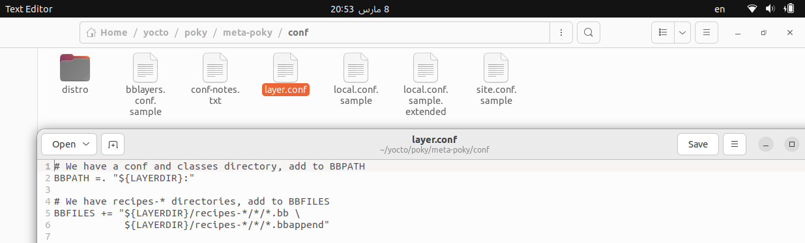

>Layers typically add their top-level directory to this variable: BBPATH .= ":${LAYERDIR}".

- **BBFILES**: This variable is a space-delimited list of paths for recipe files. You specify the paths to the recipe files relevant to your project in this variable. Layers can extend this variable by adding their own paths to recipe files in their `layer.conf` configuration file.

  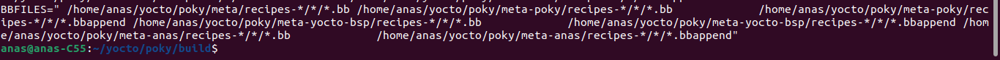

  >**space-delimited**  means that pathes in the variable are separated by spaces. 
  >
  >Example:  BBFILES = "/path/to/recipes/recipe1.bb    /path/to/recipes/recipe2.bb" 	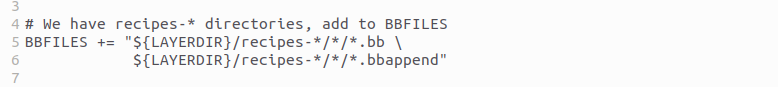

- **BBLAYERS**: BitBake automatically sets this variable to the full path of the directory of the current layer being processed. 

  > Layers are organizational units in BitBake that contain recipes, configuration files, and other metadata. This variable helps BitBake locate files within the current layer being processed.


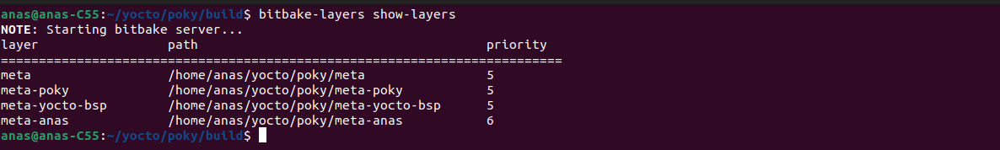

- **BBPATH**: BitBake uses this variable to locate classes (`.bbclass` files) and configuration files (`.conf` files) in specific directories. By default, classes are located in a subdirectory named `classes`, and configuration files are located in a subdirectory called `conf`, both within the directory specified by `BBPATH`. This variable is a list of directories where BitBake searches for these files.

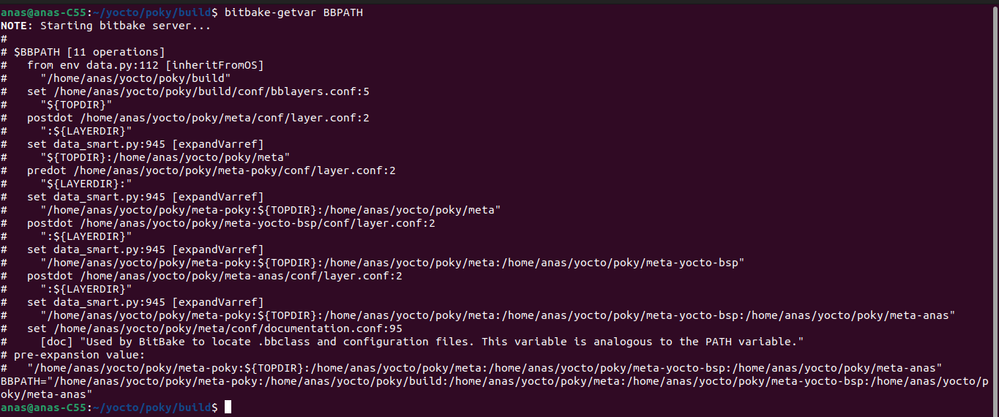

### 2.3. Standard Runtime Variables

The "Standard Runtime Variables" in BitBake are used by various modules within BitBake during the runtime of a build process. These variables are typically initialized by the **conf/bitbake.conf** file.

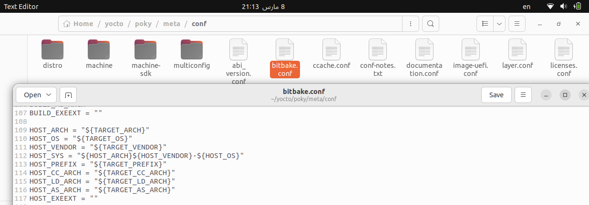

>- **Bitbake Modules**
>
>  - **Parser**: Responsible for parsing recipe files (`*.bb` and `*.conf` files) and extracting metadata, dependencies, and tasks.
>
>  - **Dependency Resolver**: Determines the build order by analyzing task dependencies and ensuring that tasks are executed in the correct sequence.
>  - **Scheduler**: Schedules tasks for execution based on available resources, dependencies, and build priorities.
>  - **Fetchers**: Handle fetching source code from remote repositories specified in the `SRC_URI` variable.
>  - **Builders**: Execute compilation, packaging, and installation tasks defined in the recipe files.
>  - **Packagers**: Create package files (e.g., `.ipk`, `.rpm`, `.deb`) from the compiled binaries and other files produced during the build process.
>  - **Image Generators**: Generate target system images (e.g., root filesystems, disk images) based on the configured recipes and package lists.
>
>  - **Configuration Manager**: Manages configuration changes and ensures consistency between configuration files and build settings.


- **B (Build Directory)**: Represents the full path of the directory where BitBake builds a source package. It's typically where the package's source code is extracted.

- **BUILD_ARCH (CPU Architecture)**: Represents the CPU architecture of the build host. It's automatically derived, usually returning the system’s architecture on Linux systems.

- **TARGET_ARCH**:  specifies the CPU architecture for which BitBake is building the software or package. Unlike BUILD_ARCH, TARGET_ARCH is specified explicitly in the recipe file. It defines the architecture for target Machine.

  >- BUILD_ARCH refers to the CPU architecture of the build host, automatically derived by BitBake.
  >
  >- TARGET_ARCH specifies the CPU architecture for which the software is being built, explicitly defined by the user or in the recipe file.

- **CACHE**: Represents the full path of the directory for the metadata cache. BitBake parses all metadata files and recipes and creates a cache to improve execution speed.

- **CVSDIR**: Represents the full path to the directory to which BitBake checks out CVS repositories.

>CVS (Concurrent Versions System) is a version control system that allows multiple developers to work on the same project . When using BitBake to manage software builds, it may need to interact with CVS repositories to fetch source code. 

- **D (Task Output Directory)**: Represents the full path to the directory where a task places its output, such as an installation task or an image creation task.  `D = /output/directory/path`

- **DEPENDS**: Describes package dependencies as a space-delimited list of package names.
  - Example: `DEPENDS = "libx11 libxext"`

- **DEPLOY_DIR**: Represents the full path to the base directory where BitBake places all the files for deployment, such as target images **(Kernel, Uboot, SD-Image...)**, package feeds, and licenses.

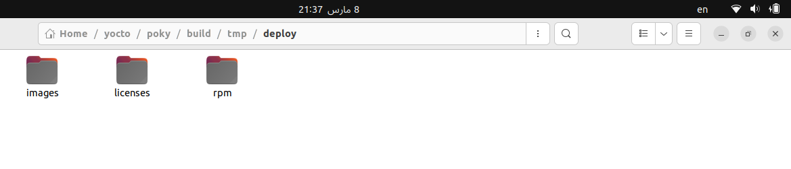

- **DEPLOY_DIR_IMAGE**: Represents the full path to the directory where BitBake stores target binary images.

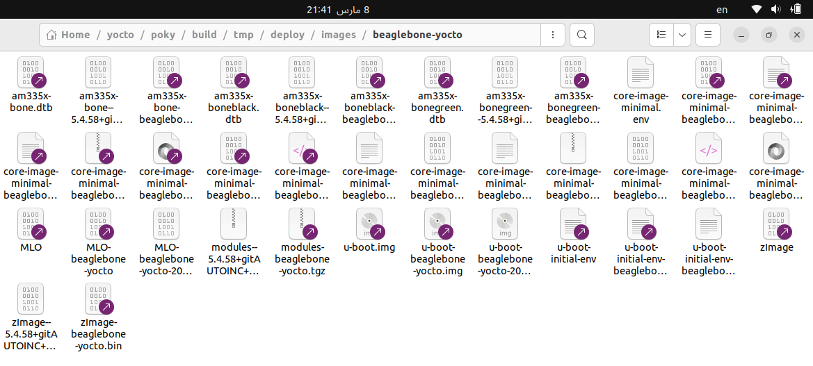

- **DL_DIR (Download Directory)**: Represents the full path to the download directory where source files are stored.

  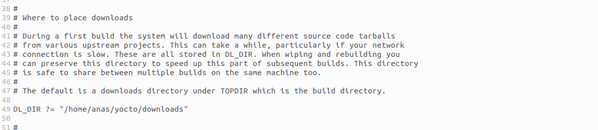

- **FILE_DIRNAME**: Represents the full path to the directory that contains the file that BitBake is currently processing.  `FILE_DIRNAME = /path/to/file/directory`

  > - `FILE_DIRNAME`: Represents the directory path where the currently processed file resides.
  > - `FILE`: Represents the path to the currently processed file itself.
  >
  > So, while `FILE_DIRNAME` points to the directory containing the file, `FILE` points directly to the file itself.
  >
  > For example, if `FILE` is "/path/to/recipes/example/recipe.bb", then `FILE_DIRNAME` would be "/path/to/recipes/example".

- **FILESDIR**: This variable specifies the Full path to a directory where BitBake looks for local files. BitBake
  uses this variable only if it cannot find the file in any of the directories listed in **FILESPATH**. The most common use case for this variable is in append files.

- **FILESPATH**: FILESPATH is a colon-separated list of full directory paths. BitBake's local file fetcher searches these directories for matching local files. The default setting is                                                  `FILESPATH ="${FILE_DIRNAME}/${PF}:${FILE_DIRNAME}/${P}:${FILE_DIRNAME}/$`

- **PERSISTENT_DIR**: This variable specifies path to the directory where BitBake stores files persistently. The default setting is `PERSISTENT_DIR ="${TOPDIR}/cache"`. The *CACHE* and the *PERSISTENT_DIR* variables are used interchangeably. Either one of them must be set. If PERSISTENT_DIR is not
  set, BitBake falls back to **CACHE**.

- **PF**: stands for **"Package Full"**. It's a variable that represents a concatenation of the package name, version, and revision, separated by dashes. For example, if you have the following values:

  - Package name (`PN`) = "example"
  - Package version (`PV`) = "1.0"
  - Package revision (`PR`) = "r1"

  Then, the `PF` variable would be `"example-1.0-r1"`. In my case `PF="defaultpkgname-1.0-r0"`

  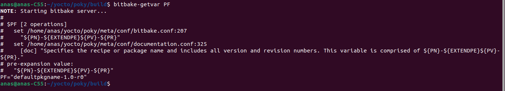

- **PN**: Stand for Package Name derived from the recipe filename. 

- **PR**: Stand for Package Revision derived from the recipe name or explicitly set.

- **P**: is a  variable that represents the package name and version  concatenated with a dash. It's typically used to uniquely identify a  package. The value of `P` is often constructed using the package name (`PN`) and package version (`PV`). In my case `"defaultpkgname-1.0"`

  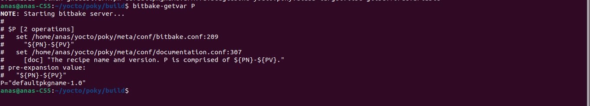

- **PV**:  Stand for Package Version derived from the recipe filename or explicitly set.

- **PROVIDES**: PROVIDES is a space-delimited list of names declaring what a package provides. Other recipes can use these names to declare their dependencies on this package.

- **S**: specifies the  path to the directory where BitBake places the unpacked sources. By default, it's a subdirectory of the package's work directory.

  >Source packages contain the source code of the software being built.  These packages typically come in compressed formats like tarballs (`.tar.gz`, `.tar.xz`), zip files (`.zip`), or other archive formats. 
  >
  >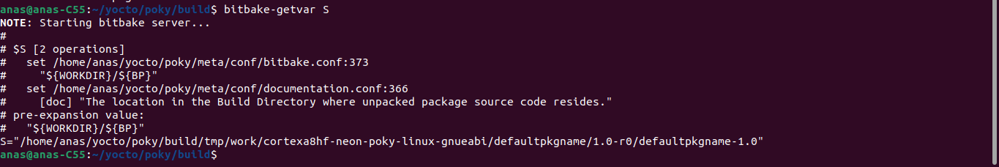

- **SRC_URI**: The primary purpose of the `SRC_URI` variable is to specify  the location from which BitBake should download the source code for the  package being built. This URI can point to various types of locations,  including web URLs, FTP servers, Git repositories, local file paths, or  even archives stored in BitBake's cache.

- **MKTEMPCMD**: It is the command which BitBake uses to create temporary files. 

  `MKTMPCOMMAND = "mktemp -q ${TMPBASE}"`

- **MKTEMPDIRCMD**: Similar to MKTEMPCMD, this variable specifies the command BitBake uses to create temporary directories. `MKTMPCOMMAND = "mktemp -d -q ${TMPBASE}"`

- **OVERRIDES**: This is a variable in BitBake that contains a list of conditions or settings that can override each other. It's used to control what  variables are overridden after BitBake parses recipes and configuration files. BitBake processes the list from right to left, giving precedence to later overrides. Example : `OVERRIDES = “arm:x86:mips:powerpc”`.

  .svg)

- **SRCREV**:  specifies the source code revision or version to be used when  downloading source code from a Source Code Management (SCM) system, such as Git.

- **GITDIR**: This variable holds the path of the directory which BitBake checks out Git repositories.
  The default of this directory to be a subdirectory of the download directory: `GITDIR = ${DL_DIR}/git` .

  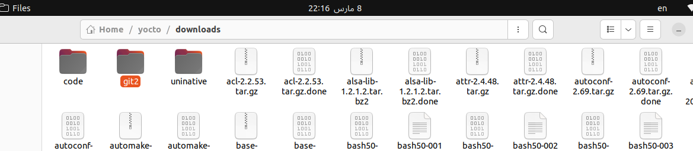

- **SVNDIR**: Similar to GITDIR, SVNDIR specifies the full path to the directory where BitBake checks out Subversion repositories.

- **T**:  hold the Path of directory where BitBake stores temporary files, such as task code and task logs, when processing a package recipe. By default, this directory resides inside the package’s work directory: `T = "${WORKDIR}/tmp"`.

- **TMPBASE**:  Hold the path of a directory that BitBake uses to create temporary files and
  directories with the **MKTMPCMD** and **MKTEMPDIRCMD** commands. BitBake modules, classes, and tasks set this variable according to their requirements.

- **TMPDIR**: Toutput, such as package builds, root filesystem stages, image, and package feeds. It typically resides inside the build environment: `TMPDIR = "${TOPDIR}/tmp"`.

- **WORKDIR**: WORKDIR specifies the full path to the directory where BitBake builds a package and stores all log information related to the package's build progress.

  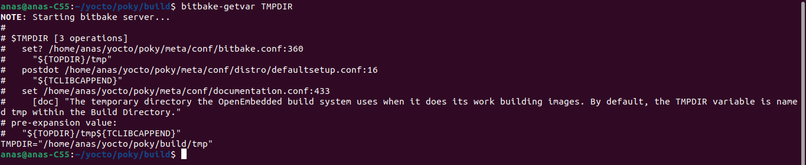

**Strong Point in Yocto : As you can see, many of the variables reference other variables, particularly the paths for files and directories. This creates a very flexible architecture that lets you easily customize your build environments by simply changing a few variables in a single configuration file.**


## 3. Variable Assignment

Read This [ReadME](https://github.com/FadyKhalil/EmbeddedLinux/blob/main/8-Yocto/4-Variables/Variable_Assignment.md) File to understand 


## References

1. https://github.com/NguyeVietAnh/Book/blob/master/Embedded%20Linux%20System%20with%20the%20Yocto%20Project.pdf
2. https://github.com/FadyKhalil/EmbeddedLinux/blob/main/8-Yocto/4-Variables/Variable_Assignment.md
3. https://docs.yoctoproject.org/bitbake/bitbake-user-manual/bitbake-user-manual-ref-variables.html#term-OVERRIDES
