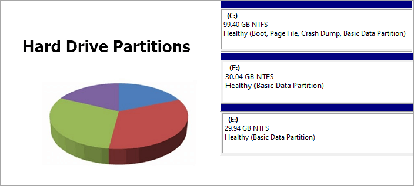
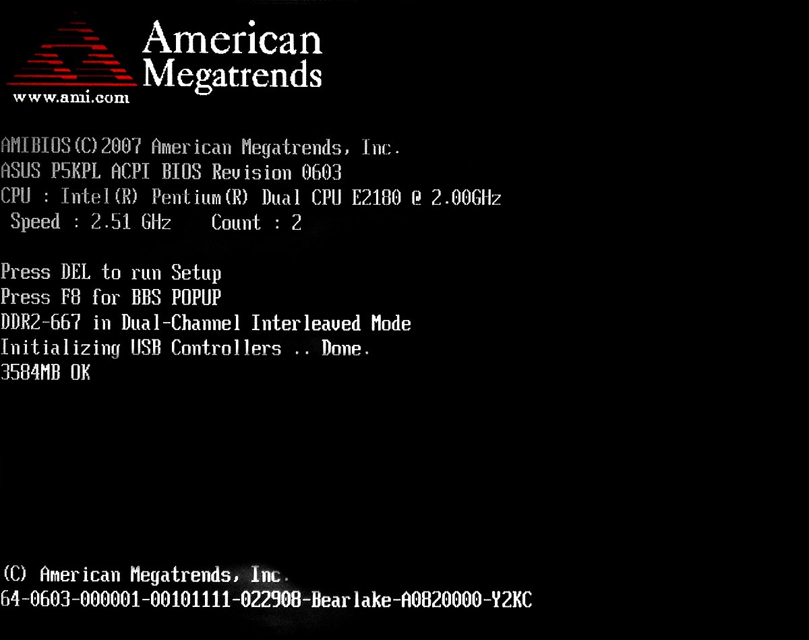
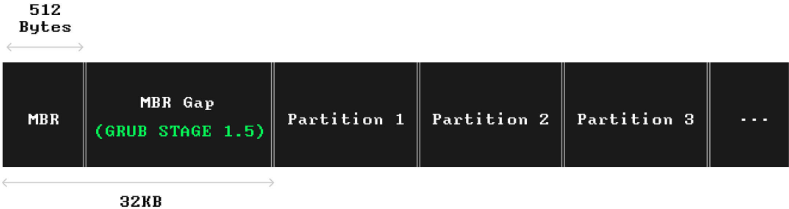
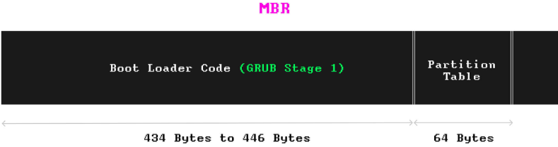
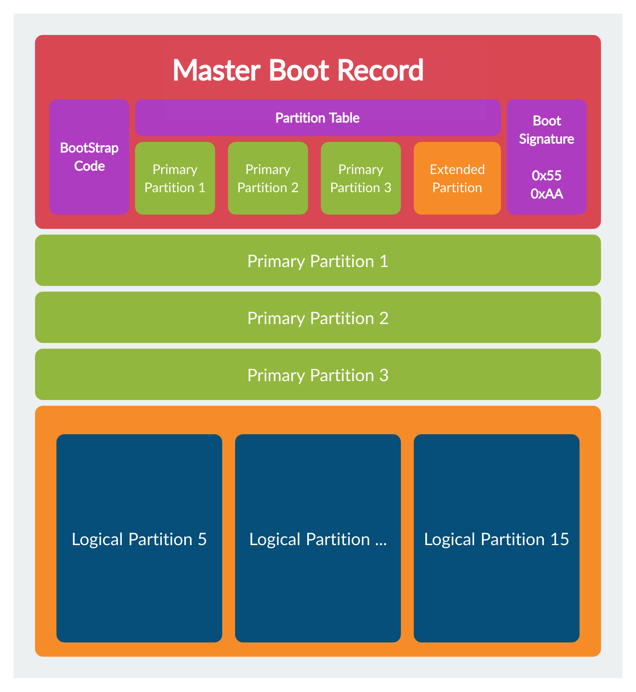

# Linux Admin 

## Storage Device (SSD /HDD) Partitioning 

Partitioning is splitting a storage device into several  *logical regions*, so they can be managed separately as if they are separate storage devices. A storage device should have at least one partition or more if needed.

On a computer with multiple partitions, you can install several operating systems, and every time choose a different operating system to boot up your system with. 

### Master boot record (MBR) Scheme

The first few blocks on the storage device will always contain critical data about your partitions. The system's  *firmware* uses these data structures to boot up the operating system on a partition.

>Firmware is low-level software programmed into the read-only memory (ROM) of an electronic device. It provides the necessary instructions for the hardware to communicate and function correctly. Firmware is crucial for initializing hardware during the boot-up process and providing basic control functions.

Hardware manufacturers create firmware based on two main specifications: **Basic Input/Output System (BIOS) and Unified Extensible Firmware Interface (UEFI)**. Both types of firmware are stored in non-volatile memory, such as flash ROM, attached to the motherboard.

When you press the power button on your computer, the firmware is the first program that runs. Its primary mission is to boot up the computer, load the operating system, and transfer control to it. Additionally, firmware can run pre-operating system environments with network support, such as recovery tools, diagnostic tools, or even a command-line shell for text-based commands.

The initial screens you see before the operating system logo appears are outputs of the firmware performing hardware checks and memory verification. This process is confirmed by a beep (usually on PCs), indicating that everything is functioning correctly and the system is ready to proceed.

When you turn on your computer, the BIOS firmware starts and loads the bootloader program from the Master Boot Record (MBR) into the computer's memory. Once the bootloader is in memory, the CPU begins to run it. The BIOS can boot the system easily because the bootloader and partition table are located in a predefined place in the MBR, which means it doesn’t need to search for them in files.

The bootloader code in the MBR uses between 434 and 446 bytes out of the MBR’s total 512 bytes. The remaining 64 bytes are used for the partition table, which can hold information about up to four partitions. Since 446 bytes is not enough space for a complex bootloader, advanced bootloaders like GRUB 2 in Linux split their tasks into different stages. The simplest part, called the **first-stage bootloader**, is stored in the MBR. It’s a small program that doesn’t take much space.

The job of the **first-stage bootloader** is to start the next, more complex stages of the booting process.

Right after the MBR, there is a small unused space called the MBR gap, which is about 1MB in size. This space can be used to store additional bootloader code if necessary. **GRUB 2** , for example, uses the MBR gap to store another part of the bootloader called **stage 1.5**. This part includes a file system driver. The stage 1.5 bootloader helps the next stages of GRUB understand and work with files, rather than just raw data from the storage device.

The **second-stage bootloader**, which can now handle files, loads the operating system's bootloader file to start the OS. At this point, you see the operating system's logo on the screen as it starts up.

1. **BootStrap Code (446 bytes)**:
   - This section contains the bootloader code that the BIOS executes to boot the operating system. This code is crucial for starting the boot process.
2. **Partition Table (64 bytes)**:
   - The partition table consists of four entries, each 16 bytes in size, and provides information about the primary and extended partitions on the disk.
3. **Boot Signature (2 bytes)**:
   - The boot signature, also known as the magic number, is `0x55AA`. This signature indicates that the MBR is valid and can be booted by the BIOS.

### Primary Partitions

- **Primary Partition 1**:
  - A segment of the disk designated as the first primary partition. It can contain a file system and data.
- **Primary Partition 2**:
  - The second primary partition, similar to the first, can also contain a file system and data.
- **Primary Partition 3**:
  - The third primary partition. MBR supports up to four primary partitions, but in this illustration, only three are shown as primary, with the fourth entry being an extended partition.

### Extended Partition

- The extended partition is a special type of primary partition that acts as a container for logical partitions. This allows the MBR to bypass the limitation of having only four primary partitions by subdividing the extended partition into multiple logical partitions.

### Logical Partitions

Within the extended partition, there can be multiple logical partitions:

- **Logical Partition 5**:
  - The first logical partition within the extended partition. Logical partitions are numbered starting from 5.
- **Logical Partition ...**:
  - Additional logical partitions. The ellipsis (...) indicates that there can be several logical partitions within the extended partition.
- **Logical Partition 15**:
  - The last logical partition in this example. The actual number of logical partitions depends on the size of the extended partition and the disk.

### Summary

- **BootStrap Code**: Contains bootloader code to start the operating system.

- Partition Table

  : Contains entries for up to four partitions.

  - **Primary Partitions**: Directly usable partitions for data and operating systems.
  - **Extended Partition**: A special partition type that can contain multiple logical partitions.

- **Boot Signature**: Indicates a valid MBR.

**Although MBR is simple and widely supported, it has some limitations.**

1. **Limited Number of Partitions**:
   - MBR allows only four primary partitions.
   - To work around this, you can create an extended partition instead of a fourth primary partition. This extended partition can contain multiple logical partitions.
2. **Maximum Partition Size**:
   - Each partition can only be up to 2 TiB in size.
3. **No Backup**:
   - The MBR sector does not have a backup. If it gets corrupted, you may have trouble using the hard drive.

To create partitions, you can choose between primary and extended partitions. The process for creating extended partitions varies by operating system. For example, Microsoft provides a guide on how to do this in Windows.

If the MBR gets corrupted, it can cause significant issues since there's no built-in backup, and you'll need to find a way to recover or replace it.

## ########################### Not Finished Yet ########################################

