# Admin Linux


### 1. Processes in Linux

A process is an instance of a running program. It consists of the program code, its current activity, and the context in which it is executed (like variables, files, and other resources).

#### 2. Process Identification

- **PID (Process ID)**: A unique identifier assigned to each process.
- **PPID (Parent Process ID)**: The PID of the parent process that created the current process.

You can view the PID and PPID of a process using various commands like `ps`, `top`, and `pstree`.

#### 3. The `/proc` Filesystem

The `/proc` filesystem is a pseudo-filesystem that provides an interface to kernel data structures. It is commonly used to get information about system processes.

>n Linux, a pseudo-filesystem (or virtual filesystem) is a filesystem that does not reside on a physical storage device like a hard disk or SSD. Instead, it is created and managed by the kernel and exists only in **RAM**. These filesystems provide an interface to various kernel services and hardware information, and they do not consume actual disk space.
>
>Here are some examples of pseudo-filesystems in Linux:
>
>1. **/proc**: The `/proc` filesystem is used to provide information about the system and running processes. It contains directories and files representing each running process, system memory, CPU information, and kernel parameters.
>2. **/sys**: The `/sys` filesystem, also known as sysfs, provides information about devices, drivers, and some kernel features. It is used to represent the system's device tree and allows user-space programs to query and control various aspects of hardware and kernel functionality.
>3. **/dev**: The `/dev` filesystem, or devfs, contains device nodes that represent hardware devices. These nodes allow user-space applications to interact with hardware devices through standard file I/O operations.
>4. **/run**: The `/run` filesystem is a temporary filesystem used to store runtime data for the system and applications. It is typically mounted as a tmpfs (temporary filesystem) and exists only in memory.
>5. **tmpfs**: A tmpfs is a temporary filesystem that uses virtual memory. Files stored in a tmpfs exist only in RAM (and swap space if needed). It is commonly used for directories like `/tmp`, where temporary files are stored.

##### Example: `/proc` Entries

- `/proc/[PID]`: Directory containing information about the process with the specified PID.
- `/proc/cpuinfo`: Contains information about the CPU.
- `/proc/meminfo`: Contains information about memory usage.
- `/proc/uptime`: Contains the system uptime.

#### 4. Relationship Between Kernel and Processes

The kernel is the core component of the operating system that manages system resources and facilitates interactions between hardware and software. Processes interact with the kernel through system calls to perform tasks like I/O operations, memory management, and inter-process communication.

#### 5. Commands and Examples

##### 5.1. Viewing Processes

- **ps**: Displays information about active processes.

  #####  Example: Viewing Processes with `ps`

  ```bash
  ps -ef
  ```

  Example output:

  ```bash
  UID        PID  PPID  C STIME TTY          TIME CMD
  root         1     0  0 Apr22 ?        00:01:30 /sbin/init
  root      1345     1  0 Apr22 ?        00:00:00 /bin/bash
  root      1368  1345  0 00:00 pts/0    00:00:00 ps -ef
  ```

  In this example:

  - `PID 1` (`/sbin/init`) is the first process started by the kernel and has `PPID 0` (no parent).
  - `PID 1345` (`/bin/bash`) is a shell process started by `init`.
  - `PID 1368` (`ps -ef`) is the command to list the processes, started by the shell (`bash`).

  

  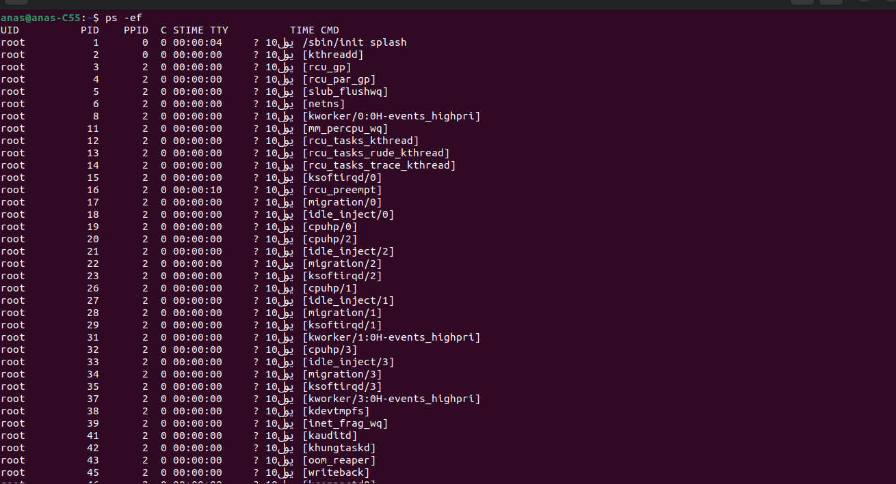

  - #### Columns:

    - **UID**: User ID of the process owner.
    - **PID**: Process ID.
    - **PPID**: Parent Process ID.
    - **C**: CPU utilization of the process.
    - **STIME**: Start time of the process.
    - **TTY**: Terminal associated with the process.
    - **TIME**: Cumulative CPU time used by the process.
    - **CMD**: Command that started the process.

  - #### Sample Processes:

    - **root 1 0 /sbin/init splash:**
    - **PID 1**: This is the init process (systemd or similar), the first process started by the kernel at boot time.
    - **kthread**: Kernel threads for various kernel tasks.
    - **rcu_gp, rcu_par_gp**: Read-Copy-Update (RCU) processes for handling synchronization.
    - **slub_flushwq**: SLUB allocator work queue.
    - **netns**: Network namespace processes.
    - **kworker**: Kernel worker threads for handling various tasks.
    - **migration**: Processes responsible for migrating tasks between CPUs.
    - **cpu_hp**: CPU hotplug processes for managing CPU additions and removals.
    - **kswapd**: Kernel swap daemon responsible for memory management.
    - **khungtaskd**: Kernel thread to detect and handle hung tasks.
    - **oom_reaper**: Out-of-memory killer reaper process.

  - #### Explanation:

    - **Kernel Threads**: Many processes listed are kernel threads (e.g., `kworker`, `ksoftirqd`, `migration`, `cpu_hp`). These threads handle various low-level system tasks such as managing CPU resources, handling interrupts, and migrating tasks between CPUs.
    - **RCU Processes**: Processes like `rcu_gp`, `rcu_par_gp`, and others related to RCU (Read-Copy-Update) handle synchronization mechanisms in the kernel, allowing read operations to be performed without locking and writing operations to occur concurrently.
    - **System Management**: Processes such as `kswapd`, `oom_reaper`, and `khungtaskd` are involved in system management, handling memory swapping, out-of-memory situations, and detecting hung tasks, respectively.
    - **Work Queues**: Kernel worker threads (`kworker`) are responsible for executing tasks in the background. These can be scheduled by various kernel subsystems to perform asynchronous work.
    - **Networking**: Processes like `netns` and `inet_frag_wq` are related to network namespaces and handling network fragments.


```bash
ps -aux
```

>### Explanation:
>
>1. **ps**:
>
>   - **Command**: `ps` stands for "process status". It is used to report a snapshot of current processes running on the system.
>
>2. **-aux**:
>
>   - Options/Flags
>
>     :
>
>     - **-a**: Lists all processes with a terminal (TTY), including those of other users. Normally, `ps` only shows your own processes.
>     - **-u**: Displays detailed information about each process, including the user who owns it, CPU and memory usage, and more.
>     - **-x**: Lists processes without a controlling terminal (TTY). This includes background processes and daemons.
>
>### Output Columns Explained:
>
>When you run `ps -aux`, the output typically includes columns with detailed information about each process. Here are the common columns you might see and what they represent:
>
>- **USER**: The user who owns the process.
>- **PID**: The process ID, a unique number assigned to each running process.
>- **%CPU**: The percentage of CPU time used by the process since the last update.
>- **%MEM**: The percentage of physical memory (RAM) used by the process.
>- **VSZ**: Virtual memory size of the process in kilobytes (KB).
>- **RSS**: Resident Set Size, the non-swapped physical memory that a task is using (in kilobytes).
>- **TTY**: The controlling terminal associated with the process (or `?` if there is none).
>- **STAT**: Process status (e.g., running, sleeping, zombie).
>- **START**: Time when the process started.
>- **TIME**: Cumulative CPU time used by the process.
>- **COMMAND**: The command that initiated the process.
>
>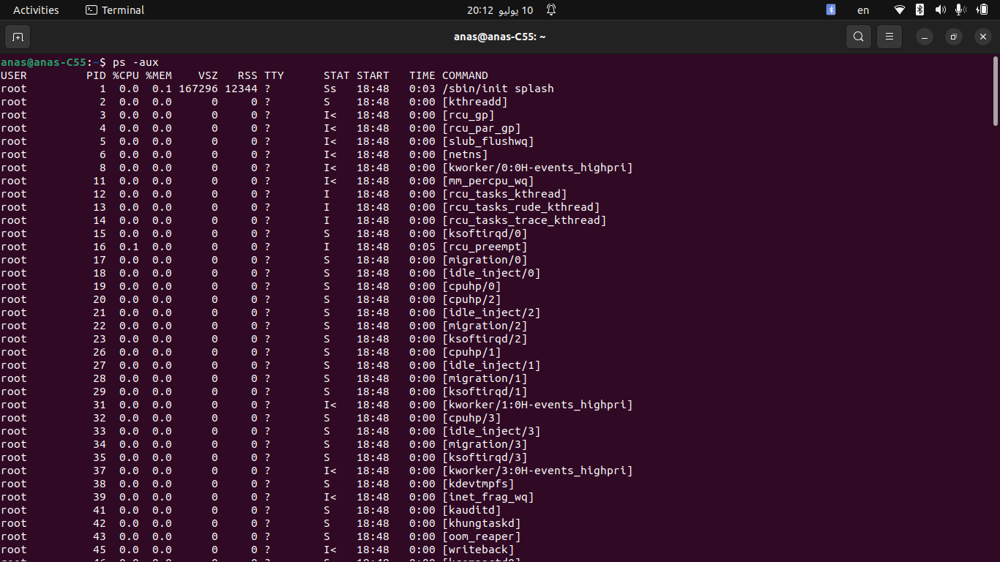
>
>### Example Usage:
>
>When you execute `ps -aux` in a terminal, you will see a detailed list of all processes currently running on your system. This output is useful for monitoring system activity, identifying resource-intensive processes, and troubleshooting performance issues.
>
>

```bash
ps -at
```

>### Explanation:
>
>1. **ps**:
>
>   - **Command**: `ps` stands for "process status". It is used to display information about active processes.
>
>2. **-at**:
>
>   - Options/Flags
>
>     :
>
>     - **-a**: Lists all processes associated with terminals, including those of other users. Normally, `ps` only shows processes related to the current user.
>     - **-t**: Specifies the selection of processes based on their associated terminal.
>
>### Output:
>
>When you run `ps -at`, the output typically lists processes based on their association with terminals. This is useful for viewing processes that are currently running with a specific terminal association, such as those connected to a remote session or a particular TTY device.


- **top**: Displays real-time information about running processes.

  ```bash
  top
  ```

  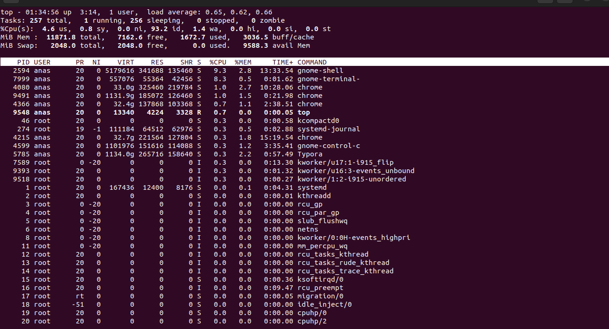

- **pstree**: Displays a tree of processes.

  ```bash
  pstree
  ```

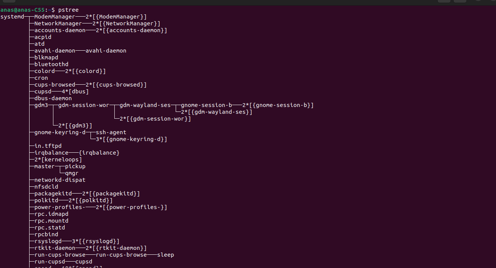

##### 5.2. Getting Information from `/proc`

- **Process Information**: View details of a specific process.

  ```bash
  cat /proc/[PID]/status
  ```

  Replace `[PID]` with the process ID. Example:

  ```bash
  cat /proc/1/status
  ```

  Example output:

  ```bash
  Name:   init
  Umask:  0022
  State:  S (sleeping)
  Tgid:   1
  Ngid:   0
  Pid:    1
  PPid:   0
  ```

  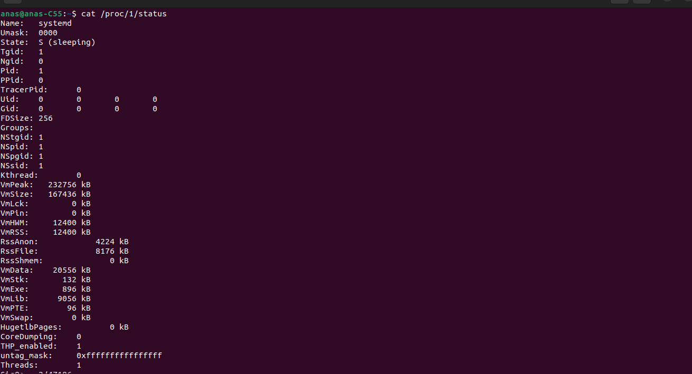

  ##### - Example: Checking Process Details in `/proc` For process `PID 1345`:

  ```bash
  cat /proc/1345/status
  ```

  Example output:

  ```bash
  Umask:  0022
  State:  S (sleeping)
  Tgid:   1345
  Ngid:   0
  Pid:    1345
  PPid:   1
  ```

  >- **Processes**: Instances of running programs identified by unique PIDs.
  >
  >- **PPID**: Parent process ID indicating the creator of the process.
  >
  >- **/proc Filesystem**: Interface to kernel data structures providing information about processes and system status.
  >
  >- **Kernel Interaction**: Processes interact with the kernel via system calls to manage resources and perform tasks.
  >
  >- **Commands**: Use `ps`, `top`, `pstree`, and commands in `/proc` to view and manage processes.

  

- **CPU Information**:

  ```bash
  cat /proc/cpuinfo
  ```

  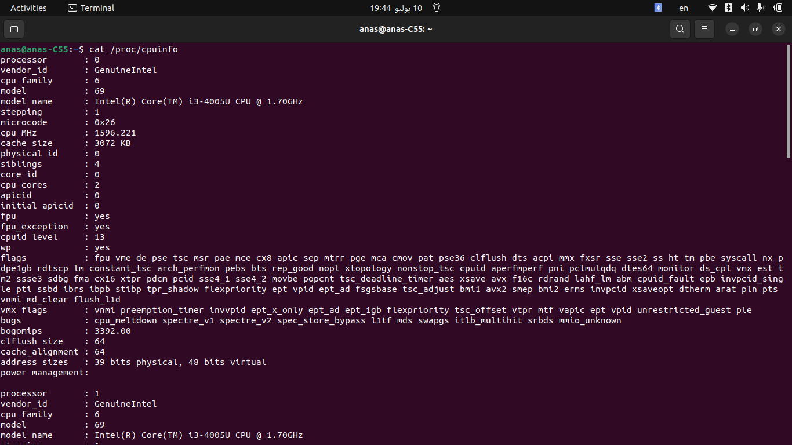

- **Memory Information**:

  ```bash
  cat /proc/meminfo
  ```

  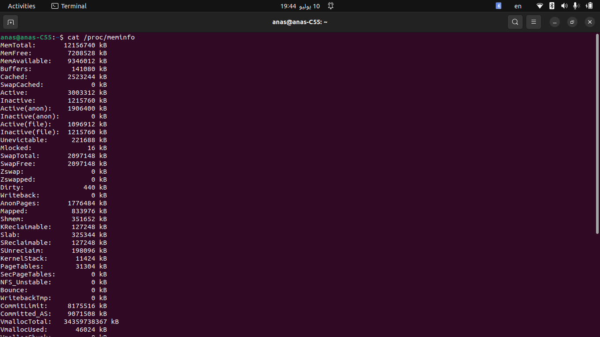
  
  ### Memory Information Fields
  
  >### Detailed Explanation of Each Type in `/proc/meminfo`
  >
  >1. **MemTotal**
  >   - **Definition**: This represents the total amount of physical RAM in your system.
  >   - **Role**: It provides an overview of the total memory available for use by the operating system and applications.
  >   - **Example**: `MemTotal: 12156740 kB` means your system has approximately 12.15 GB of total physical memory.
  >2. **MemFree**
  >   - **Definition**: This is the amount of physical memory that is currently not being used by the system.
  >   - **Role**: It indicates the free memory that can be immediately used for processes.
  >   - **Example**: `MemFree: 7041764 kB` means there are about 7.04 GB of memory available.
  >3. **MemAvailable**
  >   - **Definition**: This is an estimate of the amount of memory available for starting new applications, without requiring swap.
  >   - **Role**: It provides a more accurate estimate of available memory than MemFree because it accounts for caches and buffers that can be freed.
  >   - **Example**: `MemAvailable: 9593244 kB` means there are approximately 9.59 GB of memory available for new applications.
  >4. **Buffers**
  >   - **Definition**: Memory used by the kernel to store metadata and other buffer information for filesystem I/O.
  >   - **Role**: Buffers improve the performance of disk operations by temporarily holding data to be written to or read from disk.
  >   - **Example**: `Buffers: 197568 kB` means about 197 MB is used for file buffers.
  >5. **Cached**
  >   - **Definition**: Memory used to cache file data to improve performance of read operations.
  >   - **Role**: Cached memory speeds up file access by keeping recently or frequently accessed file data in memory.
  >   - **Example**: `Cached: 2832524 kB` means around 2.83 GB of memory is being used to cache files.
  >6. **SwapCached**
  >   - **Definition**: Memory that was swapped out to disk but is still in the swap cache, and can be quickly swapped back in.
  >   - **Role**: It allows swapped out memory to be quickly accessed without reading from the disk again.
  >   - **Example**: `SwapCached: 0 kB` means no memory is currently in the swap cache.
  >7. **Active**
  >   - **Definition**: Memory that has been used recently and is unlikely to be reclaimed unless absolutely necessary.
  >   - **Role**: This is memory in active use by applications and processes.
  >   - **Example**: `Active: 2772464 kB` means about 2.77 GB of memory is active and in use.
  >8. **Inactive**
  >   - **Definition**: Memory that is not actively being used but can be reclaimed if needed.
  >   - **Role**: It includes memory that could be swapped out to make room for active processes.
  >   - **Example**: `Inactive: 1555224 kB` means around 1.55 GB of memory is inactive.
  >9. **Active(anon)**
  >   - **Definition**: Anonymous memory (not backed by files) that is currently active.
  >   - **Role**: This is memory used by applications for data that is not saved to disk (e.g., stack and heap memory).
  >   - **Example**: `Active(anon): 1636404 kB` means approximately 1.64 GB of active anonymous memory.
  >10. **Inactive(anon)**
  >    - **Definition**: Anonymous memory that is currently inactive.
  >    - **Role**: Inactive anonymous memory can be swapped out if necessary.
  >    - **Example**: `Inactive(anon): 0 kB` means there is no inactive anonymous memory.
  >11. **Active(file)**
  >    - **Definition**: File-backed memory that is currently active.
  >    - **Role**: Memory used for active file data, such as open files and recently accessed file data.
  >    - **Example**: `Active(file): 1136060 kB` means around 1.14 GB of active file-backed memory.
  >12. **Inactive(file)**
  >    - **Definition**: File-backed memory that is currently inactive.
  >    - **Role**: Inactive file-backed memory can be reclaimed or swapped out if needed.
  >    - **Example**: `Inactive(file): 1555224 kB` means about 1.55 GB of inactive file-backed memory.
  >13. **Unevictable**
  >    - **Definition**: Memory that cannot be swapped out for various reasons.
  >    - **Role**: This includes memory locked in RAM by applications or the kernel to prevent it from being swapped out.
  >    - **Example**: `Unevictable: 224140 kB` means approximately 224 MB of memory is unevictable.
  >14. **Mlocked**
  >    - **Definition**: Memory that has been locked in RAM and cannot be swapped out.
  >    - **Role**: Applications may lock memory to ensure it stays in RAM, often for performance or security reasons.
  >    - **Example**: `Mlocked: 16 kB` means 16 kB of memory is locked.
  >15. **SwapTotal**
  >    - **Definition**: Total amount of swap space available.
  >    - **Role**: Swap space is used when physical memory (RAM) is full, allowing the system to move inactive pages to disk.
  >    - **Example**: `SwapTotal: 2097148 kB` means there is approximately 2.1 GB of swap space available.
  >16. **SwapFree**
  >    - **Definition**: Amount of swap space that is free and available for use.
  >    - **Role**: Indicates how much swap space is currently unused.
  >    - **Example**: `SwapFree: 2097148 kB` means all of the swap space (about 2.1 GB) is free.
  >17. **Zswap**
  >    - **Definition**: Compressed swap space.
  >    - **Role**: Zswap is a compressed cache for swap pages, reducing the amount of I/O needed for swap operations.
  >    - **Example**: `Zswap: 0 kB` means no compressed swap space is currently used.
  >18. **Zswapped**
  >    - **Definition**: Amount of swap space that has been compressed and used.
  >    - **Role**: Indicates how much swap space has been compressed to save space.
  >    - **Example**: `Zswapped: 0 kB` means no swap space has been compressed and used.
  >19. **Dirty**
  >    - **Definition**: Memory waiting to be written back to disk.
  >    - **Role**: This includes modified data that needs to be written to disk to ensure consistency.
  >    - **Example**: `Dirty: 204 kB` means 204 kB of memory is waiting to be written to disk.
  >20. **Writeback**
  >    - **Definition**: Memory that is currently being written back to disk.
  >    - **Role**: Indicates ongoing disk write operations.
  >    - **Example**: `Writeback: 0 kB` means no memory is currently being written to disk.
  >21. **AnonPages**
  >    - **Definition**: Total amount of anonymous memory.
  >    - **Role**: Includes all memory used by applications for anonymous data not associated with any file.
  >    - **Example**: `AnonPages: 1521620 kB` means around 1.52 GB of anonymous memory is in use.
  >22. **Mapped**
  >    - **Definition**: Memory mapped by processes, such as for shared libraries.
  >    - **Role**: Shared memory allows processes to share data efficiently.
  >    - **Example**: `Mapped: 867328 kB` means around 867 MB of memory is mapped by processes.
  >23. **Shmem**
  >    - **Definition**: Shared memory used.
  >    - **Role**: Memory used for shared memory segments.
  >    - **Example**: `Shmem: 338808 kB` means around 339 MB of shared memory is in use.
  >24. **KReclaimable**
  >    - **Definition**: Memory that can be reclaimed by the kernel.
  >    - **Role**: Includes memory used for kernel data structures that can be freed if needed.
  >    - **Example**: `KReclaimable: 183476 kB` means around 183 MB of kernel memory can be reclaimed.
  >25. **Slab**
  >    - **Definition**: Memory used by the kernel for data structures.
  >    - **Role**: The slab allocator manages memory for objects in the kernel.
  >    - **Example**: `Slab: 394568 kB` means around 395 MB is used by the kernel for data structures.
  >26. **SReclaimable**
  >    - **Definition**: Part of the Slab that can be reclaimed.
  >    - **Role**: Indicates how much of the Slab memory can be freed.
  >    - **Example**: `SReclaimable: 183476 kB` means around 183 MB of Slab memory is reclaimable.
  >27. **SUnreclaim**
  >    - **Definition**: Part of the Slab that cannot be reclaimed.
  >    - **Role**: Indicates memory used for kernel data structures that cannot be freed.
  >    - **Example**: `SUnreclaim: 211092 kB` means around 211 MB of Slab memory is non-reclaimable.
  >28. **KernelStack**
  >    - **Definition**: Memory used for kernel stacks.
  >    - **Role**: Each thread in the kernel requires stack space.
  >    - **Example**: `KernelStack: 11456 kB` means around 11.5 MB is used for kernel stacks.
  >29. **PageTables**
  >    - **Definition**: Memory used for page tables.
  >    - **Role**: Page tables map virtual memory addresses to physical memory addresses.
  >    - **Example**: `PageTables: 31740 kB` means around 31.7 MB is used for page tables.
  >30. **SecPageTables**
  >    - **Definition**: Secure page tables.
  >    - **Role**: Used for secure memory mappings, often in virtualized environments.
  >    - **Example**: `SecPageTables: 0 kB` means no secure page tables are in use.
  >31. **NFS_Unstable**
  >    - **Definition**: NFS pages that have not yet been committed to storage.
  >    - **Role**: Data written via NFS that hasn't been confirmed as committed to disk.
  >    - **Example**: `NFS_Unstable: 0 kB` means no unstable NFS pages.
  >32. **Bounce**
  >    - **Definition**: Memory used for bounce buffers for I/O.
  >    - **Role**: Bounce buffers are used to handle I/O operations when direct memory access isn't possible.
  >    - **Example**: `Bounce: 0 kB` means no memory is used for bounce buffers.
  >33. **WritebackTmp**
  >    - **Definition**: Temporary memory used during writeback.
  >    - **Role**: Temporary buffer space for data being written to disk.
  >    - **Example**: `WritebackTmp: 0 kB` means no temporary writeback memory is in use.
  >34. **CommitLimit**
  >    - **Definition**: Total amount of memory that can be allocated based on the overcommit ratio.
  >    - **Role**: Determines the limit of memory that can be committed for use, considering overcommit.
  >    - **Example**: `CommitLimit: 8175516 kB` means approximately 8.18 GB is the limit for memory allocation.
  >35. **Committed_AS**
  >    - **Definition**: Total amount of memory currently allocated, including overcommit.
  >    - **Role**: Shows the total committed virtual memory.
  >    - **Example**: `Committed_AS: 10459400 kB` means around 10.46 GB of memory is allocated.
  >36. **VmallocTotal**
  >    - **Definition**: Total amount of virtual memory available.
  >    - **Role**: Indicates the virtual memory limit for the kernel.
  >    - **Example**: `VmallocTotal: 34359738367 kB` means a large virtual address space is available (about 34.36 TB).
  >37. **VmallocUsed**
  >    - **Definition**: Amount of virtual memory used.
  >    - **Role**: Shows how much of the virtual memory is currently used.
  >    - **Example**: `VmallocUsed: 46004 kB` means around 46 MB of virtual memory is used.
  >38. **VmallocChunk**
  >    - **Definition**: Largest contiguous block of vmalloc memory available.
  >    - **Role**: Indicates the size of the largest free block of virtual memory.
  >    - **Example**: `VmallocChunk: 0 kB` means no large contiguous blocks of vmalloc memory are available.
  >39. **Percpu**
  >    - **Definition**: Memory allocated for per-CPU variables.
  >    - **Role**: Memory used for data structures that are specific to each CPU.
  >    - **Example**: `Percpu: 7680 kB` means around 7.68 MB is allocated for per-CPU variables.
  >40. **HardwareCorrupted**
  >    - **Definition**: Amount of memory marked as hardware corrupted.
  >    - **Role**: Memory that is not usable due to hardware issues.
  >    - **Example**: `HardwareCorrupted: 0 kB` means no memory is marked as hardware corrupted.
  >41. **AnonHugePages**
  >    - **Definition**: Amount of anonymous huge pages.
  >    - **Role**: Memory used for large, contiguous blocks that aren't file-backed.
  >    - **Example**: `AnonHugePages: 0 kB` means no anonymous huge pages are used.
  >42. **ShmemHugePages**
  >    - **Definition**: Amount of shared memory huge pages.
  >    - **Role**: Large pages used for shared memory.
  >    - **Example**: `ShmemHugePages: 0 kB` means no shared memory huge pages are used.
  >43. **ShmemPmdMapped**
  >    - **Definition**: Amount of shared memory mapped with PMD (Page Middle Directory).
  >    - **Role**: Indicates shared memory regions mapped with large pages.
  >    - **Example**: `ShmemPmdMapped: 0 kB` means no shared memory is mapped with PMD.
  >44. **FileHugePages**
  >    - **Definition**: Amount of file-backed huge pages.
  >    - **Role**: Large pages used for file-backed memory.
  >    - **Example**: `FileHugePages: 0 kB` means no file-backed huge pages are used.
  >45. **FilePmdMapped**
  >    - **Definition**: Amount of file-backed PMD-mapped memory.
  >    - **Role**: Indicates file-backed memory regions mapped with large pages.
  >    - **Example**: `FilePmdMapped: 0 kB` means no file-backed PMD-mapped memory is used.
  >46. **Unaccepted**
  >    - **Definition**: Unaccepted memory.
  >    - **Role**: Memory that has not been accepted by the system for use.
  >    - **Example**: `Unaccepted: 0 kB` means no unaccepted memory is present.
  >47. **HugePages_Total**
  >    - **Definition**: Total number of huge pages.
  >    - **Role**: Indicates the total configured huge pages.
  >    - **Example**: `HugePages_Total: 0` means no huge pages are configured.
  >48. **HugePages_Free**
  >    - **Definition**: Number of free huge pages.
  >    - **Role**: Indicates how many huge pages are available for use.
  >    - **Example**: `HugePages_Free: 0` means no free huge pages are available.
  >49. **HugePages_Rsvd**
  >    - **Definition**: Number of reserved huge pages.
  >    - **Role**: Reserved huge pages are allocated but not yet used.
  >    - **Example**: `HugePages_Rsvd: 0` means no huge pages are reserved.
  >50. **HugePages_Surp**
  >    - **Definition**: Number of surplus huge pages.
  >    - **Role**: Surplus huge pages are additional pages that can be used beyond the reserved number.
  >    - **Example**: `HugePages_Surp: 0` means no surplus huge pages are available.
  >51. **Hugepagesize**
  >    - **Definition**: Size of huge pages.
  >    - **Role**: Indicates the size of each huge page.
  >    - **Example**: `Hugepagesize: 2048 kB` means each huge page is 2 MB in size.
  >52. **Hugetlb**
  >    - **Definition**: Memory used by hugetlbfs.
  >    - **Role**: Indicates the amount of memory used for huge pages through hugetlbfs.
  >    - **Example**: `Hugetlb: 0 kB` means no memory is used by hugetlbfs.
  >53. **DirectMap4k**
  >    - **Definition**: Amount of memory mapped with 4k pages.
  >    - **Role**: Indicates memory mapped using 4 KB pages.
  >    - **Example**: `DirectMap4k: 191104 kB` means around 191 MB of memory is mapped using 4 KB pages.
  >54. **DirectMap2M**
  >    - **Definition**: Amount of memory mapped with 2MB pages.
  >    - **Role**: Indicates memory mapped using 2 MB pages.
  >    - **Example**: `DirectMap2M: 3921920 kB` means around 3.92 GB of memory is mapped using 2 MB pages.
  >55. **DirectMap1G**
  >    - **Definition**: Amount of memory mapped with 1GB pages.
  >    - **Role**: Indicates memory mapped using 1 GB pages.
  >    - **Example**: `DirectMap1G: 9437184 kB` means around 9.44 GB of memory is mapped using 1 GB pages.
  
  ### Summary
  
  - **Total Physical Memory**: 12,156,740 kB (approximately 12 GB)
  - **Free Physical Memory**: 7,041,764 kB (approximately 7 GB)
  - **Available Memory**: 9,593,244 kB (approximately 9.6 GB)
  - **Swap Total**: 2,097,148 kB (approximately 2 GB)
  - **Swap Free**: 2,097,148 kB (approximately 2 GB)

--------------------------------

##### 5.3. Creating and Managing Processes

- **Creating a Process**: Use the `fork()` system call in C to create a new process.

  ```c
  #include <stdio.h>
  #include <unistd.h>
  #include <sys/types.h>
  #include <sys/wait.h>
  
  int main() {
      pid_t pid;
  
      // Fork a new process
      pid = fork();
  
      if (pid == 0) {
          // Child process
          printf("Child process running (PID: %d)\n", getpid());
          sleep(5); // Simulate child process doing some work
          printf("Child process exiting\n");
  
      } else if (pid > 0) {
          // Parent process
          printf("Parent process running (PID: %d)\n", getpid());
          printf("Child process created with PID: %d\n", pid);
          sleep(10); // Parent process waits for 10 seconds before exiting
          printf("Parent process exiting\n");
  
      } else {
          // Error occurred
          perror("fork");
          return 1;
      }
  
      return 0;
  }
  ```

  >### Step-by-Step Explanation:
  >
  >1. **Include Headers**:
  >
  >   - `#include <stdio.h>`: Standard input-output header.
  >   - `#include <unistd.h>`:  **POSIX** operating system API (including `fork`, `sleep`, etc.).
  >   - `#include <sys/types.h>`: Defines various data types used in system calls.
  >   - `#include <sys/wait.h>`: Declares the `wait` function used for process synchronization.
  >
  >2. **Declare Variables**:
  >
  >   - `pid_t pid;`: Declares a variable `pid` of type `pid_t`, which is typically used for process IDs.
  >
  >3. **Forking a Process**:
  >
  >   - ```c
  >     pid = fork(); // Creates a new process.
  >     ```
  >
  >      **Returns:**
  >
  >     - `> 0` in the parent process, with the value being the PID of the child process.
  >     - `0` in the child process.
  >     - `-1` if an error occurred during forking.
  >
  >     ### Forking a Process:
  >
  >     When you call `fork()` in a C program, you create a new process. The new process is called the child process, and the process that called `fork()` is called the parent process. Here’s how `fork()` works and what each return value signifies:
  >
  >     #### 1. Syntax and Functionality:
  >
  >     ```c
  >     pid_t fork(void);
  >     ```
  >
  >     - `pid_t` is a data type defined in `<sys/types.h>`, typically an integer type representing process IDs (`pid`).
  >     - `fork()` creates a new process by duplicating the calling process. After a successful `fork()`, two almost identical processes are running concurrently.
  >
  >     #### 2. Return Values:
  >
  >     - **In the Parent Process (`pid > 0`)**:
  >       - The return value of `fork()` is the PID (Process ID) of the child process.
  >       - This value is greater than `0`.
  >       - The parent process can use this PID to identify and control the child process (e.g., send signals, wait for its termination).
  >     - **In the Child Process (`pid == 0`)**:
  >       - After `fork()`, the return value is `0` in the child process.
  >       - This indicates to the child process that it is now running as the child created by `fork()`.
  >       - Child processes typically perform different tasks than their parent or execute the same code with different data.
  >     - **Error Condition (`pid == -1`)**:
  >       - If an error occurs during `fork()`, it returns `-1`.
  >       - This can happen due to various reasons, such as resource limits (e.g., too many processes), insufficient memory, or other system-specific issues.
  >       - In this case, `fork()` failed to create a new process, and an appropriate error message should be handled using `perror()` or similar error-handling mechanisms.
  >
  >4. **Handling the Fork Outcome**:
  >
  >   - **Child Process (`pid == 0`)**:
  >     - Executes the code within this block since `fork()` returned `0`.
  >     - Prints a message indicating it is the child process (`getpid()` retrieves its PID).
  >     - `sleep(5);`: Simulates the child process doing some work for 5 seconds.
  >     - Prints a message indicating the child process is exiting.
  >   - **Parent Process (`pid > 0`)**:
  >     - Executes this block since `fork()` returned a positive PID.
  >     - Prints a message indicating it is the parent process (`getpid()` retrieves its PID).
  >     - Prints the PID of the child process (`pid`).
  >     - `sleep(10);`: Parent process waits for 10 seconds before proceeding.
  >     - Prints a message indicating the parent process is exiting.
  >   - **Error Handling (`pid == -1`)**:
  >     - Executes this block if `fork()` returns `-1`, indicating an error occurred.
  >     - Prints an error message using `perror("fork")`.
  >     - Returns `1` to indicate an error condition to the operating system.
  >
  >5. **Return Statement**:
  >
  >   - `return 0;`: Indicates successful execution of the program.
  >
  >### Execution Flow:
  >
  >- When you run this program, it will fork a new process.
  >- The child process executes its code independently from the parent process.
  >- The parent process typically waits for the child to complete some task (simulated by `sleep` in this example) before continuing or exiting.

  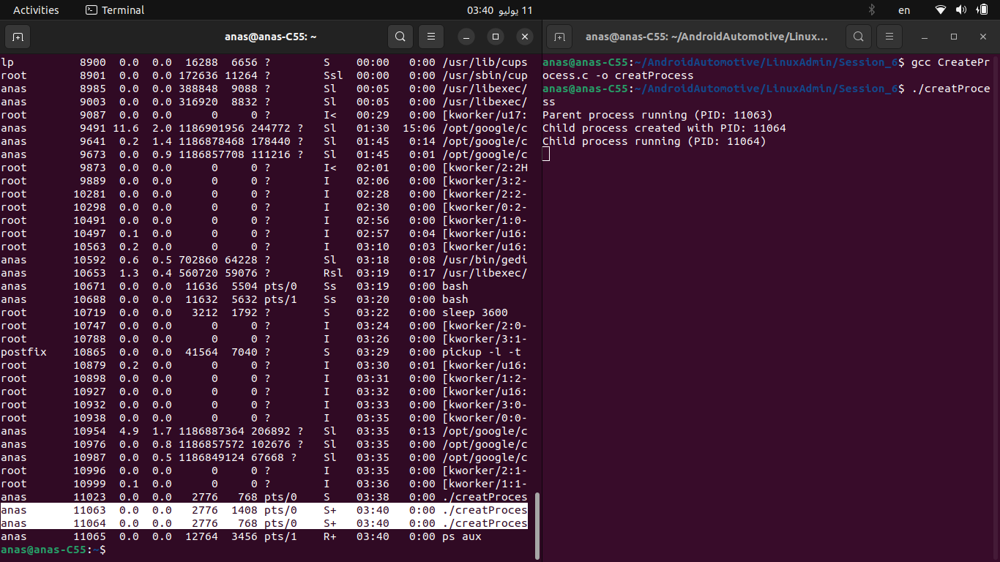

  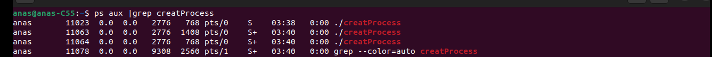

  >**The columns typically show:**
  >
  >- User (`anas` in this case)
  >- PID (Process ID, such as `11063` and `11064`)
  >- %CPU, %MEM (CPU and memory usage)
  >- VSZ (Virtual memory size)
  >- RSS (Resident Set Size, actual memory used)
  >- TTY (Terminal associated)
  >- STAT (Process state)
  >- START (Start time)
  >- TIME (CPU time consumed)
  >- COMMAND (Name of the command or process)
  >
  >**You expected to see two processes from `creatProcess`, but you see three because the `grep` command you used to filter the output (`grep creatProcess`) also appears in the list of processes. This is a common occurrence when using `grep` or similar commands to filter process lists—they include their own process in the results.**
  >
  >*To summarize:*
  >
  >- The two processes with `PID 11063` and `PID 11064` are instances of `creatProcess`.
  >- The third process with `PID 10729` is the `grep` command itself, which is finding and displaying lines containing `creatProcess` from the output of `ps aux`.

  

- **Killing a Process**: Use the `kill` command to terminate a process.

  ```bash
  kill [PID]
  ```

  - **Let's Kill the child process of above c code**

  ```bash
  kill 11064
  ```

##### 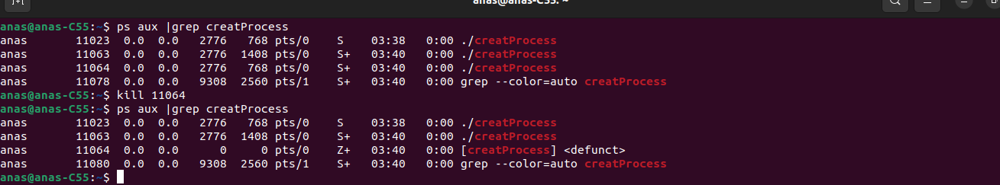

**But what happen 😯😯**

>1. **Initial `ps` Command**:
>   - I ran `ps aux | grep creatProcess` to list processes containing `creatProcess`.
>   - It showed three instances of `creatProcess` (PIDs 11023, 11063, and 11064) and the `grep` command itself (PID 11078).
>2. **Killing Process 11064**:
>   - I executed `kill 11064` to terminate the process with PID 11064.
>3. **Subsequent `ps` Command**:
>   - After killing PID 11064, you ran `ps aux | grep creatProcess` again.
>   - It showed that PID 11064 is now `<defunct>` (`Z+` state), indicating it has become a zombie process.
>   - The other two instances of `creatProcess` (PIDs 11023 and 11063) remain active (`S` and `S+` states respectively).
>   - The `grep` command (PID 11080) also appears in the output.
>
>### Explanation:
>
>- **Zombie Process (PID 11064)**:
>  - When you killed PID 11064, it transitioned to a `<defunct>` or zombie state.
>  - This happens because the child process (PID 11064) completed its execution, but its parent process (likely the shell that spawned it) hasn't yet called `wait()` or `waitpid()` to read its exit status and clean up its entry from the process table.
>- **Remaining Processes**:
>  - PID 11023 and PID 11063 are still running and active instances of `creatProcess`.
>  - PID 11080 is the `grep` command itself that you used to filter the output of `ps`.

- **Example to create a process and kill it correctly**

```c
#include <stdio.h>
#include <stdlib.h>
#include <unistd.h>
#include <sys/types.h>
#include <sys/wait.h>

int main() {
    pid_t pid;

    printf("Parent process (PID: %d)\n", getpid());

    // Create a child process
    pid = fork();
    if (pid == 0) {
        // Child process
        printf("Child process created (PID: %d)\n", getpid());
        printf("Child process is running...\n");
        while(1); // Infinite loop to keep the child process running
        exit(0);  // This line is never reached due to the infinite loop
    } else if (pid > 0) {
        // Parent process
        printf("Parent process created child with PID: %d\n", pid);
        printf("In another terminal, use 'kill %d' to terminate the child process.\n", pid);

        // Wait for child to exit and reap its status
        wait(NULL);
        printf("################################################\n");
        printf("** The child process killed **\n");
        printf("################################################\n");
        printf("Parent process exiting (PID: %d)\n", getpid());
    } else {
        // Error occurred
        perror("fork");
        return 1;
    }

    return 0;
}
```

### Explanation:

1. **Include Statements**:

   - The program includes necessary header files for standard input and output (`stdio.h`), standard library functions (`stdlib.h`), process management (`unistd.h`, `sys/types.h`, `sys/wait.h`).

2. **Main Function**:

   - The `main()` function is the entry point of the program.

3. **Print Parent Process Information**:

   - `printf("Parent process (PID: %d)\n", getpid());` prints the PID (Process ID) of the parent process.

4. **Forking a Child Process**:

   - ```c
     pid = fork();
     ```

      creates a new process. After `fork()`:

     - In the **parent process** (`pid > 0`), `pid` will be the PID of the child process.
     - In the **child process** (`pid == 0`), `pid` will be 0.
     - If an **error** occurs (`pid < 0`), `fork()` returns -1.

5. **Child Process Execution**:

   - When `pid == 0`, the code inside the `if (pid == 0)` block executes:
     - `printf("Child process created (PID: %d)\n", getpid());` prints the child process's PID.
     - `printf("Child process is running...\n");` indicates the child process is running.
     - `while(1);` creates an infinite loop, simulating continuous activity.
     - `exit(0);` is never reached because of the infinite loop; it's good practice to include an exit statement after the loop in real scenarios.

6. **Parent Process Execution**:

   - When `pid > 0`, the code inside the `else if (pid > 0)`block executes:
     - `printf("Parent process created child with PID: %d\n", pid);` prints the PID of the child process created.
     - `printf("In another terminal, use 'kill %d' to terminate the child process.\n", pid);` instructs the user to kill the child process using its PID.
     - `wait(NULL);` waits for the child process to terminate. `wait(NULL)` suspends execution of the parent process until a child process terminates. The argument `NULL` means the parent process waits for any child process to terminate.
     - After the child process terminates, `wait(NULL)`returns, and the parent process continues:
       - `printf("################################################\n");` and subsequent lines print a visual indication that the child process was killed.
       - `printf("Parent process exiting (PID: %d)\n", getpid());` prints a message indicating the parent process is exiting.

7. **Error Handling**:

   - If `fork()` returns a negative value (`pid < 0`), an error occurred. `perror("fork");` prints an error message to the standard error stream (`stderr`), and the program returns 1 to indicate an error.

8. **Return Statement**:

   - `return 0;` at the end of `main()` indicates successful execution of the program.

**Running the Program:**

- Compile the program using a C compiler (`gcc -o creatProcess CreatProcess.c`).
- Run the executable (`./creatProcess`).
- Follow the instructions printed in the terminal to interact with the parent and child processes, particularly to kill the child process using its PID from another terminal session.
------------------------------------------------------------
[CreateProcess&Kill.webm](https://github.com/anaskhamees/AndroidAutomotive/assets/52020047/f28400af-140e-49a8-863e-8c3469129a61)


-------------------------------------------------------------

### 6. Processes Vs Threads

**6.1. Processes**:

- A **process** can be thought of as a program in execution. It includes the program code, data, and resources (like open files and allocated memory) allocated by the operating system.
- **Process Characteristics:**
  - Each process has its own memory space, typically including a stack, heap, and data segments.
  - Processes are independent entities that can execute concurrently.
  - Processes are managed by the operating system kernel, which allocates resources and ensures their isolation and protection from each other.

**6.2. Threads**:

- A **thread** is a lightweight unit of execution within a process. Multiple threads can exist within the same process and share the same memory space, including code, data, and resources.
- **Thread Characteristics:**
  - Threads share memory and resources of the process that created them.
  - Threads within the same process can communicate directly with each other.
  - Threads are lighter weight than processes and typically have lower overhead when switching between them.
  - Threads allow concurrent execution of tasks within a single process, enabling parallelism and multitasking.

**6.3. Relationship between Processes and Threads**:

- **Process vs. Thread**: A process can contain one or multiple threads. Threads within the same process share resources such as memory, file descriptors, and other process-specific attributes.

- **Concurrency and Parallelism**: Threads enable concurrent execution within a single process, while processes allow concurrent execution of multiple tasks or programs. Threads within a process can run concurrently on multiple CPU cores (parallelism) or utilize time slicing on a single core (concurrency).

- **Communication and Synchronization**: Threads within the same process can communicate through shared memory or synchronized mechanisms like semaphores and mutexes. Processes, on the other hand, communicate via inter-process communication (IPC) mechanisms provided by the operating system.

  >**Inter-process communication (IPC)** mechanisms in Linux allow processes to communicate and synchronize with each other. Here are some common IPC mechanisms:
  >
  >1. **Pipes**:
  >   - **Unnamed Pipes**: Used for communication between related processes (parent and child processes). Data written to one end of the pipe can be read from the other end.
  >   - **Named Pipes (FIFOs)**: Allow communication between unrelated processes. Named pipes are represented by a special file in the filesystem.
  >2. **Message Queues**:
  >   - Allow processes to send and receive messages in a queue. Each message can be tagged with a type, and processes can read messages in a non-sequential order based on the message type.
  >3. **Shared Memory**:
  >   - Provides a way for multiple processes to access a common memory region. It is the fastest form of IPC because processes can directly read and write to the shared memory.
  >4. **Semaphores**:
  >   - Used for synchronizing access to shared resources. Semaphores can be used to signal and control access, preventing race conditions and ensuring that only one process accesses a critical section at a time.
  >5. **Sockets**:
  >   - Provide a way for processes to communicate over a network. Sockets can be used for communication between processes on the same machine or different machines over a network.
  >6. **Signals**:
  >   - Used to notify a process that a particular event has occurred. Signals can be used to interrupt a process, handle asynchronous events, or communicate between processes.
  >7. **D-Bus (Desktop Bus)**:
  >   - A message bus system that allows applications to communicate with each other. It is commonly used in desktop environments to facilitate communication between applications and system services.
  >8. **Memory-Mapped Files**:
  >   - Allow processes to map a file or a portion of a file into the process's address space. This allows multiple processes to share data by reading and writing to the mapped file.

  

- **Multithreading**: A single core can execute multiple threads concurrently through **context switching**. This is managed by the operating system scheduler, which alternates between threads to give the appearance of parallel execution. However, only one thread executes at any given moment on a single core.

- **Multicore Execution**: With multiple cores, multiple threads can truly execute in parallel. Each core can independently execute a different thread, allowing for **genuine parallelism**. This significantly increases the overall throughput and responsiveness of the system.

  >**Genuine parallelism,** also known as true parallelism, refers to the simultaneous execution of multiple tasks or processes in a computing environment. In genuine parallelism, multiple processing units (such as CPU cores, processors, or even different machines) execute different tasks at the same time. This is distinct from concurrency, where multiple tasks are managed and executed in overlapping time periods, but not necessarily at the same time.
  >
  >Here are some key points about genuine parallelism:
  >
  >1. **Multiple Processing Units**: Genuine parallelism relies on having multiple processing units available. These can be multiple cores in a single CPU, multiple CPUs in a system, or multiple machines in a distributed computing environment.
  >2. **Simultaneous Execution**: Tasks are executed truly simultaneously. For example, on a multi-core processor, different cores can execute different threads or processes at the same time.
  >3. **Performance Improvement**: Genuine parallelism can significantly improve performance for compute-intensive tasks by dividing the workload across multiple processing units.
  >4. **Parallel Programming**: To achieve genuine parallelism, parallel programming techniques are used. This includes using libraries and frameworks such as OpenMP, MPI (Message Passing Interface), and parallel algorithms that can distribute tasks across multiple processors.
  >5. **Applications**: Genuine parallelism is crucial in high-performance computing (HPC), scientific simulations, real-time processing, data analysis, and other applications where large amounts of data or complex computations need to be processed quickly.
  >
  >### Examples of Genuine Parallelism
  >
  >1. **Multi-core Processors**: Modern CPUs have multiple cores, and each core can execute a separate thread or process. This allows for genuine parallel execution of tasks.
  >2. **GPU Computing**: Graphics Processing Units (GPUs) have many small cores designed for parallel processing. GPUs are used for tasks that can be broken down into smaller, parallelizable computations, such as graphics rendering, machine learning, and scientific simulations.
  >3. **Distributed Systems**: In a distributed computing environment, multiple computers work together to solve a problem. Each computer (or node) processes a portion of the workload in parallel with others.
  >
  >


**Utilization of Cores**:

- **Single-Core**: In a single-core processor, threads share the core's resources and execution time. The operating system scheduler manages thread execution, switching between threads to give the appearance of concurrent execution.
- **Multi-Core**: In a multicore processor, each core can execute its own thread concurrently with other cores. This enables true parallel execution of multiple threads, enhancing performance for multitasking applications and tasks that can be divided into parallel workloads.

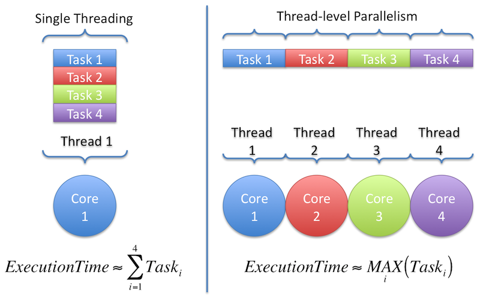


### 7. Process Priorities in Linux

In Linux, Processes priorities, often managed by the operating system, determine the order and urgency with which processes are executed. Prioritization ensures that critical tasks are handled promptly while less critical tasks receive lower priority. Process priorities are managed using the **nice** command and utilities related to process scheduling. The priority range typically spans from -20 (highest priority) to 19 (lowest priority), with 0 being the default priority. Lower numerical values indicate higher priority.

#### 7.1. Viewing Process Priorities

You can view the priorities of running processes using the `ps` command with specific flags.

```bash
ps -eo pid,nice,cmd
```

- **-e**: Selects all processes.

- **-o pid,nice,cmd**: Specifies the output format to include process ID (`pid`), nice value (`nice`), and command (`cmd`).

  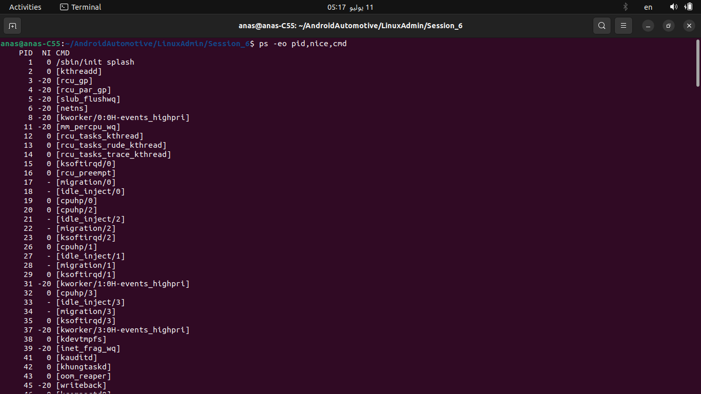


#### 7.2. Setting Process Priorities

You can adjust process priorities using the **nice** command or its variants:

- **nice**: Adjusts a process's scheduling priority.

```bash
nice -n <value> <command>
```

- **-n <value>**: Specifies the priority adjustment value (range: -20 to 19).
- **<command>**: The command to execute with the adjusted priority.

**Example:**

```bash
nice -n 10 ./my_script.sh
```

- This command executes `my_script.sh` with a nice value of 10, making it lower priority (less urgent) compared to default (0).

#### 7.3. Renicing a Running Process

You can change the priority of a running process using **renice**:

```bash
renice <value> -p <pid>
```

- **<value>**: New nice value to assign to the process (range: -20 to 19).
- **-p <pid>**: Process ID of the running process.

**Example:**

```bash
renice -5 -p 1234
```

- This command changes the priority of process with ID 1234 to a nice value of -5, giving it higher priority (more urgent) compared to default.

#### Explanation:

- **Nice Value**: Determines a process's priority relative to other processes. Lower nice values indicate higher priority (more favorable scheduling by the OS).

- Commands:

  - **ps**: Displays information about active processes.
  - **nice**: Adjusts the scheduling priority of a command at launch.
  - **renice**: Changes the scheduling priority of a running process.


### 8. Signals

In Linux, signals are software interrupts that can be sent to processes to notify them of certain events or to instruct them to perform specific actions. Each signal type has a unique number and name, and they are used for various purposes like process control, communication, and handling of system events. Here's an explanation of common signals with commands and step-by-step explanations:

#### 8.1. Common Signals in Linux:

1. **SIGINT (2)**:

   - **Purpose**: Interrupt signal, often generated by the user pressing `Ctrl+C` in the terminal to interrupt a running process.

   - Command Example: Sending SIGINT to a process.

     ```bash
    kill -2 <PID>
     ```
     
     - Replace `<PID>` with the Process ID of the process you want to send the signal to. You can find the PID using `ps` command.

2. **SIGKILL (9)**:

   - **Purpose**: Kill signal, forces termination of a process immediately. It cannot be caught or ignored by the process.

   - Command Example: Sending SIGKILL to a process.

     ```bash
    kill -9 <PID>
     ```
     
     - Replace `<PID>` with the Process ID.

3. **SIGTERM (15)**:

   - **Purpose**: Termination signal, requests a process to terminate. Allows the process to perform cleanup operations before exiting.

   - Command Example: Sending SIGTERM to a process.

     ```bash
    kill -15 <PID>
     ```
     
     - Replace `<PID>` with the Process ID.

4. **SIGHUP (1)**:

   - **Purpose**: Hangup signal, often used to instruct a process to reload configuration files or restart.

   - Command Example: Sending SIGHUP to a process.

     ```bash
  kill -1 <PID>
     ```
     
     - Replace `<PID>` with the Process ID.

5. **SIGSTOP (19)**:

   - **Purpose**: Stop signal, suspends (pauses) a process. Similar to pressing `Ctrl+Z` in the terminal.

   - Command Example : Sending SIGSTOP to a process.

     ```bash
     kill -19 <PID>
     ```
     
     - Replace `<PID>` with the Process ID.

#### 8.2. Sending Signals Using Commands:

To send a signal to a process, you use the `kill` command followed by the signal name or number and the Process ID (PID).

#### Step-by-Step Example:

1. **Identify the Process ID (PID)**:

   - Use `ps`command to find the PID of the process you want to send the signal to. For example, to find the PID of a process named firefox

     ```bash
     ps aux | grep firefox
     ```

     - This command lists all processes (`ps aux`) and filters (`grep`) for processes containing `firefox` in their name.

2. **Send Signal**:

   - Use `kill`with the appropriate signal option:

   -  `-2`for SIGINT, `-9`for SIGKILL, etc.) followed by the PID.

     ```bash
     kill -<signal_number> <PID>
     ```
     
     - For example, to send SIGKILL (9) to Firefox:

       ```bash
       kill -9 <PID>
       ```
     
       - Replace `<PID>` with the actual Process ID obtained from the previous step.


### 8.3. Job Control Commands:

In Linux shells (like Bash), you can manage jobs (processes) running in the background or foreground using job control commands:

- **bg**: Move a job to run in the background.

  ```bash
  bg %<job_number>
  ```

- **fg**: Bring a background job to the foreground.

  ```bash
  fg %<job_number>
  ```

  >In Linux, the `fg` command is used to bring a background job to the foreground, making it the active process in the current terminal session. Here's how the `fg` command works and how you can use it effectively
  >
  >- **fg**: Stands for "foreground". It is a built-in command in most Unix-like shells, including Bash.
  >- **%job_number**: Optional argument specifying the job number of the background job you want to bring to the foreground. If no job number is provided, `fg` brings the most recently suspended job to the foreground.

  - **jobs**: List all jobs currently running or suspended.

  ```bash
  jobs
  ```

##### Running Scripts in the Background:

To run a script or command in the background, append an ampersand (`&`) at the end of the command line:

```bash
./script.sh &
```

This starts `script.sh` in the background, allowing you to continue using the terminal for other tasks.


######################## I will Complete them soon ##############################

### 9. QNX 

### 10. micro service

### 11. monotonic OS

### 12. monolithic OS

