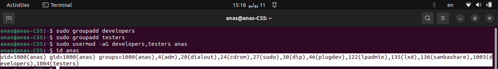
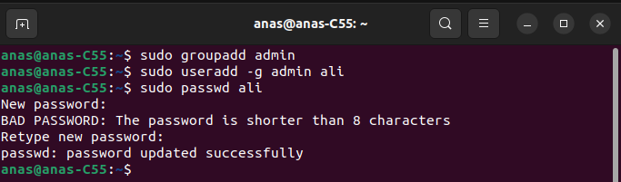

# Admin Linux

### Table of Content

-----------------

- **File Types**

- **User Groups**
- **User Permissions**


## 1. File Types

#### 1.1. Regular File (`-`)

>contains data that is typically in a plain text or binary format and is not associated with any special device or driver.
>
>- **Content**: Regular files store data in a straightforward format, such as text documents, images, executables, or any other type of user-generated data.
>
>- **Structure**: They are organized as a stream of bytes without any internal structure known to the operating system. The structure and interpretation of the data are typically defined by the application that reads or writes to the file.
>
>- **Permissions**: Regular files have permissions that define who can read, write, or execute them. These permissions are set for the owner of the file, the group associated with the file, and others (users not in the group or owner).
>
>- **Attributes**: They can have attributes such as ownership (user and group), size, timestamps (creation, modification, and access times), and permissions.
>
>- **Filesystem Location**: Regular files are typically located within directories on the filesystem. They are represented by inodes (index nodes), which contain metadata about the file, including its location on disk, permissions, and other attributes.
>
>**Examples of regular files include text files (`*.txt`), source code files (`*.c`, `*.cpp`, `*.java`), binary executables, images (`*.jpg`, `*.png`), and more.** 

```bash
touch regularfile.txt
echo "This is a regular file" > regularfile.txt
ls -l regularfile.txt
```

Output:

```bash
-rw-r--r-- 1 user user 22 Jul 10 12:00 regularfile.txt
```

>**File Permissions (`-rw-r--r--`)**:
>
>- The first part `-rw-r--r--` indicates the file's permissions.
>- `rw-` indicates that the owner (`user`) has read (`r`) and write (`w`) permissions.
>- `r--` indicates that the group (`user`) has read (`r`) permission only.
>- `r--` also indicates that others (users not in the group or owner) have read (`r`) permission only.
>- These permissions (`-rw-r--r--`) are typical for a regular file where the owner can read and modify the file, while others can only read it.
>
>**Number of Hard Links (`1`)**:
>
>- The number `1` after the permissions indicates the number of hard links to the file.
>- Hard links are multiple directory entries pointing to the same inode (file or directory structure).
>- For a regular file, the number of hard links is usually `1`, indicating it has a single name in the file system.
>
>**Owner and Group (`user user`)**:
>
>- The owner of the file is `user`, and the group associated with the file is also `user`.
>- This means the user `user` owns the file, and members of the `user` group have group-level permissions.
>
>**File Size (`22`)**:
>
>- `22` indicates the size of the file in bytes.
>- In this case, `regularfile.txt` is 22 bytes in size.
>
>**Last Modified Date and Time (`Jul 10 12:00`)**:
>
>- `Jul 10 12:00` shows the date and time when the file was last modified.
>- In this example, the file `regularfile.txt` was last modified on July 10 at 12:00 (noon).
>
>**File Name (`regularfile.txt`)**:
>
>- `regularfile.txt` is the name of the file.
>
>


#### 1.2. Directory (`d`)

>is a special type of file that serves as a container or folder for storing files and other directories. Directories provide a hierarchical structure for organizing and managing files on the filesystem. Here are the key characteristics of directories:
>
>1. **Purpose**: Directories are used to organize and group related files and subdirectories. They provide a logical structure that helps users and applications organize their data efficiently.
>2. **Representation**: Directories are represented as files themselves, but they contain entries that point to other files and directories within them. Each entry consists of a filename and an inode number, which uniquely identifies the file or directory.
>3. **Hierarchy**: Directories can be nested within each other, forming a hierarchical tree-like structure. The top-most directory in the hierarchy is known as the root directory (`/`), which contains all other directories and files on the filesystem.
>4. **Access Control**: Like regular files, directories have permissions that control who can read (`r`), write (`w`), and execute (`x`) them. These permissions apply to listing the contents of the directory (`r`), creating or deleting files within it (`w`), and accessing files or directories within it (`x`).
>5. **Special Entries**: Directories contain special entries `.` (dot) and `..` (dot-dot):
>   - `.` refers to the current directory itself.
>   - `..` refers to the parent directory (the directory containing the current directory).
>6. **Operations**: Users and applications can perform various operations on directories, such as creating new files or directories (`mkdir`), removing files or directories (`rm`), navigating between directories (`cd`), and listing directory contents (`ls`).
>7. **Filesystem Navigation**: Directories are essential for navigating and accessing files on the filesystem. They provide a structured way to locate and organize data stored on disks or other storage devices.
>
>**Examples of directories include `/home` (containing user home directories), `/bin` (containing essential binaries), `/etc` (configuration files), and any custom directories created by users or applications.**
>
>

```bash
mkdir mydirectory
ls -ld mydirectory
```

Output:

```bash
drwxr-xr-x 2 user user 4096 Jul 10 12:00 mydirectory
```

>**File Type and Permissions (`drwxr-xr-x`)**:
>
>- The first part `drwxr-xr-x` indicates the file type and permissions.
>- `d` indicates that `mydirectory` is a directory.
>- `rwx` (for the owner `user`) indicates read (`r`), write (`w`), and execute (`x`) permissions.
>- `r-x` (for the group `user`) indicates read (`r`) and execute (`x`) permissions, but no write (`w`) permission.
>- `r-x` (for others) indicates read (`r`) and execute (`x`) permissions, but no write (`w`) permission.
>- These permissions (`drwxr-xr-x`) mean that the owner (`user`) can read, write, and execute files within `mydirectory`, while others can only read and execute files within it.
>
>**Number of Hard Links (`2`)**:
>
>- The number `2` after permissions indicates the number of hard links to the directory.
>- Hard links are multiple directory entries pointing to the same inode (file or directory structure).
>- For a directory, the number of hard links typically includes the directory itself (`.`) and its parent directory (`..`), so it's common to see `2` here.
>
>**Owner and Group (`user user`)**:
>
>- The owner of the directory is `user`, and the group associated with the directory is also `user`.
>- This means the user `user` owns the directory, and members of the `user` group have group-level permissions.
>
>**Directory Size (`4096`)**:
>
>- `4096` indicates the size of the directory in bytes.
>- Directories typically occupy a fixed amount of space regardless of the number of files they contain due to the way file system structures are organized.
>
>**Last Modified Date and Time (`Jul 10 12:00`)**:
>
>- `Jul 10 12:00` shows the date and time when the directory was last modified.
>- In this example, `mydirectory` was last modified on July 10 at 12:00 (noon).
>
>**Directory Name (`mydirectory`)**:
>
>- `mydirectory` is the name of the directory.

#### 1.3. Character Device File (`c`)

>character device file** (or character special device) is a type of file that provides access to devices that transfer data one character at a time. These devices typically include terminals, serial ports, printers, and other devices that interact with data in a sequential or stream-oriented manner. Here are the key characteristics of character device files:
>
>1. **Data Transfer**: Character devices transfer data in a character-by-character manner, meaning they handle data as a continuous stream of bytes without any fixed block size. This is suitable for devices that operate on a continuous data flow, such as keyboards, mice, and sound cards.
>2. **Representation**: Character devices are represented as special files (`/dev/...`) in the filesystem. They are accessed similarly to regular files but interact with the underlying hardware or driver to perform specific functions.
>3. **No Internal Structure**: Unlike regular files, character devices do not have any internal structure known to the operating system. They do not store data persistently but facilitate real-time communication with hardware devices.
>4. **Device Drivers**: Character devices are associated with device drivers that manage the communication between the device and the operating system. These drivers handle the specifics of how data is transferred to and from the device.
>5. **Device Numbers**: Character devices are identified by major and minor device numbers. These numbers differentiate between different types of devices (major number) and instances of the same type of device (minor number).
>6. **Access Control**: Permissions (`rwx`) on character device files control who can read from, write to, or execute the device. Typically, these permissions are set to allow access by specific users or groups, depending on the device's intended use.
>7. **Examples**: Examples of character devices include `/dev/tty` (terminal), `/dev/ttyUSB0` (USB serial port), `/dev/audio` (audio device), and `/dev/null` (null device for discarding data).

```bash
sudo mknod /dev/mychardev c 89 1
ls -l /dev/mychardev
```

>#### 1. `sudo mknod /dev/mychardev c 89 1`
>
>- `sudo`: Executes the following command with superuser (root) privileges.
>- `mknod`: Command used to create special files (in this case, a device node).
>- `/dev/mychardev`: Specifies the path and name of the device node to create (`mychardev` in the `/dev` directory).
>- `c`: Specifies that you're creating a character special file type.
>- `89`: Major number assigned to the device.
>- `1`: Minor number assigned to the device.
>
>##### Explanation of Major and Minor Numbers:
>
>- **Major number**: Identifies the type of device (in this case, `89` could correspond to a specific type of device).
>- **Minor number**: Typically used to differentiate between multiple devices of the same type controlled by the same driver.
>
>##### 2. `ls -l /dev/mychardev`
>
>- `ls -l`: Command to list detailed information about files or directories.
>- `/dev/mychardev`: Path to the device node (`mychardev`) in the `/dev` directory.
>
>

**Output:**

```bash
crw-r--r-- 1 root root 89, 1 Jul 10 12:00 /dev/mychardev
```

>**File Type (`c`)**:
>
>- `c` indicates that `mychardev` is a character special device node.
>- Character special devices are used for devices that operate character by character, such as terminals and serial ports.
>
>**Permissions (`crw-r--r--`)**:
>
>- `c`: Indicates it's a character special device.
>- `rw-r--r--`: Specifies the permissions for the device node.
>  - The first character (`c`) denotes the type of file (`c` for character special device).
>  - The next nine characters `rw-r--r--` specify permissions:
>    - `rw-`: Owner (`root`) has read (`r`) and write (`w`) permissions.
>    - `r--`: Group (`root`) has read (`r`) permission only.
>    - `r--`: Others have read (`r`) permission only.
>
>**Number of Hard Links (`1`)**:
>
>- `1` indicates that there is only one link to this device node.
>- Hard links are additional names (directory entries) pointing to the same file or device node.
>
>**Owner and Group (`root root`)**:
>
>- `root root`: Indicates that the owner (`root`) and group (`root`) of the device node are both set to `root`.
>- `root` is typically the superuser or administrator in Unix-like systems, having full access rights.
>
>**Device Numbers (`89, 1`)**:
>
>- `89`: Major number associated with the device.
>  - Major number identifies the type of device or the driver associated with it.
>- `1` : Minor number associated with the device.
>  - Minor number typically differentiates between multiple devices of the same type controlled by the same driver.
>
>**Last Modification Date and Time (`Jul 10 12:00`)**:
>
>- `Jul 10 12:00`: Shows the date and time when the device node was last modified.
>- For device nodes, this typically reflects the last time the node's metadata was updated, rather than the content of the device itself.
>
>**File Name (`/dev/mychardev`)**:
>
>- `/dev/mychardev`: Path to the device node within the `/dev` directory.
>- `/dev` is a directory on Unix-like systems where device nodes are typically stored.

#### 1.4. Block Device File (`b`)

>**block device file** (or block special device) is a type of file that provides access to devices that transfer data in fixed-size blocks or chunks. These devices typically include hard drives, solid-state drives (SSDs), USB storage devices, and other storage media where data is organized and accessed in fixed-sized blocks. Here are the key characteristics of block device files:
>
>1. **Data Transfer**: Block devices transfer data in fixed-size blocks or sectors. These blocks are typically larger than single characters and can range in size depending on the device and filesystem configuration. Block devices are suitable for storage media where data is accessed in chunks, such as reading and writing files on a disk.
>2. **Representation**: Block devices are represented as special files (`/dev/...`) in the filesystem. They are accessed similarly to regular files but interact with the underlying hardware or driver to perform specific functions related to block-level operations.
>3. **Structured Data**: Unlike character devices, which transfer data as a continuous stream of bytes, block devices handle data in structured blocks or sectors. These blocks can be read from or written to independently, making them suitable for random access and efficient data storage.
>4. **Device Drivers**: Block devices are associated with device drivers that manage the communication between the device and the operating system. These drivers handle low-level operations such as reading and writing data blocks, managing data caches, and handling error correction.
>5. **Device Numbers**: Block devices are identified by major and minor device numbers. The major number identifies the type of device or the driver associated with it, while the minor number differentiates between multiple instances or partitions of the same type of device.
>6. **Access Control**: Permissions (`rwx`) on block device files control who can read from, write to, or execute the device. These permissions are typically set to allow access by specific users or groups based on the device's intended use.
>7. **Examples**: Examples of block devices include `/dev/sda` (hard drive), `/dev/nvme0n1` (NVMe SSD), `/dev/mmcblk0` (SD card), and `/dev/md0` (software RAID device).

```bash
sudo mknod /dev/myblockdev b 89 1
ls -l /dev/myblockdev
```

Output:

```bash
brw-r--r-- 1 root root 89, 1 Jul 10 12:00 /dev/myblockdev
```

>**File Type (`b`)**:
>
>- `b` indicates that `myblockdev` is a block special device node.
>- Block special devices are used for devices that operate in blocks or chunks of data, such as hard drives and SSDs.
>
>**Permissions (`brw-r--r--`)**:
>
>- `b`: Indicates it's a block special device.
>- `rw-r--r--` : Specifies the permissions for the device node.
>  - The first character (`b`) denotes the type of file (`b` for block special device).
>  - The next nine characters `rw-r--r--`specify permissions:
>    - `rw-`: Owner (`root`) has read (`r`) and write (`w`) permissions.
>    - `r--`: Group (`root`) has read (`r`) permission only.
>    - `r--`: Others have read (`r`) permission only.
>
>**Number of Hard Links (`1`)**:
>
>- `1` indicates that there is only one link to this device node.
>- Hard links are additional names (directory entries) pointing to the same file or device node.
>
>**Owner and Group (`root root`)**:
>
>- `root root`: Indicates that the owner (`root`) and group (`root`) of the device node are both set to `root`.
>- `root` is typically the superuser or administrator in Unix-like systems, having full access rights.
>
>**Device Numbers (`89, 1`)**:
>
>- `89`: Major number associated with the device.
>  - Major number identifies the type of device or the driver associated with it.
>- `1`: Minor number associated with the device.
>  - Minor number typically differentiates between multiple devices of the same type controlled by the same driver.
>
>**Last Modification Date and Time (`Jul 10 12:00`)**:
>
>- `Jul 10 12:00`: Shows the date and time when the device node was last modified.
>- For device nodes, this typically reflects the last time the node's metadata was updated, rather than the content of the device itself.
>
>**File Name (`/dev/myblockdev`)**:
>
>- `/dev/myblockdev`: Path to the device node within the `/dev` directory.
>- `/dev` is a directory on Unix-like systems where device nodes are typically stored.

#### 1.5. Named Pipe (FIFO) (`p`)

>**Named Pipe**, also known as a **FIFO** (First In, First Out), is a special type of file that provides a mechanism for inter-process communication (IPC) between processes. It allows processes to communicate with each other, passing data in a way that resembles the use of regular pipes (`|` in shell scripting), but with some key differences and advantages:
>
>**File Representation**:
>
>- Named pipes are represented as special files in the filesystem (`/dev/fifo` or simply by their name).
>- They appear like regular files but have properties that allow processes to both read from and write to them in a non-blocking manner.
>
>**Persistent**:
>
>- Unlike unnamed pipes (pipes created using the `|` operator in shell), named pipes persist beyond the lifetime of the processes that create them.
>- They remain on the filesystem until they are explicitly deleted using `rm` or `unlink`, or until the system is rebooted.
>
>**Unidirectional Communication**:
>
>- Named pipes provide unidirectional communication channels between processes.
>- Data written to the named pipe by one process can be read by another process that has appropriate permissions to access the pipe.
>
>**FIFO Principle**:
>
>- Named pipes follow the FIFO principle, meaning data written to the pipe by one process is read in the order it was written by the receiving process(es).
>
>**Access Control**:
>
>- Access to named pipes is controlled using file permissions (`chmod` and `chown`), just like regular files.
>- This allows administrators to restrict which processes or users can read from or write to the named pipe.
>
>**Use Cases**:
>
>- Named pipes are commonly used for communication between related processes, where one process produces data and another consumes it (e.g., logging systems, data processing pipelines).
>- They are also useful in scenarios where multiple processes need to coordinate their activities or share data efficiently.

```bash
mkfifo mypipe
ls -l mypipe
```

Output:

```bash
prw-r--r-- 1 user user 0 Jul 10 12:00 mypipe
```

>- `prw-r--r--`: This indicates the file type and permissions of the named pipe.
>
>- `p`: Indicates it's a named pipe (`p` for pipe).
>- `rw-r--r--`: Specifies the permissions (`rw-` for read and write permissions for the owner, `r--` for read-only permissions for the group and others).
>
>- `1`: Indicates the number of hard links to the file.
>
>- `user user`: Indicates the owner and group of the file (`user` in this case).
>
>- `0`: Indicates the size of the named pipe (since named pipes don't store data, their size is typically 0.
>
>- `Jul 10 12:00`: Indicates the date and time when the named pipe was last modified.
>
>- `mypipe`: Indicates the name of the named pipe.

#### 1.6. Socket (`s`)

>**socket** is a special type of file used for inter-process communication (IPC) between processes on the same host or across a network. Sockets provide a bidirectional communication channel that allows processes to exchange data. They are widely used in networking applications for communication between clients and servers, as well as for inter-process communication within the same system.
>
>1. **File Representation**:
>   - Sockets are represented as special files (`/dev/socket` or simply by their name) in the filesystem.
>   - They behave like files but are distinct from regular files or named pipes due to their specific purpose in facilitating communication.
>2. **Network and IPC**:
>   - **Network Sockets**: Used for communication between processes running on different hosts over a network (e.g., TCP/IP sockets).
>   - **Unix Domain Sockets**: Used for communication between processes on the same host using file system paths.
>3. **Types of Sockets**:
>   - **Stream Sockets (TCP)**: Provide reliable, bidirectional, and sequenced communication streams between two endpoints. Used in protocols like TCP.
>   - **Datagram Sockets (UDP)**: Provide connectionless, unreliable, and unordered communication. Used in protocols like UDP.
>   - **Raw Sockets**: Allow direct access to underlying network protocols and can be used for low-level network monitoring and packet manipulation.
>4. **Communication Paradigm**:
>   - Sockets use a client-server communication paradigm where one process (server) listens for incoming connections and another process (client) initiates the connection.
>   - They support multiple clients connecting to a single server (e.g., web servers handling multiple clients simultaneously).
>5. **Creation and Usage**:
>   - Sockets are created using system calls (`socket()`, `bind()`, `listen()` for servers; `connect()` for clients) in programming languages like C, Python, and others.
>   - They are managed by the operating system's networking stack, which handles routing, data buffering, and error handling.
>6. **Security and Access Control**:
>   - Access to sockets is controlled by the operating system using file permissions and networking configuration.
>   - Network sockets may be protected by firewalls and other network security measures to restrict access to authorized parties.

```bash
sudo socat UNIX-LISTEN:/tmp/mysocket,fork EXEC:/bin/cat &
ls -l /tmp/mysocket
```

>- `sudo`: Runs the `socat` command with elevated privileges.
>
>- `socat`: A command-line utility that establishes bidirectional data transfers between two data channels (e.g., sockets, files, pipes).
>
>- `UNIX-LISTEN:/tmp/mysocket`: Specifies that `socat`should listen for connections on a Unix domain socket named `/tmp/mysocket`
>
>  - `UNIX-LISTEN` indicates that this is a Unix domain socket.
>  - `/tmp/mysocket` is the path to the socket file.
>
>- `,fork`: This option tells `socat`to fork a new process for each incoming connection.
>
>  - This allows multiple clients to connect to the socket simultaneously, with each client handled by a separate instance of `/bin/cat`.
>
>- `EXEC:/bin/cat`: Specifies that for each connection received on `/tmp/mysocket`, `socat`
>
>   should execute `/bin/cat`.
>
>  - `/bin/cat` is a simple command that reads data from its standard input (in this case, the socket) and writes it to its standard output (which will be connected back to the client via the socket).
>
>- `&`: Runs the `socat` command in the background, allowing you to continue using the terminal.
>
>**Impact and Usage:**
>
>- After running this command, `socat` listens for connections on `/tmp/mysocket`.
>- When a client connects to `/tmp/mysocket`, `socat` spawns a new instance of `/bin/cat` to handle the client's communication.
>- `/bin/cat` echoes back whatever it receives from the client, essentially acting as a simple data relay between the client and server (in this case, `socat`).
>
>**Checking the Socket (`ls -l /tmp/mysocket`):**
>
>- After running the `socat` command, you can use `ls -l /tmp/mysocket` to check the details of the Unix domain socket file.
>
>**Output Explanation (`ls -l /tmp/mysocket`):**
>
>- The output of 
>
>  ```bash
>  ls -l /tmp/mysocket
>  ```
>
>   typically shows details such as:
>
>  - File permissions (`prwxr-xr-x`): `p` indicates it's a named pipe (Unix domain socket), `rwx` indicates read, write, and execute permissions for the owner, and `r-x` indicates read and execute permissions for group and others.
>  - Number of links (usually `1` for a single socket).
>  - Owner and group (`root root`).
>  - File size (`0` for sockets, as they do not store data).
>  - Last modified timestamp (`Jul 10 12:00`), indicating when the socket file was last modified.
>  - File name (`/tmp/mysocket`), confirming the path and name of the socket file.

Output:

```bash
srwxr-xr-x 1 user user 0 Jul 10 12:00 /tmp/mysocket
```

>**File Type and Permissions (`srwxr-xr-x`)**:
>
>- `s`: Indicates that this file is a Unix domain socket. This is specific to Unix-like systems and denotes a special type of file used for inter-process communication (IPC) within the same host.
>- `rwxr-xr-x`: Represents the file permissions.
>  - `rwx` (owner permissions): The owner (`user` in this case) has read (`r`), write (`w`), and execute (`x`) permissions.
>  - `r-x` (group permissions): The group (`user` group) has read (`r`) and execute (`x`) permissions, but no write permission (`-`).
>  - `r-x` (others permissions): Users outside the owner's group have read (`r`) and execute (`x`) permissions, but no write permission (`-`).
>
>**Number of Links (`1`)**:
>
>- `1`: Indicates the number of hard links to the file. For Unix domain sockets, this is typically `1`.
>
>**Owner and Group (`user user`)**:
>
>- `user`: Indicates that the owner of the file is `user`.
>- `user`: Indicates that the group of the file is `user`.
>
>**File Size (`0`)**:
>
>- `0`: Indicates the size of the socket file. Unix domain sockets do not store data like regular files, so their size is always `0`.
>
>**Last Modified Timestamp (`Jul 10 12:00`)**:
>
>- `Jul 10 12:00`: Shows the date and time when the socket file was last modified.
>
>**File Name (`/tmp/mysocket`)**:
>
>- `/tmp/mysocket`: Specifies the path and name of the socket file.
>
>

**simplified example of creating and using a TCP/IP socket in Python:**

>```python
>import socket
># Create a TCP/IP socket
>server_socket = socket.socket(socket.AF_INET, socket.SOCK_STREAM)
>
># Bind the socket to a specific address and port
>server_socket.bind(('localhost', 8888))
>
># Listen for incoming connections (max 5 clients in queue)
>server_socket.listen(5)
>
># Accept incoming connections
>client_socket, client_address = server_socket.accept()
>
># Receive data from the client
>data = client_socket.recv(1024)
>print(f"Received: {data.decode()}")
>
># Send a response back to the client
>client_socket.sendall(b"Hello from server!")
>
># Close the connection
>client_socket.close()
>server_socket.close()
>```
>
>In this example:
>
>- `socket.socket()` creates a TCP/IP socket (`socket.AF_INET` for IPv4 and `socket.SOCK_STREAM` for stream-based communication).
>- `bind()` binds the socket to localhost (`'localhost'`) on port 8888.
>- `listen()` prepares the socket to accept incoming connections, with a backlog queue of 5 clients.
>- `accept()` blocks and waits for a client to connect, returning a new socket (`client_socket`) and client address (`client_address`).
>- `recv()` and `sendall()` are used to receive data from and send data to the client socket.
>- Finally, `close()` closes the client and server sockets after communication is complete.

#### 1.7. Symbolic Link (`l`)

1. >**symbolic link**, also known as a **symlink** or **soft link**, is a special type of file that points to another file or directory in the filesystem. Unlike a hard link, which points directly to the inode of a file, a symbolic link contains the path to the target file or directory. This means it acts as a shortcut or reference to the target rather than a direct link at the filesystem level.
   >
   >1. **File Representation**:
   >   - Symbolic links appear as separate files in the filesystem, distinct from the target file or directory.
   >   - They are created using the `ln -s` command or similar utilities, specifying the target file or directory and the name of the symbolic link.
   >2. **Pointer to Target**:
   >   - A symbolic link contains the path or location of the target file or directory.
   >   - It does not contain the data or contents of the target but serves as a reference to it.
   >3. **Dereferencing**:
   >   - Accessing a symbolic link dereferences it, meaning the operating system follows the link to access the target file or directory.
   >   - Changes to the target file or directory are reflected when accessed through the symbolic link.
   >4. **Cross-Filesystem Links**:
   >   - Symbolic links can point to files or directories located on different filesystems or partitions.
   >   - They provide flexibility in organizing files and directories across filesystem boundaries.
   >5. **Permissions and Ownership**:
   >   - Symbolic links have their own permissions and ownership settings.
   >   - Permissions apply to the link itself, not to the target file or directory.
   >6. **Use Cases**:
   >   - Creating short, convenient paths to frequently accessed files or directories.
   >   - Simplifying directory structures by providing alternative access points to files or directories located elsewhere.
   >   - Facilitating software installations where components may be relocated without breaking references.

   ```bash
   ln -s /path/to/target symlinkname
   ls -l symlinkname
   ```

   >- **`ln`**: This is the command used to create links between files.
   >
   >- **`-s`**: This option specifies that we are creating a symbolic link (symlink) rather than a hard link. Symbolic links are created with `-s`, whereas hard links are created without any option.
   >
   >- **`/path/to/target`**: This is the absolute or relative path to the target file or directory that you want to create a symbolic link to. Replace `/path/to/target` with the actual path of the file or directory you want to link to.
   >
   >- **`symlinkname`**: This is the name of the symbolic link that will be created. It can be any valid filename you choose.

   **Output:**

   ```bash
   lrwxrwxrwx 1 user user 14 Jul 10 12:00 symlinkname -> /path/to/target
   ```

   >**File Type and Permissions (`lrwxrwxrwx`)**:
   >
   >- `l`: Indicates that `symlinkname` is a symbolic link.
   >- `rwxrwxrwx`: Represents the file permissions.
   >  - `rwx`: The owner (`user`) has read (`r`), write (`w`), and execute (`x`) permissions on the symbolic link.
   >  - `rwx`: The group (`user` group) also has read, write, and execute permissions.
   >  - `rwx`: Others (users not in the owner's group) have read, write, and execute permissions.
   >
   >**Number of Links (`1`)**:
   >
   >- `1`: Specifies the number of hard links to the file. For symbolic links, this is typically `1`.
   >
   >**Owner and Group (`user user`)**:
   >
   >- `user`: Indicates that the owner of `symlinkname` is `user`.
   >- `user`: Specifies that the group of `symlinkname` is `user`.
   >
   >**File Size (`14`)**:
   >
   >- `14`: Represents the size of the symbolic link file. This is the length of the target path (`/path/to/target`), including the terminating null byte.
   >
   >**Last Modified Timestamp (`Jul 10 12:00`)**:
   >
   >- `Jul 10 12:00`: Shows the date and time when the symbolic link `symlinkname` was last modified.
   >
   >**Symbolic Link Details (`symlinkname -> /path/to/target`)**:
   >
   >- `symlinkname`: The name of the symbolic link.
   >- `->`: Indicates that `symlinkname` is a symbolic link pointing to the file or directory specified next.
   >- `/path/to/target`: Specifies the path to the target file or directory that `symlinkname` points to.


### 2. User Groups

When creating a user in Linux, the user is assigned to a primary group and can also be added to one or more secondary groups. Here's an explanation and examples of how to manage users and groups.

#### 2.1. Primary Group

- **Primary Group**: Each user has a primary group that is created when the user is created. The primary group is typically the same as the username.
- **Command to create a user with a primary group**: `useradd username`

#### 2.2. Secondary Groups

- **Secondary Groups**: Users can also be added to additional groups. These are known as secondary groups. Secondary groups are useful for providing additional permissions to the user.
- **Command to add a user to secondary groups**: `usermod -aG group1,group2 username`

#### 2.3. Examples

1. **Create a User**

   ```bash
   sudo useradd anas
   ```

   This command creates a user named `anas`. By default, it also creates a group named `anas` and assigns it as `anas's` primary group.

2. **Set Password for the User**

   ```bash
   sudo passwd anas
   ```

   This command sets a password for the user `anas`.

3. **Create Secondary Groups**

   ```bash
   sudo groupadd developers
   sudo groupadd testers
   ```

   These commands create two groups named `developers` and `testers`.

4. **Add User to Secondary Groups**

   ```bash
   sudo usermod -aG developers,testers anas
   ```

   This command adds the user `anas` to the `developers` and `testers` groups as secondary groups.

5. **Check User and Group Information**

   ```bash
   id anas
   ```

   **Output:**

   ```bash
   uid=1000(anas) gid=1000(anas) groups=1000(anas),4(adm),20(dialout),24(cdrom),27(sudo),30(dip),46(plugdev),122(lpadmin),135(lxd),136(sambashare),1003(developers),1004(testers)
   
   ```
   
   >1. **User ID (`uid=1000(anas)`)**:
   >   - `uid`: Stands for User ID.
   >   - `1000`: Numerical User ID (UID) assigned to the user `anas`.
   >   - `(anas)`: Username associated with UID `1000`.
   >2. **Primary Group (`gid=1000(anas)`)**:
   >   - `gid`: Stands for Group ID.
   >   - `1000`: Numerical Group ID (GID) of the primary group of user `anas`.
   >   - `(anas)`: Group name associated with GID `1000`.
   >3. **Supplementary Groups (`groups=...`)**:
   >   - `groups`: Lists the supplementary groups that user `anas` belongs to, in addition to their primary group.
   >4. **Group Memberships (Supplementary Groups)**:
   >   - Each entry after `groups=` represents a supplementary group membership in the format `GID(group_name)`.
   >   - **Supplementary Groups Explained**:
   >     - `1000(anas)`: The primary group membership of user `anas`.
   >     - `4(adm)`: Group with GID `4` named `adm`.
   >     - `20(dialout)`: Group with GID `20` named `dialout`.
   >     - `24(cdrom)`: Group with GID `24` named `cdrom`.
   >     - `27(sudo)`: Group with GID `27` named `sudo`.
   >     - `30(dip)`: Group with GID `30` named `dip`.
   >     - `46(plugdev)`: Group with GID `46` named `plugdev`.
   >     - `122(lpadmin)`: Group with GID `122` named `lpadmin`.
   >     - `135(lxd)`: Group with GID `135` named `lxd`.
   >     - `136(sambashare)`: Group with GID `136` named `sambashare`.
   >     - `1003(developers)`: Group with GID `1003` named `developers`.
   >     - `1004(testers)`: Group with GID `1004` named `testers`.
   >
   >### Summary:
   >
   >- **User ID (`uid`)**: Numeric identifier for the user `anas`.
   >- **Primary Group (`gid`)**: Numeric identifier for the primary group `anas` that `anas` belongs to.
   >- **Supplementary Groups (`groups`)**: List of additional groups (`adm`, `dialout`, `cdrom`, `sudo`, `dip`, `plugdev`, `lpadmin`, `lxd`, `sambashare`, `developers`, `testers`) that `anas` belongs to.
   >- Each entry in the `groups` section shows the Group ID (GID) followed by the corresponding group name in parentheses.

​	


#### 2.4. User Group Commands

1. **Creating a User with a Specific Primary Group**

   ```bash
   sudo useradd -g groupname username
   ```

2. **Adding User to Secondary Groups**

   ```bash
   sudo usermod -aG group1,group2 username
   ```

3. **Creating a Group**

   ```bash
   sudo groupadd groupname
   ```

4. **Checking User Information**

   ```bash
   id username
   ```

5. **Listing All Groups**

   ```bash
   cat /etc/group
   ```

6. **Listing All Users**

   ```bash
   cat /etc/passwd
   ```

### Detailed Example

1. **Create User with Specific Primary Group**

   ```bash
   sudo groupadd admin
   ```

   >This command creates a new group named `admin` with administrative privileges.
   >
   >- **`sudo`**: Executes the command with superuser (administrative) privileges.
   >- **`groupadd`**: Command to create a new group.
   >- **`admin`**: The name of the group to be created.

   ```bash
   sudo useradd -g admin ali
   ```

   >This command creates a new user account named `ali` and assigns them to the `admin` group as their primary group.
   >
   >- **`sudo`**: Executes the command with superuser privileges.
   >- **`useradd`**: Command to add a new user to the system.
   >- **`-g admin`**: Specifies that the primary group for the new user `ali` should be `admin`.
   >- **`ali`**: The username of the new user to be created.

   ```bash
   sudo passwd ali
   ```

   >1. This command prompts you to set a new password for the user `belal`. After running this command, you'll typically be asked to enter and confirm the new password for `ali`.
   >
   >- **`sudo`**: Executes the command with superuser privileges.
   >- **`passwd`**: Command to set or change the password for a user account.
   >- **`ali`**: The username for which the password will be set.

   

   >- **Creating a Group (`sudo groupadd admin`)**: This creates a new group named `admin`, which can be used to grant specific permissions and access to users.
   >
   >- **Adding a User (`sudo useradd -g admin ali`)**: This creates a new user named `ali` and assigns them to the `admin` group as their primary group. Users in the `admin` group typically have elevated privileges.
   >- **Setting a Password (`sudo passwd ali`)**: This sets a password for the existing user `ali`, allowing them to log in and access the system securely.

2. **Add User to Secondary Groups**

   ```bash
   sudo groupadd devops
   sudo groupadd linuxAdmin
   sudo usermod -aG devops,linuxAdmin ali
   ```

   This adds `ali` to `devops` and `linuxAdmin` as secondary groups.

3. **Verify User's Groups**

   ```bash
   id ali
   ```

   Output:

   ```bash
   uid=2001(ali) gid=1005(admin) groups=1005(admin),1006(devops),1007(linuxAdmin)
   
   ```


## 3. Permissions

 In Linux, file permissions control the actions that users can perform on files and directories. There are three types of basic permissions and several special permissions. Here's a detailed overview:

### 3.1. Basic Permissions

Each file and directory has three types of permissions for three different categories of users:

1. **Owner (u)**: The user who owns the file.
2. **Group (g)**: The group that owns the file.
3. **Others (o)**: All other users.

The three types of permissions are:

1. **Read (r)**: Permission to read the file or list the directory's contents.
2. **Write (w)**: Permission to modify the file or directory's contents.
3. **Execute (x)**: Permission to execute the file (if it's a script or program) or access the directory.

### 3.2. Viewing Permissions

Use the `ls -l` command to view the permissions of files and directories: `ls -l`

Output example:

```bash
-rwxr-xr-- 1 user group  4096 Jul 10 12:00 filename
```

- `-rwxr-xr--`: The first character indicates the file type (`-` for regular files, `d` for directories, etc.).
- `rwxr-xr--`: The next nine characters represent the permissions for the owner, group, and others.

### 3.3. Changing Permissions

Use the `chmod` command to change file permissions:

```bash
chmod [permissions] [filename]
```

Permissions can be set using symbolic or numeric modes.

#### Symbolic Mode

- `u` (user/owner), `g` (group), `o` (others), `a` (all)
- `+` (add), `-` (remove), `=` (set)

Example:

```bash
chmod u+x filename      # Add execute permission for the owner
chmod g-w filename      # Remove write permission for the group
chmod o=r filename      # Set read-only permission for others
chmod a=rwx filename    # Set read, write, and execute permissions for all
```

#### Numeric Mode

- Read (r) = 4
- Write (w) = 2
- Execute (x) = 1

Example:

```bash
chmod 755 filename      # rwxr-xr-x
chmod 644 filename      # rw-r--r--
chmod 777 filename      # rwxrwxrwx
```

#### 3.3.1. Examples symbolic mode

- **Example 1: Add execute permission for the owner**

```bash
chmod u+x filename
```

- `u`: Refers to the user (owner).
- `+`: Means add the permission.
- `x`: Represents execute permission.

**Use case**: This is often used to make a script or program executable by its owner.

- **Example 2: Remove write permission for the group**

```bash
chmod g-w filename
```

- `g`: Refers to the group.
- `-`: Means remove the permission.
- `w`: Represents write permission.

**Use case**: This can be used to prevent a group from modifying a file.

- **Example 3: Set read-only permission for others**

```bash
chmod o=r filename
```

- `o`: Refers to others.
- `=`: Sets the permission exactly to the specified value.
- `r`: Represents read permission.

**Use case**: This ensures that all other users can only read the file, not write or execute it.

- **Example 4: Set read, write, and execute permissions for all**

```bash
chmod a=rwx filename
```

- `a`: Refers to all users (user, group, and others).
- `=`: Sets the permission exactly to the specified value.
- `rwx`: Represents read, write, and execute permissions.

**Use case**: This gives full permissions to everyone, which is rarely advisable for security reasons but might be useful for temporary or specific purposes.

#### 3.3.2. Examples with Numeric Mode

The `chmod` command in numeric mode allows you to set permissions using a three-digit octal number.

- **Example 1: Set permissions to rwxr-xr-x**

```bash
chmod 755 filename
```

- `7` (rwx): Owner has read, write, and execute permissions.
- `5` (r-x): Group has read and execute permissions.
- `5` (r-x): Others have read and execute permissions.

**Use case**: Common for scripts and programs where the owner needs full control, and others can execute but not modify.

- **Example 2: Set permissions to rw-r--r--**

```bash
chmod 644 filename
```

- `6` (rw-): Owner has read and write permissions.
- `4` (r--): Group has read-only permissions.
- `4` (r--): Others have read-only permissions.

**Use case**: Common for configuration files where the owner can modify, and others can only read.

- **Example 3: Set permissions to rwxrwxrwx**

```bash
chmod 777 filename
```

- `7` (rwx): Owner has read, write, and execute permissions.
- `7` (rwx): Group has read, write, and execute permissions.
- `7` (rwx): Others have read, write, and execute permissions.

**Use case**: Allows everyone full access to the file, generally not recommended for security reasons.


-----------------

## I will organize soooooooooon the following section


### 3.4. Special Permissions

In Linux, special permissions provide additional control over how files and directories are accessed and executed. There are three special permissions:**Setuid (Set User ID)**, **Setgid (Set Group ID)**, **Sticky Bit**

#### 3.4.1. Setuid (Set User ID)

When the setuid bit is set on an executable file, it allows users to execute the file with the permissions of the file's owner. This is typically used for programs that require elevated privileges.

1. **Create a Test Script:**

   ```bash
   echo -e "#!/bin/bash\n echo 'Current user: $(whoami)'" > test_script.sh
   ```

   >- **`echo -e`**:
   >
   >  - `echo` is a command that prints text to the terminal.
   >
   >  - The `-e` option enables interpretation of backslash escapes, allowing special characters like `\n` (newline) to be processed.
   >
   >- **`#!/bin/bash`**:
   >
   >  - This is the shebang line that tells the system to use the Bash shell to interpret the script.
   >
   >  - `#!/bin/bash` ensures that the script will run in the Bash shell environment.
   >
   >- **`\n`**:
   >  - This represents a newline character, which moves the cursor to the next line in the script.
   >
   >- **`echo 'Current user: $(whoami)'`**:
   >
   >  - This is the actual command within the script that prints the current user's name.
   >
   >  - `$(whoami)` is a command substitution that gets replaced by the output of the `whoami` command, which returns the username of the current user.
   >
   >- **`> test_script.sh`**:
   >  - This redirects the output of the `echo` command to a file named `test_script.sh`, effectively creating or overwriting the file with the script content.
   >
   >

2. **Make the Script Executable:**

   ```bash
   chmod +x test_script.sh
   ```

3. **Change Owner to Root (for demonstration purposes):**

   ```bash
   sudo chown root test_script.sh
   ```

4. **Set the Setuid Bit:**

   - **Symbolic Mode:**

     ```bash
     sudo chmod u+s test_script.sh
     ```

     >1. **`sudo`**:
     >   - `sudo` stands for "superuser do."
     >   - It allows a permitted user to execute a command as the superuser (root) or another user, as specified by the security policy.
     >   - In this command, `sudo` is used because changing the setuid bit on a file typically requires superuser privileges.
     >2. **`chmod`**:
     >   - `chmod`  stands for change mode ,is a Unix command used to change the file system modes or permissions of files and directories.
     >3. **`u+s`**:
     >   - `u` refers to the user (the owner of the file).
     >   - `+s` adds the setuid (Set User ID) bit to the file's permissions.
     >   - When the setuid bit is set on an executable file, it means that the file will be executed with the privileges of the file's owner rather than the user who is running the file.
     >4. **`test_script.sh`**:
     >   - This is the name of the file to which the command is being applied.
     >
     >

   - **Numeric Mode:**

     ```bash
     sudo chmod 4755 test_script.sh
     ```
     
     >1. **sudo**: Runs the command with superuser (root) privileges. This is necessary to change the permissions to certain special modes like the setuid bit.
     >2. **chmod 4755**: Changes the permissions of the file. The numeric mode `4755` has specific meanings:
     >   - `4`: This sets the setuid bit. When a file with the setuid bit set is executed, the process that runs this file will have the privileges of the file's owner, rather than the privileges of the user who is running the file.
     >   - `7`: The owner (user) has read (`4`), write (`2`), and execute (`1`) permissions.
     >   - `5`: The group has read (`4`) and execute (`1`) permissions.
     >   - `5`: Others (everyone else) have read (`4`) and execute (`1`) permissions.
     >
     >So, the permissions `4755` mean:
     >
     >- The setuid bit is set.
     >- The owner can read, write, and execute the file.
     >- The group can read and execute the file.
     >- Others can read and execute the file.
     >
     >1. **test_script.sh**: This is the file whose permissions are being changed.
     >
     >

5. **Verify Permissions:**

   ```bash
   ls -l test_script.sh
   ```

   Output:

   ```bash
   -rwsr-xr-x 1 root root 32 Jul 10 12:00 test_script.sh
   ```

   >- `-rwsr-xr-x`
   >
   >  :
   >
   >  - The first character (`-`) indicates the file type. In this case, `-` means it is a regular file.
   >
   >  - The next nine characters (
   >
   >    ```
   >    rwsr-xr-x
   >    ```
   >
   >    ) represent the file permissions:
   >
   >    - `rws`: The owner's permissions. The owner can read (`r`), write (`w`), and execute (`x`) the file. The `s` instead of `x` indicates that the setuid bit is set, meaning the file will run with the owner's privileges.
   >    - `r-x`: The group's permissions. The group can read (`r`) and execute (`x`) the file, but not write (`-`).
   >    - `r-x`: The permissions for others (everyone else). Others can read (`r`) and execute (`x`) the file, but not write (`-`).
   >
   >##### Links
   >
   >- **`1`**: The number of hard links to the file. In this case, there is one link.
   >
   >##### Owner and Group
   >
   >- `root root`
   >
   >  :
   >
   >  - The first `root` indicates the file's owner.
   >  - The second `root` indicates the file's group.
   >
   >##### Size
   >
   >- **`32`**: The size of the file in bytes. This file is 32 bytes.
   >
   >##### Timestamp
   >
   >- **`Jul 10 12:00`**: The last modification date and time of the file. This file was last modified on July 10th at 12:00.
   >
   >##### File Name
   >
   >- **`test_script.sh`**: The name of the file.
   >
   >

6. **Run the Script:**

   ```bash
   ./test_script.sh
   ```

   Expected Output:

   ```bash
   Current user: root
   ```

#### 3.4.2. Setgid (Set Group ID)

When the setgid bit is set on a directory, files created within the directory inherit the group ownership of the directory rather than the primary group of the user who created the file. For executable files, it allows users to run the file with the permissions of the file's group.

#### Example 

1. **Create a Directory:**

   ```bash
   mkdir test_dir
   ```

2. **Change Group Ownership (for demonstration purposes):**

   ```bash
   sudo chown :groupname test_dir
   ```

   - **`sudo`**

     - **`sudo`** stands for "superuser do."

     - It allows a permitted user to execute a command as the superuser (root) or another user, as specified by the security policy.

     - In this case, it is used to execute the `chown` command with elevated privileges, which is often necessary for changing ownership of system files or files not owned by the current user.

   - **`chown`**

     - **`chown`** stands for "change owner."
     - It is a command used to change the ownership of files and directories.
     - The basic syntax of `chown` is `chown [OPTIONS] USER:GROUP FILE`, where `USER` is the new owner and `GROUP` is the new group.

     - **`:groupname`**

     - In the `chown` command, specifying `:groupname` without a username changes only the group ownership.

     - **`groupname`** is the name of the group to which you want to change the group ownership of `test_dir`.

     - The colon (`:`) before `groupname` indicates that only the group ownership is being modified, not the user ownership.

   - **`test_dir`**
     - **`test_dir`** is the name of the directory (or file) whose group ownership you want to change.

   

   3. **Set the Setgid Bit**

      The Setgid (Set Group ID) bit is a special permission that can be set on directories. When the Setgid bit is set on a directory, new files and directories created within it inherit the group ownership of the directory rather than the creating user's default group.

      **Symbolic Mode**

   ```bash
   sudo chmod g+s test_dir
   ```

   - **`sudo`**: Executes the command with superuser privileges.
   - **`chmod`**: Changes the file mode bits (permissions) of a file or directory.
   - **`g+s`**: Adds the Setgid bit. The `g` specifies the group, and `+s` adds the Setgid bit.
   - **`test_dir`**: The directory on which the Setgid bit is being set.

   #####  Numeric Mode

   ```bash
   sudo chmod 2755 test_dir
   ```

   - **`sudo`**: Executes the command with superuser privileges.
   - **`chmod`**: Changes the file mode bits (permissions) of a file or directory.
   - `2755`: The numeric representation of the permissions you are setting.
     - The first digit (`2`) sets the Setgid bit.
     - The following three digits (755) set the standard read, write, and execute permissions.
       - `7` corresponds to read (`r`), write (`w`), and execute (`x`) permissions for the owner.
       - `5` corresponds to read (`r`) and execute (`x`) permissions for the group.
       - `5` corresponds to read (`r`) and execute (`x`) permissions for others.

   So, `2755` means the directory has read, write, and execute permissions for the owner, and read and execute permissions for the group and others, with the Setgid bit set.

   **Verify Permissions**

   To verify that the permissions have been set correctly, you can use the `ls -ld` command:

   ```bash
   ls -ld test_dir
   ```

   This command lists the directory's detailed information, including its permissions, ownership, and other attributes.

   ###  Output:

   ```bash
   drwxr-sr-x 2 user groupname 4096 Jul 10 12:00 test_dir
   ```

   >- **`drwxr-sr-x`**:
   >  - `d`: Indicates it is a directory.
   >  - `rwx`: Read, write, and execute permissions for the owner.
   >  - `r-s`: Read and execute permissions for the group, with the Setgid bit set (`s` replaces the `x`).
   >  - `r-x`: Read and execute permissions for others.
   >- **`2`**: Number of hard links to the directory.
   >- **`user`**: Owner of the directory.
   >- **`groupname`**: Group owner of the directory.
   >- **`4096`**: Size of the directory in bytes.
   >- **`Jul 10 12:00`**: Last modification date and time.
   >- **`test_dir`**: Name of the directory.
   >

   

   **Create a File in the Directory:**

   ```bash
   touch test_dir/newfile
   ```

4. **Verify Group Ownership of the New File:**

   ```bash
   ls -l test_dir/newfile
   ```

   Output:

   ```bash
   -rw-r--r-- 1 user groupname 0 Jul 10 12:00 newfile
   ```

### 

### Read Permissions

Commands that need read permissions typically require access to the contents of a file or directory. Examples include:

1. **cat**: Displays the contents of a file.

   ```bash
   cat filename
   ```

2. **less/more**: Views the contents of a file one screen at a time.

   ```bash
   less filename
   more filename
   ```

3. **head/tail**: Views the beginning or end of a file.

   ```bash
   head filename
   tail filename
   ```

4. **grep**: Searches for patterns in a file.

   ```bash
   grep "pattern" filename
   ```

5. **find**: Searches for files and directories.

   ```bash
   find /path -name filename
   ```

6. **ls**: Lists directory contents.

   ```bash
   ls
   ```

7. **stat**: Displays detailed information about a file or directory.

   ```bash
   stat filename
   ```

### Write Permissions

Commands that need write permissions typically modify the contents of a file or directory. Examples include:

1. **touch**: Creates an empty file or updates the timestamp of a file.

   ```bash
   touch filename
   ```

2. **echo**: Writes a string to a file (often used with redirection).

   ```bash
   echo "text" > filename
   ```

3. **nano/vim**: Edits a file using a text editor.

   ```bash
   nano filename
   vim filename
   ```

4. **rm**: Deletes a file.

   ```bash
   rm filename
   ```

5. **mv**: Moves or renames a file or directory.

   ```bash
   mv oldname newname
   ```

6. **cp**: Copies a file or directory.

   ```bash
   cp source destination
   ```

7. **mkdir**: Creates a new directory.

   ```bash
   mkdir dirname
   ```

8. **rmdir**: Deletes an empty directory.

   ```bash
   rmdir dirname
   ```

9. **chmod**: Changes file permissions.

   ```bash
   chmod 755 filename
   ```

10. **chown**: Changes file owner and group.

    ```bash
    chown user:group filename
    ```

11. **truncate**: Shrinks or extends the size of a file to the specified size.

    ```bash
    truncate -s 0 filename
    ```

### Execute Permissions

Commands that need execute permissions typically require the ability to run a file as a program or script, or to access a directory. Examples include:

1. **./script.sh**: Executes a script.

   ```bash
   ./script.sh
   ```

2. **bash**: Executes a script with the Bash shell.

   ```bash
   bash script.sh
   ```

3. **sh**: Executes a script with the SH shell.

   ```bash
   sh script.sh
   ```

4. **python**: Runs a Python script.

   ```bash
   python script.py
   ```

5. **java**: Runs a Java program.

   ```bash
   java Program
   ```

6. **gcc**: Compiles and runs C programs (needs execute permission for the resulting binary).

   ```bash
   gcc program.c -o program
   ./program
   ```

7. **find**: If using the `-exec` option, it requires execute permissions on the target files.

   ```bash
   find /path -name "*.sh" -exec chmod +x {} \;
   ```

8. **mkdir**: Needs execute permission on the parent directory to create a new directory within it.

   ```bash
   mkdir newdir
   ```

9. **cd**: Changes the current directory, requiring execute permission on the target directory.

   ```bash
   cd targetdir
   ```

### Summary

- **Read Permissions**: Required for commands that read file contents or list directory contents (e.g., `cat`, `ls`, `grep`).
- **Write Permissions**: Required for commands that modify file contents or directory structure (e.g., `touch`, `rm`, `mv`).
- **Execute Permissions**: Required for commands that execute scripts, programs, or change directories (e.g., `./script.sh`, `cd`).


### **Create Files by Different Users (simulated)**

#### Step 1.1: Create a File as the Current User

```bash
touch shared_dir/file1
```

- **`touch shared_dir/file1`**: The `touch` command is used to create an empty file named `file1` inside the `shared_dir` directory. This file is created by the current user, who owns this session in the terminal.

#### Step 1.2: Create a File as Another User

```bash
sudo -u anotheruser touch shared_dir/file2
```

- **`sudo`**: This command allows you to run programs with the security privileges of another user (by default, as the superuser).
- **`-u anotheruser`**: This option tells `sudo` to run the command as `anotheruser` instead of the default superuser.
- **`touch shared_dir/file2`**: This command, run as `anotheruser`, creates an empty file named `file2` inside the `shared_dir` directory.

In this setup:

- `file1` is owned by the current user.
- `file2` is owned by `anotheruser`.

### 2. **Verify that Only File Owners Can Delete Their Files**

#### Step 2.1: Attempt to Delete `file2` as the Current User

```bash
rm shared_dir/file2  # Permission denied if not owner
```

- **`rm shared_dir/file2`**: The `rm` command is used to remove (delete) the file named `file2` inside the `shared_dir` directory.
- If you try to delete `file2` as the current user (who did not create `file2`), you should get a "Permission denied" error. This is because the sticky bit on `shared_dir` prevents users from deleting files they do not own.

#### Step 2.2: Delete `file2` as `anotheruser`

```bash
sudo -u anotheruser rm shared_dir/file2  # Successful if owner
```

- **`sudo -u anotheruser rm shared_dir/file2`**: This command uses `sudo` to run the `rm` command as `anotheruser`, who is the owner of `file2`.
- Since `anotheruser` owns `file2`, this command will successfully delete `file2`.

### Recap

1. **Creating Files**:
   - You created `file1` as the current user.
   - You created `file2` as `anotheruser`.
2. **Verifying Deletion Permissions**:
   - Attempting to delete `file2` as the current user results in a **"Permission denied"** error because the sticky bit prevents non-owners from deleting files in the directory.
   - Deleting `file2` as `anotheruser` is successful because `anotheruser` is the owner of the file.

--------------------------------------------------------------

#### Summary

- **Setuid:**
  - Symbolic: `chmod u+s filename`
  - Numeric: `chmod 4755 filename`
- **Setgid:**
  - Symbolic: `chmod g+s filename` or `chmod g+s directory`
  - Numeric: `chmod 2755 filename` or `chmod 2755 directory`
- **Sticky Bit:**
  - Symbolic: `chmod +t directory`
  - Numeric: `chmod 1777 directory`

---------------------------------------------------

### Tricks in Permissions

### 1. groupmems Command

The `groupmems` command is used to administer memberships in a group. It allows the administrator to manage which users are members of a specified group. This command is part of the `shadow` package and is useful for modifying group memberships directly from the command line.

### `groupmems` Command Syntax

```bash
groupmems -g groupname [options]
```

- **`-g groupname`**: Specifies the group for which you want to manage memberships.
- **`[options]`**: Various options to add, delete, or list members of the group.

### Common Options

- **`-a username`**: Add a user to the specified group.
- **`-d username`**: Delete a user from the specified group.
- **`-l`**: List the members of the specified group.
- **`-h`**: Display help information for the `groupmems` command.

### Examples

#### 1. Add a User to a Group

```bash
sudo groupmems -g groupname -a username
```

- **`sudo`**: Runs the command with superuser privileges.
- **`groupmems -g groupname -a username`**: Adds the specified `username` to the `groupname` group.

#### 2. Delete a User from a Group

```bash
sudo groupmems -g groupname -d username
```

- **`sudo`**: Runs the command with superuser privileges.
- **`groupmems -g groupname -d username`**: Deletes the specified `username` from the `groupname` group.

#### 3. List Members of a Group

```bash
groupmems -g groupname -l
```

- **`groupmems -g groupname -l`**: Lists all the members of the specified `groupname` group.

### Example Scenario

Let's assume you have a group named `developers` and you want to manage its members.

#### Adding a User to the Group

```bash
sudo groupmems -g developers -a john
```

This command adds the user `john` to the `developers` group.

#### Deleting a User from the Group

```bash
sudo groupmems -g developers -d john
```

This command removes the user `john` from the `developers` group.

#### Listing Members of the Group

```bash
groupmems -g developers -l
```

This command lists all users who are members of the `developers` group.

### Summary

- **`groupmems`** is a command for managing group memberships.
- **`-g groupname`** specifies the group.
- Options:
  - `-a username`: Adds a user to the group.
  - `-d username`: Deletes a user from the group.
  - `-l`: Lists the members of the group.
  - `-h`: Displays help information.
