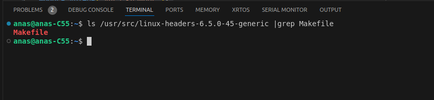
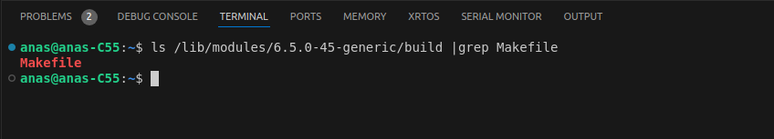
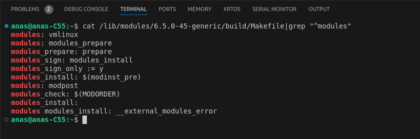
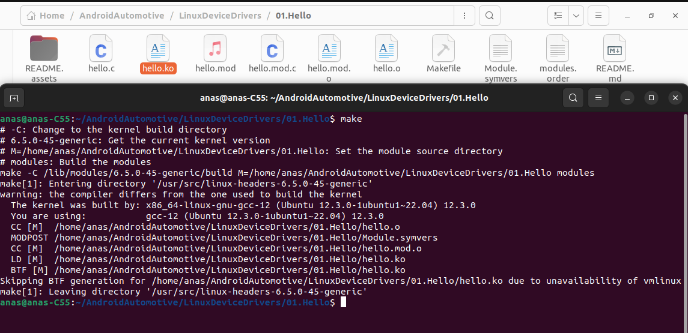
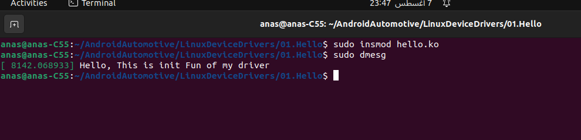
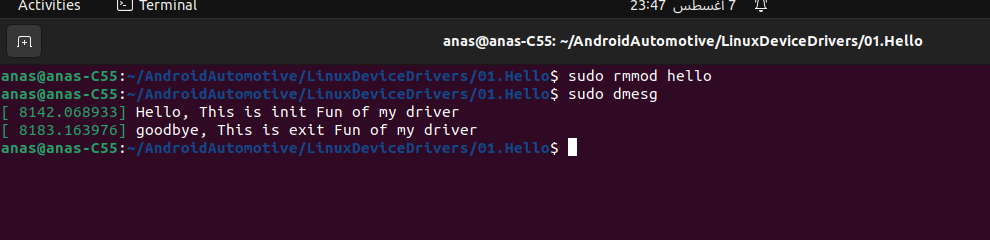

## Pseduo Device Driver

A virtual device driver (VDD) or pseudo device driver is a software component that emulates a physical device within an operating system. These drivers allow the OS and applications to interact with hardware as if it were present, even though it might not physically exist.

### How Pseudo Device Drivers Work

1. **Kernel Integration**:
   - Pseudo device drivers are integrated into the kernel just like real hardware drivers. They register themselves with the kernel and provide the necessary interfaces for communication.
2. **Resource Management**:
   - The kernel may allocate resources such as memory or CPU time to these pseudo devices, just as it would for real hardware devices. This allows the pseudo device to perform its tasks efficiently.
3. **Interaction with the Kernel**:
   - The kernel interacts with the pseudo device driver through standard device driver interfaces. The driver handles these interactions and provides responses as if it were controlling real hardware.
4. **Abstracting Hardware**:
   - Although there’s no actual hardware, the pseudo device driver can manage software resources or provide virtualized services. For example, a pseudo device might manage a memory buffer or provide a virtual file system.

### Examples and Use Cases

- **/dev/null and /dev/zero**:
  - `/dev/null`: Acts like a "black hole" where any data written to it is discarded. The kernel interacts with it as if it were a real device that can receive data.
  - `/dev/zero`: Provides a continuous stream of null characters (zeros) when read. The kernel thinks it’s a device providing data.
- **Loopback Network Interface (lo)**:
  - This pseudo network device allows the system to send network traffic to itself. The kernel treats it like any other network device, even though no physical network hardware is involved.
- **Virtual Consoles**:
  - In Unix-like systems, virtual consoles (e.g., accessed via Ctrl+Alt+F1 to F6) are managed by pseudo device drivers. They allow multiple terminal sessions without the need for multiple physical terminals.

### Benefits

- **Testing and Development**:
  - Pseudo device drivers are invaluable for software development and testing. Developers can simulate hardware conditions and test their applications without needing the actual hardware.
- **System Flexibility**:
  - These drivers provide flexible solutions for managing resources and services within the system, enhancing overall functionality and efficiency.
- **Cost-Effective**:
  - By eliminating the need for physical hardware, pseudo device drivers reduce costs associated with purchasing and maintaining hardware.

###  Example for virtual Device driver

```c
#include <linux/module.h>

MODULE_LICENSE("GPL");
MODULE_AUTHOR("Ansa Khamees");
MODULE_DESCRIPTION("A simple Hello World Kernel Module");

static int __init mydriver_init(void)
{
    /* - The KERN_INFO log level should ensure that the message is displayed. Other common log levels include KERN_DEBUG, KERN_WARNING, KERN_ERR.
       - Don't remove the \n to run the driver correctly*/
    printk(KERN_INFO "Hello, This is init Fun of my driver\n");
    return 0;
}

static void __exit mydriver_exit(void)
{
    /*- Don't remove the \n to run the driver correctly*/
    printk(KERN_INFO "goodbye, This is exit Fun of my driver\n");
}

module_init(mydriver_init);
module_exit(mydriver_exit);
```

To compile the driver ,we can not use gcc , because this code will run in **kernel space** NOT in user space So, the GNU library not exist in kernel space. We will use **Makefile** of the kernel (Not **make** of user space).

I configured VS code before (in the last README file )to compile the code in kernel space.

- Go to kernel header directory to ensure the **makefile** of kernel is exist.

  

- Write **Makefile** to compile my device driver 

  ```makefile
  # Specify the name of the module object file (my device driver)
  obj-m += hello.o
  all:
  	make -C /lib/modules/$(shell uname -r)/build M=$(PWD) modules
  clean:
  	make -C /lib/modules/$(shell uname -r)/build M=$(PWD) clean
  
  ```

#### Specifying the Module Object

```makefile
obj-m += hello.o
```

- **obj-m**: This variable is used to specify the object files that make up the kernel module (dynamic device driver).
- **hello.o**: This tells the build system that the module to be built is named `hello` and its source file is `hello.c`.

#### Building the Module

```makefile
all:
	make -C /lib/modules/$(shell uname -r)/build M=$(PWD) modules
```

- **all**: This is a target in the Makefile that will be run when you simply type `make` in the terminal.

- **Changing Directory**:

  - `make -C /lib/modules/$(shell uname -r)/build`: This command tells `make` to change the directory to the build directory of the currently running kernel.

  - `/lib/modules/$(shell uname -r)/build`: This directory is a symbolic link to the directory where the kernel headers and build files for the currently running kernel are located. This directory contains the Makefile and other necessary files for building kernel modules.

    

- **Getting the Current Kernel Version**:

  - `$(shell uname -r)`: This command gets the current kernel version, which ensures the module is built against the correct version.

- **Setting the Module Source Directory**:

  - `M=$(PWD)`: This sets the variable `M` to the current directory (`$(PWD)`), indicating where the external module source code is located.

- **Building the Modules**:

  - `modules`: This is the target that tells the kernel build system to build the modules in the directory specified by `M`.

    

- **M=$(PWD)**: This sets the variable `M` to the current directory (`$(PWD)`), indicating where the external module source code is located.
- **modules**: This target tells the kernel build system to build modules in the directory specified by `M`.

#### Cleaning Up

```makefile
clean:
	make -C /lib/modules/$(shell uname -r)/build M=$(PWD) clean
```

- **clean**: This is another target in the Makefile that will be run when you type `make clean` in the terminal.
- **make -C /lib/modules/$(shell uname -r)/build**: As before, this changes the directory to the kernel build directory.
- **M=$(PWD) clean**: This tells the kernel build system to clean up the module build files in the current directory.


#### Compile the device driver




### insert the Kernel module (my device driver)

- Clear Kernel Messages 

  ```bash
  sudo dmesg -C
  ```

- Insert **.KO** file

  ```bash
  sudo insmod hello.ko
  ```

  - The output is : 

    

> **"loading out-of-tree module"**: This means that the module (`hello.ko`) is not part of the official kernel tree. It is an external or third-party module.
>
> **"taints kernel"**: Loading out-of-tree modules will taint the kernel. Tainted kernels are less likely to be supported by official kernel developers.


- Load the kernel module (my device driver)



- Remove the kernel module

   
