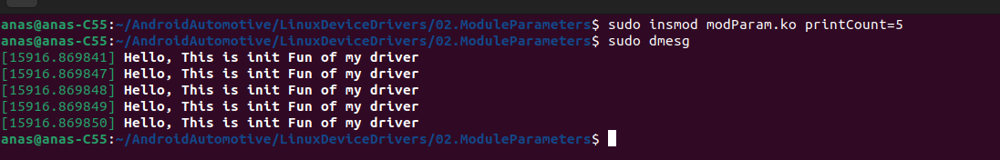
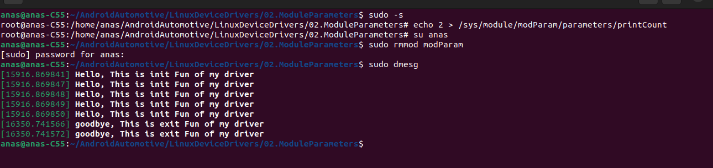
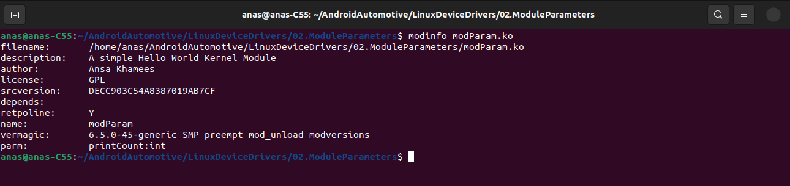

## Kernel Module Parameters

```c
#include <linux/module.h>
#include <linux/moduleparam.h>

MODULE_LICENSE("GPL");
MODULE_AUTHOR("Ansa Khamees");
MODULE_DESCRIPTION("A simple Hello World Kernel Module");

int printCount=0;
module_param(printCount,int,0664);
static int __init mydriver_init(void)
{
    int i=0;
    for(i=0;i<printCount;i++)
	    printk("Hello, This is init Fun of my driver\n");
    return 0;
}

static void __exit mydriver_exit(void)
{
    int i=0;
    for(i=0;i<printCount;i++)
        printk("goodbye, This is exit Fun of my driver\n");
}

module_init(mydriver_init);
module_exit(mydriver_exit);
```




- I will change the printCount paramerter in run time to print the exit message 2 times onlyyyy

  

  

- Kernel Module Information

  
