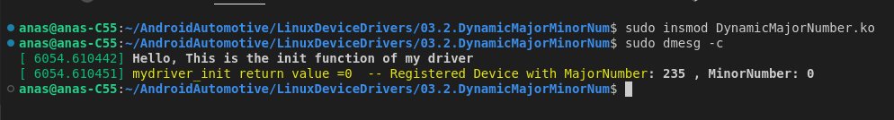
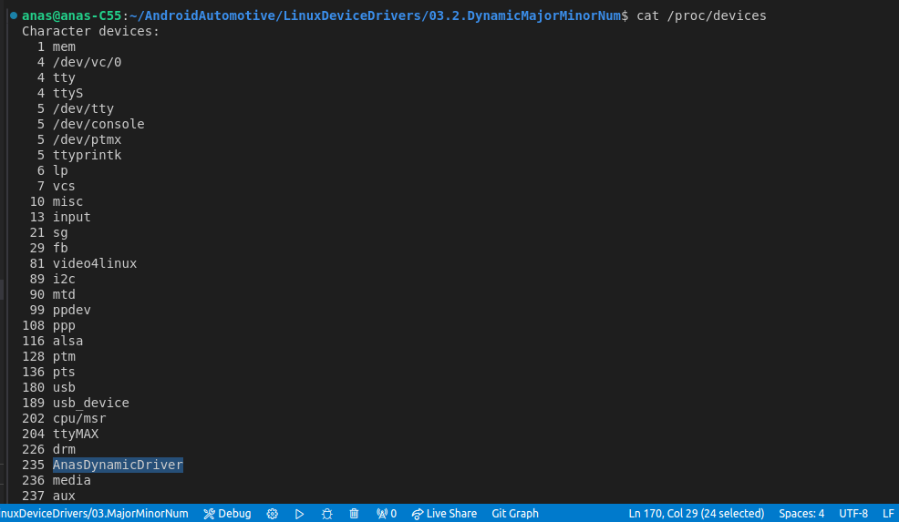

#### 1. Register The Major number of driver dynamically by the kernel

```c
int alloc_chrdev_region(dev_t *dev, unsigned baseminor, unsigned count, const char *name)
{
	struct char_device_struct *cd;
	cd = __register_chrdev_region(0, baseminor, count, name);
	if (IS_ERR(cd))
		return PTR_ERR(cd);
	*dev = MKDEV(cd->major, cd->baseminor);
	return 0;
}

```

### Parameters:

1. **`dev_t \*dev`**:
   - This is a pointer to a `dev_t` type variable where the function will store the first allocated device number (both major and minor numbers combined).
   - After the function executes successfully, `*dev` will contain the device number with the dynamically allocated major number and the specified `baseminor`.
2. **`unsigned baseminor`**:
   - This specifies the starting minor number in the range you are requesting. Minor numbers allow multiple devices to be associated with the same major number.
3. **`unsigned count`**:
   - The number of consecutive minor numbers you need. For example, if you request `count = 3` and `baseminor = 0`, you are asking for minor numbers 0, 1, and 2.
4. **`const char \*name`**:
   - The name of the device or driver. This string is associated with the device and helps in identifying the device in the system.

### Return Value:

- The function returns `0` on success.
- If it fails, it returns a negative error code.


### Detailed Code Explanation:

```c
struct char_device_struct *cd;
```

- The function defines a pointer `cd` to a `char_device_struct`. This structure holds the metadata associated with the character device, including the major number, minor number, and other relevant details.

```c
cd = __register_chrdev_region(0, baseminor, count, name);
```

- The function calls `__register_chrdev_region()` with the major number set to `0`. This signals that the system should dynamically allocate a major number.
- `baseminor`, `count`, and `name` are passed to request the specific range of minor numbers and to associate the device with a name.
- The function `__register_chrdev_region()` returns a pointer to a `char_device_struct` if successful or an error code (encoded as a pointer) if it fails.

```c
if (IS_ERR(cd))
    return PTR_ERR(cd);
```

- The function checks if the returned `cd` pointer is an error using the `IS_ERR()` macro.
- If it is an error, it returns the error code using the `PTR_ERR()` macro, which extracts the error value from the pointer.

```c
*dev = MKDEV(cd->major, cd->baseminor);
```

- If the allocation is successful, the function sets the `dev` variable (pointed to by the `dev` parameter) to the device number.
- `MKDEV()` is a macro that combines the major and minor numbers into a single `dev_t` value.

```c
return 0;
```

- Finally, the function returns `0` to indicate success.

### Summary

- The `alloc_chrdev_region()` function dynamically allocates a range of character device numbers.
- The major number is chosen by the system, while the minor number starts from the specified `baseminor`.
- The function returns the allocated device number in `dev` and either returns `0` for success or a negative error code if something goes wrong.

This function is useful when writing device drivers that need to register character devices with the Linux kernel, ensuring that the devices can be properly accessed through the `/dev` directory.


### 2. Un-Register The Major number of driver dynamically by the kernel


The function `unregister_chrdev_region()` is responsible for releasing or unregistering a previously allocated range of character device numbers in the Linux kernel. This is typically done when a driver module is being unloaded or when a device is no longer needed. The function ensures that the system no longer associates the specified device numbers with any character device.

Let's break down the code to understand its working in detail.

### Function Prototype

```c
void unregister_chrdev_region(dev_t from, unsigned count)
```

This function unregisters a range of character device numbers that were previously allocated using `alloc_chrdev_region()` . The range is specified by a starting device number and a count of consecutive minor numbers.

### Parameters:

1. **`dev_t from`**:
   - The starting device number from which to begin unregistering. This `dev_t` value contains both the major and minor numbers combined into a single value.
2. **`unsigned count`**:
   - The number of consecutive minor numbers to unregister. This specifies the range of device numbers to be released.

### Detailed Code Explanation:

```c
dev_t to = from + count;
```

- This calculates the endpoint of the range. `to` is the device number that is just beyond the last device number to be unregistered. This is computed by adding `count` to the `from` device number.

```c
dev_t n, next;
```

- Two `dev_t` variables, `n` and `next`, are declared. `n` will iterate through the device numbers in the range, while `next` will be used to calculate the next device number to be unregistered.

```c
for (n = from; n < to; n = next) {
```

- This loop iterates over each device number in the range, starting from `from` and ending just before `to`.

```c
    next = MKDEV(MAJOR(n)+1, 0);
```

- The `next` device number is calculated by incrementing the major number of the current device number (`n`) and resetting the minor number to `0`.
- `MKDEV(MAJOR(n)+1, 0)` creates a new `dev_t` value with the next major number and minor number `0`. This is typically done to handle the case where the next minor number range starts with a new major number.

```c
    if (next > to)
        next = to;
```

- If `next` exceeds the `to` device number (i.e., it goes beyond the specified range), it is set to `to` to ensure that only the specified range is unregistered.

```c
    kfree(__unregister_chrdev_region(MAJOR(n), MINOR(n), next - n));
```

- The function `__unregister_chrdev_region()` is called to unregister the range of device numbers starting from the current device number (`n`) and covering the range up to but not including `next`.
- The number of minor numbers to unregister is `next - n`.
- After unregistering the device numbers, `kfree()` is used to free the memory associated with the device structure, which was allocated when the device numbers were registered.




