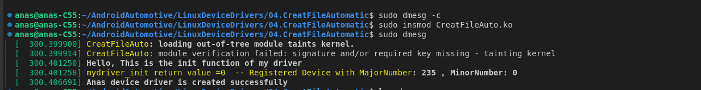
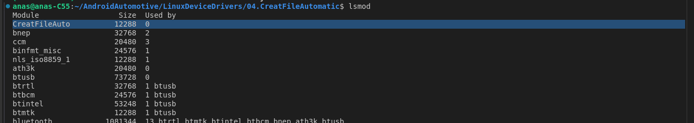
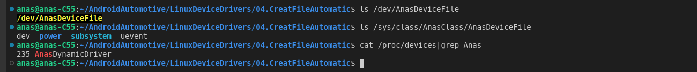

```c
#include <linux/module.h>      
#include <linux/moduleparam.h>  
#include <linux/fs.h>     
#include <linux/cdev.h>

MODULE_LICENSE("GPL");
MODULE_AUTHOR("Anas Khamees");
MODULE_DESCRIPTION("A simple Kernel Module");

dev_t deviceNum;
struct cdev charDevice;
struct class *myClass;
struct device* myDevice;

static int driver_open(struct inode *device_file, struct file *instance)
{
    printk("%s  open function of the driver was called \n", __FUNCTION__);
    return 0;
}

static int driver_close(struct inode *device_file, struct file *instance)
{
    printk("%s  close function of the driver was called \n", __FUNCTION__);
    return 0;
}

struct file_operations fops = {
    .owner = THIS_MODULE,
    .open = driver_open,
    .release = driver_close
};

static int __init mydriver_init(void)
{
    int returnValue;
    printk("Hello, This is the init function of my driver\n");

    returnValue = alloc_chrdev_region(&deviceNum, 0, 1, "AnasDynamicDriver");
    if (returnValue == 0)
    {
        printk("%s return value =0  -- Registered Device with MajorNumber: %d , MinorNumber: %d \n", __FUNCTION__, MAJOR(deviceNum), MINOR(deviceNum));
    }
    else
    {
        printk("could Not register Device with Major Numer: %d \n", MAJOR(deviceNum));
        return -1;
    }

    cdev_init(&charDevice, &fops);
    returnValue = cdev_add(&charDevice, deviceNum, 1);
    if (returnValue != 0)
    {
        unregister_chrdev_region(deviceNum, 1);
        printk("Failed to register a device driver to kernel \n");
        return -1;
    }

    myClass = class_create("AnasClass");
    if (myClass == NULL)
    {
        printk("Failed to create device class\n");
        cdev_del(&charDevice);
        unregister_chrdev_region(deviceNum, 1);
        return -1;
    }

    myDevice = device_create(myClass, NULL, deviceNum, NULL, "AnasDeviceFile");
    if (myDevice == NULL)
    {
        printk("Failed to create device file\n");
        cdev_del(&charDevice);
        class_destroy(myClass);
        unregister_chrdev_region(deviceNum, 1);
        return -1;
    }

    printk("Anas device driver is created successfully \n");

    return 0;
}

static void __exit mydriver_exit(void)
{
    unregister_chrdev_region(deviceNum, 1);
    printk("Goodbye, This is the exit function of my driver\n");
}

module_init(mydriver_init);
module_exit(mydriver_exit);

```


### 1. **Including Header Files**

```c
#include <linux/module.h>      
#include <linux/moduleparam.h>  
#include <linux/fs.h>     
#include <linux/cdev.h>
```

- **`#include <linux/module.h>`**: Contains core functions and macros used in kernel modules.
- **`#include <linux/moduleparam.h>`**: Allows parameters to be passed to the module at load time.
- **`#include <linux/fs.h>`**: Provides the file operations structure and related functions for interacting with the file system.
- **`#include <linux/cdev.h>`**: Supports character device drivers, providing functions for managing character devices.

------

### 2. **Module Metadata**

```c
MODULE_LICENSE("GPL");
MODULE_AUTHOR("Anas Khamees");
MODULE_DESCRIPTION("A simple Kernel Module");
```

- **`MODULE_LICENSE("GPL")`**: Specifies the module’s license. Using "GPL" indicates that the code adheres to the GNU General Public License.
- **`MODULE_AUTHOR("Anas Khamees")`**: Defines the author of the module.
- **`MODULE_DESCRIPTION("A simple Kernel Module")`**: Describes the purpose of the module.

------

### 3. **Global Variables**

```c
dev_t deviceNum;
struct cdev charDevice;
struct class *myClass;
struct device *myDevice;
```

- **`dev_t deviceNum`**: Holds the device number, including the major and minor numbers of the driver.

- **`struct cdev charDevice`**: Represents the character device structure, which is registered with the kernel.

  >### Importance of `struct cdev`
  >
  >1. **Device Management**: The `cdev` structure provides a way to associate file operations (such as `open`, `read`, `write`, and `release`) with a character device. It acts as a bridge between the kernel and the driver, allowing user space to interact with the device via system calls.
  >2. **Registration in the Kernel**: Once initialized and registered using `cdev_init()` and `cdev_add()`, the `cdev` structure is known to the kernel, allowing it to properly handle I/O operations directed at the device.
  >3. **Linking File Operations**: The `cdev` structure links the character device to the appropriate file operations defined in the driver. These file operations are specified in a `struct file_operations` structure.
  >4. **Resource Management**: The `cdev` structure is critical for managing resources associated with the device. When a device is opened or closed, the `cdev` structure ensures that the correct operations are performed.
  >
  >### Contents of `struct cdev`
  >
  >The `struct cdev` is defined in the kernel and includes several fields:
  >
  >```c
  >struct cdev {
  >    struct kobject kobj;         // Embedded kobject for sysfs support
  >    struct module *owner;        // Points to the module that "owns" this device
  >    const struct file_operations *ops; // Pointer to the file operations structure
  >    struct list_head list;       // List to keep track of all cdevs
  >    dev_t dev;                   // The device number (major and minor)
  >    unsigned int count;          // Number of minor numbers associated with this device
  >};
  >```
  >
  >1. **`struct kobject kobj`**: Provides a link between the character device and the kernel object model (sysfs). This allows the device to appear in the `/sys` filesystem for interaction.
  >2. **`struct module \*owner`**: Points to the kernel module that "owns" this device. It is typically set to `THIS_MODULE`, ensuring that the module remains loaded while the device is in use.
  >3. **`const struct file_operations \*ops`**: This is a pointer to the file operations structure associated with the device. It tells the kernel what functions to call when user space performs operations like `open`, `read`, `write`, etc.
  >4. **`struct list_head list`**: Used to link multiple `cdev` structures in a list, allowing the kernel to manage multiple character devices efficiently.
  >5. **`dev_t dev`**: Holds the device number (major and minor) assigned to this character device. This is the number used to identify the device in the system.
  >6. **`unsigned int count`**: Indicates the number of minor numbers associated with this device. This is useful when a single driver handles multiple minor devices.
  >
  >

- **`struct class *myClass`**: Represents the device class, allowing the creation of device files.

  >The **`struct class *myClass`** represents a device class in the Linux kernel, which is a higher-level abstraction used when creating and managing device files. The class concept is closely related to user-space interaction, particularly when dealing with `/dev/` files. Here's a detailed explanation of its importance and how it's used:
  >
  >### Importance of `struct class *myClass`
  >
  >1. **Device File Creation**: The primary purpose of the `struct class` is to create a device file in `/dev/` that user-space programs can interact with. By using `myClass`, you can automatically create a corresponding device file, such as `/dev/myDeviceFile`, without manually managing it.
  >2. **Grouping Similar Devices**: In the Linux device model, classes group similar types of devices. For instance, all block devices (e.g., hard drives) can be grouped under a "block" class. This logical grouping makes it easier to organize and manage devices within the kernel.
  >3. **Simplified User-Space Access**: The class helps in exposing the device to user space. Once the class and device are created, you can easily access the device using common file operations (like `read`, `write`, etc.) from user space.
  >4. **Automatic Sysfs Interface**: Creating a class results in a corresponding directory in `/sys/class/`, allowing the device to be controlled and monitored via the sysfs interface. This is helpful for debugging and monitoring the state of devices.
  >
  >### Contents and Functions Related to `struct class`
  >
  >The `struct class` itself is a part of the Linux device model and is defined in `<linux/device.h>`. It includes various fields and functions that are involved in managing the class and associated devices.
  >
  >###  How `struct class *myClass` is Used
  >
  >Typically, you follow a sequence of steps to use a `struct class` in your driver:
  >
  >1. **Create a Device Class**: The class is created using the `class_create()` function. This function returns a pointer to the `struct class`.
  >
  >   ```c
  >   myClass = class_create(THIS_MODULE, "MyDeviceClass");
  >   if (IS_ERR(myClass)) {
  >       // Handle error
  >   }
  >   ```
  >
  >   - **`THIS_MODULE`**: Indicates that this class is associated with the current kernel module.
  >   - **`"MyDeviceClass"`**: The name of the class. It will appear in `/sys/class/`.
  >
  >

- **`struct device *myDevice`**: Represents the device itself, allowing interaction with user space.

  >The **`struct device *myDevice`** represents a specific device that is associated with the device class (represented by `struct class *myClass`). It is used to create a device entry in the `/dev/` directory that user-space programs can interact with.
  >
  >### Importance of `struct device *myDevice`
  >
  >1. **Device File Creation in `/dev/`**: The primary purpose of `myDevice` is to represent the actual device in the system, which is typically exposed as a file in the `/dev/` directory. For example, if your device is named `"AnasDeviceFile"`, a file called `/dev/AnasDeviceFile` will be created.
  >2. **Device Attributes in sysfs**: The `struct device` provides access to attributes in the sysfs filesystem under `/sys/class/<class_name>/`. This is useful for managing the device and interacting with it from user space.
  >3. **Device Interaction in User Space**: By creating a device file in `/dev/`, user-space programs can easily perform operations like `open`, `read`, `write`, and `ioctl` on the device. The `struct device` is essential for linking the kernel driver with this file.
  >4. **Resource Management**: The `struct device` is also used internally by the kernel to manage resources associated with the device, such as power management and event notifications.
  >
  >### Usage of `struct device *myDevice`
  >
  >The `struct device` is created using the `device_create()` function, which takes the class and device number as input and generates a device file in `/dev/`. Here's how it’s done:
  >
  >```c
  >myDevice = device_create(myClass, NULL, deviceNum, NULL, "AnasDeviceFile");
  >if (IS_ERR(myDevice)) {
  >    printk("Failed to create device file\n");
  >    class_destroy(myClass);
  >    cdev_del(&charDevice);
  >    unregister_chrdev_region(deviceNum, 1);
  >    return -1;
  >}
  >```
  >
  >- **`myClass`**: The class associated with this device. It helps group similar devices together.
  >- **`NULL` (2nd parameter)**: The parent device, which is usually set to `NULL` for simple drivers.
  >- **`deviceNum`**: The device number (major and minor) associated with this device.
  >- **`NULL` (4th parameter)**: Private data, which is usually `NULL` unless you want to pass additional data to the device.
  >- **`"AnasDeviceFile"`**: The name of the device file, which will appear as `/dev/AnasDeviceFile`.
  >
  >

------

### 4. **Driver File Operations (open and close)**

```c
static int driver_open(struct inode *device_file, struct file *instance)
{
    printk("%s  open function of the driver was called \n", __FUNCTION__);
    return 0;
}

static int driver_close(struct inode *device_file, struct file *instance)
{
    printk("%s  close function of the driver was called \n", __FUNCTION__);
    return 0;
}
```

- **`driver_open` and `driver_close`**: These functions are called when the device file is opened and closed, respectively. They log messages indicating the action and always return 0, signifying success.

------

### 5. **File Operations Structure**

```c
struct file_operations fops = {
    .owner = THIS_MODULE,
    .open = driver_open,
    .release = driver_close
};
```

- **`struct file_operations fops`**: Links the operations that the device driver supports (open and close) with their corresponding functions.
- **`.owner = THIS_MODULE`**: Specifies the module responsible for these operations.

------

### 6. **Module Initialization (`mydriver_init`)**

```c
static int __init mydriver_init(void)
{
    int returnValue;
    printk("Hello, This is the init function of my driver\n");

    // 1. Allocate Device Number
    returnValue = alloc_chrdev_region(&deviceNum, 0, 1, "AnasDynamicDriver");
    if (returnValue == 0) {
        printk("%s return value = 0  -- Registered Device with MajorNumber: %d, MinorNumber: %d\n", __FUNCTION__, MAJOR(deviceNum), MINOR(deviceNum));
    } else {
        printk("Could not register Device with Major Number: %d\n", MAJOR(deviceNum));
        return -1;
    }

    // 2. Initialize the character device
    cdev_init(&charDevice, &fops);
    returnValue = cdev_add(&charDevice, deviceNum, 1);
    if (returnValue != 0) {
        unregister_chrdev_region(deviceNum, 1);
        printk("Failed to register a device driver to kernel\n");
        return -1;
    }

    // 3. Create a class and device file
    myClass = class_create(THIS_MODULE, "AnasClass");
    if (myClass == NULL) {
        printk("Failed to create device class\n");
        cdev_del(&charDevice);
        unregister_chrdev_region(deviceNum, 1);
        return -1;
    }

    myDevice = device_create(myClass, NULL, deviceNum, NULL, "AnasDeviceFile");
    if (myDevice == NULL) {
        printk("Failed to create device file\n");
        class_destroy(myClass);
        cdev_del(&charDevice);
        unregister_chrdev_region(deviceNum, 1);
        return -1;
    }

    printk("Anas device driver is created successfully\n");
    return 0;
}
```

- **`alloc_chrdev_region`**: Dynamically allocates a major number for the device, which is stored in `deviceNum`.
- **`cdev_init` and `cdev_add`**: Initializes and registers the character device with the kernel.
- **`class_create` and `device_create`**: Create the device class and file, allowing the device to be accessed from user space (e.g., `/dev/AnasDeviceFile`).

------

### 7. **Module Cleanup (`mydriver_exit`)**

```c
static void __exit mydriver_exit(void)
{
    device_destroy(myClass, deviceNum);
    class_destroy(myClass);
    cdev_del(&charDevice);
    unregister_chrdev_region(deviceNum, 1);
    printk("Goodbye, This is the exit function of my driver\n");
}
```

- **`device_destroy`, `class_destroy`, `cdev_del`, and `unregister_chrdev_region`**: These functions clean up and release all resources allocated during initialization. This ensures the module is properly unloaded.

------

### 8. **Module Initialization and Exit Macros**

```c
module_init(mydriver_init);
module_exit(mydriver_exit);
```

- These macros tell the kernel which functions to call when the module is loaded (`mydriver_init`) and unloaded (`mydriver_exit`).


## Test the Driver 

-------------------






