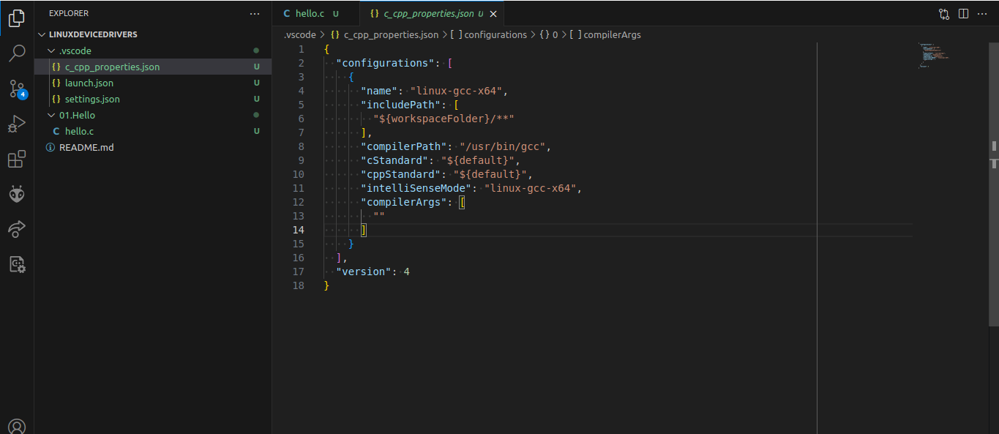
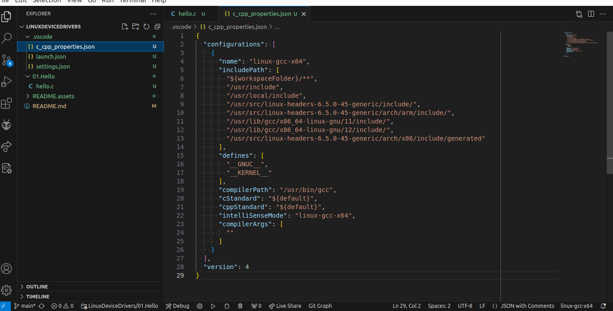

## Device Drivers

A device driver is a specialized software component that enables communication between the operating system and hardware devices. It serves as an intermediary that translates the high-level operations requested by applications into low-level commands that the hardware understands.

### 1. **Purpose of Device Drivers**

- **Hardware Communication:** Device drivers handle the low-level details of how hardware devices communicate with the operating system and user applications. They translate general instructions from the OS into specific commands that the hardware can execute.
- **Abstraction:** They abstract the hardware specifics from user applications, allowing programs to operate without needing to know the hardware details.

### 2. **Components of Device Drivers**

- **Initialization Code:** Sets up the hardware device when the driver is loaded, including allocating resources and configuring hardware settings.
- **Interrupt Handlers:** Manages interrupts from the hardware, allowing the driver to respond to hardware events (e.g., input from a keyboard or mouse).
- **IO Operations:** Implements functions for input and output operations, such as reading from or writing to hardware devices.
- **Control and Configuration:** Provides mechanisms for configuring hardware settings and controlling the device's behavior.
- **Error Handling:** Handles errors and exceptions that occur during hardware operations, ensuring stability and robustness.

### 3. **Types of Device Drivers**

- **Character Drivers:** Handle devices that transmit data in a character-by-character or byte-by-byte fashion (e.g., keyboards, serial ports).
- **Block Drivers:** Manage devices that handle data in blocks or chunks (e.g., hard drives, SSDs). They are responsible for managing data storage and retrieval.
- **Network Drivers:** Facilitate communication over network interfaces (e.g., Ethernet cards, Wi-Fi adapters).

### 4. **Driver Models**

- **Kernel Space vs. User Space:**
  - **Kernel Space:** Most device drivers run in kernel space, where they have direct access to hardware and system resources. This can provide high performance but also comes with risks of system crashes and security issues if the driver is faulty.
  - **User Space:** Some drivers operate in user space (e.g., virtual devices, certain USB drivers). They offer better isolation from the kernel but might have performance trade-offs.
- **Modularity:**
  - **Loadable Modules:** Many modern operating systems support loadable kernel modules, which allow drivers to be loaded and unloaded dynamically without requiring a reboot.

### 5. **Driver Development Process**

- **Design:** Determine the functionality and capabilities required, and how the driver will interface with the hardware and the operating system.
- **Implementation:** Write the driver code, handling initialization, I/O operations, interrupts, and error conditions.
- **Testing:** Rigorously test the driver in various scenarios to ensure it works correctly and does not cause system instability.
- **Deployment:** Integrate the driver into the operating system or application environment, providing installation and configuration instructions.

### 6. **Challenges in Driver Development**

- **Hardware Variability:** Different hardware devices can have varying interfaces and protocols, requiring extensive knowledge and customization for each device.
- **Concurrency:** Drivers must handle multiple simultaneous operations and ensure proper synchronization to avoid conflicts and data corruption.
- **Performance:** Optimizing driver performance while maintaining stability and security can be challenging.
- **Security:** Drivers operate with high privileges, making them potential vectors for security vulnerabilities. Ensuring that drivers do not expose the system to risks is crucial.

### 7. **Examples of Device Drivers**

- **Printer Drivers:** Translate print jobs from a computer into a format that a specific printer can understand.
- **Graphics Drivers:** Interface with graphic hardware to render images and manage display outputs.
- **Network Drivers:** Manage communication between a computer and network interfaces, handling data transmission and reception.


### 1. Install Linux Kernel Headers

```bash
 sudo apt install linux-headers-$(uname -r)
```


### 2. Configure VS code for Kernel Headers

- Edit **c_cpp_properties.josn** file 

  

  **change the above settings**



```c
{
  "configurations": [
    {
      "name": "linux-gcc-x64",
      "includePath": [
        "${workspaceFolder}/**",
        "/usr/include",
        "/usr/local/include",
        "/usr/src/linux-headers-6.5.0-45-generic/include/",
        "/usr/src/linux-headers-6.5.0-45-generic/arch/arm/include/",
        "/usr/lib/gcc/x86_64-linux-gnu/11/include/",
        "/usr/lib/gcc/x86_64-linux-gnu/12/include/",
        "/usr/src/linux-headers-6.5.0-45-generic/arch/x86/include/generated"
      ],
      "defines": [
        "__GNUC__",
        "__KERNEL__"
      ],
      "compilerPath": "/usr/bin/gcc",
      "cStandard": "${default}",
      "cppStandard": "${default}",
      "configurationProvider": "ms-vscode.makefile-tools",
      "intelliSenseMode": "linux-gcc-x64",
      "compilerArgs": [
        ""
      ]
    }
  ],
  "version": 4
}
```

>**Note That "linux-headers-6.5.0-45-generic" is my kernel version ,replace this by your kernel version**
>
>- Run this command to know your kernel version
>
>  ```bash
>  uname -r
>  ```


Now, you are ready to develop device derivers
