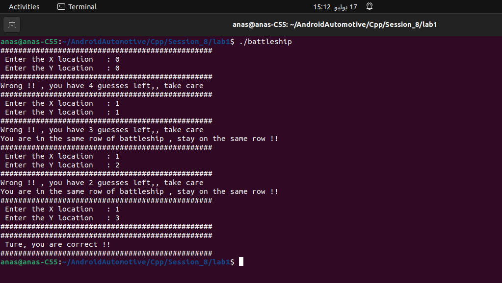

## Battleship Game


```c++
#include<iostream>
#include<random>
#include<vector>
   


class battleship
{
	private:
    	
		int guessesNum;
		int maxGuesses;
		int locX;
		int locY;
	public:
		battleship(int MaxGuess,int rows,int cols,bool initial_value){
			maxGuesses=	MaxGuess;
			/*Initialize a 2D vector with the same value*/
    		std::vector<std::vector<bool>> board(rows, std::vector<bool>(cols, initial_value));

			/*Create a random device to seed the random number generator*/
    		std::random_device rd;

    		/* Step 2: Create a random number generator */
    		std::mt19937 gen(rd()); // Standard mersenne_twister_engine

    		/* Step 3: Define a uniform integer distribution in the range [0, 4] */
   			 std::uniform_int_distribution<> dis(0, 4);
   			 locX=dis(gen);
   			 locY=dis(gen);
   			 guessesNum=0;
   			 
		}	
		
	bool guess(int x,int y)
	{
		guessesNum++;

			if((x==locX)&&(y==locY))
			{
				std::cout<<"################################################\n";
				std::cout<<" Ture, you are correct !!\n";
				std::cout<<"################################################\n";
				return true;
			}
			else
			{
				std::cout<<"Wrong !! , you have "<<(maxGuesses-guessesNum)<<" guesses left,, take care \n";
			}
			
			if(x==locX)
			{
				std::cout<<"You are in the same row of battleship , stay on the same row !!\n";
			}
			else if(y==locY)
			{
				std::cout<<"You are in the same colomn of battleship , stay on the same colomn !!\n";
			}
		
		return false;
	}
	
	bool gameOver() const
	{
		if(guessesNum==maxGuesses)
		{
			return true;
		}
		
		return false;

	}

	int getGuesses() const
	{
		return guessesNum;
	}


~battleship()
{

}


};


int main()
{
	int maxGuess=5;
	int row=5;
	int col=5;
	int x=0;
	int y=0;
	bool initVal=false;
	battleship game1(maxGuess,row,col,false);
	
	while(1)
	{
		if(game1.getGuesses()>maxGuess)
		{
			std::cout<<"################################################\n";
			std::cout<<"Game over !!\n";
			std::cout<<"################################################\n";
			break;
		}
		else
		{
			std::cout<<"################################################\n";
			std::cout<<" Enter the X location   : ";
			std::cin>>x;
			std::cout<<" Enter the Y location   : ";
			std::cin>>y;
			std::cout<<"################################################\n";
			bool ret=game1.guess(x,y);
			if(ret==true)
			{
				break;
			}
		}
	}
	
	return 0;

}
```


#### 1. Include Necessary Headers

```c++
#include<iostream>
#include<random>
#include<vector>
```

These headers are needed for:

- `iostream`: Standard input and output operations.
- `random`: Random number generation.
- `vector`: Dynamic array support.

#### 2. Define the `battleship` Class

The `battleship` class encapsulates the game logic.

```c++
class battleship
{
    private:
        int guessesNum;   // Number of guesses made by the player
        int maxGuesses;   // Maximum allowed guesses
        int locX;         // X coordinate of the battleship
        int locY;         // Y coordinate of the battleship
    public:
        battleship(int MaxGuess, int rows, int cols, bool initial_value);
        bool guess(int x, int y);
        bool gameOver() const;
        int getGuesses() const;
        ~battleship();
};
```

#### 3. Implement the `battleship` Constructor

The constructor initializes the game state.

```c++
battleship::battleship(int MaxGuess, int rows, int cols, bool initial_value)
{
    maxGuesses = MaxGuess;
    // Initialize a 2D vector with the same value
    std::vector<std::vector<bool>> board(rows, std::vector<bool>(cols, initial_value));

    // Create a random device to seed the random number generator
    std::random_device rd;

    // Create a random number generator
    std::mt19937 gen(rd()); // Standard Mersenne Twister engine

    // Define a uniform integer distribution in the range [0, 4]
    std::uniform_int_distribution<> dis(0, 4);

    // Generate random positions for the battleship
    locX = dis(gen);
    locY = dis(gen);

    guessesNum = 0;
}
```

1. **Initialize Member Variables**:

   ```c++
   maxGuesses = MaxGuess;
   guessesNum = 0;
   ```

2. **Initialize a 2D Vector (Game Board)**:

   ```c++
   std::vector<std::vector<bool>> board(rows, std::vector<bool>(cols, initial_value));
   ```

3. **Seed the Random Number Generator**:

   ```c++
   std::random_device rd;
   std::mt19937 gen(rd());
   ```

4. **Define the Random Number Distribution**:

   ```c++
   std::uniform_int_distribution<> dis(0, 4);
   ```

5. **Generate Random Locations for the Battleship**:

   ```c++
   locX = dis(gen);
   locY = dis(gen);
   ```

#### 4. Implement the `guess` Method

The `guess` method checks the player's guess and provides feedback.

```c++
bool battleship::guess(int x, int y)
{
    guessesNum++;
    if ((x == locX) && (y == locY))
    {
        std::cout << "################################################\n";
        std::cout << "True, you are correct!!\n";
        std::cout << "################################################\n";
        return true;
    }
    else
    {
        std::cout << "Wrong!! You have " << (maxGuesses - guessesNum) << " guesses left. Take care!\n";
        if (x == locX)
        {
            std::cout << "You are in the same row as the battleship. Stay on the same row!!\n";
        }
        else if (y == locY)
        {
            std::cout << "You are in the same column as the battleship. Stay on the same column!!\n";
        }
        return false;
    }
}
```

1. **Increment Guess Counter**:

   ```c++
   guessesNum++;
   ```

2. **Check if the Guess is Correct**:

   ```c++
   if ((x == locX) && (y == locY)) { ... }
   ```

3. **Provide Feedback**:

   - If correct: Print success message.
   - If incorrect: Print remaining guesses and hints.

#### 5. Implement the `gameOver` Method

The `gameOver` method checks if the game is over based on the number of guesses made.

```c++
bool battleship::gameOver() const
{
    return guessesNum >= maxGuesses;
}
```

#### 6. Implement the `getGuesses` Method

The `getGuesses` method returns the number of guesses made so far.

```c++
int battleship::getGuesses() const
{
    return guessesNum;
}
```

#### 7. Implement the Destructor

The destructor is empty since there are no dynamically allocated resources that need to be freed.

```c++
battleship::~battleship() {}
```

#### 8. Implement the `main` Function

The `main` function drives the game by creating an instance of `battleship` and managing the game loop.

```c++
int main()
{
    int maxGuess = 5;
    int row = 5;
    int col = 5;
    int x = 0;
    int y = 0;
    bool initVal = false;

    battleship game1(maxGuess, row, col, initVal);

    while (true)
    {
        if (game1.gameOver())
        {
            std::cout << "################################################\n";
            std::cout << "Game over!!\n";
            std::cout << "################################################\n";
            break;
        }
        else
        {
            std::cout << "################################################\n";
            std::cout << "Enter the X location: ";
            std::cin >> x;
            std::cout << "Enter the Y location: ";
            std::cin >> y;
            std::cout << "################################################\n";
            bool ret = game1.guess(x, y);
            if (ret)
            {
                break;
            }
        }
    }

    return 0;
}
```

1. **Initialize Game Parameters**:

   ```c++
   int maxGuess = 5;
   int row = 5;
   int col = 5;
   int x = 0;
   int y = 0;
   bool initVal = false;
   ```

2. **Create an Instance of `battleship`**:

   ```c++
   battleship game1(maxGuess, row, col, initVal);
   ```

3. **Game Loop**:

   - Check if Game is Over:

     ```c++
     if (game1.gameOver()) { ... }
     ```

   - Prompt for User Input:

     ```c++
     std::cin >> x;
     std::cin >> y;
     ```

   - Make a Guess:

     ```c++
     bool ret = game1.guess(x, y);
     ```



